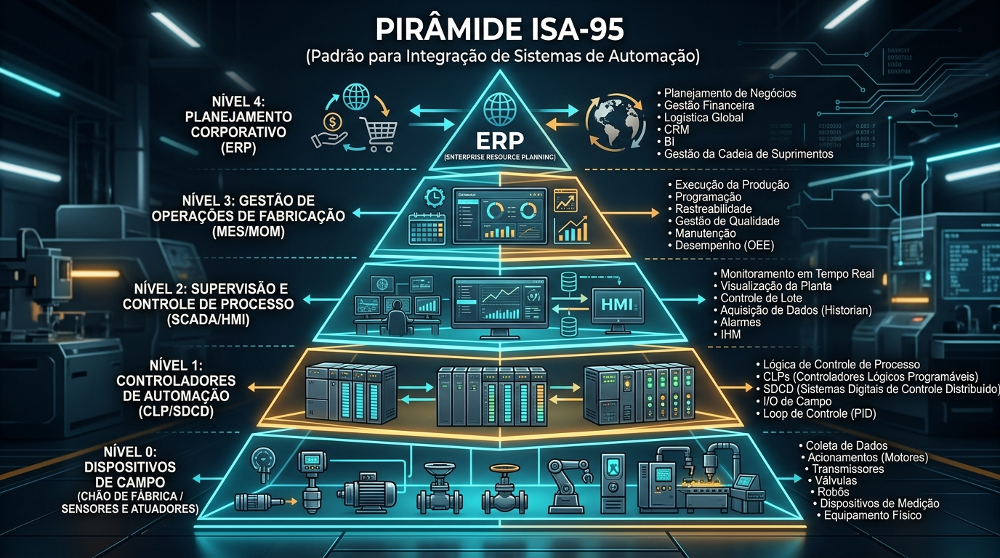
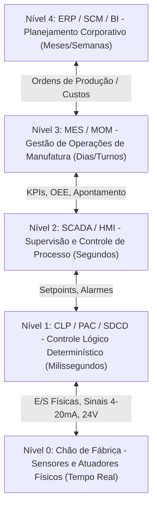

# Aula 01: Arquitetura TI/TA, Pirâmide ISA-95 e Modelo de Eventos Fabris

> **Guia Didático e Material Teórico de Consulta Assíncrona**  
> *Disciplina: Automação Industrial | Unidade Curricular: Integração TI/TA & Manufatura Avançada*

---

## 1. Visão Geral & Contexto Histórico

A **Automação Industrial** evoluiu de sistemas eletromecânicos baseados em relés e comandos hidráulicos/pneumáticos para redes complexas e integradas de sensoriamento, controle determinístico, ingestão de grandes volumes de dados e inteligência artificial.

```
┌─────────────────┐    ┌─────────────────┐    ┌─────────────────┐    ┌─────────────────┐
│  Indústria 1.0  │───►│  Indústria 2.0  │───►│  Indústria 3.0  │───►│  Indústria 4.0  │
│ Mecanização e   │    │ Eletrificação e │    │ Eletrônica, CLP │    │ IIoT, Nuvem,    │
│ Vapor (Séc XVIII)│    │ Linhas de Mont. │    │ e Informática   │    │ IA e CPS (Cyber-│
└─────────────────┘    └─────────────────┘    └─────────────────┘    │ Physical System)│
                                                                     └─────────────────┘
```

Nesta aula, analisamos como os dados gerados no **chão de fábrica (Tecnologia da Automação - TA / OT)** trafegam verticalmente para os sistemas corporativos de gestão **(Tecnologia da Informação - TI / IT)**.

---

## 2. A Norma ISA-95 e a Hierarquia da Manufatura

A norma **ANSI/ISA-95** (adotada internacionalmente sob o padrão **IEC 62264**) estabelece a arquitetura de referência para a integração entre os sistemas de controle de produção e os sistemas empresariais.

### 2.1 Infográfico da Pirâmide ISA-95



### 2.2 Detalhamento dos Níveis da Pirâmide ISA-95



#### **Nível 0: Processo Físico (Chão de Fábrica)**
- **Função:** Interface física direta com a matéria-prima e os equipamentos da fábrica.
- **Dispositivos:** Sensores discretos (indutivos, fotoelétricos), sensores analógicos (pressão, temperatura), atuadores pneumáticos, válvulas solenoide, motores e servomotores.
- **Escala Temporal:** Resposta física em microssegundos ($\mu\text{s}$) ou milissegundos ($\text{ms}$).

#### **Nível 1: Controle Discreto e Contínuo**
- **Função:** Execução do algoritmo de controle determinístico, intertravamentos de segurança e malhas de regulação.
- **Dispositivos:** Controladores Lógicos Programáveis (CLPs), PACs (*Programmable Automation Controllers*), SDCDs (*Sistemas Digitais de Controle Distribuído*).
- **Redes Industriais:** Profinet, EtherCAT, Modbus RTU/TCP, CANopen.
- **Escala Temporal:** Ciclo de varredura (*SCAN*) entre $1\text{ ms}$ e $50\text{ ms}$.

#### **Nível 2: Supervisão e Controle de Processo**
- **Função:** Monitoramento visual da planta em tempo real, operação de linhas, gestão de alarmes e registro histórico (*Historian*).
- **Sistemas:** SCADA (*Supervisory Control and Data Acquisition*), IHMs (*Interface Homem-Máquina*).
- **Escala Temporal:** Atualização gráfica entre $100\text{ ms}$ e $2\text{ s}$.

#### **Nível 3: Gestão das Operações de Manufatura (MOM / MES)**
- **Função:** Sequenciamento fino de ordens de produção, rastreabilidade de lotes (*genealogia do produto*), controle de qualidade e cálculo do índice **OEE (Overall Equipment Effectiveness)**.
- **Sistemas:** MES (*Manufacturing Execution System*), LIMS (*Laboratory Information Management System*).
- **Escala Temporal:** Horas, turnos de trabalho, dias.

#### **Nível 4: Planejamento Empresarial e Logística**
- **Função:** Gestão financeira, compras de matéria-prima, vendas, logística global e planejamento estratégico.
- **Sistemas:** ERP (*Enterprise Resource Planning* - ex.: SAP, TOTVS), CRM, SCM.
- **Escala Temporal:** Semanas, meses, anos.

---

## 3. Convergência TI / TA (IT / OT Convergence)

Historicamente, as áreas de **TI (Tecnologia da Informação)** e **TA (Tecnologia da Automação / Operational Technology)** operavam isoladas, com prioridades e culturas divergentes.

### 3.1 Tabela Comparativa: TI vs TA

| Característica | Tecnologia da Automação (TA / OT) | Tecnologia da Informação (TI / IT) |
| :--- | :--- | :--- |
| **Foco Principal** | Disponibilidade física e segurança do processo (*Safety*) | Confidencialidade e integridade dos dados |
| **Determinismo** | **Crítico em Tempo Real** (latência imprevisível pode causar acidentes) | Latência tolerável (requisições HTTP, relatórios) |
| **Prioridade de Segurança (Tríade)** | **AIC:** Availability (1º), Integrity (2º), Confidentiality (3º) | **CIA:** Confidentiality (1º), Integrity (2º), Availability (3º) |
| **Ciclo de Vida** | 10 a 20 anos (CLPs, motores, sensores) | 3 a 5 anos (Servidores, notebooks, frameworks) |
| **Protocolos de Comunicação** | Modbus, Profinet, OPC UA, MQTT | HTTP/HTTPS, REST APIs, WebSockets, SQL |
| **Topologia de Rede** | Redes industriais segmentadas (Norma IEC 62443 / Perímetro Purdue) | Redes de computadores corporativas (TCP/IP) |

### 3.2 O Paradigma da Indústria 4.0: Da Pirâmide Rígida ao Data Mesh Industrial

Na arquitetura tradicional, o dado precisava subir degrau por degrau (Nível 0 $\rightarrow$ Nível 1 $\rightarrow$ Nível 2 $\rightarrow$ Nível 3 $\rightarrow$ Nível 4). Na **IIoT**, a camada de campo conecta-se via protocolos leves (**MQTT / OPC UA**) a uma malha de dados (*Industrial Data Mesh*), permitindo que algoritmos de **Machine Learning** consumam telemetria de campo sem sobrecarregar a CPU do CLP.

---

## 4. O Modelo de Eventos Fabris no Ecossistema Smart N1

Na célula fabril **Smart N1**, cada alteração física (uma peça detectada, um motor ligado, uma variação de temperatura) é convertida em um **Payload JSON de Telemetria**:

```json
{
  "timestamp": "2026-08-16T22:30:00.125Z",
  "plant_id": "SMART_N1_SOROCABA",
  "station_id": "ESTACAO_TRIAGEM_01",
  "sensor_id": "SENS_IND_01",
  "event_type": "PECA_DETECTADA",
  "metrics": {
    "material": "METALLIC",
    "conveyor_speed_m_s": 0.45,
    "temperature_celsius": 42.8,
    "vibration_mm_s": 1.2
  },
  "status_code": 200
}
```

Este payload é o insumo base que será trafegado via **MQTT**, processado no **Node-RED**, armazenado no **InfluxDB** e analisado com **CRISP-DM / ML** nas disciplinas subsequentes.

---

## 5. Exercícios Práticos e Questões para Estudo Assíncrono

### Exercício 01 (Análise Crítica de Segurança)
Explique por que aplicar uma atualização automática de patch de sistema operacional (prática comum em TI) pode ser perigoso em um computador de supervisão SCADA (Nível 2 de TA) sem o devido comissionamento prévio.

### Exercício 02 (Mapeamento ISA-95)
Classifique cada um dos itens abaixo no respectivo nível da Pirâmide ISA-95 (0 a 4):
a) Leitor de Código de Barras / RFID na esteira.  
b) Software SAP emitindo Ordem de Produção (OP).  
c) CLP Siemens S7-1200 executando uma rotina de contagem em texto estruturado (ST).  
d) Servidor MES registrando o refugo de peças por turno.  
e) Tela de IHM mostrando a pressão do circuito pneumático.

### Exercício 03 (Convergência IIoT)
Qual a principal vantagem técnica de utilizar o protocolo MQTT (Publish/Subscribe) em substituição a requisições HTTP REST (Request/Response) para enviar telemetria de mil sensores industriais para um banco de dados de séries temporais?

---

## 6. Referências Complementares

1. **IEC 62264-1:** *Enterprise-control system integration - Part 1: Models and terminology*.
2. **AGUIRRE, Luis Antonio.** *Fundamentos de Instrumentação*. São Paulo: Pearson, 2013.
3. **TANENBAUM, A. S.; FEAMSTER, N.** *Redes de Computadores*. 6. ed. Pearson, 2021.
