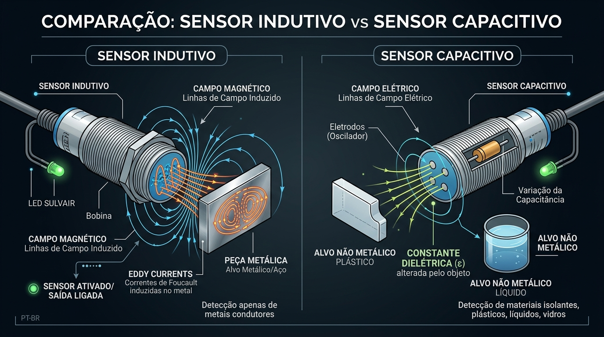
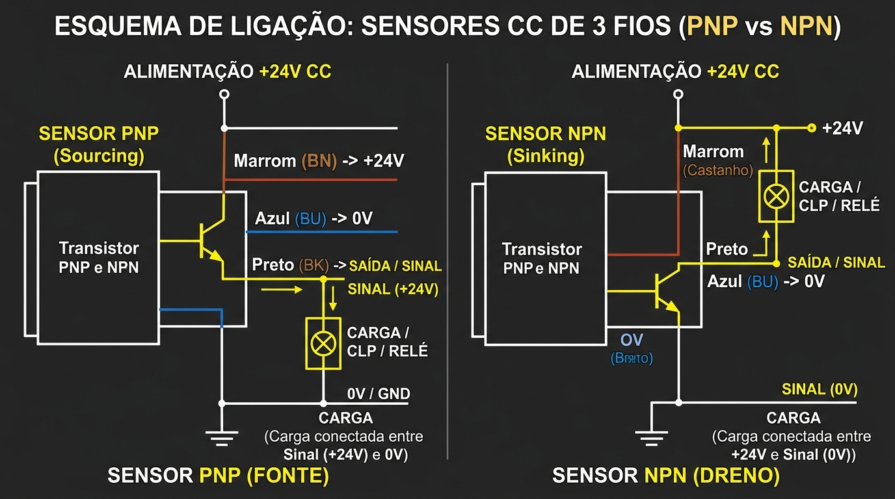
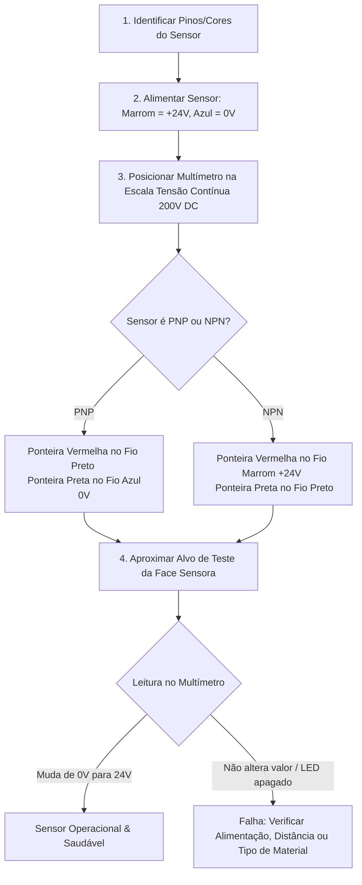

# Aula 02: Guia de Referência de Sensores Industriais Discretos & Prática de Laboratório

> **Guia Didático e Material Teórico de Consulta Assíncrona**  
> *Disciplina: Automação Industrial | Unidade Curricular: Dispositivos de Campo & Sensoriamento Discreto*

---

## 1. Visão Geral do Sensoriamento Discreto

Sensores discretos são dispositivos de entrada que fornecem um **sinal binário (DIGITAL: LIGADO / DESLIGADO, 1 / 0, +24V DC / 0V DC)** para o sistema de controle. Eles representam a primeira camada de percepção física da planta **Smart N1**, responsáveis por detectar a presença, ausência ou contagem de peças e a posição extrema de mecanismos.

---

## 2. Tecnologias de Sensoriamento Discreto

### Infográfico Comparativo: Sensor Indutivo vs Sensor Capacitivo



---

### 2.1 Sensores Eletromecânicos (Chaves Fim de Curso / Microswitches)

As **chaves fim de curso** (*limit switches*) dependem do impacto físico direto entre a peça em movimento e o atuador mecânico do sensor.

```
       Atuador Mecânico (Haste / Rolete)
                    │
                    ▼
          ┌───────────────────┐
          │  Bloco de Contatos│
          │   NA (NO) / NF (NC)│
          └─────────┬─────────┘
                    │
                    ▼
       Chaveamento Elétrico Físico
```

#### **Estrutura dos Contatos Internos:**
- **NA / NO (*Normally Open* / Normal Aberto):** O contato fica aberto em repouso ($0\text{V}$) e se fecha ao ser acionado ($24\text{V}$).
- **NF / NC (*Normally Closed* / Normal Fechado):** O contato fica fechado em repouso ($24\text{V}$) e se abre ao ser acionado ($0\text{V}$). **Uso Obrigatório em Circuitos de Emergência e Parada de Segurança (Princípio da Falha Segura / *Fail-Safe*)**.

#### **Fenômeno de Ricochete de Contato (*Contact Bounce*):**
Quando os contatos metálicos se chocam, ocorrem micro-vibrações mecânicas durante $1\text{ ms}$ a $10\text{ ms}$, gerando múltiplos pulsos falsos no CLP.
- **Solução no CLP:** Aplicação de filtros digitais de entrada (*hardware debounce filter*) configurados para ignorar transições menores que $10\text{ ms}$.

---

### 2.2 Sensores de Proximidade Indutivos

Os sensores indutivos são dispositivos eletrônicos estado sólido que detectam **exclusivamente materiais condutores de eletricidade (metais)** sem contato físico.

#### **Arquitetura de Bloco e Princípio de Operação:**


1. O **circuito oscilador LC** interno produz um campo magnético alternado de alta frequência ($100\text{ kHz}$ a $1\text{ MHz}$) que se projeta a partir da face sensora.
2. Quando um objeto metálico aproxima-se do campo, são induzidas na superfície do metal pequenas correntes parasitas conhecidas como **Correntes de Foucault** (*Eddy currents*).
3. Essas correntes geram um campo magnético oposto, absorvendo energia do oscilador e **reduzindo a amplitude de oscilação**.
4. O circuito **Schmitt Trigger** monitora a amplitude e comuta o transistor de saída quando o nível cai abaixo do limiar pré-definido.

#### **Distância Efetiva de Detecção ($S_e$) e Fator de Redução ($K_r$):**
A distância nominal ($S_n$) informada pelo fabricante é medida padronizada para uma placa de **Aço Carbono Fe 360** de $1\text{ mm}$ de espessura. Para outros materiais:

$$S_e = S_n \times K_r$$

| Material do Alvo | Fator de Redução Aproximado ($K_r$) | Distância Efetiva ($S_n = 10\text{ mm}$) |
| :--- | :---: | :---: |
| **Aço Carbono (Fe 360)** | **1,00** | $10,0\text{ mm}$ |
| **Aço Inoxidável (AISI 304)** | **0,70 – 0,80** | $7,5\text{ mm}$ |
| **Latão** | **0,45 – 0,50** | $4,8\text{ mm}$ |
| **Alumínio** | **0,35 – 0,40** | $3,8\text{ mm}$ |
| **Cobre** | **0,25 – 0,30** | $2,8\text{ mm}$ |

#### **Histerese Operacional ($H$):**
Diferença percentual entre a distância em que o sensor **liga** na aproximação ($S_a$) e a distância em que ele **desliga** no afastamento ($S_r$). A histerese (tipicamente $5\%$ a $15\%$ de $S_r$) evita trepidações e acionamentos instáveis da saída caso o objeto oscile mecanicamente na borda de detecção.

---

### 2.3 Sensores de Proximidade Capacitivos

Detectam a aproximação de **qualquer tipo de material (metais, plásticos, vidro, água, óleo, madeira, papel, grãos)** através da variação da capacitância da face sensora.

#### **Princípio Físico de Operação:**
A face sensora é formada por dois eletrodos metálicos concêntricos que atuam como um capacitor de placas abertas. O valor da capacitância $C$ é dado por:

$$C = \frac{\epsilon_0 \cdot \epsilon_r \cdot A}{d}$$

Onde:
- $\epsilon_0$: Permissividade do vácuo/ar ($8,854 \times 10^{-12}\text{ F/m}$).
- $\epsilon_r$: **Constante dielétrica relativa do material aproximado**.
- $A$: Área das placas dos eletrodos.
- $d$: Distância entre a face e o eletrodo.

Como a constante dielétrica do ar é $\epsilon_r \approx 1$, a entrada de qualquer meio com $\epsilon_r > 1$ aumenta a capacitância do conjunto, acionando o oscilador interno.

#### **Tabela de Constantes Dielétricas Relativas ($\epsilon_r$):**

| Material | Constante Dielétrica ($\epsilon_r$) | Sensibilidade de Detecção |
| :--- | :---: | :--- |
| **Água pura / Soluções aquosas** | **80** | Excelente (Alta sensibilidade) |
| **Glicerina / Álcool** | **30 – 40** | Muito Boa |
| **Vidro** | **5 – 10** | Boa |
| **Acrílico / Polietileno (PET)** | **3,2** | Média (Requer ajuste fino) |
| **Óleo Mineral / Petróleo** | **2,2** | Baixa |
| **Ar seco** | **1,0** | Referência de repouso |

---

## 3. Esquemas de Ligação Elétrica (PNP vs NPN)

Para sensores eletrônicos de 3 fios alimentados em **Corrente Contínua (+24V DC)**, o padrão normatizado de fiação **IEC 60947-5-2** é:

```
  ──────────────────────────────────────────────────────────
  Cor do Fio           Sigla IEC        Função Elétrica
  ──────────────────────────────────────────────────────────
  MARROM               BN (Brown)       Alimentação Positiva (+24V DC)
  AZUL                 BU (Blue)        Alimentação Negativa (0V / GND)
  PRETO                BK (Black)       Linha de Sinal / Saída Digital (OUT)
  BRANCO (4º fio)      WH (White)       Saída Complementar (NC) ou Sinal 2
  ──────────────────────────────────────────────────────────
```

### Infográfico de Ligação Elétrica: PNP vs NPN



### 3.1 Transistor de Saída PNP (Modo FONTE / *Sourcing*)
- O transistor interno chaveia o polo **positivo (+24V DC)** para o fio Preto (Sinal).
- **A carga (entrada do CLP)** deve ser conectada entre o **fio Preto (Sinal)** e o **0V (GND)**.
- **Padrão:** Padrão industrial amplamente adotado na América Latina e Europa (CLPs Siemens, Schneider, ABB).

### 3.2 Transistor de Saída NPN (Modo DRENO / *Sinking*)
- O transistor interno chaveia o polo **negativo (0V / GND)** para o fio Preto (Sinal).
- **A carga (entrada do CLP)** deve ser conectada entre o **+24V DC** e o **fio Preto (Sinal)**.
- **Padrão:** Padrão comum em máquinas de origem asiática (CLPs Omron, Mitsubishi, Keyence).

---

## 4. Guia de Diagnóstico de Bancada e Teste Prático

Durante as aulas práticas no laboratório da **Smart N1**, siga este procedimento de bancada para testar e comissionar um sensor discreto de 3 fios:



---

## 5. Exercícios Práticos e Questões Resolvidas

### Exercício Resolvido 01 (Cálculo de Distância com Fator de Redução)
Um sensor indutivo possui distância nominal $S_n = 12\text{ mm}$. Deseja-se utilizar este sensor para detectar a passagem de latas de alumínio ($K_r = 0,40$) em uma esteira transportadora.  
**Pergunta:** Qual deve ser a distância física máxima de montagem entre o sensor e a lata para garantir detecção confiável?

**Solução:**
$$S_e = S_n \times K_r = 12\text{ mm} \times 0,40 = 4,8\text{ mm}$$
*Resposta:* O sensor deve ser montado a uma distância máxima de $4,8\text{ mm}$ da superfície da lata de alumínio. Recomenda-se aplicar uma margem de segurança operacional de $20\%$, posicionando-o a aproximadamente $3,8\text{ mm}$.

---

### Exercício de Autoavaliação 02
Um técnico conectou um sensor NPN em uma entrada digital de um CLP cujo cartão foi configurado internamente para operar no modo *Sink* (esperando receber +24V em relação ao GND comum). O LED do sensor acende ao aproximar a peça, mas o CLP não registra a entrada.  
**Pergunta:** Explique a causa elétrica da falha e qual a solução correta de hardware.

---

## 6. Referências Bibliográficas

1. **IEC 60947-5-2:** *Low-voltage switchgear and controlgear - Part 5-2: Control circuit devices and switching elements - Proximity switches*.
2. **FRANCHI, Claiton Moro.** *Controladores Lógicos Programáveis: Sistemas Discretos*. 2. ed. Érica, 2009.
3. **AGUIRRE, Luis Antonio.** *Fundamentos de Instrumentação*. Pearson, 2013.
