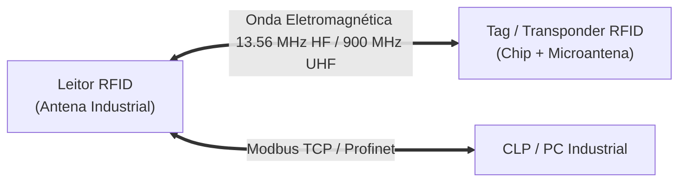
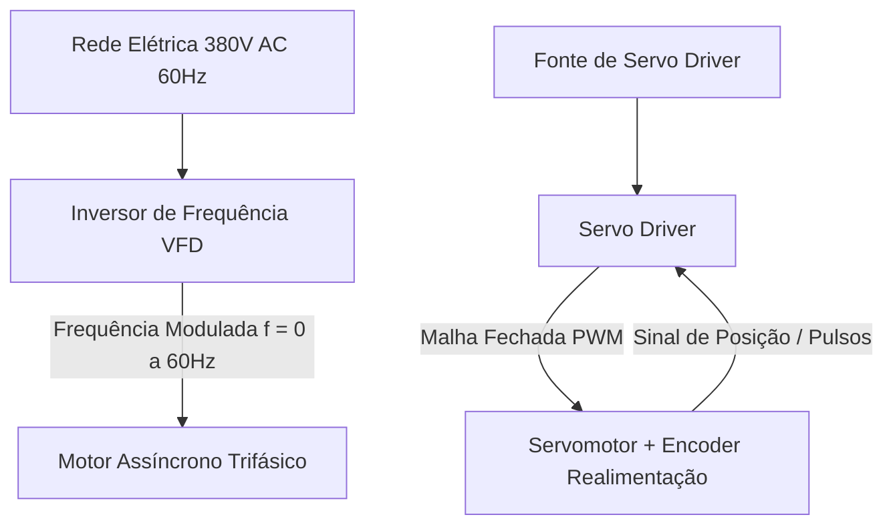

# Aula 03: Teoria Geral dos Dispositivos Industriais (Sensores Avançados, Atuadores e Controladores)

> **Guia Didático e Material Teórico de Consulta Assíncrona**  
> *Disciplina: Automação Industrial | Unidade Curricular: Dispositivos Industriais, Atuadores e Controladores (CLP/IHM)*

---

## 1. Visão Geral & Escopo Técnico

Esta aula consolida a **fundamentação teórica dos dispositivos físicos do chão de fábrica**, cumprindo a ementa de hardware da disciplina. Compreendemos aqui o funcionamento de sensores ópticos e acústicos avançados, sistemas de identificação RFID, atuadores de potência (pneumáticos e acionamentos elétricos) e a arquitetura determinística do **Controlador Lógico Programável (CLP)**.

---

## 2. Sensores Avançados e Sistemas de Identificação

### 2.1 Sensores Fotoelétricos (Ópticos)

Os sensores fotoelétricos utilizam o princípio da emissão e recepção de feixes de luz (visível vermelha ou infravermelha modulada em alta frequência) para detectar objetos a longas distâncias sem contato físico.

#### Infográfico Comparativo: Tipos de Sensores Fotoelétricos


#### **1. Sistema por Barreira / Feixe Transmitido (*Through-Beam*):**
- **Funcionamento:** O emissor de luz e o fototransistor receptor são construídos em invólucros separados e montados alinhados de frente um para o outro. A detecção ocorre quando um objeto opaco interrompe fisicamente o feixe contínuo de luz.
- **Vantagens Técnicas:**
  - Maior alcance operacional da automação (pode atingir até $50\text{ metros}$).
  - Confiabilidade máxima: imune à cor, brilho, formato ou rugosidade da peça.
- **Desvantagem:** Exige instalação física e lançamento de cabos elétricos nos dois lados da esteira ou estrutura mecânica.

#### **2. Sistema Retroreflexivo (*Retro-reflective*):**
- **Funcionamento:** Emissor e receptor estão integrados no mesmo invólucro plástico ou metálico. O feixe luminoso é apontado para um **espelho prismático retroreflexivo** instalado do outro lado, que devolve a luz ao receptor.
- **Filtro Polarizado Anti-Ofuscamento:** Os sensores industriais modernos empregam filtros de polarização cruzada. A luz emitida passa por um filtro vertical; ao ser refletida pelo espelho prismático (formado por micro-prismas de canto de cubo), a fase da onda é rotacionada em $90^\circ$ (horizontal). Se um objeto metálico brilhante passar pela esteira e refletir a luz, a fase da luz não será alterada, e o filtro polarizado do receptor bloqueará esse falso sinal, evitando erros de contagem.

#### **3. Sistema Difuso (*Diffuse-Reflective*):**
- **Funcionamento:** Emissor e receptor ficam no mesmo invólucro, mas não utilizam espelho retroreflexivo. É a própria superfície do objeto que reflete parte da luz de volta ao sensor.
- **Tecnologia de Supressão de Fundo (*Background Suppression*):** Sensores difusos avançados utilizam um receptor PSD (*Position Sensitive Device*) com dois elementos fotossensíveis para medir o ângulo da luz refletida. Isso permite detectar um objeto escuro próximo e ignorar um fundo brilhante distante, independentemente da cor da peça.

---

### 2.1.1 Matriz Comparativa de Sensores Fotoelétricos

| Característica | Barreira (*Through-Beam*) | Retroreflexivo (*Retro-Reflective*) | Difuso (*Diffuse*) |
| :--- | :---: | :---: | :---: |
| **Montagem Elétrica** | Fiação dos dois lados | Fiação em um só lado | Fiação em um só lado |
| **Necessita de Espelho?** | Não | Sim (Espelho Prismático) | Não (Reflete no Objeto) |
| **Alcance Típico** | Até $50\text{ m}$ | $2\text{ m}$ a $10\text{ m}$ | $10\text{ cm}$ a $2\text{ m}$ |
| **Sensibilidade à Cor do Alvo** | Imune | Imune (com Filtro Polarizado) | Alta (depende do albedo) |
| **Aplicação Típica** | Detecção de caixas grandes em corredores | Contagem de garrafas PET em esteiras | Presença de peças em células robóticas |

---

### 2.2 Sensores Ultrassônicos (Acústicos)

Detectam a presença ou medem continuamente a distância de alvos sólidos ou líquidos emitindo pulsos de ondas de ultrassom de alta frequência ($200\text{ kHz}$ a $400\text{ kHz}$) e medindo o tempo de retorno do eco (**Time-of-Flight - ToF**).

```
   Face Sensora (Transdutor Piezoolétrico)
      │
      ├─── Pulsos Ultrassônicos (Emissão) ────────►  ┌──────────────┐
      │                                              │ Objeto Alvo  │
      └─── Eco Refletido (Recepção) ◄───────────────  └──────────────┘
```

#### **Princípios Operacionais e Vantagens:**
- **Independência Óptica:** Capazes de detectar materiais totalmente transparentes (garrafas de vidro, filmes plásticos, água limpa) que seriam invisíveis para sensores fotoelétricos.
- **Compensação Térmica Integrada:** Como a velocidade do som no ar varia com a temperatura ambiente ($v \approx 331,5 + 0,6 \cdot T$), os sensores ultrassônicos industriais possuem um **termistor NTC embutido** para corrigir automaticamente a leitura de distância.
- **Zona Cega (*Blind Zone*):** Região física nos primeiros centímetros à frente da face sensora (típico de $5\text{ cm}$ a $20\text{ cm}$) onde o cristal piezoelétrico ainda está amortecendo a oscilação da emissão e não pode receber o eco. Nenhum objeto pode ser medido dentro da zona cega.

---

### 2.3 Identificação Automática por Rádio Frequência (RFID)

O **RFID** (*Radio Frequency Identification*) permite a leitura e escrita sem contato direto de dados armazenados em microchips acoplados a peças, ferramentas ou *pallets* na linha de produção da **Smart N1**.



#### **Arquitetura do Sistema RFID:**
1. **Tag / Transponder (Etiqueta de Memória):**
   - **Passiva:** Não necessita de bateria. É energizada por indução magnética gerada pelo leitor.
   - **Memória de Dados:** Possui um código **UID (Unique Identifier)** de fábrica inalterável e uma área de **Memória de Usuário (User Memory)** regravável.
2. **Leitor / Escritor RFID com Antena:**
   - Transmite energia via radiofrequência e decodifica a resposta enviada pela tag.
   - Comunica-se com o CLP via rede industrial (Profinet, Ethernet/IP, Modbus TCP).

#### **Aplicação no Ecossistema Smart N1:**
À medida que um produto trafega pelas estações da planta **Smart N1**, o leitor RFID escreve na memória da tag gravada no *pallet*: o número de série, o lote, as receitas de usinagem e o timestamp de aprovação no teste de qualidade, garantindo **genealogia completa do produto**.

---

## 3. Atuadores Industriais e Elementos Finais de Controle

Os atuadores convertem os sinais elétricos de comando enviados pelas saídas do CLP em **força, movimento físico ou controle de vazão**.

### 3.1 Sistemas Pneumáticos e Válvulas Solenoide

A pneumática é o meio de atuação mais utilizado para movimentos lineares rápidos e repetitivos na indústria.

```
  Compressor ──► Unidade FRL ──► Válvula Solenoide 5/2 Vias ──► Cilindro Dupla Ação
                 (Filtro, Reg,                  │
                 Lubrificador)                 ├──► Solenoide Y1 (Avança)
                                               └──► Solenoide Y2 (Retorna)
```

#### **Componentes de um Circuito Pneumático:**
1. **Unidade FRL (Filtro, Regulador de Pressão e Lubrificador):**
   - **Filtro:** Remove umidade, condensado e partículas sólidas do ar comprimido.
   - **Regulador de Pressão:** Estabiliza a pressão de trabalho da fábrica (típico $6\text{ bar} = 600\text{ kPa}$).
   - **Lubrificador:** Injeta uma névoa fina de óleo para reduzir o atrito nos vedações das válvulas e cilindros.
2. **Cilindro Pneumático de Dupla Ação:**
   - Possui duas entradas de ar (uma na câmara traseira e outra na câmara dianteira). O avanço e o retorno do êmbolo são comandados por pressão pneumática.
3. **Válvula Direcional Solenoide 5/2 Vias:**
   - Possui 5 vias de conexão (1 Pressão, 2 Trabalhos A/B, 2 Escapes R/S) e 2 posições de comutação.
   - Comandada por bobinas elétricas (solenoides de 24V DC) conectadas diretamente às saídas digitais do CLP.

---

### 3.2 Acionamentos Elétricos de Potência



#### **1. Motor Assíncrono Trifásico (MIT):**
- **Princípio:** O estator alimentado por corrente trifásica cria um campo magnético girante que induz correntes no rotor de "gaiola de esquilo", gerando o torque mecânico.
- **Aplicação:** Carga industrial contínua de alta confiabilidade (bombas, ventiladores, esteiras de velocidade fixa).

#### **2. Inversor de Frequência (VFD - Variable Frequency Drive):**
- **Arquitetura Interna:**
  1. *Retificador:* Converte a tensão alternada da rede (AC) em tensão contínua (DC).
  2. *Barramento DC:* Filtra e armazena a energia em capacitores.
  3. *Inversor IGBT:* Utiliza transistores de alta velocidade para gerar uma saída trifásica sintetizada via **PWM (Pulse Width Modulation)**.
- **Função:** Permite alterar suavemente a velocidade de rotação do motor ajustando a frequência elétrica ($0$ a $60\text{ Hz}$ ou mais), eliminando picos de corrente na partida (*ramp de aceleração*) e economizando energia.

#### **3. Servomotores e Servo Drivers:**
- **Diferencial:** Motores síncronos de alta dinâmica com **encoder óptico ou magnético absoluto de alta resolução** montado no próprio eixo.
- **Operação em Malha Fechada:** O Servo Driver compara continuamente a posição desejada enviada pelo CLP com a posição real lida pelo encoder milhares de vezes por segundo, permitindo controle preciso de torque, rotação e posicionamento angular com precisão milimétrica em braços robóticos e dosadores.

---

## 4. Arquitetura de Controladores Industriais (CLP) e IHM

### 4.1 Anatomia de Hardware do CLP

O **Controlador Lógico Programável (CLP)** é um computador industrial reforçado para operação contínua 24/7 sob interferência eletromagnética, poeira e vibração.

- **CPU (Unidade Central de Processamento):** Processador responsável por executar o sistema operacional de tempo real (RTOS) e o código do usuário.
- **Módulos de E/S Digitais:** Cartões de entradas ($24\text{V DC}$) e saídas (Transistores PNP ou Relés) dotados de **optoacopladores (isolamento óptico)** para proteger os circuitos eletrônicos sensíveis da CPU contra surtos de tensão do campo.
- **Módulos de E/S Analógicas:** Conversores A/D e D/A para leitura de sinais padronizados de instrumentação (**$4$ a $20\text{ mA}$** ou **$0$ a $10\text{ V}$**).

---

### 4.2 O Ciclo de SCAN (Varredura Determinística)

Ao contrário de computadores pessoais que executam múltiplos programas concorrentes com latência variável, o CLP opera sob um rigoroso **Ciclo de SCAN Determinístico**:


#### **As 4 Fases Fundamentais do Ciclo de SCAN:**

1. **Leitura das Entradas Físicas (PII - Process Image Input):**
   - A CPU lê os níveis lógicos de todos os cartões de entrada e salva uma cópia estática na **Memória de Imagem das Entradas**.
   - *Por que usar a Memória de Imagem?* Garante que todas as instruções do programa leiam valores consistentes do início ao fim da varredura, mesmo que um sensor mude de estado durante a execução do código.

2. **Execução do Programa da Aplicação:**
   - A CPU executa a lógica de programação criada pelo engenheiro/técnico (Texto Estruturado ST, Ladder, Bloco de Funções).
   - As decisões lógicas alteram o estado da **Memória de Imagem das Saídas (PIO)**.

3. **Atualização das Saídas Físicas (PIO - Process Image Output):**
   - Os estados gravados na Memória de Imagem das Saídas são transferidos de uma só vez para os cartões de saída física, acionando relés, solenoides e contatores.

4. **Tarefas Housekeeping, Comunicação e Diagnóstico:**
   - A CPU processa pacotes de rede (Modbus, Profinet, MQTT), realiza checagem de erros do sistema e reinicia o ciclo imediatamente.

---

### 4.3 Interface Homem-Máquina (IHM / HMI)

A IHM é a tela sensível ao toque montada na porta do painel elétrico ou no posto de trabalho da célula **Smart N1**.

- **Sinóticos Gráficos:** Representação visual animada da planta (esteiras rodando, válvulas abrindo/fechando, níveis de tanques).
- **Gestão de Alarmes:** Tela dedicada com histórico de falhas, avisos de emergência e necessidade de reconhecimento por parte do operador.
- **Parâmetros de Receita:** Permite ao operador ajustar *setpoints* de velocidade, contadores de produção e tempos de temporizadores sem alterar a programação interna do CLP.

---

## 5. Questões de Fixação Teórica Assíncrona

### Questão 01 (Sensores Fotoelétricos)
Explique o funcionamento do filtro polarizado em um sensor fotoelétrico retroreflexivo e por que ele previne leituras falsas quando um objeto metálico polido passa em frente ao sensor.

### Questão 02 (Sensoriamento Ultrassônico)
O que é a "Zona Cega" de um sensor ultrassônico e quais cuidados de projeto de montagem mecânica o projetista deve ter ao instalar esse sensor no topo de um reservatório de líquidos?

### Questão 03 (Acionamentos Elétricos)
Qual a principal diferença operacional entre acionar um motor trifásico através de um Inversor de Frequência (VFD) versus um sistema com Servomotor e Servo Driver no tocante à realimentação de posição (*malha fechada*)?

### Questão 04 (Arquitetura CLP)
Descreva as 4 etapas do Ciclo de SCAN do CLP e explique a importância da "Memória de Imagem das Entradas" para garantir o determinismo temporal na automação industrial.

---

## 6. Referências Bibliográficas

1. **IEC 61131-3:** *Programmable controllers - Part 3: Programming languages*.
2. **GROOVER, Mikell P.** *Automação Industrial e Sistemas de Manufatura*. 3. ed. Pearson, 2011.
3. **FRANCHI, Claiton Moro.** *Controladores Lógicos Programáveis: Sistemas Discretos*. 2. ed. Érica, 2009.
