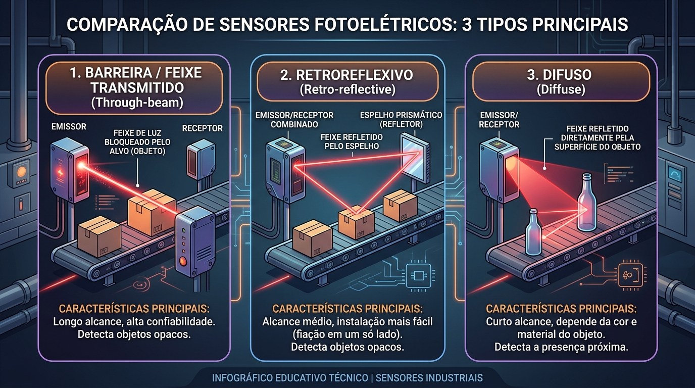
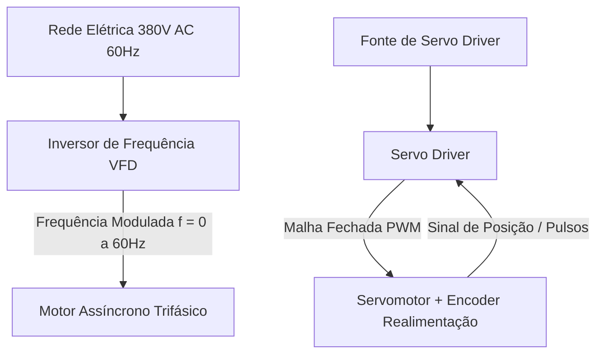
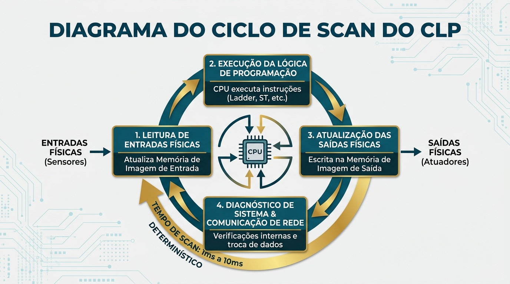

# Aula 03: Teoria Geral dos Dispositivos Industriais (Sensores Avançados, Atuadores e Controladores)

> **Guia Didático e Material Teórico de Consulta Assíncrona**  
> *Disciplina: Automação Industrial | Unidade Curricular: Dispositivos Industriais, Atuadores e Controladores (CLP/IHM)*

---

## 1. Visão Geral & Escopo Técnico

Esta aula consolida a **fundamentação teórica dos dispositivos físicos do chão de fábrica**, cumprindo a ementa de hardware da disciplina. Compreendemos aqui o funcionamento de sensores ópticos e acústicos avançados, sistemas de identificação RFID, atuadores de potência (pneumáticos e acionamentos elétricos) e a arquitetura determinística do **Controlador Lógico Programável (CLP)**.

---

## 2. Sensores Avançados e Sistemas de Identificação

### 2.1 Sensores Fotoelétricos (Ópticos)

Os sensores fotoelétricos utilizam o princípio da emissão e recepção de feixes de luz (visível vermelha ou infravermelha modulada em alta frequência) para detectar objetos a longas distâncias.

#### Infográfico Comparativo: Tipos de Sensores Fotoelétricos



#### **1. Sistema por Barreira / Feixe Transmitido (*Through-Beam*):**
- **Funcionamento:** Emissor e receptor são montados em invólucros separados e alinhados frontalmente. O objeto é detectado quando interrompe fisicamente a passagem do feixe luminoso.
- **Características:**
  - Maior alcance operacional (até $50\text{ metros}$).
  - Máxima confiabilidade: imune à cor, reflexividade ou rugosidade do objeto.
  - Requer cabeamento elétrico em ambos os lados da esteira.

#### **2. Sistema Retroreflexivo (*Retro-reflective*):**
- **Funcionamento:** Emissor e receptor estão integrados no mesmo corpo. O feixe é emitido em direção a um **espelho prismático retroreflexivo** que devolve a luz ao receptor.
- **Filtro Polarizado:** Os sensores modernos utilizam filtros de polarização cruzada. A luz refletida pelo espelho prismático tem sua fase girada em $90^\circ$, permitindo que o receptor diferencie a luz do espelho da reflexão de um objeto metálico brilhante (evitando falsos disparos).

#### **3. Sistema Difuso (*Diffuse-Reflective*):**
- **Funcionamento:** Emissor e receptor no mesmo invólucro. O próprio objeto atua como refletor da luz.
- **Limitações:** O alcance depende drasticamente do **fator de albedo (cor e refletividade)** do objeto:
  - Papel / Objeto Branco: $100\%$ do alcance nominal.
  - Plástico Cinza: $\approx 50\%$ do alcance.
  - Borracha Preta / Superfície Fosca: $\approx 10\%$ do alcance.

---

### 2.2 Sensores Ultrassônicos (Acústicos)

Detectam a presença ou medem continuamente a distância de alvos através da emissão de pulsos de ondas sonoras de alta frequência (típico $200\text{ kHz}$ a $400\text{ kHz}$) e medição do tempo de eco (**Time-of-Flight - ToF**).

```
   Face Sensora (Transdutor Piezoolétrico)
      │
      ├─── Pulsos Ultrassônicos (Emissão) ────────►  ┌──────────────┐
      │                                              │ Objeto Alvo  │
      └─── Eco Refletido (Recepção) ◄───────────────  └──────────────┘
```

#### **Formulação Matemática da Distância ($d$):**

$$d = \frac{v_{\text{som}} \cdot t_{\text{eco}}}{2}$$

Onde:
- $v_{\text{som}}$: Velocidade de propagação do som no ar ($\approx 343\text{ m/s}$ a $20^\circ\text{C}$).
- $t_{\text{eco}}$: Tempo decorrido entre a emissão do pulso e a recepção do eco.
- O fator $2$ compensa o trajeto de ida e volta da onda.

#### **Influência da Temperatura ($T$):**
A velocidade do som no ar varia com a temperatura ambiente segundo a aproximação:

$$v_{\text{som}}(T) \approx 331,5 + 0,6 \times T(^\circ\text{C}) \quad [\text{m/s}]$$

Sensores ultrassônicos industriais possuem um **sensor de temperatura NTC integrado** para compensação automática da leitura.

#### **Zona Cega (*Blind Zone*):**
Região física imediatamente à frente do transdutor (típico $5\text{ cm}$ a $20\text{ cm}$) onde o sensor não consegue realizar medições, pois o cristal piezoelétrico ainda está oscilando da emissão e não pode alternar para o modo receptor.

---

### 2.3 Identificação Automática por Rádio Frequência (RFID)

O **RFID** (*Radio Frequency Identification*) permite a leitura e escrita sem contato direto de dados armazenados em microchips acoplados a peças, ferramentas ou *pallets* de produção.

```mermaid
graph LR
    Leitor["Leitor RFID<br/>(Antena Industrial)"] <===>|Onda Eletromagnética<br/>13,56 MHz (HF) / 900 MHz (UHF)| Tag["Tag / Transponder RFID<br/>(Chip + Microantena)"]
    Leitor <===>|Modbus TCP / Profinet| CLP["CLP / PC Industrial"]
```

#### **Tipos de Tags RFID:**
- **Passivas:** Não possuem bateria interna. São energizadas por **indução eletromagnética** a partir do campo gerado pela antena do leitor.
- **Ativas:** Possuem bateria própria e alcançam distâncias de dezenas de metros.

#### **Estrutura de Memória de uma Tag RFID (Norma ISO 15693 / EPC Gen2):**
1. **UID (Unique Identifier):** Código de fábrica gravado em ROM, hexadecimal de 64 bits, inalterável.
2. **User Memory:** Bloco de memória RAM/EEPROM regravável onde o CLP salva o histórico do produto (ex: receita da peça, status de aprovação do teste de qualidade, timestamps de estações).

---

## 3. Atuadores Industriais e Elementos Finais de Controle

Os atuadores transformam sinais elétricos de comando do CLP em **trabalho mecânico útil** (movimento linear, rotativo ou controle de fluxo).

### 3.1 Atuadores Pneumáticos e Válvulas Solenoide

A pneumática industrial utiliza ar comprimido seco e lubrificado na pressão padrão de $6\text{ bar} = 600\text{ kPa} \approx 87\text{ PSI}$.

```
  Compressor ──► Unidade FRL ──► Válvula Solenoide 5/2 Vias ──► Cilindro Dupla Ação
                 (Filtro, Reg,                  │
                 Lubrificador)                 ├──► Solenoide Y1 (Avança)
                                               └──► Solenoide Y2 (Retorna)
```

#### **Cálculo da Força Teórica de um Cilindro Pneumático ($F$):**
- **Força no Avanço ($F_{\text{av}}$):**
  $$F_{\text{av}} = P \times A_{\text{pistão}} = P \times \frac{\pi \cdot D^2}{4}$$
- **Força no Retorno ($F_{\text{ret}}$):**
  $$F_{\text{ret}} = P \times (A_{\text{pistão}} - A_{\text{haste}}) = P \times \frac{\pi \cdot (D^2 - d^2)}{4}$$

Onde:
- $P$: Pressão manométrica do ar ($\text{N/m}^2$ ou $\text{Pa}$).
- $D$: Diâmetro interno do tubo do cilindro ($\text{m}$).
- $d$: Diâmetro da haste do cilindro ($\text{m}$).

---

### 3.2 Acionamentos Eléticos de Potência



#### **1. Motor Assíncrono Trifásico (MIT):**
A velocidade síncrona do campo magnético girante no estator ($N_s$) em RPM é calculada por:

$$N_s = \frac{120 \cdot f}{P}$$

Onde $f$ é a frequência da rede ($60\text{ Hz}$) e $P$ é o número de polos magnéticos do motor.

#### **2. Inversor de Frequência (VFD - Variable Frequency Drive):**
Controla a velocidade do motor variando a frequência ($f$) e a tensão aplicada, mantendo a razão $V/f$ constante para preservar o torque nominal do motor.

#### **3. Servomotores:**
Motores de alta dinâmica com **encoder de alta resolução** integrado no eixo. Operam em malha fechada controlada pelo Servo Driver, permitindo posicionamento angular com precisão de frações de grau.

---

## 4. Controladores Industriais (CLPs) e o Ciclo de SCAN

O **CLP (Controlador Lógico Programável)** é o cérebro determinístico da automação de Nível 1.

### Infográfico do Ciclo de SCAN do CLP



### Detalhamento das 4 Etapas do SCAN:

1. **Etapa 1 - Leitura das Entradas Físicas (PII - Process Image Input):**
   - O hardware lê o estado de todos os cartões de entrada digitais e analógicos.
   - O estado de cada entrada é copiado para uma região dedicada da memória RAM denominada **Memória de Imagem das Entradas**.
   - *Vantagem:* Durante a execução do programa, o valor das entradas permanece congelado e consistente, imune a ruídos temporários de campo.

2. **Etapa 2 - Execução da Lógica de Programação:**
   - A CPU executa instrução por instrução o programa do usuário (em Texto Estruturado ST, Ladder, etc.) lendo os dados da Memória de Imagem das Entradas e escrevendo os resultados intermediários na **Memória de Imagem das Saídas (PIO)**.

3. **Etapa 3 - Atualização das Saídas Físicas (PIO - Process Image Output):**
   - Os dados gravados na Memória de Imagem das Saídas são transferidos simultaneamente para os módulos físicos de saída, acionando relés, transistores e atuadores.

4. **Etapa 4 - Diagnósticos e Tarefas de Comunicação de Rede:**
   - A CPU realiza autochecagens de hardware, monitora a bateria de backup, processa solicitações de comunicação de rede (Modbus, Profinet, MQTT) e reinicia o ciclo.

---

## 5. Questões Resolvidas e Avaliativas

### Exercício Resolvido 01 (Cálculo de Força Pneumática)
Um cilindro de dupla ação possui diâmetro do pistão $D = 50\text{ mm} = 0,05\text{ m}$ e diâmetro da haste $d = 20\text{ mm} = 0,02\text{ m}$. Sabendo que a rede pneumática fornece ar a uma pressão de $6\text{ bar} = 600.000\text{ N/m}^2$, calcule a força teórica de avanço ($F_{\text{av}}$) e de retorno ($F_{\text{ret}}$).

**Solução:**
- **Área do Pistão ($A_{\text{pistão}}$):**
  $$A_{\text{pistão}} = \frac{\pi \cdot D^2}{4} = \frac{3,14159 \cdot (0,05)^2}{4} \approx 0,0019635\text{ m}^2$$
- **Força de Avanço ($F_{\text{av}}$):**
  $$F_{\text{av}} = P \times A_{\text{pistão}} = 600.000\text{ N/m}^2 \times 0,0019635\text{ m}^2 = 1178,1\text{ N} \approx 120\text{ kgf}$$
- **Área Útil de Retorno ($A_{\text{ret}}$):**
  $$A_{\text{ret}} = \frac{\pi \cdot (D^2 - d^2)}{4} = \frac{3,14159 \cdot (0,0025 - 0,0004)}{4} \approx 0,0016493\text{ m}^2$$
- **Força de Retorno ($F_{\text{ret}}$):**
  $$F_{\text{ret}} = P \times A_{\text{ret}} = 600.000 \times 0,0016493 = 989,6\text{ N} \approx 101\text{ kgf}$$

---

### Questão de Autoavaliação 02
Por que um CLP executa a lógica de programação utilizando uma "Memória de Imagem" em vez de acessar diretamente os cartões físicos de entrada e saída a cada instrução do código? Quais os benefícios em relação a **determinismo** e **consistência gráfica**?

---

## 6. Referências Bibliográficas

1. **IEC 61131-3:** *Programmable controllers - Part 3: Programming languages*.
2. **GROOVER, Mikell P.** *Automação Industrial e Sistemas de Manufatura*. 3. ed. Pearson, 2011.
3. **FIALHO, Arivelto Bustamante.** *Automação Hidráulica: Projetos, Dimensionamento e Análise de Circuitos*. Érica, 2011.
