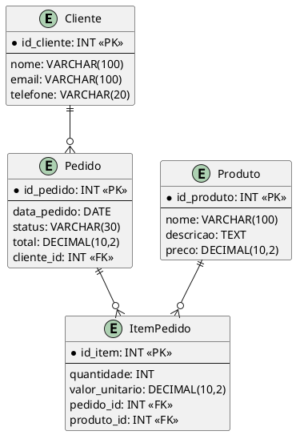
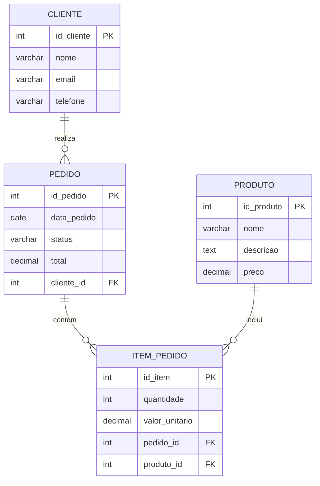

# README de Exemplo - Modelo de Banco de Dados

Este documento apresenta um exemplo de diagrama entidade-relacionamento (DER) em duas sintaxes diferentes: PlantUML e Mermaid.

## Visão geral

O sistema de exemplo modela um cadastro de clientes, pedidos e produtos, incluindo itens de pedido e relacionamento entre entidades.

## DER em PlantUML

## DER em Mermaid

## Regras de negócio

- Um cliente pode fazer vários pedidos.
- Um pedido pode conter vários itens.
- Cada item do pedido refere-se a um único produto.
- O total do pedido pode ser calculado a partir dos itens.

## Observações

Esses diagramas servem como base para a modelagem conceitual e lógica do banco de dados, facilitando a comunicação entre analistas, desenvolvedores e stakeholders.
