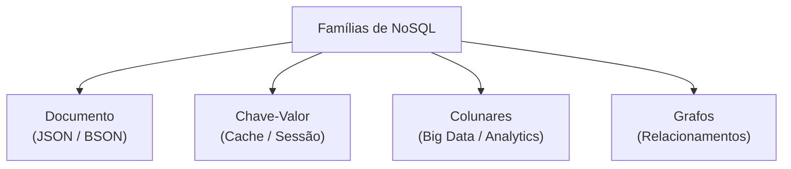

# 1. Introdução aos Bancos de Dados NoSQL

## O que significa NoSQL?

O termo **NoSQL** evoluiu de *"No SQL"* (Sem SQL) para **"Not Only SQL" (Não Apenas SQL)**. Ele não surgiu para destruir os bancos de dados relacionais, mas para preencher lacunas onde o modelo tradicional baseia-se em limitações de flexibilidade e escalabilidade.

Um banco de dados NoSQL refere-se a sistemas de gerenciamento de dados que:

* **Evitam o modelo relacional estrito:** Não dependem obrigatoriamente de tabelas, colunas fixas e chaves estrangeiras.
* **Possuem alta flexibilidade de esquema:** Permitem armazenar dados sem a necessidade de uma estrutura pré-definida (*schema-less*).
* **Nascem distribuídos:** Foram projetados desde o início para rodar em clusters de servidores.

## Contexto Histórico: A Crise do Modelo Relacional

Por mais de três décadas, os Sistemas de Gerenciamento de Bancos de Dados Relacionais (SGBDR), como **Oracle, MySQL, PostgreSQL e SQL Server**, reinaram absolutos. Eles lidavam perfeitamente com sistemas ERP, CRMs e dados transacionais estruturados.

No entanto, a virada do milênio trouxe a Web 2.0 e, com ela, novos desafios de escala:

* **Redes Sociais:** Milhões de usuários gerando curtidas, comentários e conexões simultâneas.
* **Big Data e IoT:** Sensores e logs gerando gigabytes de dados por segundo, misturando texto, geolocalização e arquivos de mídia.
* **Streaming e Aplicações em Nuvem:** Plataformas globais que não podem tolerar *downtime* (tempo de inatividade) e exigem leitura instantânea.

Armazenar esses dados heterogêneos e massivos em tabelas rígidas gerava gargalos de performance e custos astronômicos de infraestrutura. O movimento NoSQL nasceu dessa necessidade de criar sistemas mais rápidos, elásticos e tolerantes a falhas.


# 2. Pilares das Arquiteturas NoSQL

Para compreender o NoSQL, é preciso entender os conceitos técnicos que guiam essas ferramentas.

## 2.1 Escalabilidade Vertical vs. Horizontal

* **Escalabilidade Vertical (Scale-Up):** Consiste em adicionar mais poder (CPU, Memória RAM, SSD) a um **único servidor existente**. É a abordagem padrão dos bancos relacionais. O problema? Existe um limite físico e financeiro (servidores potentes custam exponencialmente mais caro).
* **Escalabilidade Horizontal (Scale-Out):** Consiste em adicionar **mais servidores comuns** à rede, distribuindo o processamento e o armazenamento entre eles. O NoSQL foi projetado para crescer horizontalmente de forma nativa e linear.

## 2.2 Alta Disponibilidade e Tolerância a Falhas

Diferente de um banco relacional centralizado, os sistemas NoSQL costumam trabalhar replicando as informações automaticamente entre diferentes servidores (nós). Se um servidor queimar ou a sua rede cair, outro nó assume o comando imediatamente, garantindo que o usuário final nem perceba a falha.

## 2.3 Flexibilidade Dinâmica (*Schema-less*)

Em ambientes ágeis, os requisitos do software mudam a cada semana. Em um banco relacional, adicionar um novo campo exige alterar a tabela (`ALTER TABLE`), o que pode travar o banco em produção se houver milhões de registros. No NoSQL, o esquema é dinâmico: o Registro A pode ter 3 campos, e o Registro B pode ter 10 campos sem causar erros no sistema.


# 3. Comparativo Técnico: Relacional vs. NoSQL

A tabela abaixo resume as principais diferenças arquiteturais que você deve dominar:

| Característica | Banco de Dados Relacional (SQL) | Banco de Dados Não-Relacional (NoSQL) |
| -------------------------  | ------------------------- | ------------------------- |
| **Estrutura de Dados** | Tabelas estritas com linhas (registros) e colunas. | Flexível (Documentos, Chave-Valor, Grafos, Colunas). |
| **Esquema (*Schema*)** | Rígido, definido estaticamente antes da inserção. | Dinâmico, flexível em tempo de execução. |
| **Linguagem de Consulta** | Padrão SQL (`SELECT`, `JOIN`, `WHERE`). | Variada (JSON queries, APIs específicas, CQL). |
| **Escalabilidade** | Tipicamente **Vertical** (limitação de hardware). | Tipicamente **Horizontal** (adicionando nós ao cluster). |
| **Relacionamentos** | Fortes, garantidos por Chaves Estrangeiras (`JOINs`). | Limitados. Prefere-se o aninhamento de dados. |
| **Transações** | Modelo **ACID** (Foco total em Consistência). | Modelo **BASE** (Foco em Disponibilidade e Performance). |
| **Volume/Performance** | Excelente para transações, limitado para Big Data. | Otimizado para volumes massivos e acessos rápidos. |


# 4. Modelagem de Dados: Comparação Prática

Para entender a mudança de paradigma, veja como representaríamos um cliente que possui mais de um número de telefone nos dois modelos:

## Cenário no Banco Relacional (Normalizado)

Para evitar a repetição de dados, o modelo relacional exige a criação de duas tabelas separadas ligadas por uma Chave Estrangeira (*Foreign Key*).

```sql
-- Tabela de Clientes
CREATE TABLE clientes (
    id INT PRIMARY KEY,
    nome VARCHAR(100),
    email VARCHAR(100)
);

-- Tabela de Telefones (Relacionamento 1:N)
CREATE TABLE telefones (
    id INT PRIMARY KEY,
    cliente_id INT,
    numero VARCHAR(20),
    FOREIGN KEY (cliente_id) REFERENCES clientes(id)
);

```

> **Para ler esses dados**, o banco de dados precisa fazer uma operação de cruzamento em memória chamada `JOIN`, o que consome processamento à medida que o volume de dados cresce.

## Cenário no Banco NoSQL Orientado a Documentos

No NoSQL, a informação é armazenada de forma **desnormalizada**. Nós agregamos tudo o que pertence ao cliente dentro de um único documento estruturado em formato JSON (ou similar).

```json
{
    "_id": 1,
    "nome": "João da Silva",
    "email": "joao@email.com",
    "telefones": [
        "1199999-9999",
        "1188888-8888"
    ]
}

```

> **Vantagem:** Para buscar os dados do cliente e seus telefones, o banco faz uma única busca direta em disco ou memória, retornando a estrutura completa de uma só vez, eliminando o custo do `JOIN`.


# 5. Teorema CAP (Teorema de Brewer)

Formulado pelo cientista da computação Eric Brewer, o **Teorema CAP** dita uma regra imutável para sistemas de arquivos ou bancos distribuídos: é impossível para um sistema garantir simultaneamente as três propriedades fundamentais abaixo. Você deve escolher, no máximo, **duas**.

* **C - Consistency (Consistência):** Todos os nós da rede leem os mesmos dados exatamente ao mesmo tempo. Se você atualizar uma informação no Nó A, ela deve aparecer instantaneamente no Nó B.
* **A - Availability (Disponibilidade):** Toda requisição recebida pelo sistema operacional recebe uma resposta de sucesso/erro, garantindo que o sistema nunca fique fora do ar, mesmo que alguns nós falhem.
* **P - Partition Tolerance (Tolerância a Partições):** O sistema continua operando mesmo se a comunicação de rede entre os servidores cair ou ficar instável (particionamento de rede).

## O Dilema do Mundo Real

Em sistemas distribuídos na internet, **a Tolerância a Partições (P) não é negociável**, pois redes falham. Portanto, os bancos de dados modernos precisam escolher entre ser **CP** ou **AP**:

1. **Sistemas CP (Consistência + Tolerância):** Se a rede falhar, o banco bloqueia as escritas/leituras para evitar inconsistências nos dados até que o cluster se estabilize. (Ex: MongoDB).
2. **Sistemas AP (Disponibilidade + Tolerância):** Se a rede falhar, o banco aceita atualizações locais em qualquer servidor ativo, mesmo sabendo que eles ficarão temporariamente desatualizados entre si. (Ex: Cassandra).


# 6. Transações: ACID vs. BASE

Os objetivos de design dos bancos tradicionais e NoSQL refletem-se em suas filosofias de transação:

## ACID (Foco no Rigor e Segurança)

Típico de bancos relacionais. Garante que o banco nunca entre em estado inválido.

* **Atomicidade:** Ou a transação acontece por inteiro (todas as etapas), ou nada é salvo.
* **Consistência:** As regras de integridade (chaves, restrições) são checadas estritamente antes e depois da operação.
* **Isolamento:** Uma transação rodando em paralelo não interfere no resultado de outra.
* **Durabilidade:** Uma vez salva, a informação nunca será perdida, mesmo em quedas de energia.

## BASE (Foco na Escala e Fluidez)

Típico de sistemas NoSQL distribuídos de alta performance.

* **Basically Available (Basicamente Disponível):** O sistema dá prioridade para responder ao usuário rápido, mesmo que isso signifique retornar um dado levemente desatualizado.
* **Soft State (Estado Fluido/Instável):** Os dados podem mudar ao longo do tempo de forma autônoma à medida que as cópias vão se sincronizando entre os servidores.
* **Eventual Consistency (Consistência Eventual):** O banco garante que, se nenhuma nova atualização ocorrer por um breve período de tempo, todos os nós eventualmente se sincronizarão e ficarão idênticos.

> **Exemplo Prático:** A quantidade de curtidas em um post do Instagram ou um vídeo no YouTube. Se um usuário nos EUA e outro no Japão olharem o mesmo post, um pode ver "1000 curtidas" e o outro "1005". Em poucos segundos, os servidores se sincronizam e ambos veem o valor correto. Para este cenário, a velocidade importa muito mais do que a precisão absoluta em tempo real.


# 7. As Quatro Grandes Famílias NoSQL

O termo NoSQL abriga quatro subcategorias principais de bancos de dados, cada uma projetada para um tipo específico de problema técnico:




## 7.1 Bancos Orientados a Documentos

Armazenam os dados como registros de documentos estruturados (normalmente JSON ou BSON).

* **Principais Ferramentas:** MongoDB, CouchDB, Amazon DocumentDB.
* **Indicação de Uso:** Catálogos de e-commerce, perfis de usuários complexos, CMS (Gerenciamento de Conteúdo).
* **Vantagens:** Mapeamento natural com objetos do código de programação; alta flexibilidade.
* **Desvantagens:** Risco de redundância de dados se mal projetado.

## 7.2 Bancos Chave-Valor (*Key-Value*)

A categoria mais simples e performática. Armazena um identificador único (chave) atrelado a um bloco de dados (valor). É equivalente a um dicionário ou mapa em programação.

* **Principais Ferramentas:** Redis, Riak, Memcached.
* **Indicação de Uso:** Armazenamento de sessões de login, carrinhos de compras em e-commerce, cache de consultas pesadas do banco relacional.
* **Vantagens:** Velocidade extrema de leitura e escrita (frequentemente operam 100% em memória RAM).
* **Desvantagens:** Não permite buscar dados filtrando pelo "valor", apenas pela "chave".

## 7.3 Bancos Orientados a Colunas (Wide-Column Stores)

Em vez de organizar as linhas consecutivamente no disco rígido, eles agrupam as colunas de dados juntas. Otimizado para ler bilhões de linhas focando em poucas colunas de análise.

* **Principais Ferramentas:** Apache Cassandra, Apache HBase, Google Cloud Bigtable.
* **Indicação de Uso:** Análise de dados massivos de sensores (IoT), histórico de transações financeiras, sistemas de telemetria.
* **Vantagens:** Altíssima performance de escrita e compactação de dados agressiva.
* **Desvantagens:** Lógica de modelagem complexa e consultas flexíveis limitadas.

## 7.4 Bancos Orientados a Grafos

Em vez de tabelas ou listas, utilizam estruturas de grafos constituídas por **Vértices (Nós)** que guardam os dados, e **Arestas (Relacionamentos)** que mapeiam as conexões entre esses nós.

* **Principais Ferramentas:** Neo4j, Amazon Neptune, ArangoDB.
* **Indicação de Uso:** Motores de recomendação (Ex: "Pessoas que você talvez conheça"), redes sociais, algoritmos de logística e rotas, detecção de fraudes financeiras cruzadas.
* **Vantagens:** Consultas de relacionamentos profundos em milissegundos (onde o SQL exigiria dezenas de `JOINs`).
* **Desvantagens:** Difícil de escalar horizontalmente e ineficiente para relatórios agregados simples.


# 8. Imersão em MongoDB

O **MongoDB** é o banco de dados NoSQL mais utilizado no mercado de tecnologia mundial. Ele armazena dados em documentos no formato **BSON (Binary JSON)**, uma extensão binária do JSON que suporta mais tipos de dados (como datas nativas, números decimais precisos e dados binários).

## 8.1 Equivalência de Conceitos: SQL vs. MongoDB

Para quem está migrando do modelo relacional, esta tabela funciona como um tradutor mental imediato de termos:

| Conceito no SQL Tradicional | Equivalente no MongoDB | Descrição |
| -------------------------  | ------------------------- | ------------------------- |
| **Database** (Banco de dados) | **Database** | Agrupamento lógico de armazenamento. |
| **Table** (Tabela) | **Collection** (Coleção) | Agrupamento de registros similares. |
| **Row / Record** (Linha / Registro) | **Document** (Documento) | O registro individual contendo os dados. |
| **Column** (Coluna) | **Field** (Campo) | Par de chave-valor dentro do documento. |
| **Index** (Índice) | **Index** | Estrutura para acelerar as consultas. |
| **Table JOIN** | **$lookup** ou **Embedded Docs** | Mecanismo para cruzar ou aninhar dados. |

## 8.2 Anatomia de um Documento MongoDB

Todo documento inserido no MongoDB possui, obrigatoriamente, um campo exclusivo chamado `_id`. Se você não o definir explicitamente, o MongoDB gerará automaticamente um identificador único global chamado `ObjectId`.

```javascript
{
    "_id": ObjectId("645d1f8e1234567890abcdef"), // Chave primária gerada automaticamente
    "nome": "Carlos Souza",
    "idade": 30,
    "cidade": "Sorocaba",
    "interesses": ["tecnologia", "banco de dados"], // Vetores nativos (Arrays)
    "cadastro": ISODate("2026-05-18T20:00:00Z")   // Tipo data nativo
}

```


## 8.3 Guia Prático de Manipulação de Dados (CRUD)

Abaixo, encontram-se os comandos fundamentais do MongoDB Shell para a realização das operações de **C**reate, **R**ead, **U**pdate e **D**elete.

### 8.3.1 CREATE (Inserção)

#### Inserir apenas um documento (`insertOne`)

```javascript
// Acessa a coleção 'clientes' e insere o objeto passado por parâmetro
db.clientes.insertOne({
    nome: "André",
    idade: 35,
    cidade: "Sorocaba"
});

```

#### Inserir múltiplos documentos em lote (`insertMany`)

```javascript
// Passamos um array [] contendo vários objetos JSON
db.clientes.insertMany([
    { nome: "Carlos", idade: 20, cidade: "Itu" },
    { nome: "Maria", idade: 28, cidade: "Sorocaba" }
]);

```


### 8.3.2 READ (Consulta e Filtros)

#### Buscar todos os documentos de uma coleção

```javascript
db.clientes.find();

```

#### Buscar filtrando por igualdade simples

```javascript
// Retorna todos os clientes cuja idade seja exatamente igual a 28
db.clientes.find({ idade: 28 });

```

#### Operadores de Comparação Avançados

Para fazer filtros avançados, o MongoDB utiliza operadores especiais prefixados com o caractere `$`:

| Operador | Significado | Exemplo Prático |
| -------------------------  | ------------------------- | ------------------------- |
| `$gt` | *Greater Than* (Maior que) | `{ idade: { $gt: 25 } }` |
| `$lt` | *Less Than* (Menor que) | `{ idade: { $lt: 40 } }` |
| `$gte` | *Greater Than or Equal* (Maior ou igual) | `{ idade: { $gte: 18 } }` |
| `$lte` | *Less Than or Equal* (Menor ou igual) | `{ idade: { $lte: 60 } }` |
| `$ne` | *Not Equal* (Diferente de) | `{ cidade: { $ne: "São Paulo" } }` |
| `$in` | *In* (Contido em uma lista) | `{ cidade: { $in: ["Itu", "Sorocaba"] } }` |

**Exemplo de consulta complexa combinada:**

```javascript
// Busca clientes com idade maior que 25 anos
db.clientes.find({
    idade: { $gt: 25 }
});

```


### 8.3.3 UPDATE (Atualização)

> ⚠️ **Atenção:** Em operações de alteração no MongoDB, você deve utilizar operadores como `$set`. Caso passe apenas as propriedades sem o `$set`, o documento antigo será totalmente **substituído** pelo novo objeto.

#### Atualizar o primeiro documento encontrado (`updateOne`)

```javascript
db.clientes.updateOne(
    { nome: "Maria" },        // 1º argumento: Filtro de busca (Quem alterar?)
    { $set: { idade: 29 } }   // 2º argumento: Operador de modificação (O que mudar?)
);

```

#### Atualizar múltiplos documentos em massa (`updateMany`)

```javascript
db.clientes.updateMany(
    { cidade: "Sorocaba" },          // Filtro: Todos de Sorocaba
    { $set: { ativo: true } }        // Adiciona ou altera o campo 'ativo' para true
);

```


### 8.3.4 DELETE (Remoção)

#### Remover o primeiro documento correspondente (`deleteOne`)

```javascript
db.clientes.deleteOne({ nome: "Carlos" });

```

#### Remover múltiplos documentos correspondentes (`deleteMany`)

```javascript
// Remove todos os registros cujo campo 'ativo' seja falso
db.clientes.deleteMany({ ativo: false });

```


# 9. Arquitetura Avançada em NoSQL

## Índices (*Indexes*)

Assim como o sumário de um livro físico, os índices evitam que o banco precise varrer todos os documentos do disco para achar um registro (*Collection Scan*).

```javascript
// Cria um índice focado no campo 'nome' em ordem ascendente (1)
db.clientes.createIndex({ nome: 1 });

```

# 10. Replicação e Alta Disponibilidade (*Replica Sets*)

O MongoDB gerencia alta disponibilidade através de **Replica Sets**. Trata-se de um cluster composto por uma instância **Primária** (responsável por receber todas as escritas) e diversas instâncias **Secundárias** (que copiam os dados do nó primário continuamente). Se o nó Primário sofrer uma pane, os nós Secundários realizam uma votação automatizada e elegem um novo líder em frações de segundo.

# 11. Distribuição de Dados com Sharding

Quando o volume de dados ultrapassa a capacidade de armazenamento de um único servidor físico de grande porte, entra em jogo o **Sharding**. Ele quebra os dados da coleção em fatias (*shards*) baseando-se em uma chave escolhida e distribui essas fatias de forma transparente entre servidores independentes.


# 12. Tomada de Decisão: Quando Usar e Quando Evitar NoSQL

A escolha de um banco de dados deve ser pragmática, pautada nos requisitos de negócio e técnicos do sistema.

## Quando Usar NoSQL?

* **Esquemas fluidos ou desconhecidos:** Projetos em fase inicial ou produtos onde a estrutura do dado muda frequentemente.
* **Altíssimo volume de dados e requisições:** Aplicações de escopo global com milhões de acessos diários.
* **Dados Semi-estruturados/Não-estruturados:** IoT, processamento de logs, catálogos de produtos com dezenas de variações de atributos.
* **Arquiteturas de Microsserviços:** Onde cada microsserviço precisa de independência e velocidade em sua própria base de dados de domínio único.

## Quando NÃO Usar NoSQL (Manter-se no Relacional)?

* **Sistemas com forte integridade transacional:** Aplicações financeiras estritas, sistemas bancários e contábeis que exigem ACID puro e imediato de ponta a ponta.
* **Sistemas altamente normalizados:** Estruturas onde o coração do negócio baseia-se em relacionamentos complexos de tabelas altamente amarradas.
* **Cenários onde o padrão de consulta muda constantemente:** Se a equipe de analistas precisa realizar *queries* complexas e improvisadas (*ad-hoc queries*) combinando múltiplos dados o tempo todo para gerar relatórios.


# 13. Casos de Uso no Mundo Real

| Empresa | Tecnologia Adotada | Cenário de Aplicação |
| -------------------------  | ------------------------- | ------------------------- |
| **Netflix** | Cassandra / DynamoDB | Armazenamento do histórico de visualizações de vídeos e logs de comportamento de milhões de usuários globais em tempo real. |
| **Amazon** | DynamoDB | Catálogo flexível de produtos (onde uma camiseta tem campos como 'tamanho' e 'cor', enquanto um notebook tem 'processador' e 'RAM'). |
| **Facebook** | Motores customizados / Grafos | Mapeamento instantâneo da imensa teia de conexões entre usuários, páginas, curtidas e posts associados. |
| **Uber** | Schemaless / NoSQL proprietários | Processamento massivo e instantâneo de coordenadas de geolocalização e rotas de motoristas por segundo. |


# Exercícios de Fixação Conceitual e Teórica

## 1. Dinâmica de Infraestrutura

Diferencie, detalhadamente, a **escalabilidade horizontal** da **escalabilidade vertical**, pontuando as principais limitações físicas e financeiras associadas ao crescimento vertical de servidores.

## 2. Mudança de Paradigma

O que significa afirmar que um banco de dados NoSQL possui um modelo de dados *schema-less* (esquema dinâmico)? Quais vantagens essa característica traz para equipes de desenvolvimento que trabalham com metodologias ágeis?

## 3. Teorema CAP e Tolerância

Imagine que ocorreu um rompimento físico na rede que interliga dois data centers de um banco de dados NoSQL distribuído. Com base nas premissas do Teorema CAP, explique o que acontecerá caso os administradores priorizem a **Disponibilidade (A)** em detrimento da **Consistência (C)**.

## 4. Modelo BASE vs. ACID

Explique o conceito de **Consistência Eventual** presente no modelo transacional BASE. Dê um exemplo de um cenário prático da internet onde a consistência eventual é aceitável e um cenário onde ela seria desastrosa.

## 5. Análise de Modelagem

Por que bancos de dados orientados a documentos, como o MongoDB, preferem o **aninhamento de dados** (documentos embutidos) em vez da criação de tabelas separadas unidas por chaves estrangeiras (`JOINs`)? Explique o impacto dessa escolha na performance de leitura de grandes volumes de dados.


# Laboratório Prático: Resolução de Desafios no MongoDB

Analise os códigos de exemplo abaixo. Eles servem de guia prático de estudos para a sintaxe e lógica operacional de manipulação de dados.

## Desafio 1: Cadastro Inicial (CREATE)

```javascript
// Criando e alimentando uma coleção de estudantes universitários
db.alunos.insertOne({
    nome: "Pedro",
    curso: "Análise e Desenvolvimento de Sistemas",
    semestre: 3,
    habilidades: ["JavaScript", "HTML", "SQL"]
});

```

## Desafio 2: Filtragem de Informação (READ)

```javascript
// Localizando todos os estudantes matriculados em um curso específico
db.alunos.find({
    curso: "Análise e Desenvolvimento de Sistemas"
});

```

## Desafio 3: Modificação de Estado (UPDATE)

```javascript
// Modificando campos e adicionando novas propriedades dinamicamente
db.alunos.updateOne(
    { nome: "Pedro" },
    { 
        $set: { 
            curso: "Engenharia de Software",
            semestre: 4
        } 
    }
);

```

## Desafio 4: Expurgando Registros (DELETE)

```javascript
// Removendo de forma controlada o registro criado no início do laboratório
db.alunos.deleteOne({
    nome: "Pedro"
});

```