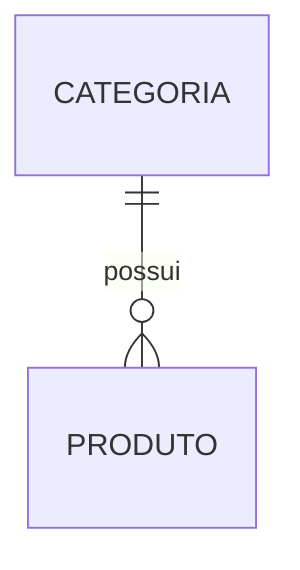
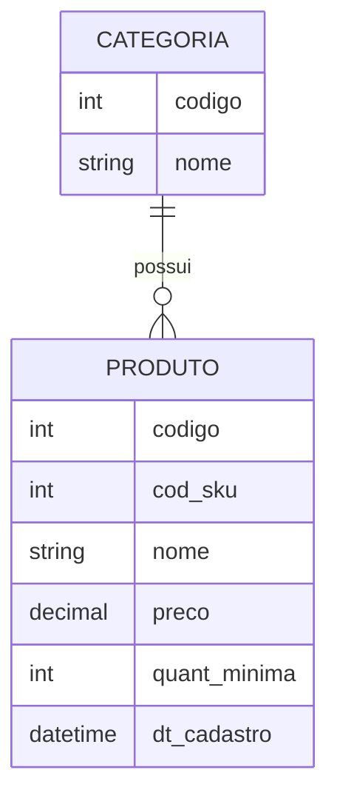

## Aula 2: Introdução a Banco de Dados Relacional (do problema ao SQL)

Este material foi elaborado para **acompanhar a explicação do professor em sala**. Utilize-o como um **guia passo a passo**, fazendo anotações e observando os exemplos apresentados na lousa.

O objetivo desta aula **não é decorar comandos SQL**, mas entender como um **problema real** se transforma em um **banco de dados organizado**.


### 1. Por que usar Banco de Dados?

Em sistemas reais, precisamos armazenar informações de forma:

* Organizada
* Segura
* Consistente
* Fácil de consultar

Um **banco de dados relacional** organiza essas informações em **tabelas**, que se relacionam entre si.

Pense em uma tabela como uma **planilha**, onde:

* Cada linha é um registro
* Cada coluna é uma informação específica


### 2. Enunciado do Problema (Ponto de Partida)

> Uma empresa precisa de um sistema simples de controle de estoque.
>
> Ela deseja:
>
> * Cadastrar categorias de produtos
> * Cadastrar produtos
> * Cada produto pertence a uma única categoria
> * Registrar nome, código (SKU), preço, quantidade mínima e data de cadastro

**Tudo em banco de dados começa com um problema real.**


### 3. Identificando Entidades

A primeira pergunta que fazemos é:

**Quais são as coisas principais que precisam ser armazenadas?**

Normalmente, elas aparecem como **substantivos** no texto.

#### Entidades encontradas:

* Categoria
* Produto

Essas entidades futuramente se tornarão **tabelas** no banco de dados.


### 4. Definindo Atributos das Entidades

Agora listamos as informações que cada entidade precisa guardar.

#### Entidade: Categoria

* Identificador da categoria
* Nome da categoria
* Descrição

#### Entidade: Produto

* Identificador do produto
* Código (SKU)
* Nome do produto
* Preço
* Quantidade mínima
* Data de cadastro
* Categoria do produto

Cada item dessa lista se tornará uma **coluna** na tabela.


### 5. Relacionamento entre Entidades

Perguntas importantes:

* Uma categoria pode ter vários produtos? → **Sim**
* Um produto pode pertencer a várias categorias? → **Não**

#### Tipo de relacionamento:

* **1 para N (1:N)**

```
CATEGORIA (1) ──────── (N) PRODUTO
```

Isso significa que:

* Uma categoria pode estar ligada a vários produtos
* Cada produto pertence a apenas uma categoria




### 6. Conceitos Essenciais

#### Chave Primária (Primary Key – PK)

* Identifica um registro de forma única
* Não pode se repetir
* Exemplo: id_categoria, id_produto

#### Chave Estrangeira (Foreign Key – FK)

* Cria o relacionamento entre tabelas
* Aponta para a chave primária de outra tabela

No nosso caso, o produto guarda o **id da categoria**.


### 7. Tipos de Dados Mais Usados

| Tipo      | Uso                 |
| --------- | ------------------- |
| INT       | Números inteiros    |
| VARCHAR   | Textos curtos       |
| DECIMAL   | Valores monetários  |
| TIMESTAMP | Data e hora         |
| BOOLEAN   | Verdadeiro ou falso |

O tipo de dado deve representar corretamente a informação armazenada.


### 8. Preparando o Ambiente com Docker

Para garantir que todos utilizem o mesmo banco de dados, usaremos **Docker com PostgreSQL 15**.

#### Arquivo: docker-compose.yml

```yaml
services:
  db-estoque:
    image: postgres:15
    container_name: postgres_pbl
    restart: always
    environment:
      POSTGRES_USER: admin
      POSTGRES_PASSWORD: senha_segura_123
      POSTGRES_DB: sistema_estoque
    ports:
      - "5432:5432"
    volumes:
      - postgres_data:/var/lib/postgresql/data

volumes:
  postgres_data:
```


#### Comandos Básicos

Subir o banco de dados:

```bash
docker-compose up -d
```

Acessar o banco:

```bash
docker exec -it postgres_pbl psql -U admin -d sistema_estoque
```


### 9. Exercício Proposto

Utilizando o cenário do seu grupo:

1. Escreva o enunciado do problema
2. Identifique pelo menos duas entidades
3. Liste os atributos de cada entidade
4. Defina um relacionamento 1:N
5. Crie as tabelas no banco de dados
6. Insira pelo menos um registro em cada tabela
7. Faça uma consulta simples com SELECT

Este exercício será a base para as próximas aulas.


### 10. Sistema de Estoque com Movimentação (mais avançado)

A empresa deseja evoluir o sistema.

Agora será necessário:

#### **Novos requisitos**

* Controlar **entradas e saídas de produtos**
* Registrar:

  * Tipo de movimentação (entrada ou saída)
  * Data da movimentação
  * Quantidade movimentada
* Controlar o **estoque atual** automaticamente


#### **Entidades adicionais**

* **Movimentacao**

  * `id_movimentacao` (PK)
  * `tipo` (E = Entrada, S = Saída)
  * `quantidade`
  * `data_movimentacao`
  * `id_produto` (FK)


#### **Tarefas do desafio**

1. Atualize o **DER**, incluindo a entidade Movimentação
2. Crie o DDL completo com:

   * PK e FK
   * Restrições de domínio (`CHECK`)
3. Insira movimentações de entrada e saída
4. Crie consultas para:

   * Calcular o estoque atual de cada produto
   * Listar produtos abaixo da quantidade mínima
5. Avançado

   * Criar uma **VIEW** de estoque atual
   * Criar uma **TRIGGER** para impedir saída maior que o estoque
