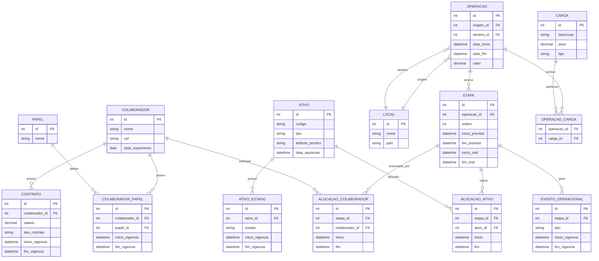

# **Modelo Relacional**

## DER (Mermaid)

### Problemas dessa abordagem

* Muitos **NULLs** (se tipos diferentes tiverem atributos diferentes)
* Regras mais difíceis de garantir
* Menor expressividade semântica

# **VERSÃO COM ESPECIALIZAÇÃO**

## DER (Mermaid)

```mermaid
erDiagram

    COLABORADOR {
        int id PK
        string nome
        string cpf
        date data_nascimento
    }

    MOTORISTA {
        int colaborador_id PK, FK
        string cnh
    }

    GERENTE {
        int colaborador_id PK, FK
        string area
    }

    PAPEL {
        int id PK
        string nome
    }

    COLABORADOR_PAPEL {
        int id PK
        int colaborador_id FK
        int papel_id FK
        datetime inicio_vigencia
        datetime fim_vigencia
    }

    CONTRATO {
        int id PK
        int colaborador_id FK
        decimal salario
        string tipo_contrato
        datetime inicio_vigencia
        datetime fim_vigencia
    }

    ATIVO {
        int id PK
        string codigo
        datetime data_aquisicao
    }

    VEICULO_TERRESTRE {
        int ativo_id PK, FK
        string placa
        string tipo_veiculo
    }

    AERONAVE {
        int ativo_id PK, FK
        string prefixo
        int autonomia
    }

    ATIVO_ESTADO {
        int id PK
        int ativo_id FK
        string estado
        datetime inicio_vigencia
        datetime fim_vigencia
    }

    OPERACAO {
        int id PK
        int origem_id FK
        int destino_id FK
        datetime data_inicio
        datetime data_fim
        decimal valor
    }

    LOCAL {
        int id PK
        string nome
        string pais
    }

    ETAPA {
        int id PK
        int operacao_id FK
        int ordem
        datetime inicio_previsto
        datetime fim_previsto
        datetime inicio_real
        datetime fim_real
    }

    CARGA {
        int id PK
        string descricao
        decimal peso
        string tipo
    }

    OPERACAO_CARGA {
        int operacao_id FK
        int carga_id FK
    }

    ALOCACAO_ATIVO {
        int id PK
        int etapa_id FK
        int ativo_id FK
        datetime inicio
        datetime fim
    }

    ALOCACAO_COLABORADOR {
        int id PK
        int etapa_id FK
        int colaborador_id FK
        datetime inicio
        datetime fim
    }

    EVENTO_OPERACIONAL {
        int id PK
        int etapa_id FK
        string tipo
        datetime inicio_vigencia
        datetime fim_vigencia
    }

    %% RELAÇÕES

    COLABORADOR ||--|| MOTORISTA : especializacao
    COLABORADOR ||--|| GERENTE : especializacao

    ATIVO ||--|| VEICULO_TERRESTRE : especializacao
    ATIVO ||--|| AERONAVE : especializacao

    COLABORADOR ||--o{ COLABORADOR_PAPEL : possui
    PAPEL ||--o{ COLABORADOR_PAPEL : define

    COLABORADOR ||--o{ CONTRATO : possui

    ATIVO ||--o{ ATIVO_ESTADO : possui

    OPERACAO ||--o{ ETAPA : possui
    OPERACAO ||--o{ OPERACAO_CARGA : possui
    CARGA ||--o{ OPERACAO_CARGA : pertence

    OPERACAO }o--|| LOCAL : origem
    OPERACAO }o--|| LOCAL : destino

    ETAPA ||--o{ ALOCACAO_ATIVO : utiliza
    ATIVO ||--o{ ALOCACAO_ATIVO : alocado

    ETAPA ||--o{ ALOCACAO_COLABORADOR : executada_por
    COLABORADOR ||--o{ ALOCACAO_COLABORADOR : participa

    ETAPA ||--o{ EVENTO_OPERACIONAL : gera
```

## **Por que essa versão é melhor (conceitualmente)?**

### 1. Representa o domínio real

* motorista tem CNH → só ele
* aeronave tem autonomia → só ela

✔ evita gambiarra com NULL

### 2. Permite regras fortes

Exemplo:

* só MOTORISTA pode dirigir veículo
* só AERONAVE faz transporte aéreo

### Observações

**Use especialização quando:**

* há diferenças estruturais entre tipos
* há regras específicas por tipo

**Evite especialização quando:**

* diferenças são pequenas
* sistema simples
* foco é implementação rápida
