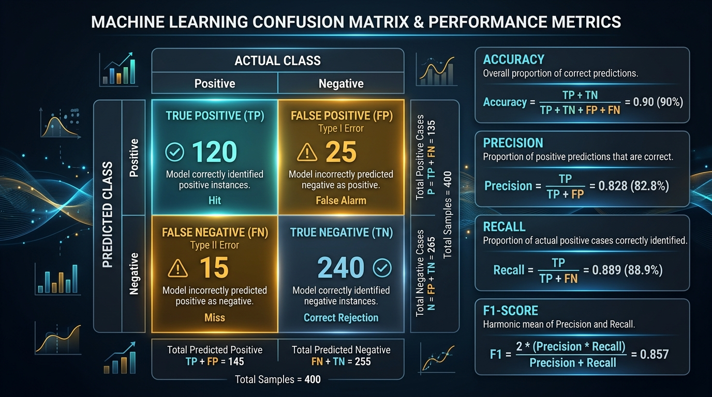
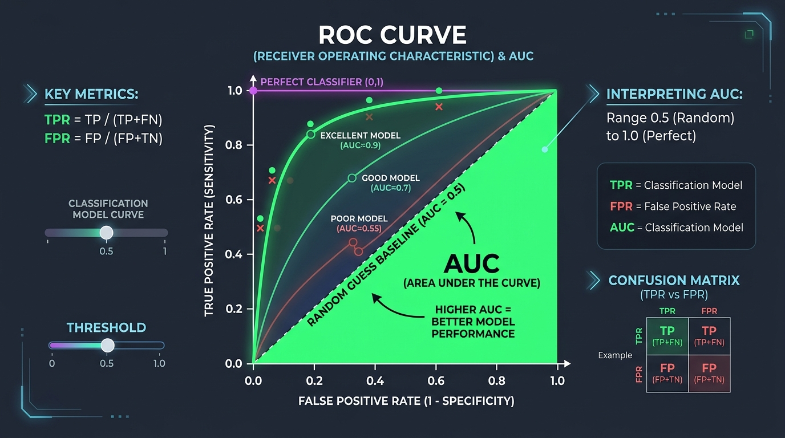
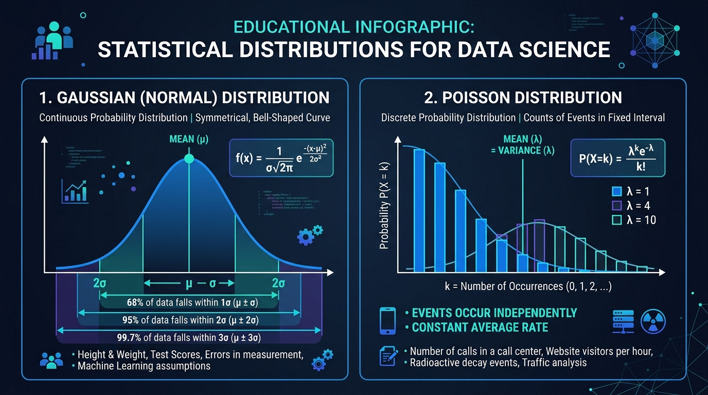

# Semana 02: CRISP-DM Fase 2 — Entendimento dos Dados, Métricas de Avaliação & Distribuições Estatísticas

> **Formato de Aula Prática**: Esta aula possui uma versão interativa em Jupyter Notebook disponível em [`semana_02.ipynb`](semana_02.ipynb).

## 1. Visão Geral & Contexto do Negócio
Nesta aula, aprofundaremos a **Fase 2 do CRISP-DM (Data Understanding)** utilizando o dataset oficial de concessão de crédito (`CRISP_DM_Random_Forest_Credito.ipynb`), localizado na pasta [`materiais/`](../materiais/CRISP_DM_Random_Forest_Credito.ipynb).

---

## 2. Métricas de Avaliação de Classificação & Matriz de Confusao (CRISP-DM Fases 1 & 5)

Para avaliar modelos de Machine Learning em problemas de risco de crédito, utilizamos a **Matriz de Confusão** e métricas derivadas.

### Fórmulas Matemáticas das Métricas:

- **Acurácia**: Proporção geral de acertos do modelo.
$$\text{Acurácia} = \frac{TP + TN}{TP + TN + FP + FN}$$

- **Precisão**: Dentre todas as previsões positivas feitas pelo modelo, quantas eram realmente positivas.
$$\text{Precisão} = \frac{TP}{TP + FP}$$

- **Recall (Sensibilidade)**: Dentre todos os casos reais de inadimplência, quantos o modelo conseguiu detectar. **É a métrica chave para crédito!**
$$\text{Recall} = \frac{TP}{TP + FN}$$

- **F1-Score**: Média harmônica entre Precisão e Recall.
$$\text{F1-Score} = 2 \times \frac{\text{Precisão} \times \text{Recall}}{\text{Precisão} + \text{Recall}}$$

---

### Curva ROC e Área sob a Curva (ROC-AUC)

A **Curva ROC** (*Receiver Operating Characteristic*) plota a taxa de Verdadeiros Positivos ($TPR = Recall$) contra a taxa de Falsos Positivos ($FPR = \frac{FP}{FP + TN}$) para diferentes limiares de decisão de probabilidade.

- **ROC-AUC = 0.5**: Modelo equivalente a um palpite aleatório (moeda).
- **ROC-AUC >= 0.85**: Excelente capacidade de separação estatística entre caloteiros e bons pagadores.

---

## 3. Distribuições Estatísticas e Geração de Dados com `np.random`

O dataset da disciplina é gerado via simulação de monte carlo para incorporar padrões estatísticos reais do mercado financeiro.

### A) Distribuição Normal / Gaussiana (`np.random.normal`)
Utilizada para modelar variáveis contínuas da natureza que se concentram em torno de uma média $\mu$ com dispersão medida pelo desvio padrão $\sigma$.
- **Idade**: `np.random.normal(loc=38.0, scale=11.0)`
- **Score Serasa**: `np.random.normal(loc=620.0, scale=140.0)`

#### Regra Empírica 68-95-99.7:
- **$68\%$** dos dados estão a $\pm 1\sigma$ da média.
- **$95\%$** dos dados estão a $\pm 2\sigma$ da média.
- **$99.7\%$** dos dados estão a $\pm 3\sigma$ da média.

### B) Distribuição de Poisson (`np.random.poisson`)
Utilizada para modelar variáveis discretas que representam contagens de eventos independentes em um intervalo fixo.
- **Consultas recentes ao CPF**: `np.random.poisson(lam=2.3)`
- **Histórico de atrasos em 12 meses**: `np.random.poisson(lam=0.8)`

### C) Outros Recursos Usados no Dataset (`np.random`):
- `np.random.choice()`: Amostragem categórica com probabilidades (ex: `CLT`, `Autonomo`, `PJ`).
- `np.random.exponential()`: Distribuição de renda assimétrica com cauda longa à direita.
- `np.clip()`: Limitação de valores dentro de um intervalo válido (ex: Score de 150 a 990).

---

## 4. Anatomia do Dataset de Crédito & Comandos Pandas

A base bruta extraída do banco de dados operacional (`df_raw`) contém **3.000 amostras (linhas)** e **15 atributos (colunas)**.

### Tabela de Dicionário de Dados

| Atributo | Tipo de Dado | Descrição / Significado no Negócio | Desafios Identificados |
| :--- | :---: | :--- | :--- |
| `proponente_id` | Texto (String) | Identificador único da proposta | Sem valor preditivo |
| `idade` | Numérico (Float) | Idade do proponente em anos | Contém outliers espúrios (`-15.0` e `999.0`) |
| `tipo_vinculo` | Categórico (String) | Regime de trabalho | Strings despadronizadas (`' CLT '`, `'clt'`) |
| `estado_civil` | Categórico (String) | Estado civil | Dados bem formatados |
| `escolaridade` | Categórico (String) | Nível de instrução | Dados bem formatados |
| `renda_mensal` | Numérico (Float) | Renda bruta mensal em Reais | Contém **nulos (`NaN`)** e valores aberrantes |
| `valor_solicitado` | Numérico (Float) | Valor do empréstimo | Faixa de R$ 2.000 a R$ 35.000 |
| `numero_parcelas` | Numérico (Int) | Prazo de pagamento em meses | Variável discreta (12 a 60) |
| `score_serasa` | Numérico (Float) | Pontuação de crédito (150 a 990) | Contém **nulos (`NaN`)** |
| `num_consultas_recentes` | Numérico (Int) | Consultas ao CPF nos últimos 90 dias | Distribuição de Poisson ($\lambda=2.3$) |
| `atrasos_ultimos_12m` | Numérico (Int) | Histórico de atrasos no último ano | Distribuição de Poisson ($\lambda=0.8$) |
| `ruido_estocastico` | Numérico (Float) | Flutuação aleatória do sistema | Ruído puro |
| `numero_da_sorte_app` | Numérico (Int) | Número promocional no app | Sem valor preditivo |
| `ip_origem_hash` | Texto (String) | Hash do dispositivo | Sem valor preditivo |
| `inadimplente` | Binário (Int) | **Target**: `0` = Adimplente, `1` = Calote | Classe desbalanceada (~20%) |

---

## 5. Exercícios de Fixação & Estudo Dirigido

1. Explique por que o **Recall** é a métrica mais relevante do que a **Acurácia** ao avaliar modelos de concessão de crédito.
2. Na distribuição Normal de idades ($\mu = 38$, $\sigma = 11$), aproximadamente qual percentual de clientes possui idade entre 27 e 49 anos?
3. Qual função do `np.random` foi utilizada para gerar a contagem discreta de atrasos em 12 meses?
4. O que indica uma Curva ROC com área sob a curva (ROC-AUC) igual a 0.50?
