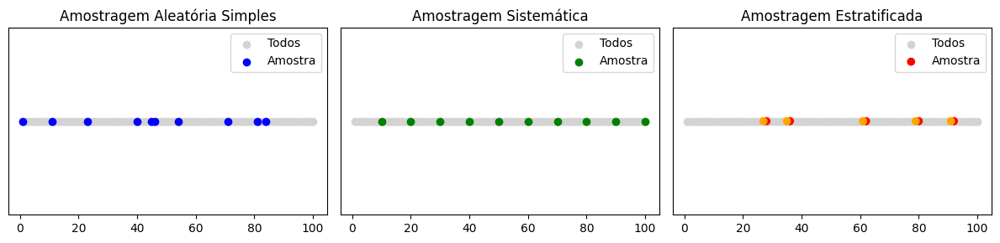

# Aula 1 — Introdução à Estatística para Ciência de Dados

---

## Objetivos da Aula
- Compreender o conceito de estatística e sua importância para ciência de dados.
- Diferenciar estatística descritiva e inferencial.
- Identificar e aplicar técnicas básicas de amostragem.
- Simular processos de amostragem para fixar o conhecimento.

---

## Introdução: O que é Estatística?

### Conceito Geral
- **Estatística** é a ciência que coleta, organiza, resume, analisa e interpreta dados para apoiar a tomada de decisão.
- Usada em diversas áreas: negócios, engenharia, saúde, tecnologia e ciências sociais.

### Tipos de Estatística
- **Descritiva**: resume os dados de maneira simples, utilizando tabelas, gráficos e medidas (ex: média, mediana, moda).
- **Inferencial**: usa amostras para fazer generalizações sobre a população inteira, envolvendo margem de erro, teste de hipóteses, intervalos de confiança.

> **Exemplo rápido:**  
> Estudar 500 clientes para inferir a opinião de 50.000 clientes de uma empresa.

---


## Pensamento Estatístico

O **pensamento estatístico** é um processo estruturado de raciocínio usado para compreender fenômenos por meio da coleta, organização, análise e interpretação de dados. Ele é fundamental em diversas áreas do conhecimento, apoiando a tomada de decisões com base em evidências.

---

### 1. Coleta de Dados

A primeira etapa do pensamento estatístico consiste em reunir dados relevantes que possam responder a uma pergunta ou sustentar uma investigação. Essa coleta deve ser planejada cuidadosamente para garantir a confiabilidade das conclusões.

#### Perguntas-chave:
- **Quem?** — Sujeitos ou fontes dos dados (ex: pessoas, sensores, máquinas).
- **O quê?** — Variáveis ou características observadas (ex: idade, temperatura, tempo).
- **Quando?** — Período ou frequência da coleta (ex: diário, mensal, sazonal).
- **Onde?** — Local da coleta (ex: campo, laboratório, plataforma digital).
- **Como?** — Métodos de coleta (ex: entrevistas, experimentos, registros automáticos).

---

### 2. Organização dos Dados

Após a coleta, os dados precisam ser organizados de maneira clara e acessível. Essa etapa facilita a identificação de padrões, erros e lacunas.

### Principais formas de organização:
- **Tabelas** — Estruturação dos dados em linhas e colunas.
- **Gráficos** — Representações visuais como gráficos de barras, linhas, setores e histogramas.
- **Categorias** — Classificação dos dados em grupos (quantitativos x qualitativos; contínuos x discretos).

---

### 3. Análise dos Dados

Nesta etapa, os dados organizados são examinados para extrair informações úteis, fazer comparações e testar hipóteses.

#### Técnicas utilizadas:
- **Estatísticas descritivas** — Medidas como média, mediana, moda, variância e desvio padrão.
- **Análise gráfica** — Visualizações que auxiliam na detecção de tendências, dispersões e correlações.
- **Inferência estatística** — Aplicação de métodos para generalizar resultados de uma amostra para a população (ex: testes de hipótese, regressões, intervalos de confiança).

---

### 4. Interpretação dos Resultados

A etapa final envolve transformar os resultados numéricos em informações compreensíveis e úteis para a tomada de decisão.

#### Elementos da interpretação:
- **Conclusões práticas** — O que os dados mostram? Como se aplicam ao problema investigado?
- **Reconhecimento de limitações** — Identificação de possíveis vieses, erros de amostragem ou limitações dos métodos utilizados.
- **Recomendações** — Sugestões com base nos dados analisados, incluindo propostas de ações ou novas investigações.

---

### Importância do Pensamento Estatístico

O pensamento estatístico promove decisões fundamentadas em evidências, reduzindo incertezas. É amplamente utilizado em áreas como saúde, engenharia, economia, educação, ciência de dados, entre outras.


---


## Tipos de Amostragem

Amostragem é o processo de selecionar uma parte da população para análise.

### 1. Amostragem Aleatória
- Cada elemento tem **probabilidade igual** de ser escolhido.
- **Exemplo**: Sorteio aleatório de nomes para uma pesquisa.

### 2. Amostragem Aleatória Simples
- Um subconjunto é retirado diretamente da população sem agrupamentos ou estratificações.
- Técnicas:
  - Sorteio físico (papelzinhos, roleta).
  - Sorteio computacional (ex: `random.sample` em Python).

### 3. Amostragem Sistemática
- Selecione um ponto de partida aleatório e depois escolha cada `n`-ésimo elemento.
- Útil para listas ordenadas.
- **Exemplo**: Num cadastro de clientes, selecionar um cliente a cada 10 registros.

### 4. Amostragem Estratificada
- A população é dividida em **estratos** homogêneos (ex: faixa etária, sexo, região) e então é feita uma amostra aleatória dentro de cada grupo.
- Garante melhor representatividade da diversidade.

### 5. Exemplo Amostragem Aleatória Simples, Sistemática e Estratificada



```python
import random
import pandas as pd
import matplotlib.pyplot as plt

# Criar base de dados fictícia
clientes = [f"Cliente {i}" for i in range(1, 101)]
df_clientes = pd.DataFrame({
    "ID": range(1, 101),
    "Nome": clientes,
    "Grupo": ["Par" if i % 2 == 0 else "Ímpar" for i in range(1, 101)]
})

# Amostragem Aleatória Simples
amostra_aleatoria = df_clientes.sample(n=10, random_state=42)

# Amostragem Sistemática
passo = 10
inicio = random.randint(0, passo - 1)
amostra_sistematica = df_clientes.iloc[inicio::passo]

# Amostragem Estratificada
grupo_par = df_clientes[df_clientes['Grupo'] == 'Par']
grupo_impar = df_clientes[df_clientes['Grupo'] == 'Ímpar']
amostra_par = grupo_par.sample(n=5, random_state=42)
amostra_impar = grupo_impar.sample(n=5, random_state=42)
amostra_estratificada = pd.concat([amostra_par, amostra_impar])

# Visualização com scatter plot
fig, axes = plt.subplots(3, 1, figsize=(10, 12), sharey=True)

# Aleatória
axes[0].scatter(df_clientes['ID'], [1]*100, color='lightgrey', label='Todos')
axes[0].scatter(amostra_aleatoria['ID'], [1]*10, color='blue', label='Amostra')
axes[0].set_title('Amostragem Aleatória Simples')
axes[0].set_yticks([])
axes[0].legend()

# Sistemática
axes[1].scatter(df_clientes['ID'], [1]*100, color='lightgrey', label='Todos')
axes[1].scatter(amostra_sistematica['ID'], [1]*len(amostra_sistematica), color='green', label='Amostra')
axes[1].set_title('Amostragem Sistemática')
axes[1].set_yticks([])
axes[1].legend()

# Estratificada
colors = amostra_estratificada['Grupo'].map({'Par': 'red', 'Ímpar': 'orange'})
axes[2].scatter(df_clientes['ID'], [1]*100, color='lightgrey', label='Todos')
axes[2].scatter(amostra_estratificada['ID'], [1]*10, color=colors, label='Amostra')
axes[2].set_title('Amostragem Estratificada')
axes[2].set_yticks([])
axes[2].legend()

plt.tight_layout()
plt.show()

```

---

## Projeto Prático: Simulador de Amostragem

### Objetivo
Demonstrar de forma prática os principais tipos de amostragem usados em estatística e ciência de dados, por meio da criação e manipulação de uma base de clientes fictícios.

---

### Descrição

Criaremos uma população composta por **100 clientes** nomeados sequencialmente como:

```
Cliente 1, Cliente 2, Cliente 3, ..., Cliente 100
```

A seguir, aplicaremos três métodos de amostragem:

#### 1. Amostragem Aleatória Simples  
Seleciona **10 clientes** de forma totalmente aleatória, sem reposição.

#### 2. Amostragem Sistemática  
Escolhe **1 cliente a cada 10**, iniciando em uma posição aleatória entre os primeiros 10.

#### 3. Amostragem Estratificada  
Divide a população em **dois estratos**:
- Clientes **pares** (Cliente 2, Cliente 4, ...)
- Clientes **ímpares** (Cliente 1, Cliente 3, ...)

Sorteia **5 clientes de cada estrato**, formando uma amostra proporcional e balanceada.

---

### Código Python — Simulador de Amostragem

```python
import random
import pandas as pd
import matplotlib.pyplot as plt

# Criando a base de clientes com IDs
df_clientes = pd.DataFrame({
    'ID': list(range(1, 101)),
    'Nome': [f"Cliente {i}" for i in range(1, 101)]
})

# 1. Amostragem Aleatória Simples
amostra_aleatoria = df_clientes.sample(n=10, random_state=42)

# 2. Amostragem Sistemática
intervalo = 10
inicio = random.randint(0, intervalo - 1)
amostra_sistematica = df_clientes.iloc[inicio::intervalo].head(10)

# 3. Amostragem Estratificada
df_clientes['Grupo'] = df_clientes['ID'].apply(lambda x: 'Par' if x % 2 == 0 else 'Ímpar')
grupo_par = df_clientes[df_clientes['Grupo'] == 'Par'].sample(n=5, random_state=42)
grupo_impar = df_clientes[df_clientes['Grupo'] == 'Ímpar'].sample(n=5, random_state=42)
amostra_estratificada = pd.concat([grupo_par, grupo_impar])

# Visualização com scatter plot
fig, axes = plt.subplots(1, 3, figsize=(12, 3), sharey=True)

# Aleatória
axes[0].scatter(df_clientes['ID'], [1]*100, color='lightgrey', label='Todos')
axes[0].scatter(amostra_aleatoria['ID'], [1]*10, color='blue', label='Amostra')
axes[0].set_title('Amostragem Aleatória Simples')
axes[0].set_yticks([])
axes[0].legend()

# Sistemática
axes[1].scatter(df_clientes['ID'], [1]*100, color='lightgrey', label='Todos')
axes[1].scatter(amostra_sistematica['ID'], [1]*len(amostra_sistematica), color='green', label='Amostra')
axes[1].set_title('Amostragem Sistemática')
axes[1].set_yticks([])
axes[1].legend()

# Estratificada
colors = amostra_estratificada['Grupo'].map({'Par': 'red', 'Ímpar': 'orange'})
axes[2].scatter(df_clientes['ID'], [1]*100, color='lightgrey', label='Todos')
axes[2].scatter(amostra_estratificada['ID'], [1]*10, color=colors, label='Amostra')
axes[2].set_title('Amostragem Estratificada')
axes[2].set_yticks([])
axes[2].legend()

plt.tight_layout()
plt.show()

```

---

### Observações
- A amostragem sistemática depende do ponto de partida aleatório (`inicio`).
- A estratificação ajuda a garantir representatividade entre subgrupos distintos da população.


---

## Exercícios

1. **[Conceitual]** Defina estatística descritiva e inferencial com exemplos práticos do dia a dia.

2. **[Conceitual]** Explique a diferença entre amostragem aleatória simples e amostragem estratificada.

3. **[Conceitual]** Cite duas situações reais onde seria preferível usar amostragem sistemática.

4. **[Prático]** Simule, em papel, uma amostragem aleatória simples de 5 elementos de uma população de 20 pessoas.

5. **[Prático]** Escreva um pequeno código Python que:
   - Crie uma lista de 50 elementos.
   - Realize uma amostragem sistemática para escolher 5 elementos.

6. **[Prático]** Imagine uma pesquisa de opinião em uma cidade sobre novos aplicativos de transporte.
   - Como você faria uma amostragem estratificada por idade?

7. **[Reflexivo]** Por que é importante garantir que a amostra seja representativa da população?

8. **[Reflexivo]** Quais os riscos de utilizar uma amostra mal selecionada na tomada de decisão?

---

# Materiais de Estudo Complementares:
- **BARBETTA, Pedro Alberto et al.** Estatística: para cursos de engenharia e informática.
- **BONAFINI, Fernanda César (org.)** Estatística.
- **SILVA, Rodolfo dos Santos** Estatística aplicada.
