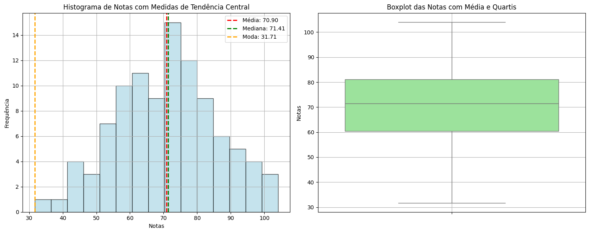

# Aula 3: Tendências Centrais na Prática

## Objetivos da Aula

- Compreender o conceito de medidas de tendência central.
- Aprender a calcular média, mediana, moda, percentis e quartis.
- Aplicar essas medidas em dados reais, como notas escolares.
- Interpretar os resultados e compará-los criticamente.

---
## Medidas de Tendência Central

As **medidas de tendência central** são usadas para identificar o ponto em torno do qual os dados se concentram. Elas fornecem uma visão geral do comportamento típico de um conjunto de dados. Essas medidas são essenciais para resumir grandes quantidades de dados de forma simples, ajudando na interpretação e análise.

---

### 1. **Média**
A **média** é a soma de todos os valores dividida pelo número de elementos. Ela é amplamente utilizada, mas é sensível a **valores extremos (outliers)**, que podem distorcer o valor da média.

#### Exemplo:
Para o conjunto de dados [2, 3, 3, 4, 10], a média é:

$$
\text{Média} = \frac{2 + 3 + 3 + 4 + 10}{5} = \frac{22}{5} = 4,4
$$

No caso acima, o valor **10** (outlier) eleva a média. A média é útil quando os dados não possuem outliers significativos.

---

### 2. **Mediana**
A **mediana** é o valor central de um conjunto de dados ordenados. Se a quantidade de dados for ímpar, a mediana é o valor que ocupa o meio da lista. Se for par, a mediana é a média dos dois valores centrais.

#### Exemplo:
Para o conjunto de dados ordenados [2, 3, 3, 4, 10], a mediana é o valor do meio: **3**.

Em outro exemplo com número par de elementos: [1, 2, 3, 4], a mediana será a média entre **2** e **3**, ou seja:

$$
\text{Mediana} = \frac{2 + 3}{2} = 2,5
$$


A mediana é uma excelente medida quando há **outliers**, pois não é tão influenciada por valores extremos.

---

### 3. **Moda**
A **moda** é o valor que ocorre com maior frequência em um conjunto de dados. Pode haver mais de uma moda, caso haja mais de um valor repetido com a mesma frequência (moda bimodal ou multimodal).

#### Exemplo:
Para o conjunto de dados [2, 3, 3, 4, 10], a moda é **3**, pois é o valor mais frequente.

Se o conjunto fosse [1, 2, 2, 3, 3], a moda seria **2** e **3**, ou seja, um conjunto **bimodal**.

A moda é útil para identificar o valor que **mais se repete** em uma amostra de dados.

---

### 4. **Quartis**
Os **quartis** dividem os dados ordenados em quatro partes iguais, oferecendo uma visão mais detalhada da distribuição. Os principais quartis são:

- **Q1 (Primeiro Quartil):** 25% dos dados estão abaixo de Q1.
- **Q2 (Segundo Quartil ou Mediana):** 50% dos dados estão abaixo de Q2 (mediana).
- **Q3 (Terceiro Quartil):** 75% dos dados estão abaixo de Q3.

#### Exemplo:
Para o conjunto de dados [1, 2, 3, 4, 5], os quartis são:

- **Q1 = 2** (valor abaixo do qual estão 25% dos dados)
- **Q2 = 3** (mediana)
- **Q3 = 4** (valor abaixo do qual estão 75% dos dados)

Os quartis ajudam a compreender a **distribuição dos dados**, mostrando onde estão os valores extremos.

---

### 5. **Percentis**
Os **percentis** dividem os dados em 100 partes iguais. O percentil 90 (P90), por exemplo, indica que **90% dos dados estão abaixo** deste valor.

#### Exemplo:
Para o conjunto de dados [1, 2, 3, 4, 5], o percentil 60 (P60) seria **3**, pois 60% dos dados estão abaixo de 3.

Os percentis são úteis para identificar a **distribuição** dos dados em relação a uma posição específica.


---

### 6. Exemplo de Medidas de Tendência





```python

# Importando as bibliotecas necessárias
import numpy as np
import pandas as pd
import matplotlib.pyplot as plt
import seaborn as sns
from scipy import stats

# Gerando um conjunto de dados de exemplo (notas de alunos)
np.random.seed(0)
data = np.random.normal(loc=70, scale=15, size=100)  # Distribuição normal

# Calculando as medidas de tendência central
mean = np.mean(data)
median = np.median(data)
mode = stats.mode(data)[0]
q1 = np.percentile(data, 25)
q3 = np.percentile(data, 75)
p90 = np.percentile(data, 90)

# Exibindo as medidas calculadas
print(f"Média: {mean:.2f}")
print(f"Mediana: {median:.2f}")
print(f"Moda: {mode:.2f}")
print(f"1º Quartil (Q1): {q1:.2f}")
print(f"3º Quartil (Q3): {q3:.2f}")
print(f"Percentil 90 (P90): {p90:.2f}")

# Criando um layout de gráficos 1x2
fig, axes = plt.subplots(1, 2, figsize=(15, 6))

# Histograma com as linhas da Média e Mediana
axes[0].hist(data, bins=15, color='lightblue', edgecolor='black', alpha=0.7)
axes[0].axvline(mean, color='red', linestyle='dashed', linewidth=2, label=f'Média: {mean:.2f}')
axes[0].axvline(median, color='green', linestyle='dashed', linewidth=2, label=f'Mediana: {median:.2f}')
axes[0].axvline(mode, color='orange', linestyle='dashed', linewidth=2, label=f'Moda: {mode:.2f}')
axes[0].legend()
axes[0].set_title('Histograma de Notas com Medidas de Tendência Central')
axes[0].set_xlabel('Notas')
axes[0].set_ylabel('Frequência')
axes[0].grid(True)

# Boxplot para visualizar os Quartis e a Mediana
sns.boxplot(data=data, color='lightgreen', ax=axes[1])
axes[1].set_title('Boxplot das Notas com Média e Quartis')
axes[1].set_ylabel('Notas')
axes[1].grid(True)

# Exibindo os gráficos
plt.tight_layout()
plt.show()

# Exibindo as estatísticas calculadas em formato de tabela
summary = pd.DataFrame({
    'Média': [mean],
    'Mediana': [median],
    'Moda': [mode],
    '1º Quartil (Q1)': [q1],
    '3º Quartil (Q3)': [q3],
    'Percentil 90 (P90)': [p90]
})

# Tabela de resumo
summary


```


| Média    | Mediana   | Moda      | 1º Quartil (Q1) | 3º Quartil (Q3) | Percentil 90 (P90) |
|----------|-----------|-----------|-----------------|-----------------|--------------------|
| 70.89712 | 71.411442 | 31.705153 | 60.34215        | 81.05616        | 92.068722          |

## Projeto Prático

### Análise de Desempenho Escolar

Considere um conjunto de **notas escolares simuladas de alunos** em uma disciplina. O objetivo é aplicar as medidas de tendência central para compreender a distribuição do desempenho da turma.

1. Crie um conjunto de notas (por exemplo, 20 alunos).
2. Calcule:
   - Média
   - Mediana
   - Moda
   - Quartis (Q1, Q2, Q3)
   - Percentis (P25, P50, P75, P90)
3. Compare e interprete os resultados.
4. Visualize os dados com boxplot e histograma.

### Script de exemplo (Colab):

```python
import numpy as np
import pandas as pd
import matplotlib.pyplot as plt
import seaborn as sns
from scipy import stats

# Simulando notas de 20 alunos
notas = np.array([7.5, 8.0, 6.5, 9.0, 5.0, 7.0, 8.5, 9.5, 6.0, 7.0,
                  6.5, 8.0, 5.5, 7.5, 8.0, 6.0, 9.0, 4.0, 5.5, 6.5])

# Cálculos
media = np.mean(notas)
mediana = np.median(notas)
moda = stats.mode(notas, keepdims=False).mode
quartis = np.percentile(notas, [25, 50, 75])
percentil_90 = np.percentile(notas, 90)

# Exibindo os resultados
print(f"Média: {media:.2f}")
print(f"Mediana: {mediana}")
print(f"Moda: {moda}")
print(f"Quartis (Q1, Q2, Q3): {quartis}")
print(f"Percentil 90: {percentil_90}")

# Visualizações
plt.figure(figsize=(12,5))

plt.subplot(1,2,1)
sns.histplot(notas, kde=True, bins=8)
plt.title("Histograma das Notas")

plt.subplot(1,2,2)
sns.boxplot(x=notas)
plt.title("Boxplot das Notas")

plt.tight_layout()
plt.show()
```

---

## Exercícios

1. Explique com suas palavras a diferença entre média e mediana.
2. Em um conjunto de dados com outliers, qual medida de tendência central é mais robusta? Por quê?
3. Calcule a média, mediana, moda e quartis para os seguintes dados:  
   `[3, 5, 7, 8, 9, 9, 10, 10, 10, 15, 20]`
4. Crie um novo conjunto de dados com duas modas e identifique-as.
5. Simule uma situação com dados de vendas mensais e aplique os conceitos de tendência central.

---

## Materiais de Estudo Complementares

- **Livro:** Triola, M. F. *Introdução à Estatística* (capítulo sobre medidas de tendência central).
- **Vídeo Aula:** [Khan Academy - Medidas de tendência central](https://pt.khanacademy.org/math/statistics-probability)
- **Artigo:** IBGE Explica – [O que são média, mediana e moda?](https://educa.ibge.gov.br/jovens/conheca-o-brasil/populacao/18397-media-mediana-e-moda.html)
- **Colab Complementar:** [Notebook interativo com dados reais de notas escolares] *(criar conforme necessidade da turma)*
