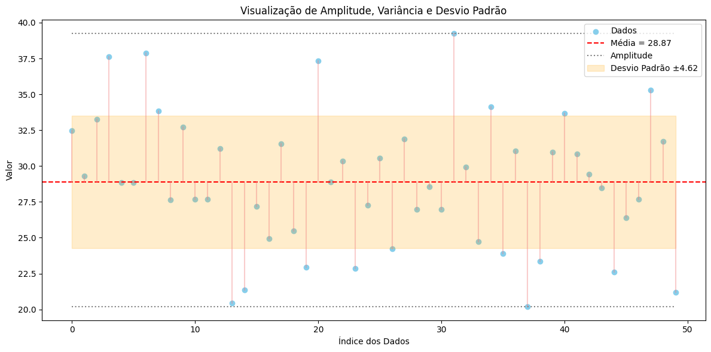

# Aula 4: Dispersão dos Dados

## Objetivos da Aula

- Compreender o conceito de dispersão em conjuntos de dados.
- Identificar e calcular as principais medidas de dispersão: amplitude, variância e desvio padrão.
- Analisar o grau de variabilidade em diferentes contextos estatísticos.

---

## Medidas de Dispersão

As **medidas de dispersão** são utilizadas para compreender **a variabilidade ou espalhamento dos dados** em relação a uma medida central (geralmente a média). Mesmo que duas distribuições tenham a mesma média, elas podem ter níveis muito diferentes de dispersão — e isso influencia diretamente nas análises e interpretações.

Essas medidas respondem a perguntas como:
- Os dados estão concentrados em torno da média?
- Existem grandes variações entre os valores?
- A média representa bem o conjunto?

As principais medidas são: **amplitude, variância** e **desvio padrão**.

---

### Amplitude

A **amplitude** é a forma mais simples de medir a dispersão. Ela representa a diferença entre o maior e o menor valor do conjunto de dados:

$$
\text{Amplitude} = \text{Valor Máximo} - \text{Valor Mínimo}
$$

#### Exemplo:
Dados: [10, 15, 20, 25, 30]  
Amplitude = 30 − 10 = **20**

#### Vantagens:
- Extremamente fácil de calcular.
- Útil para ter uma ideia rápida da **extensão total** dos dados.

#### Limitações:
- Muito **sensível a valores extremos (outliers)**.
- Não considera a distribuição dos demais dados (do meio).

---

### Variância

A **variância** é uma medida mais robusta da dispersão, pois considera **todos os valores do conjunto**. Ela calcula o quanto, em média, os dados se desviam da média do conjunto.

#### Fórmula para Variância Populacional:

$$
\sigma^2 = \frac{1}{n} \sum_{i=1}^{n} (x_i - \bar{x})^2
$$

#### Fórmula para Variância Amostral:

$$
s^2 = \frac{1}{n-1} \sum_{i=1}^{n} (x_i - \bar{x})^2
$$

A diferença principal é o **divisor**: usamos \( n-1 \) na amostra para **corrigir o viés** da estimativa da variância populacional (correção de Bessel).

#### Exemplo:
Dados: [4, 7, 6]  
Média \( \bar{x} = \frac{4+7+6}{3} = 5.67 \)

Desvios ao quadrado:
- (4 − 5.67)² ≈ 2.79  
- (7 − 5.67)² ≈ 1.77  
- (6 − 5.67)² ≈ 0.11  

Soma dos quadrados: ≈ 4.67  
Variância populacional: $` \sigma^2 = \frac{4.67}{3} ≈ 1.56 `$  
Variância amostral: $` s^2 = \frac{4.67}{2} ≈ 2.33 `$

#### Interpretação:
- Quanto maior a variância, **maior o espalhamento** dos dados em relação à média.
- Uma variância próxima de zero indica dados **concentrados**.

---

### Desvio Padrão

O **desvio padrão** é a **raiz quadrada da variância**. Como a variância está em **unidades ao quadrado**, o desvio padrão **retorna à unidade original dos dados**, facilitando a interpretação.

$$
\sigma = \sqrt{\sigma^2} \quad \text{ou} \quad s = \sqrt{s^2}
$$

#### Exemplo com variância anterior:
Variância populacional = 1.56 → \( \sigma = \sqrt{1.56} ≈ 1.25 \)  
Variância amostral = 2.33 → \( s = \sqrt{2.33} ≈ 1.53 \)

#### Interpretação:
- O desvio padrão indica, em média, **quanto os valores se afastam da média**.
- Útil para comparar conjuntos diferentes de dados com a mesma média.
- Em distribuições normais, cerca de:
  - **68%** dos dados estão a ±1σ da média.
  - **95%** estão a ±2σ.
  - **99.7%** estão a ±3σ.


### Exemplo de Dispersão





```python
import numpy as np
import matplotlib.pyplot as plt
import pandas as pd

# Gerando dados simulados
np.random.seed(42)
dados = np.random.normal(loc=30, scale=5, size=50)  # média 30, desvio padrão 5

# Estatísticas
media = np.mean(dados)
desvio_padrao = np.std(dados)
variancia = np.var(dados)
minimo = np.min(dados)
maximo = np.max(dados)
amplitude = maximo - minimo

# Plot
plt.figure(figsize=(12, 6))

# Espalhamento dos dados
plt.scatter(range(len(dados)), dados, color='skyblue', label='Dados')

# Média
plt.axhline(media, color='red', linestyle='--', label=f'Média = {media:.2f}')

# Amplitude
plt.hlines(y=[minimo, maximo], xmin=0, xmax=len(dados)-1, colors='gray', linestyles='dotted', label='Amplitude')

# Faixa do desvio padrão (área sombreada)
plt.fill_between(range(len(dados)), media - desvio_padrao, media + desvio_padrao,
                 color='orange', alpha=0.2, label=f'Desvio Padrão ±{desvio_padrao:.2f}')

# Linhas da variância (de cada ponto até a média)
for i, y in enumerate(dados):
    plt.plot([i, i], [media, y], color='lightcoral', alpha=0.4)

# Rótulos
plt.title("Visualização de Amplitude, Variância e Desvio Padrão")
plt.xlabel("Índice dos Dados")
plt.ylabel("Valor")
plt.legend()
plt.grid(True)
plt.tight_layout()
plt.show()

# Tabela de medidas
tabela = pd.DataFrame({
    'Medida': ['Média', 'Desvio Padrão', 'Variância', 'Valor Mínimo', 'Valor Máximo', 'Amplitude'],
    'Valor': [media, desvio_padrao, variancia, minimo, maximo, amplitude]
})

# Exibir tabela
tabela.style.format({'Valor': '{:.2f}'})

```


|	Medida	        | Valor     |
|-------------------|-----------|
|	Média	        | 28.87     |
|	Desvio Padrão	| 4.62      |
|	Variância	    | 21.36     |
|	Valor Mínimo	| 20.20     |
|	Valor Máximo	| 39.26     |
|	Amplitude	    | 19.06     |


---

## Projeto Prático: **Análise de Variação no Tempo de Entrega**

Neste projeto, vamos simular e analisar o **tempo de entrega de 20 pedidos online** para explorar medidas de dispersão.  

### Objetivos:
- Compreender o comportamento dos dados em torno da média.
- Identificar consistência ou variação nas entregas.
- Visualizar a distribuição e identificar possíveis valores atípicos.

---

### Passos:

1. Simular os dados de tempo de entrega.
2. Calcular:
   - **Amplitude**
   - **Variância**
   - **Desvio padrão**
3. Gerar um **gráfico** para análise visual.
4. Exibir uma **tabela com os valores calculados**.


```python
import numpy as np
import matplotlib.pyplot as plt
import pandas as pd

# 1. Simulação dos dados de tempo de entrega (em dias)
np.random.seed(42)
entregas = np.random.normal(loc=5, scale=1.5, size=20).round(2)  # média 5 dias, desvio padrão 1.5

# 2. Cálculo das estatísticas
media = np.mean(entregas)
desvio_padrao = np.std(entregas)
variancia = np.var(entregas)
minimo = np.min(entregas)
maximo = np.max(entregas)
amplitude = maximo - minimo

# 3. Visualização gráfica
plt.figure(figsize=(12, 6))

# Espalhamento dos dados
plt.scatter(range(len(entregas)), entregas, color='skyblue', label='Dados (Tempo de Entrega)')

# Linha da média
plt.axhline(media, color='red', linestyle='--', label=f'Média = {media:.2f} dias')

# Linha de amplitude (mínimo e máximo)
plt.hlines(y=[minimo, maximo], xmin=0, xmax=len(entregas)-1, colors='gray', linestyles='dotted', label='Amplitude')

# Faixa do desvio padrão
plt.fill_between(range(len(entregas)), media - desvio_padrao, media + desvio_padrao,
                 color='orange', alpha=0.2, label=f'Desvio Padrão ±{desvio_padrao:.2f}')

# Linhas da variância (de cada ponto até a média)
for i, y in enumerate(entregas):
    plt.plot([i, i], [media, y], color='lightcoral', alpha=0.4)

# Rótulos
plt.title("Dispersão do Tempo de Entrega – Amplitude, Variância e Desvio Padrão")
plt.xlabel("Pedidos")
plt.ylabel("Tempo de Entrega (dias)")
plt.legend()
plt.grid(True)
plt.tight_layout()
plt.show()

# 4. Tabela de resumo
tabela = pd.DataFrame({
    'Medida': ['Média', 'Desvio Padrão', 'Variância', 'Valor Mínimo', 'Valor Máximo', 'Amplitude'],
    'Valor': [media, desvio_padrao, variancia, minimo, maximo, amplitude]
})

tabela.style.format({'Valor': '{:.2f}'})

```

---

### Discussão:
- O gráfico permite **identificar facilmente entregas muito rápidas ou muito lentas**.
- A **amplitude** mostra o intervalo total dos tempos.
- O **desvio padrão** e a **variância** indicam se os tempos estão concentrados ou dispersos em torno da média.


## Exercícios

1. Explique com suas palavras a diferença entre variância e desvio padrão.
2. Um conjunto de dados possui todos os valores iguais. Qual será o desvio padrão? Justifique.
3. Calcule amplitude, variância e desvio padrão para o seguinte conjunto:  
   Dados: [2, 4, 4, 4, 5, 5, 7, 9]
4. Simule 15 valores de notas de alunos e analise a dispersão.
5. Quando usar variância populacional e quando usar amostral?

## Materiais de Estudo Complementares

- Triola, M. F. (2011). *Introdução à Estatística*. Pearson.
- Bussab, W. O., & Morettin, P. A. (2017). *Estatística Básica*. Saraiva.
- Khan Academy – [Variância e Desvio Padrão](https://pt.khanacademy.org/math/statistics-probability)
