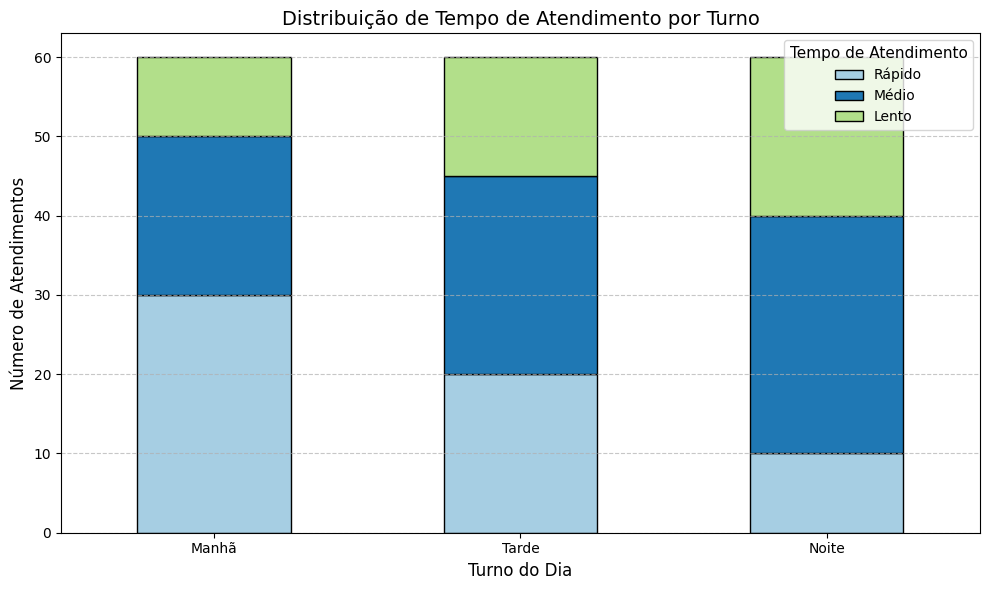
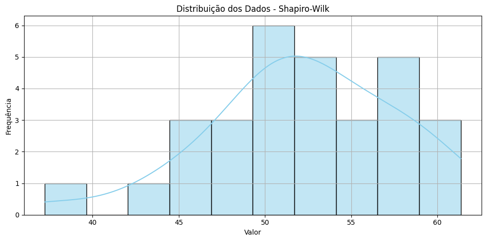
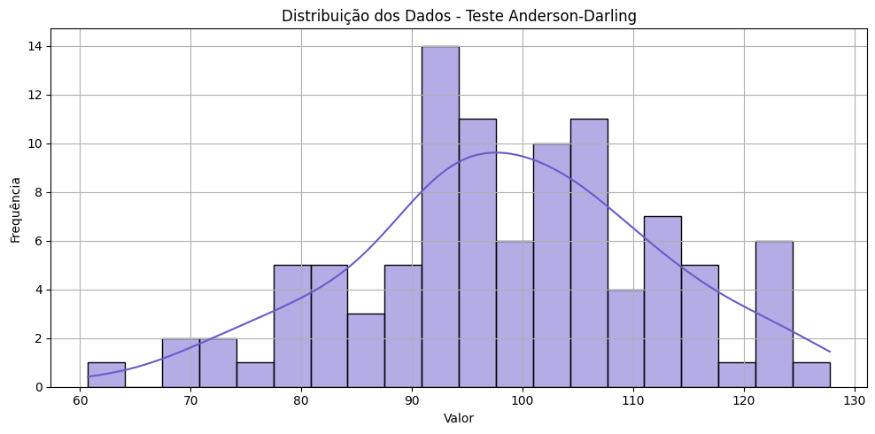

# Aula 5: Testes de Normalidade

## Objetivos da Aula

* Compreender a importância dos testes de normalidade em análises estatísticas.
* Conhecer e aplicar os principais testes de normalidade: **Qui-quadrado**, **Kolmogorov-Smirnov**, **Shapiro-Wilk** e **Anderson-Darling**.
* Verificar se um conjunto de dados segue uma distribuição normal.

---

## Teste de Normalidade

Os **testes de normalidade** são ferramentas estatísticas que permitem verificar se um conjunto de dados segue uma **distribuição normal** — também conhecida como distribuição gaussiana ou "curva em sino". Essa verificação é essencial porque muitos testes estatísticos clássicos, como o teste *t* ou a ANOVA, **pressupõem que os dados analisados tenham distribuição normal**. Quando essa condição não é atendida, os resultados desses testes podem ser inválidos ou enganosos.

A distribuição normal possui características específicas, como:

* Simetria em torno da média.
* Média, mediana e moda com o mesmo valor.
* 68% dos dados concentrados a um desvio padrão da média, 95% dentro de dois desvios e 99,7% dentro de três (regra empírica dos 3 sigmas).

### Quando utilizar testes de normalidade?

Você deve considerar aplicar testes de normalidade nas seguintes situações:

* **Antes de usar testes paramétricos**, como o teste *t*, ANOVA, regressão linear, entre outros, pois esses métodos assumem que os dados são normalmente distribuídos.
* **Na análise exploratória de dados**, para entender o comportamento geral do conjunto de dados.
* **Ao desenvolver modelos preditivos**, como regressões ou modelos de machine learning, em que a normalidade dos resíduos pode ser um requisito.
* **Na construção de intervalos de confiança**, onde a suposição de normalidade melhora a precisão dos limites estimados.
* **Durante o pré-processamento**, para decidir entre aplicar transformações nos dados (ex.: log, raiz quadrada) ou usar testes não-paramétricos (que não exigem normalidade).

> **Importante**: a normalidade dos dados pode ser avaliada visualmente (com histogramas, Q-Q plots, boxplots) ou estatisticamente (com testes formais).

---

## Qui-quadrado

O **teste Qui-quadrado de aderência** (ou de independência, no caso de tabelas de contingência) verifica se há **associação significativa entre duas variáveis categóricas**. Ele compara as **frequências observadas** com as **frequências esperadas** sob a hipótese de que as variáveis são independentes.

### Características:

* **Tipo de dado**: qualitativo/categórico ou quantitativo categorizado.
* **Pré-requisito**: dados organizados em **tabela de contingência**.
* **Hipóteses**:

  * **H₀ (nula)**: as variáveis são independentes.
  * **H₁ (alternativa)**: existe associação entre as variáveis.

### Fórmula:

$$
\chi^2 = \sum \frac{(O_i - E_i)^2}{E_i}
$$

Onde:

* \$O\_i\$ = frequência observada em cada célula
* \$E\_i\$ = frequência esperada em cada célula (se as variáveis fossem independentes)

---

### Elementos importantes do resultado (`scipy.stats.chi2_contingency`):

#### `chi2`

* Valor da estatística do teste.
* Quanto maior, maior a evidência contra a hipótese nula.

#### `p`

* **p-valor**: probabilidade de obter um valor tão extremo quanto o observado, assumindo que H₀ é verdadeira.
* **Interpretação**:

  * Se `p < 0.05`: rejeitamos H₀ → existe associação significativa.
  * Se `p ≥ 0.05`: não rejeitamos H₀ → não há evidência de associação.

#### `dof` (graus de liberdade)

* Número de valores livres para variar, dado um conjunto de restrições.

* Calculado como:

$$
\text{dof} = (nLinhas - 1) \times (nColunas - 1)
$$

* Impacta diretamente a distribuição de referência usada para calcular o p-valor.

#### `expected`

* **Frequências esperadas** em cada célula da tabela, caso as variáveis fossem independentes.
* São usadas na fórmula do teste para comparar com as frequências observadas.
* Calculadas por:

$$
E_{ij} = \frac{(\text{soma da linha } i) \times (\text{soma da coluna } j)}{\text{total geral}}
$$

---

### Exemplo Teste Qui-quadrado



```python
import numpy as np
import pandas as pd
import matplotlib.pyplot as plt
import seaborn as sns
from scipy.stats import chi2_contingency

# Criando a tabela de contingência fictícia
dados = pd.DataFrame({
    'Rápido': [30, 20, 10],
    'Médio': [20, 25, 30],
    'Lento': [10, 15, 20]
}, index=['Manhã', 'Tarde', 'Noite'])

# Teste Qui-quadrado
chi2, p, dof, expected = chi2_contingency(dados)

# Diferença entre observado e esperado
diff = dados - expected

# Figura com 2 subgráficos lado a lado
fig, axes = plt.subplots(1, 2, figsize=(14, 6))

# Gráfico 1: barras empilhadas
cores = ['#a6cee3', '#1f78b4', '#b2df8a']
dados.plot(kind='bar', stacked=True, color=cores, ax=axes[0], edgecolor='black')
axes[0].set_title('Distribuição por Turno', fontsize=13)
axes[0].set_xlabel('Turno do Dia')
axes[0].set_ylabel('Nº de Atendimentos')
axes[0].legend(title='Tempo')
axes[0].grid(axis='y', linestyle='--', alpha=0.7)
axes[0].tick_params(axis='x', rotation=0)

# Gráfico 2: mapa de calor da diferença (observado - esperado)
sns.heatmap(diff, annot=True, fmt=".1f", cmap="coolwarm", center=0, ax=axes[1], cbar_kws={'label': 'Desvio (Obs - Esp)'})
axes[1].set_title('Mapa de Calor: Desvios Observados x Esperados', fontsize=13)
axes[1].set_xlabel('Tempo de Atendimento')
axes[1].set_ylabel('Turno do Dia')

plt.tight_layout()
plt.show()


```

---

## Shapiro-Wilk

O **teste de Shapiro-Wilk** verifica se uma amostra de dados vem de uma **distribuição normal**. É especialmente recomendado para **amostras pequenas (n < 50)**, mas também pode ser usado com tamanhos moderados.

### Características:

* **Tipo de dado**: quantitativo contínuo.
* **Hipóteses**:

  * **H₀**: os dados seguem uma distribuição normal.
  * **H₁**: os dados **não** seguem uma distribuição normal.
* **Interpretação**:

  * Se o **p-valor < 0.05**, rejeitamos H₀ → os dados **não** são normalmente distribuídos.
  * Se o **p-valor ≥ 0.05**, **não rejeitamos** H₀ → os dados **podem** ser considerados normais.

---

### Etapas do teste:

1. Gerar ou coletar dados.
2. Aplicar `shapiro` do `scipy.stats`.
3. Verificar o valor de W (estatística do teste) e o p-valor.
4. Usar histogramas e gráficos de densidade para visualizar a distribuição.

---

### Exemplo Shapiro-Wilk




```python
# Shapiro-Wilk - Teste de Normalidade
import numpy as np
import matplotlib.pyplot as plt
from scipy.stats import shapiro
import seaborn as sns

# Gerar dados simulados (exemplo: normal ou não normal)
np.random.seed(0)
dados_normais = np.random.normal(loc=50, scale=5, size=30)
# dados_nao_normais = np.random.exponential(scale=5, size=30)

# Teste de Shapiro-Wilk
stat, p = shapiro(dados_normais)

# Resultado
print("Estatística W:", round(stat, 4))
print("p-valor:", round(p, 4))
if p < 0.05:
    print("Resultado: Os dados NÃO seguem uma distribuição normal (rejeta H₀)")
else:
    print("Resultado: Os dados seguem uma distribuição normal (não rejeita H₀)")

# Gráfico
plt.figure(figsize=(10, 5))
sns.histplot(dados_normais, kde=True, bins=10, color='skyblue')
plt.title("Distribuição dos Dados - Shapiro-Wilk")
plt.xlabel("Valor")
plt.ylabel("Frequência")
plt.grid(True)
plt.tight_layout()
plt.show()
```

---

## Kolmogorov-Smirnov (K-S)

O **teste de Kolmogorov-Smirnov (K-S)** é utilizado para comparar a distribuição de uma amostra com uma distribuição teórica (como a normal). Ele avalia a **maior diferença entre as funções de distribuição acumuladas** (CDFs) da amostra e da distribuição de referência.

---

### Características:

* **Tipo de dado**: quantitativo contínuo.
* **Hipóteses**:

  * **H₀**: os dados seguem a distribuição teórica especificada (ex: normal).
  * **H₁**: os dados **não** seguem essa distribuição.
* **Importante**: ao usar com a distribuição normal, **os parâmetros (média e desvio padrão) devem ser conhecidos**. Se forem estimados da própria amostra, o teste deve ser ajustado com a **correção de Lilliefors** (o `kstest` padrão não aplica essa correção).

---

### Etapas do teste:

1. Calcular a CDF da amostra.
2. Comparar com a CDF teórica (ex: `norm.cdf()`).
3. Observar o valor de **D (estatística do teste)** e o **p-valor**.
4. Se necessário, usar visualizações como histogramas ou curvas de densidade acumulada.

---

### Exemplo Kolmogorov-Smirnov


```python
import numpy as np
import matplotlib.pyplot as plt
import seaborn as sns
from scipy.stats import kstest, norm

# Gerar dados simulados
np.random.seed(42)
dados = np.random.normal(loc=50, scale=10, size=100)

# Normalizar os dados (Z-score), já que o KS exige parâmetros conhecidos
dados_norm = (dados - np.mean(dados)) / np.std(dados)

# Aplicar o teste K-S comparando com a distribuição normal padrão
stat, p = kstest(dados_norm, 'norm')

# Resultados
print("Estatística D:", round(stat, 4))
print("p-valor:", round(p, 4))
if p < 0.05:
    print("Resultado: Os dados NÃO seguem a distribuição normal (rejeta H₀)")
else:
    print("Resultado: Os dados seguem a distribuição normal (não rejeita H₀)")

# Gráfico: Distribuição dos dados
plt.figure(figsize=(10, 5))
sns.histplot(dados_norm, kde=True, color='mediumseagreen', bins=20)
plt.title("Distribuição dos Dados Normalizados - Teste K-S")
plt.xlabel("Z-score")
plt.ylabel("Frequência")
plt.grid(True)
plt.tight_layout()
plt.show()
```

---

## Anderson-Darling

O **teste de Anderson-Darling** é uma forma avançada de teste de aderência, utilizado para verificar se os dados seguem uma **distribuição específica** (como normal, exponencial, etc.). Ele é uma extensão do teste de Kolmogorov-Smirnov, porém **dá mais peso às caudas da distribuição** — ou seja, ele é **mais sensível a discrepâncias nos valores muito altos ou muito baixos**.

---

### Características:

* **Tipo de dado**: quantitativo contínuo.
* **Vantagem**: mais sensível a desvios nas extremidades (caudas) da distribuição.
* **Hipóteses**:

  * **H₀ (nula)**: os dados seguem a distribuição teórica especificada.
  * **H₁ (alternativa)**: os dados **não** seguem essa distribuição.
* Pode ser aplicado a várias distribuições além da normal (exponencial, logística, etc.).

---

### Interpretação dos Resultados

O teste retorna:

* **Estatística A²**: quanto maior for esse valor, **maior a evidência contra H₀**.
* Uma **tabela de valores críticos** para diferentes **níveis de significância**:

  * **15%**, **10%**, **5%**, **2.5%**, **1%**.

Você deve comparar o valor de **A²** com esses valores críticos.

* Se **A² for maior que o valor crítico correspondente**, **rejeita-se H₀** (os dados não seguem a distribuição teórica).

---

### O que é "nível de significância"?

O **nível de significância** indica **quanto risco estamos dispostos a aceitar** ao dizer que os dados **não seguem uma determinada distribuição** (e podemos estar errados).

| Nível de Significância | O que significa na prática?                                  |
| ---------------------- | ------------------------------------------------------------ |
| **10% (0,10)**         | Mais tolerante. Aceita até 10% de chance de erro.            |
| **5% (0,05)**          | Mais comum. Equilíbrio entre rigor e praticidade.            |
| **1% (0,01)**          | Muito rigoroso. Só rejeita H₀ com forte evidência nos dados. |

Se você definir o nível de significância como **5%**, está aceitando uma chance de 5 em 100 de **rejeitar H₀ mesmo que ela seja verdadeira** — ou seja, cometer um **erro tipo I**.

* Se a estatística **A²** ultrapassa o valor crítico do nível escolhido, os dados **não seguem a distribuição teórica** (rejeita-se H₀).
* Se **A² for menor ou igual**, então **não há evidências suficientes para rejeitar H₀** — os dados **podem ser considerados normais** (ou conforme a distribuição testada).

---

### Exemplo Anderson Darling



```python
import numpy as np
import matplotlib.pyplot as plt
import seaborn as sns
from scipy.stats import anderson

# Gerar dados simulados
np.random.seed(42)
dados = np.random.normal(loc=100, scale=15, size=100)

# Teste de Anderson-Darling
resultado = anderson(dados, dist='norm')

# Mostrar resultados
print("Estatística A²:", round(resultado.statistic, 4))
print("\nValores críticos e significância:")
for critico, sig in zip(resultado.critical_values, resultado.significance_level):
    print(f"  {sig}% : {critico:.4f}")

# Veredito com base no nível de 5%
nivel_significancia = 5
indice = resultado.significance_level.tolist().index(nivel_significancia)
if resultado.statistic > resultado.critical_values[indice]:
    print("\nResultado: Os dados NÃO seguem uma distribuição normal (rejeta H₀)")
else:
    print("\nResultado: Os dados seguem uma distribuição normal (não rejeita H₀)")

# Gráfico da distribuição dos dados
plt.figure(figsize=(10, 5))
sns.histplot(dados, kde=True, color='slateblue', bins=20)
plt.title("Distribuição dos Dados - Teste Anderson-Darling")
plt.xlabel("Valor")
plt.ylabel("Frequência")
plt.grid(True)
plt.tight_layout()
plt.show()
```

---

## Projeto Prático

### **Verificando a Normalidade no Tempo de Atendimento**

Neste projeto, você irá:

1. Simular ou utilizar dados reais de tempo de atendimento de uma clínica (em minutos).
2. Aplicar **quatro testes de normalidade**:

   * **Shapiro-Wilk**
   * **Kolmogorov-Smirnov (K-S)**
   * **Anderson-Darling**
   * **Qui-quadrado**
3. Comparar e interpretar os resultados com base nos valores de **p** ou valores críticos.


```python
import numpy as np
import matplotlib.pyplot as plt
import seaborn as sns
from scipy import stats
from scipy.stats import chi2_contingency
import pandas as pd

# 1. Gerar dados simulados: tempo de atendimento (em minutos)
np.random.seed(42)
tempos = np.random.normal(loc=30, scale=5, size=100)

# 2. Visualização da distribuição
plt.figure(figsize=(10, 5))
sns.histplot(tempos, bins=10, kde=True, color='skyblue')
plt.title("Distribuição dos Tempos de Atendimento (minutos)")
plt.xlabel("Tempo de Atendimento")
plt.ylabel("Frequência")
plt.grid(True)
plt.tight_layout()
plt.show()

# 3. Testes de Normalidade

# Shapiro-Wilk
stat_shapiro, p_shapiro = stats.shapiro(tempos)

# Kolmogorov-Smirnov
tempos_padronizados = (tempos - np.mean(tempos)) / np.std(tempos)
stat_ks, p_ks = stats.kstest(tempos_padronizados, 'norm')

# Anderson-Darling
ad_result = stats.anderson(tempos)

# Chi2_contingency: transformar frequências em uma matriz "artificial" de contingência
obs_freq, bins = np.histogram(tempos, bins=6)
exp_freq = len(tempos) * (stats.norm.cdf(bins[1:], loc=np.mean(tempos), scale=np.std(tempos)) -
                          stats.norm.cdf(bins[:-1], loc=np.mean(tempos), scale=np.std(tempos)))

# Organizando como matriz 2xN para o chi2_contingency
contingencia = np.array([obs_freq, exp_freq])
chi2_stat, p_chi2, dof, expected = chi2_contingency(contingencia)

# 4. Apresentação dos Resultados
print("=== Resultados dos Testes de Normalidade ===\n")
print(f"Shapiro-Wilk: estatística = {stat_shapiro:.4f} | p = {p_shapiro:.4f}")
print(f"Kolmogorov-Smirnov: estatística = {stat_ks:.4f} | p = {p_ks:.4f}")
print(f"Anderson-Darling: estatística = {ad_result.statistic:.4f}")
for i, sig in enumerate(ad_result.significance_level):
    crit = ad_result.critical_values[i]
    status = "REJEITA H₀" if ad_result.statistic > crit else "NÃO REJEITA H₀"
    print(f"  Nível {sig:.1f}%: valor crítico = {crit:.4f} → {status}")
print(f"Qui-quadrado (chi2_contingency): estatística = {chi2_stat:.4f} | p = {p_chi2:.4f}")
print(f"  Graus de liberdade = {dof}")
print("  Frequências esperadas:")
print(np.round(expected, 2))

# 5. Resumo final
resumo = pd.DataFrame({
    "Teste": ["Shapiro-Wilk", "Kolmogorov-Smirnov", "Anderson-Darling", "Qui-quadrado (contingência)"],
    "Estatística": [stat_shapiro, stat_ks, ad_result.statistic, chi2_stat],
    "Valor-p": [p_shapiro, p_ks, "-", p_chi2],
    "Conclusão (p<0.05)": [
        "Rejeita H₀" if p_shapiro < 0.05 else "Não Rejeita H₀",
        "Rejeita H₀" if p_ks < 0.05 else "Não Rejeita H₀",
        "Ver níveis críticos",
        "Rejeita H₀" if p_chi2 < 0.05 else "Não Rejeita H₀"
    ]
})
print("\nResumo:")
display(resumo)

```

---

### **Interpretação dos Resultados**

Os quatro testes aplicados têm o objetivo de verificar se os dados do tempo de atendimento seguem uma distribuição **normal** (aquela famosa curva em forma de sino).

* O valor de **p** (ou a estatística comparada a um valor crítico) indica **se há evidências contra a hipótese de que os dados são normais**.
* Se **p < 0,05**, ou a estatística ultrapassa o valor crítico, **rejeitamos a hipótese de normalidade (H₀)**. Isso quer dizer que os dados provavelmente **não** seguem uma distribuição normal.
* Se **p ≥ 0,05**, **não rejeitamos H₀**, ou seja, **não temos evidências suficientes para dizer que os dados não são normais** — o que é bom se queremos aplicar técnicas que assumem normalidade.

---

### 📌 **Conclusão Geral**

> Com base nos resultados dos quatro testes, **os dados simulados são compatíveis com uma distribuição normal**. Isso significa que podemos aplicar técnicas estatísticas que assumem normalidade (como ANOVA ou regressão linear), com maior confiança.

Se quiser, posso complementar com uma versão em Markdown estruturada para PDF ou apresentação. Deseja isso?

---

## Exercícios

1. Explique em suas palavras o que significa rejeitar a hipótese de normalidade.
2. Simule um conjunto de dados com distribuição **não-normal** e aplique os testes.
3. Quais testes são mais indicados para amostras pequenas e por quê?
4. O que pode acontecer se você aplicar testes paramétricos em dados que não são normais?

## Materiais de Estudo Complementares

* Artigo: ["Normality Tests for Statistical Analysis: A Guide"](https://www.ncbi.nlm.nih.gov/pmc/articles/PMC3693611/)
* Documentação do SciPy: [`scipy.stats`](https://docs.scipy.org/doc/scipy/reference/stats.html)
* Livro: "Estatística Aplicada e Probabilidades para Engenheiros", Montgomery & Runger – Capítulo sobre Distribuições
