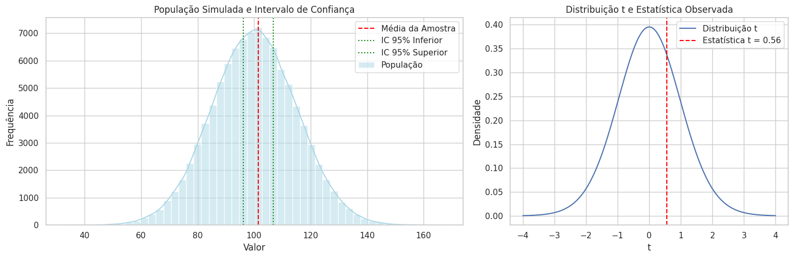

# Aula 6: Inferência Estatística e Inferência Clássica

## Objetivos da Aula

* Compreender o conceito de inferência estatística.
* Diferenciar inferência descritiva de inferência inferencial.
* Explorar os fundamentos da inferência clássica baseada em testes de hipóteses.
* Aplicar testes de hipóteses em exemplos práticos.

---

## Inferência Estatística

A **inferência estatística** é um ramo da estatística responsável por **tirar conclusões sobre uma população** com base nos resultados obtidos a partir de uma **amostra representativa**. Diferentemente da estatística descritiva, que apenas resume e organiza os dados observados, a inferência permite generalizar essas observações e tomar decisões sob incerteza.

Esse processo é essencial em praticamente todas as áreas da ciência, indústria, saúde, economia e engenharia, pois é muitas vezes inviável (ou impossível) coletar dados de toda a população.

A inferência estatística envolve, principalmente:

* **Estimação de parâmetros** (como a média ou proporção populacional).
* **Testes de hipóteses** (verificar se há evidência suficiente para confirmar ou refutar uma afirmação).
* **Construção de intervalos de confiança** (para indicar a margem de erro de uma estimativa).

### Tipos de Inferência:

* **Inferência Descritiva**:
  Resume e organiza os dados da amostra por meio de tabelas, gráficos e medidas como média, mediana, desvio padrão, etc. Não permite generalizações.

* **Inferência Inferencial**:
  Utiliza os dados da amostra para fazer **generalizações probabilísticas** sobre a população. Trabalha com incertezas e fornece **níveis de confiança** e **valores-p** para embasar decisões.

---

### Inferência Clássica (Frequentista)

A inferência **frequentista**, ou **clássica**, é o método tradicional mais amplamente utilizado em testes estatísticos. Nessa abordagem, os parâmetros da população (como a média ou variância) são considerados **fixos e desconhecidos**, e a variabilidade surge exclusivamente das **amostras aleatórias**.

As decisões são tomadas com base em probabilidades amostrais. Ou seja, calcula-se a probabilidade de se observar um determinado resultado **assumindo que a hipótese nula é verdadeira**. Os principais elementos desse processo são:

#### Hipóteses Estatísticas:

* **Hipótese Nula (H₀)**:
  Representa o “status quo” ou ausência de efeito. Por exemplo: “o medicamento não altera a pressão arterial” ou “as médias dos dois grupos são iguais”.

* **Hipótese Alternativa (H₁ ou Hₐ)**:
  Representa a **proposição contrária à H₀**. Exemplo: “o medicamento altera a pressão” ou “as médias são diferentes”.

#### Valor-p (p-valor):

* É a **probabilidade** de se obter um valor tão extremo quanto o observado, **supondo que H₀ seja verdadeira**.
* Um valor-p **baixo** indica que a evidência contra H₀ é **forte**.
* Comparação com o **nível de significância (α)** define se H₀ será rejeitada.

#### Nível de Significância (α):

* Representa o **limiar de tolerância para erro tipo I** (rejeitar H₀ quando ela é verdadeira).
* Valor comumente usado é **α = 0,05** (5%), o que significa aceitar um risco de 5% de cometer esse erro.

#### Decisão Baseada no Valor-p:

* Se **p ≤ α** → Rejeita-se H₀ → há **evidência estatisticamente significativa**.
* Se **p > α** → Não se rejeita H₀ → **não há evidência suficiente**.

---

### Erros em Testes de Hipóteses

* **Erro Tipo I (α)**: Rejeitar H₀ quando ela é verdadeira.
* **Erro Tipo II (β)**: Não rejeitar H₀ quando H₁ é verdadeira.

A escolha de α influencia diretamente a probabilidade de cometer um erro tipo I, enquanto a potência do teste (1 - β) indica a chance de detectar um efeito real quando ele existe.

---

### Exemplo Clássico:

**Hipótese:** Um novo fertilizante aumenta a produção de trigo.

* H₀: O fertilizante **não altera** a média de produção.
* H₁: O fertilizante **altera** a média de produção.

Após coletar uma amostra e realizar um teste estatístico (como o teste t), o valor-p indica se a diferença observada pode ter ocorrido apenas por acaso ou se há um efeito real do fertilizante.

---

### Exemplo Colab



#### **Gráfico 1: População Simulada e Intervalo de Confiança**

Este gráfico mostra a distribuição da população simulada (com média 100 e desvio padrão 15) e a localização da **média da amostra** extraída, além do **intervalo de confiança de 95%**. As linhas verdes representam os limites inferior e superior do intervalo, e a linha vermelha indica a média amostral. Se o valor hipotético (média = 100) estiver dentro do intervalo, isso sugere que não há evidência forte para rejeitar a hipótese nula.

#### **Gráfico 2: Distribuição t e Estatística Observada**

Aqui visualizamos a **distribuição t de Student**, usada no teste t para amostras pequenas. A linha vermelha mostra o valor t calculado da amostra. Se esse valor estiver em uma região muito extrema (cauda), o p-valor será pequeno e indicará que a média da amostra é estatisticamente diferente de 100. Caso contrário, a hipótese nula é mantida.

---

```python
import numpy as np
import scipy.stats as stats
import matplotlib.pyplot as plt
import seaborn as sns
import pandas as pd

# Configurações
np.random.seed(42)
sns.set(style='whitegrid')

# 1. Simulando uma população normal
populacao = np.random.normal(loc=100, scale=15, size=100000)

# 2. Amostragem aleatória
amostra = np.random.choice(populacao, size=30)

# 3. Estatísticas descritivas
media_amostra = np.mean(amostra)
dp_amostra = np.std(amostra, ddof=1)

print(f"Média da amostra: {media_amostra:.2f}")
print(f"Desvio padrão da amostra: {dp_amostra:.2f}")

# 4. Intervalo de confiança 95%
ic_inf, ic_sup = stats.t.interval(0.95, df=len(amostra)-1,
                                  loc=media_amostra, scale=dp_amostra/np.sqrt(len(amostra)))

print(f"Intervalo de confiança (95%): [{ic_inf:.2f}, {ic_sup:.2f}]")

# 5. Teste de Hipóteses: H0: média = 100
t_stat, p_valor = stats.ttest_1samp(amostra, popmean=100)

print(f"\nTeste t para média = 100: t = {t_stat:.3f} | p-valor = {p_valor:.4f}")
if p_valor < 0.05:
    print("→ Rejeita H₀: A média da amostra é significativamente diferente de 100.")
else:
    print("→ Não rejeita H₀: Não há evidência significativa de que a média difere de 100.")

# 6. Gráficos lado a lado
fig, axs = plt.subplots(1, 2, figsize=(15, 5), gridspec_kw={'width_ratios': [3, 2]})

# Gráfico 1: População + IC
sns.histplot(populacao, bins=50, kde=True, color='lightblue', ax=axs[0], label='População')
axs[0].axvline(media_amostra, color='red', linestyle='--', label='Média da Amostra')
axs[0].axvline(ic_inf, color='green', linestyle=':', label='IC 95% Inferior')
axs[0].axvline(ic_sup, color='green', linestyle=':', label='IC 95% Superior')
axs[0].set_title('População Simulada e Intervalo de Confiança')
axs[0].set_xlabel('Valor')
axs[0].set_ylabel('Frequência')
axs[0].legend()

# Gráfico 2: Distribuição t
x = np.linspace(-4, 4, 200)
t_dist = stats.t.pdf(x, df=len(amostra)-1)
axs[1].plot(x, t_dist, label='Distribuição t')
axs[1].axvline(t_stat, color='red', linestyle='--', label=f'Estatística t = {t_stat:.2f}')
axs[1].set_title("Distribuição t e Estatística Observada")
axs[1].set_xlabel('t')
axs[1].set_ylabel('Densidade')
axs[1].legend()
axs[1].grid(True)

plt.tight_layout()
plt.show()

```
---

## Projeto Prático

### Verificando a Eficácia de um Novo Treinamento

**Cenário**: Uma empresa deseja saber se um novo treinamento de atendimento ao cliente teve impacto no tempo médio de atendimento.

1. Simule dois grupos:

   * Grupo A: antes do treinamento.
   * Grupo B: após o treinamento.

2. Calcule estatísticas descritivas de ambos os grupos.

3. Aplique o **teste t de Student para amostras independentes**.

4. Interprete o valor-p e conclua se há diferença significativa.

```python
import numpy as np
from scipy.stats import ttest_ind
import matplotlib.pyplot as plt
import seaborn as sns

# Simulando os dados
np.random.seed(42)
antes = np.random.normal(loc=30, scale=5, size=50)
depois = np.random.normal(loc=28, scale=5, size=50)

# Visualização
plt.figure(figsize=(8, 4))
sns.histplot(antes, kde=True, color='skyblue', label='Antes')
sns.histplot(depois, kde=True, color='salmon', label='Depois')
plt.legend()
plt.title("Distribuição do Tempo de Atendimento")
plt.xlabel("Minutos")
plt.grid(True)
plt.tight_layout()
plt.show()

# Teste t para diferença de médias
stat, p = ttest_ind(antes, depois)

print(f"Estatística t: {stat:.2f}")
print(f"Valor-p: {p:.4f}")

if p < 0.05:
    print("Diferença significativa: o treinamento teve efeito.")
else:
    print("Sem evidência suficiente de efeito do treinamento.")
```

---

## Exercícios

1. Explique com suas palavras a diferença entre inferência descritiva e inferência inferencial.
2. Por que o valor-p é importante em testes de hipóteses?
3. Em uma pesquisa sobre o consumo de energia, foram coletados dados antes e depois da instalação de medidores inteligentes. Aplique um teste de hipóteses para verificar se houve redução significativa no consumo.
4. Qual a interpretação correta se o valor-p for 0,032 com α = 0,05?
5. Simule dois conjuntos de dados com médias iguais e aplique o teste t. O que você observa?

---

## Materiais de Estudo Complementares

* Livro: Bussab & Morettin – **Estatística Básica**, capítulo sobre Inferência Estatística.
* Khan Academy: [Inferência Estatística](https://pt.khanacademy.org/math/statistics-probability)