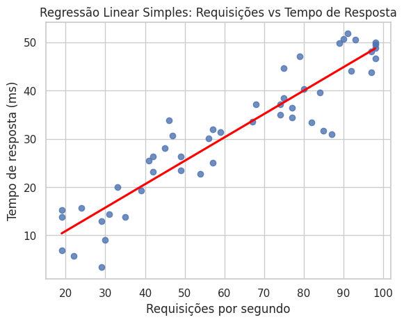
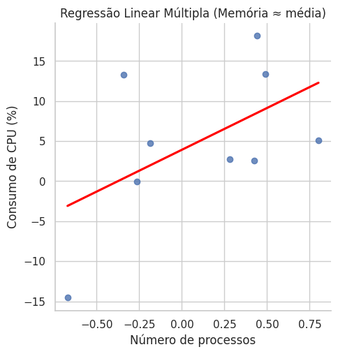
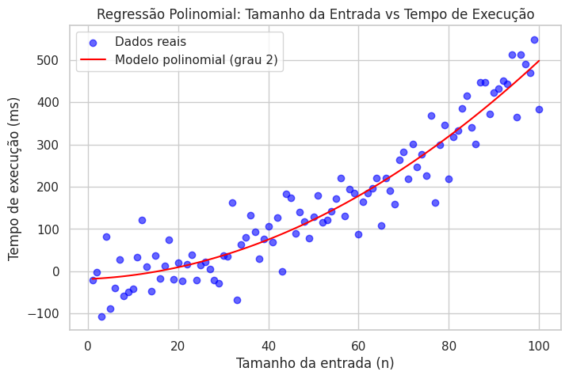
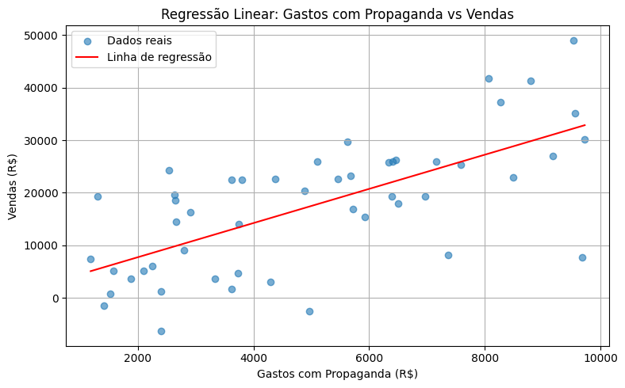
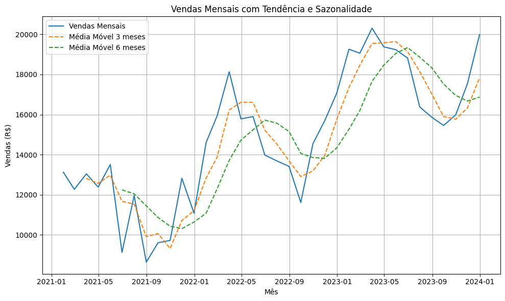

# Aula 7: Análise de Regressão e Séries Temporais

## Objetivos da Aula

* Compreender os fundamentos da análise de regressão linear simples.
* Identificar padrões em dados temporais e aplicar conceitos de séries temporais.
* Utilizar ferramentas estatísticas para prever valores futuros com base em tendências passadas.
* Explorar visualizações e medidas de ajuste de modelos estatísticos.

---

## Introdução

A regressão é uma técnica fundamental na ciência de dados, utilizada para **prever valores numéricos** com base em uma ou mais variáveis. Em TI, isso pode incluir:

* Previsão de tempo de resposta de aplicações
* Estimativa de uso de CPU/memória
* Análise de desempenho de redes

A seguir, exploramos três tipos principais: **regressão linear simples**, **múltipla** e **polinomial**.

---

## 1. Regressão Linear Simples

### Definição

A **Regressão Linear Simples** é um modelo estatístico que busca descrever e quantificar a relação entre **duas variáveis numéricas**:

* **Variável independente (ou preditora)** $x$: aquela que utilizamos para prever.
* **Variável dependente (ou resposta)** $y$: aquela que desejamos prever.

A equação da regressão linear simples é dada por:

$$
y = a + bx
$$

Onde:

* $y$: valor estimado (previsão) da variável resposta
* $x$: valor observado da variável preditora
* $a$: **intercepto**, valor de $y$ quando $x = 0$
* $b$: **coeficiente angular**, indica quanto $y$ varia para cada unidade de variação em $x$

### Objetivo

Encontrar a **reta que melhor se ajusta** aos dados, minimizando o erro quadrático (diferença entre os valores reais e previstos).

### Interpretação dos coeficientes

* **Intercepto $a$**: valor esperado de $y$ quando $x = 0$. Pode ou não ter interpretação prática, dependendo do contexto.
* **Inclinação $b$**: representa a **taxa de variação** de $y$ em relação a $x$. Um valor positivo indica que $y$ cresce com $x$; um valor negativo indica que $y$ decresce com $x$.

---

### Exemplo em Ciência de Dados (TI)

**Problema**: Suponha que uma equipe de engenharia de software esteja monitorando o tempo de resposta de uma API REST. Observou-se que o número de requisições por segundo afeta diretamente esse tempo. Nosso objetivo é criar um modelo que **preveja o tempo de resposta (em milissegundos)** com base na **carga de requisições por segundo**.



### Implementação em Python

```python
import seaborn as sns
import matplotlib.pyplot as plt
import numpy as np
import pandas as pd
from sklearn.linear_model import LinearRegression

# Gerando dados simulados
np.random.seed(0)
x = np.random.randint(10, 100, 50)  # Requisições por segundo
y = 0.5 * x + np.random.normal(0, 5, 50)  # Tempo de resposta com ruído

# Organizando em DataFrame
df = pd.DataFrame({
    'requests_per_sec': x,
    'response_time_ms': y
})

# Treinando o modelo de regressão
model = LinearRegression()
model.fit(df[['requests_per_sec']], df['response_time_ms'])

# Coeficientes
intercept = model.intercept_
slope = model.coef_[0]

print(f'Equação do modelo: y = {intercept:.2f} + {slope:.2f}x')

# Visualização
sns.set(style='whitegrid')
sns.regplot(x='requests_per_sec', y='response_time_ms', data=df, ci=None, line_kws={'color': 'red'})
plt.title('Regressão Linear Simples: Requisições vs Tempo de Resposta')
plt.xlabel('Requisições por segundo')
plt.ylabel('Tempo de resposta (ms)')
plt.show()
```


### Saída esperada (exemplo):

```
Equação do modelo: y = 1.73 + 0.49x
```

Isso significa que:

* Quando não há requisições (x = 0), o tempo de resposta estimado é **1,73 ms**.
* A cada nova requisição por segundo, o tempo de resposta aumenta em média **0,49 ms**.

---

### Discussão

Este modelo simples permite estimar como a **escalabilidade do sistema** pode impactar a **performance**. Com ele, é possível:

* Prever gargalos
* Planejar escalabilidade horizontal (adicionar instâncias)
* Simular cenários de carga

---

### Limitações da Regressão Linear Simples

* Supõe que a relação entre $x$ e $y$ é **linear**.
* Não captura efeitos de outras variáveis (ex: memória, rede).
* É sensível a **outliers** (valores extremos).

Para cenários mais complexos, recomenda-se migrar para **regressão múltipla** ou outros modelos mais robustos (ex: árvores, redes neurais).

---

## 2. Regressão Linear Múltipla

### Definição

A **Regressão Linear Múltipla** é uma generalização da regressão linear simples que permite **usar duas ou mais variáveis preditoras** para modelar uma variável resposta. A equação do modelo é:

\[
y = a + b_1x_1 + b_2x_2 + \dots + b_nx_n
\]

Onde:
- \( y \): variável dependente (resposta)
- \( x_1, x_2, ..., x_n \): variáveis independentes (ou preditoras)
- \( a \): intercepto
- \( b_1, b_2, ..., b_n \): coeficientes das variáveis preditoras

### Objetivo

O modelo estima como **múltiplas variáveis independentes, simultaneamente**, afetam uma variável dependente. Ele busca o **melhor ajuste linear** aos dados, minimizando o erro quadrático médio.

### Interpretação dos coeficientes

Cada coeficiente \( b_i \) representa a **mudança esperada em \( y \)** quando \( x_i \) varia uma unidade, mantendo as outras variáveis constantes.

---

### Exemplo em Ciência de Dados (TI)

**Problema**: Um engenheiro de infraestrutura deseja prever o **uso da CPU (%)** com base em:
- o número de **processos ativos**
- e o **uso de memória (em MB)**

Essa tarefa é comum em **monitoramento de sistemas** e **otimização de recursos** em servidores e clusters.


### Implementação em Python

```python
import numpy as np
import pandas as pd
from sklearn.linear_model import LinearRegression
import seaborn as sns
import matplotlib.pyplot as plt

# Simulando dados realistas
np.random.seed(1)
X = np.random.normal(0, 1, (100, 2))
coef = np.array([15, 8])  # pesos para processos e memória
y = X @ coef + np.random.normal(0, 10, 100)  # CPU (%) com ruído

# Montando DataFrame
df = pd.DataFrame(X, columns=['processes', 'memory_usage_MB'])
df['cpu_usage_percent'] = y

# Treinando o modelo
model = LinearRegression()
model.fit(df[['processes', 'memory_usage_MB']], df['cpu_usage_percent'])

# Coeficientes do modelo
intercept = model.intercept_
coef_proc, coef_mem = model.coef_

print(f"Equação do modelo:\nCPU% = {intercept:.2f} + {coef_proc:.2f}·processos + {coef_mem:.2f}·memória_MB")
```

### Visualização com corte (slice)

Como a regressão múltipla envolve múltiplas variáveis, é impossível representar graficamente em 2D **todas as dimensões ao mesmo tempo**. Uma alternativa é **fixar uma variável** (ex: uso de memória) e visualizar a relação entre a outra (nº de processos) e a variável resposta.



```python
# Seleciona um "slice" com memória próxima da média
slice_mem = df['memory_usage_MB'].mean()
df_slice = df[np.abs(df['memory_usage_MB'] - slice_mem) < 0.1]

# Visualização da regressão com processos fixando memória
sns.lmplot(x='processes', y='cpu_usage_percent', data=df_slice, ci=None, line_kws={'color': 'red'})
plt.title('Regressão Linear Múltipla (Memória ≈ média)')
plt.xlabel('Número de processos')
plt.ylabel('Consumo de CPU (%)')
plt.show()
```

### Interpretação

Se o modelo imprimir, por exemplo:

```
Equação do modelo:
CPU% = -0.23 + 15.22·processos + 7.85·memória_MB
```

Isso significa que:
- O uso da CPU cresce **15,22%** para cada unidade adicional em "processos", mantendo a memória constante.
- O uso da CPU cresce **7,85%** para cada MB adicional em uso de memória, mantendo o número de processos constante.

---

### Aplicações em TI

- Previsão de uso de recursos em **data centers**
- Análise de performance em **containers e microserviços**
- Tomada de decisão para **autoescalonamento de máquinas virtuais**
- Diagnóstico de sobrecarga em **monitoramento de sistemas**

---

### Vantagens da regressão múltipla

- Considera **múltiplos fatores simultaneamente**
- Facilita a análise de **interações entre variáveis**
- É base para modelos mais complexos (ex: regressão regularizada, redes neurais)

---

### Limitações

- Assume que a relação entre as variáveis e a resposta é **linear**
- Pode sofrer com **multicolinearidade** (quando variáveis preditoras são correlacionadas)
- Sensível a **outliers** e à escala dos dados

---

## 3. Regressão Polinomial

### Definição

A **Regressão Polinomial** é uma extensão da regressão linear simples que permite modelar relações **não lineares** entre as variáveis. Isso é feito adicionando **potências (termos polinomiais)** da variável preditora:

$$
y = a + b_1x + b_2x^2 + b_3x^3 + \dots + b_nx^n
$$

Onde:

* $x$: variável preditora
* $x^2, x^3, ..., x^n$: termos polinomiais
* $y$: variável resposta

Essa abordagem é útil quando os dados exibem **curvatura**, algo comum em problemas de análise de desempenho, aprendizado de máquina, e análise de algoritmos.

---

### Objetivo

Permitir que um modelo linear aprenda **padrões curvos** nos dados, ao invés de forçar um ajuste em linha reta. A ideia é continuar usando **regressão linear** nos parâmetros, mas sobre variáveis transformadas (não-lineares).

---

### Exemplo em Ciência de Dados (TI)

**Problema**: Um cientista de dados precisa prever o **tempo de execução de um algoritmo** em milissegundos com base no **tamanho da entrada (n)**. A complexidade algorítmica, como $O(n^2)$, não segue uma relação linear simples.




### Implementação em Python

```python
import numpy as np
import matplotlib.pyplot as plt
from sklearn.linear_model import LinearRegression
from sklearn.preprocessing import PolynomialFeatures

# Simulando dados com comportamento quadrático
np.random.seed(2)
x = np.linspace(1, 100, 100)
y = 0.05 * x**2 + np.random.normal(0, 50, 100)  # padrão O(n^2)
x = x.reshape(-1, 1)

# Transformando para polinômio de grau 2
poly = PolynomialFeatures(degree=2)
x_poly = poly.fit_transform(x)

# Treinando modelo
model = LinearRegression()
model.fit(x_poly, y)
y_pred = model.predict(x_poly)

# Visualização
plt.figure(figsize=(8, 5))
plt.scatter(x, y, color='blue', label='Dados reais', alpha=0.6)
plt.plot(x, y_pred, color='red', label='Modelo polinomial (grau 2)')
plt.title('Regressão Polinomial: Tamanho da Entrada vs Tempo de Execução')
plt.xlabel('Tamanho da entrada (n)')
plt.ylabel('Tempo de execução (ms)')
plt.legend()
plt.grid(True)
plt.show()
```


### Interpretação

O gráfico resultante mostra que:

* O **tempo de execução aumenta de forma quadrática** conforme o tamanho da entrada cresce.
* O modelo polinomial consegue capturar essa curvatura que um modelo linear simples não conseguiria.

A equação ajustada tem o formato:

$$
\text{Tempo} = a + b_1 \cdot n + b_2 \cdot n^2
$$

Os coeficientes podem ser acessados por:

```python
print(f"Coeficientes: {model.coef_}")
print(f"Intercepto: {model.intercept_}")
```

---

### Aplicações em TI

* **Análise de complexidade empírica de algoritmos** (tempo de execução, uso de memória)
* Modelagem de **latência de rede** com relação ao tamanho de pacotes
* Previsão de **tempo de compilação** com base em linhas de código
* Análise de curva de aprendizado de modelos de ML (ex: relação entre volume de dados e acurácia)

---

### Vantagens

* Captura **relações não lineares** sem precisar usar modelos não lineares complexos
* Fácil de interpretar e treinar
* Útil quando há **tendência curvilínea evidente nos dados**

---

### Limitações

* Pode **superajustar** os dados se o grau do polinômio for muito alto (overfitting)
* Requer mais cuidado com **normalização** e **escalonamento** das variáveis
* Só lida com **curvas suaves** — não é apropriado para padrões altamente complexos


---

## Comparação

| Tipo            | Ideal para                                                 | Exemplo em TI                           |
| --------------- | ---------------------------------------------------------- | --------------------------------------- |
| Linear Simples  | Uma variável preditora com relação linear                  | Requisições vs Tempo de resposta        |
| Linear Múltipla | Várias variáveis com impacto linear                        | Processos e memória vs Consumo de CPU   |
| Polinomial      | Relações não lineares (crescimento exponencial/quadrático) | Tamanho da entrada vs Tempo de execução |

---

## Projeto Prático

### Tema: Previsão de Vendas e Padrões Temporais

### Parte 1 – Regressão Linear

**Objetivo**: Modelar a relação entre os gastos com propaganda e as vendas mensais.




```python
import numpy as np
import pandas as pd
import matplotlib.pyplot as plt
import seaborn as sns
from sklearn.linear_model import LinearRegression
from sklearn.metrics import r2_score
import scipy.stats as stats

# Gerar dados simulados
np.random.seed(42)
gastos = np.random.uniform(1000, 10000, 50)
vendas = 3.5 * gastos + np.random.normal(0, 10000, 50)

df = pd.DataFrame({
    'gastos_prop': gastos,
    'vendas': vendas
})

# Regressão Linear
X = df[['gastos_prop']]
y = df['vendas']

model = LinearRegression()
model.fit(X, y)
y_pred = model.predict(X)

# Avaliação do modelo
r2 = r2_score(y, y_pred)
slope, intercept, r_value, p_value, std_err = stats.linregress(df['gastos_prop'], df['vendas'])

# Visualização
plt.figure(figsize=(8,5))
sns.regplot(x='gastos_prop', y='vendas', data=df)
plt.title('Regressão Linear: Gastos com Propaganda vs Vendas')
plt.xlabel('Gastos com Propaganda (R$)')
plt.ylabel('Vendas (R$)')
plt.grid(True)
plt.show()

print(f"R²: {r2:.4f}")
print(f"Coeficiente angular (b): {slope:.2f}")
print(f"Intercepto (a): {intercept:.2f}")
print(f"Valor-p: {p_value:.4f}")
```

---

### Parte 2 – Séries Temporais

**Objetivo**: Simular e visualizar padrões sazonais e tendências em vendas mensais.




```python
# Simular dados mensais com tendência + sazonalidade
import numpy as np
import pandas as pd
import matplotlib.pyplot as plt
from sklearn.linear_model import LinearRegression
from sklearn.metrics import r2_score
import scipy.stats as stats

# Gerar dados simulados
np.random.seed(42)
gastos = np.random.uniform(1000, 10000, 50)
vendas = 3.5 * gastos + np.random.normal(0, 10000, 50)

df = pd.DataFrame({
    'gastos_prop': gastos,
    'vendas': vendas
})

# Regressão Linear
X = df[['gastos_prop']]
y = df['vendas']

model = LinearRegression()
model.fit(X, y)
y_pred = model.predict(X)

# Avaliação
r2 = r2_score(y, y_pred)
slope, intercept, r_value, p_value, std_err = stats.linregress(df['gastos_prop'], df['vendas'])

# Ordenar os dados para linha contínua
df_sorted = df.sort_values('gastos_prop')
y_line = model.predict(df_sorted[['gastos_prop']])

# Visualização
plt.figure(figsize=(8,5))
plt.scatter(df['gastos_prop'], df['vendas'], alpha=0.6, label='Dados reais')
plt.plot(df_sorted['gastos_prop'], y_line, color='red', label='Linha de regressão')
plt.title('Regressão Linear: Gastos com Propaganda vs Vendas')
plt.xlabel('Gastos com Propaganda (R$)')
plt.ylabel('Vendas (R$)')
plt.legend()
plt.grid(True)
plt.tight_layout()
plt.show()

print(f"R²: {r2:.4f}")
print(f"Coeficiente angular (b): {slope:.2f}")
print(f"Intercepto (a): {intercept:.2f}")
print(f"Valor-p: {p_value:.4f}")
```

---

##  Exercícios

---

### 1. Regressão Linear Simples

**Problema**: Relacionar horas de estudo com nota da prova.

```python
np.random.seed(7)
horas = np.random.randint(1, 10, 30)
nota = 6 * horas + np.random.normal(0, 5, 30)

df_estudo = pd.DataFrame({'horas_estudo': horas, 'nota_prova': nota})

model = LinearRegression()
model.fit(df_estudo[['horas_estudo']], df_estudo['nota_prova'])
preds = model.predict(df_estudo[['horas_estudo']])

r2 = r2_score(df_estudo['nota_prova'], preds)

plt.figure(figsize=(7,4))
sns.regplot(x='horas_estudo', y='nota_prova', data=df_estudo)
plt.title('Horas de Estudo vs Nota na Prova')
plt.grid(True)
plt.show()

print(f"Coef. Angular (b): {model.coef_[0]:.2f}")
print(f"R²: {r2:.3f}")
```

---

### 2. Previsão com Séries Temporais

**Problema**: Produção mensal de uma fábrica com tendência de crescimento.

```python
meses = pd.date_range(start='2022-01', periods=24, freq='M')
producao = 1000 + np.linspace(0, 500, 24) + np.random.normal(0, 50, 24)

df_fabrica = pd.DataFrame({'mes': meses, 'producao': producao})
df_fabrica.set_index('mes', inplace=True)
df_fabrica['mm_3'] = df_fabrica['producao'].rolling(window=3).mean()

plt.figure(figsize=(8,4))
plt.plot(df_fabrica.index, df_fabrica['producao'], label='Produção Real')
plt.plot(df_fabrica.index, df_fabrica['mm_3'], label='Média Móvel (3)', linestyle='--')
plt.title('Produção Mensal com Suavização')
plt.xlabel('Mês')
plt.ylabel('Produção (unidades)')
plt.grid(True)
plt.legend()
plt.tight_layout()
plt.show()
```

---

### 3. Desafio: Previsão com Dados Reais

**Problema**: Usar uma série temporal real (ex: temperatura média mensal) e prever os próximos 6 meses com médias móveis ou extrapolação simples.

```python
# Simulando dados reais (temperatura média mensal)
np.random.seed(4)
meses = pd.date_range(start='2021-01', periods=36, freq='M')
temp = 20 + 5*np.sin(2 * np.pi * meses.month / 12) + np.random.normal(0, 1.5, 36)

df_temp = pd.DataFrame({'mes': meses, 'temperatura': temp})
df_temp.set_index('mes', inplace=True)

# Média móvel e extrapolação simples
df_temp['mm_6'] = df_temp['temperatura'].rolling(window=6).mean()

plt.figure(figsize=(9,5))
plt.plot(df_temp.index, df_temp['temperatura'], label='Temperatura Real')
plt.plot(df_temp.index, df_temp['mm_6'], label='Média Móvel (6)', linestyle='--')
plt.title('Temperatura Média Mensal')
plt.xlabel('Mês')
plt.ylabel('Temperatura (°C)')
plt.grid(True)
plt.legend()
plt.tight_layout()
plt.show()
```

---

## Exercícios


### 1 — Regressão Linear Simples (Vendas x Investimento em Publicidade)

**Contexto:**  
Uma empresa quer prever as vendas de seu produto com base no investimento em publicidade digital.

**Tarefa:**  
- Gere o modelo de regressão linear simples.  
- Plote o gráfico com a linha de regressão.  
- Interprete os coeficientes.

```python
import numpy as np
import pandas as pd
import matplotlib.pyplot as plt

np.random.seed(1)
investimento = np.random.uniform(1000, 10000, 100)
vendas = 5000 + 1.2 * investimento + np.random.normal(0, 2000, 100)

df1 = pd.DataFrame({'Investimento_Publicidade': investimento, 'Vendas': vendas})
df1.to_csv("vendas_publicidade.csv", index=False)
df1.head()
```

---

### 2 — Regressão Linear Múltipla (Preço de Imóveis)

**Contexto:**
Você é um analista imobiliário e deseja prever o preço de casas com base em:

* Área construída (m²)
* Número de quartos
* Distância do centro da cidade (km)

**Tarefa:**

* Ajuste uma regressão linear múltipla.
* Verifique a significância das variáveis.
* Avalie o desempenho com R².

```python
np.random.seed(2)
area = np.random.uniform(50, 250, 100)
quartos = np.random.randint(1, 5, 100)
dist_centro = np.random.uniform(1, 20, 100)
preco = 50000 + 1200*area + 15000*quartos - 2000*dist_centro + np.random.normal(0, 20000, 100)

df2 = pd.DataFrame({'Area': area, 'Quartos': quartos, 'Dist_Centro': dist_centro, 'Preco': preco})
df2.to_csv("preco_imoveis.csv", index=False)
df2.head()
```

---

### 3 — Regressão Polinomial (Crescimento de uma Planta)

**Contexto:**
Um biólogo observou o crescimento de uma planta ao longo de 30 dias. O crescimento segue uma curva, não uma linha reta.

**Tarefa:**

* Ajuste um modelo polinomial de 2º ou 3º grau.
* Compare com a regressão linear simples.
* Visualize a curva ajustada.

```python
dias = np.arange(1, 31)
altura = 2*dias**2 - 15*dias + 100 + np.random.normal(0, 10, 30)

df3 = pd.DataFrame({'Dia': dias, 'Altura_cm': altura})
df3.to_csv("crescimento_planta.csv", index=False)
df3.head()
```

---

### 4 — Regressão Linear Múltipla (Desempenho Escolar)

**Contexto:**
Uma escola quer prever a nota final dos alunos com base em:

* Número de horas de estudo semanais
* Participação nas aulas (%)
* Média das notas anteriores

**Tarefa:**

* Ajuste um modelo e interprete os coeficientes.
* Verifique correlações entre variáveis.

```python
np.random.seed(4)
horas_estudo = np.random.uniform(0, 20, 100)
participacao = np.random.uniform(50, 100, 100)
media_ant = np.random.uniform(4, 9, 100)
nota_final = 1 + 0.4*horas_estudo + 0.3*participacao + 2.5*media_ant + np.random.normal(0, 5, 100)

df4 = pd.DataFrame({
    'Horas_Estudo': horas_estudo,
    'Participacao': participacao,
    'Media_Anterior': media_ant,
    'Nota_Final': nota_final
})
df4.to_csv("desempenho_escolar.csv", index=False)
df4.head()
```

---

### 5 — Regressão Polinomial (Desempenho de Motor em Função da Temperatura)

**Contexto:**
Um engenheiro estuda o desempenho de um motor em função da temperatura ambiente. O desempenho apresenta comportamento não linear.

**Tarefa:**

* Ajuste uma regressão polinomial de 2º ou 3º grau.
* Identifique a temperatura ótima de desempenho.

```python
temperatura = np.linspace(0, 100, 100)
desempenho = -0.05*(temperatura - 60)**2 + 100 + np.random.normal(0, 3, 100)

df5 = pd.DataFrame({'Temperatura': temperatura, 'Desempenho': desempenho})
df5.to_csv("desempenho_motor.csv", index=False)
df5.head()
```

---


## Materiais de Estudo Complementares

* [Khan Academy – Regressão Linear](https://pt.khanacademy.org/math/statistics-probability/describing-relationships-quantitative-data)
* Capítulo sobre Regressão Linear no livro *Estatística Básica* – Wilton Bussab & Pedro Morettin.