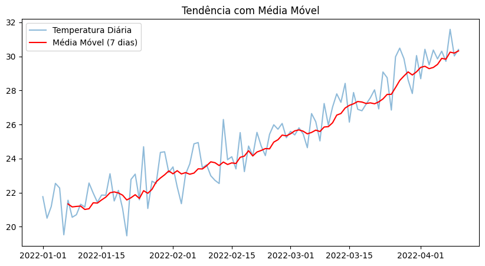
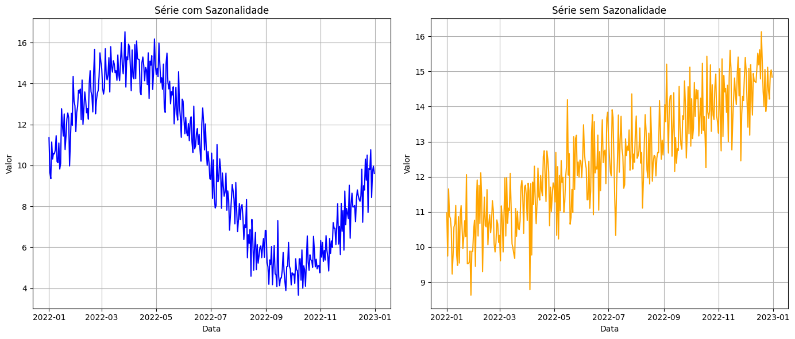
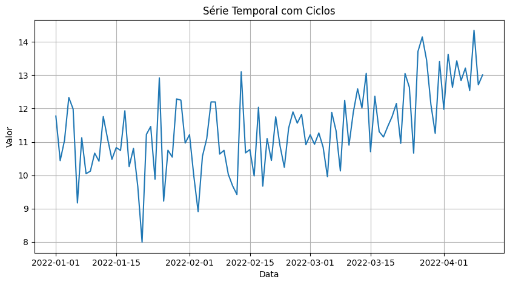
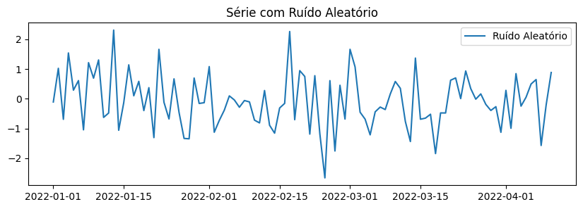
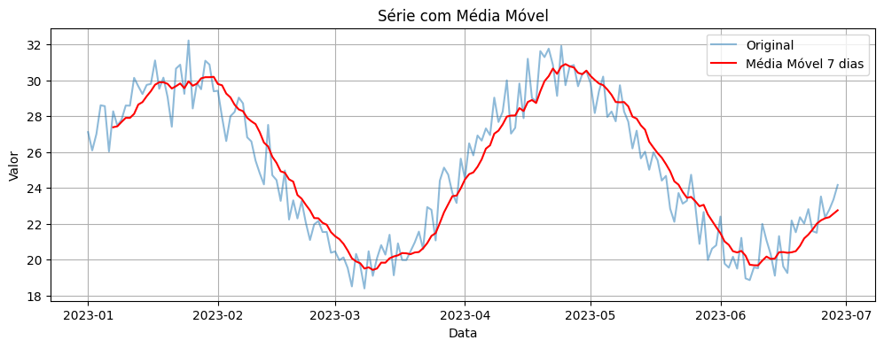
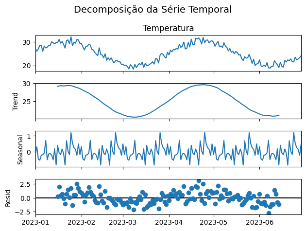
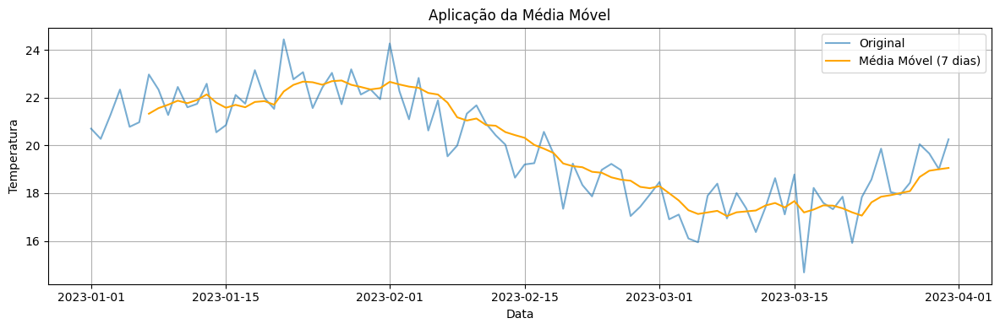
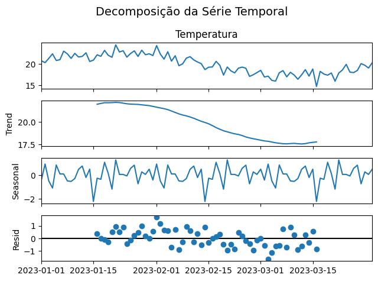

# Aula 8: Séries Temporais Básicas

## Objetivos da Aula

* Compreender os conceitos fundamentais de séries temporais.
* Identificar padrões como tendência e sazonalidade em dados temporais.
* Aplicar técnicas básicas de análise visual e estatística sobre dados temporais reais.
* Preparar o aluno para análises preditivas e uso de modelos mais complexos.

---

## O que são Séries Temporais?

Uma **série temporal** é uma coleção de observações **ordenadas no tempo**. O tempo é a principal dimensão que diferencia este tipo de dado dos dados tabulares tradicionais. As análises temporais são amplamente usadas em meteorologia, finanças, economia, saúde, entre outros.

**Objetivos principais ao trabalhar com séries temporais:**

* **Entender padrões e estruturas** nos dados.
* **Modelar e prever valores futuros** com base no histórico.
* **Detectar anomalias ou mudanças de comportamento** ao longo do tempo.

---

## Componentes de uma Série Temporal

### 1. Tendência (Trend)

A **tendência** representa o **movimento de longo prazo** na série. Pode indicar crescimento, declínio ou estabilidade.

> Exemplo: A temperatura média anual de uma cidade pode mostrar uma tendência de aumento ao longo de décadas devido ao aquecimento global.

**Exemplo prático (Colab): Detectando tendência com média móvel**



```python
import pandas as pd  # Importa a biblioteca pandas para manipulação de dados, como séries temporais.
import numpy as np  # Importa a biblioteca NumPy, que é usada para operações matemáticas e geradores de números aleatórios.
import matplotlib.pyplot as plt  # Importa o matplotlib, uma biblioteca para visualização de gráficos.

# Criando uma série temporal com tendência crescente
np.random.seed(0)  # Define a semente para o gerador de números aleatórios para garantir resultados reprodutíveis.
dias = pd.date_range(start='2022-01-01', periods=100)  # Cria uma sequência de 100 datas começando de 1º de janeiro de 2022.
tendencia = np.linspace(20, 30, 100)  # Cria um array de 100 valores igualmente espaçados entre 20 e 30 (tendência crescente).
ruido = np.random.normal(0, 1, 100)  # Gera 100 valores de ruído com distribuição normal, média 0 e desvio padrão 1.
serie = tendencia + ruido  # Adiciona o ruído à tendência para criar a série temporal final.

df = pd.DataFrame({'Data': dias, 'Temperatura': serie})  # Cria um DataFrame com as datas e as temperaturas (série temporal).
df.set_index('Data', inplace=True)  # Define a coluna 'Data' como o índice do DataFrame.

# Média móvel para suavizar a tendência
df['MediaMovel_7'] = df['Temperatura'].rolling(window=7).mean()  # Calcula a média móvel de 7 dias da série 'Temperatura' e armazena na nova coluna.

# Plotando
plt.figure(figsize=(10,5))  # Cria uma nova figura de gráfico com tamanho 10x5 polegadas.
plt.plot(df['Temperatura'], label='Temperatura Diária', alpha=0.5)  # Plota a série de temperatura com opacidade de 50% (alpha=0.5).
plt.plot(df['MediaMovel_7'], label='Média Móvel (7 dias)', color='red')  # Plota a média móvel de 7 dias em vermelho.
plt.title('Tendência com Média Móvel')  # Adiciona o título ao gráfico.
plt.legend()  # Exibe a legenda com os rótulos das séries.
plt.show()  # Exibe o gráfico gerado.
```

---

### 2. Sazonalidade (Seasonality)

A **sazonalidade** é um dos componentes fundamentais de uma série temporal e representa **padrões que se repetem em intervalos regulares e previsíveis**, como dias, meses ou anos. Esses padrões estão geralmente associados a **fatores externos recorrentes**, como clima, calendário, comportamento de consumo ou eventos periódicos.

#### Características principais:

* **Periodicidade fixa**: A sazonalidade ocorre em ciclos regulares, como:

  * **Diária**: variação de temperatura ao longo do dia.
  * **Semanal**: fluxo de clientes maior aos finais de semana.
  * **Mensal ou trimestral**: aumento de vendas em determinados meses.
  * **Anual**: mudanças de temperatura conforme estações do ano.

* **Previsível**: Ao contrário do ruído aleatório, a sazonalidade pode ser **antecipada e modelada**, pois segue padrões históricos.

* **Amplitude**: A intensidade da variação sazonal pode ser constante (sazonalidade aditiva) ou proporcional ao valor da série (sazonalidade multiplicativa).

---

#### Exemplos práticos de sazonalidade:

| Situação                                | Comportamento sazonal esperado                               |
| --------------------------------------- | ------------------------------------------------------------ |
| Vendas de sorvete                       | Aumentam no verão                                            |
| Contas de energia elétrica              | Aumentam no inverno (aquecimento) ou verão (ar-condicionado) |
| Frequência escolar                      | Diminui durante férias escolares                             |
| Tráfego em sites de comércio eletrônico | Aumenta em datas como Black Friday e Natal                   |

---

#### Identificando sazonalidade:

A sazonalidade pode ser identificada por meio de:

* **Gráficos de linha** ao longo do tempo.
* **Decomposição de séries temporais**, que separa tendência, sazonalidade e ruído.
* **Autocorrelação (ACF)**, que revela repetição de padrões em intervalos regulares.


> Exemplo: O aumento das vendas de ventiladores durante o verão.

**Exemplo prático (Colab): Simulação de sazonalidade anual**



```python
import numpy as np  # Importa a biblioteca NumPy, usada para operações matemáticas e geração de números aleatórios.
import pandas as pd  # Importa a biblioteca pandas, usada para manipulação de dados, como séries temporais.
import matplotlib.pyplot as plt  # Importa a biblioteca matplotlib para criar gráficos.

# Simulando dados
dias = pd.date_range(start='2022-01-01', periods=365)  # Cria uma sequência de datas, representando 365 dias a partir de 1º de janeiro de 2022.

# Série com sazonalidade
sazonalidade = 10 + 5 * np.sin(2 * np.pi * dias.dayofyear / 365)  # Cria uma série com sazonalidade usando uma função seno (variação anual). 
# O fator 5 altera a amplitude e o termo '10' define o valor médio. A expressão `dias.dayofyear` considera o dia do ano.
ruido_com = np.random.normal(0, 0.8, 365)  # Gera um ruído aleatório com distribuição normal (média 0 e desvio padrão 0.8).
serie_com_sazonalidade = sazonalidade + ruido_com  # Adiciona o ruído à série de sazonalidade, criando a série final com flutuações.

# Série sem sazonalidade (apenas tendência linear + ruído)
tendencia = np.linspace(10, 15, 365)  # Cria uma tendência linear que vai de 10 a 15 ao longo de 365 dias.
ruido_sem = np.random.normal(0, 0.8, 365)  # Gera um ruído aleatório para a série sem sazonalidade.
serie_sem_sazonalidade = tendencia + ruido_sem  # Adiciona o ruído à tendência linear, criando a série final sem sazonalidade.

# Criando DataFrame
df = pd.DataFrame({
    'Data': dias,  # Adiciona as datas à coluna 'Data'.
    'Com Sazonalidade': serie_com_sazonalidade,  # Adiciona a série com sazonalidade à coluna 'Com Sazonalidade'.
    'Sem Sazonalidade': serie_sem_sazonalidade  # Adiciona a série sem sazonalidade à coluna 'Sem Sazonalidade'.
}).set_index('Data')  # Define a coluna 'Data' como o índice do DataFrame para facilitar a manipulação de séries temporais.

# Plotando as séries separadas lado a lado
fig, axes = plt.subplots(1, 2, figsize=(14, 6))  # Cria uma figura com dois subgráficos lado a lado (1 linha e 2 colunas), com tamanho de 14x6 polegadas.

# Série com sazonalidade
axes[0].plot(df['Com Sazonalidade'], color='blue')  # Plota a série com sazonalidade no primeiro subgráfico com a cor azul.
axes[0].set_title('Série com Sazonalidade')  # Adiciona o título ao primeiro gráfico.
axes[0].set_xlabel('Data')  # Define o rótulo do eixo X como 'Data' no primeiro gráfico.
axes[0].set_ylabel('Valor')  # Define o rótulo do eixo Y como 'Valor' no primeiro gráfico.
axes[0].grid(True)  # Adiciona uma grade ao primeiro gráfico.

# Série sem sazonalidade
axes[1].plot(df['Sem Sazonalidade'], color='orange')  # Plota a série sem sazonalidade no segundo subgráfico com a cor laranja.
axes[1].set_title('Série sem Sazonalidade')  # Adiciona o título ao segundo gráfico.
axes[1].set_xlabel('Data')  # Define o rótulo do eixo X como 'Data' no segundo gráfico.
axes[1].set_ylabel('Valor')  # Define o rótulo do eixo Y como 'Valor' no segundo gráfico.
axes[1].grid(True)  # Adiciona uma grade ao segundo gráfico.

plt.tight_layout()  # Ajusta automaticamente o layout para que não haja sobreposição entre os gráficos e seus elementos.
plt.show()  # Exibe os gráficos gerados na tela.
```

---

### 3. Ciclos (Cycles)

Ciclos (ou flutuações cíclicas) são variações de longo prazo que ocorrem em períodos indeterminados e não seguem uma periodicidade fixa, ao contrário da **sazonalidade**, que tem um comportamento regular e previsível. Os ciclos podem durar de vários anos a várias décadas, e sua característica principal é que não se repetem em intervalos regulares.

Esses ciclos podem ser causados por uma série de fatores **externos** e **estruturais**, como:

* **Fatores econômicos**: Crises econômicas, recessões, mudanças nas políticas fiscais e monetárias, variações nos mercados financeiros e nos preços das commodities. Por exemplo, uma recessão pode reduzir o consumo e afetar a produção, enquanto uma recuperação econômica pode impulsionar esses indicadores.

* **Fatores políticos**: Mudanças em regimes políticos, políticas de governo, guerra ou estabilidade política. Isso pode afetar a confiança do consumidor, o investimento e os fluxos de comércio.

* **Fatores sociais**: Mudanças demográficas ou tendências sociais, como envelhecimento da população, mudanças nas preferências dos consumidores ou até mesmo inovações tecnológicas que alteram os padrões de consumo e produção.

Esses ciclos podem ser mais difíceis de prever e modelar devido à sua natureza imprevisível e à complexidade dos fatores envolvidos. Um exemplo clássico de flutuação cíclica é o **ciclo econômico**, que inclui períodos de crescimento (expansão) seguidos de recessões.

**Exemplo**: O ciclo de **expansão e contração econômica** é um exemplo de flutuação cíclica. Durante uma expansão, as empresas aumentam sua produção, o emprego cresce, o consumo sobe, enquanto durante uma contração (ou recessão), há uma queda na atividade econômica, desemprego e queda no consumo.

Em **modelos de previsão**, a dificuldade com ciclos é que eles não seguem padrões fixos, e podem exigir técnicas de análise de dados mais avançadas, como séries temporais com componentes de tendência e ciclos, para serem corretamente identificados e analisados.


> Exemplo: Ciclos de expansão e recessão na economia.


**Exemplo prático (Colab): Adicionando ciclos à série**



```python
# Simulando ciclos com função senoidal de baixa frequência
ciclo = 3 * np.sin(2 * np.pi * dias[:100].dayofyear / 365 * 0.25)  # Cria uma série de ciclos com uma função seno de baixa frequência.
# A amplitude do ciclo é 3 e a frequência é ajustada com o fator 0.25 para torná-lo um ciclo mais longo (ciclo de baixa frequência).

# Slice tendencia and ruido to match the length of ciclo and dias[:100]
serie_ciclo = tendencia[:100] + ciclo + ruido[:100]  # Combina uma tendência linear (primeiros 100 valores), o ciclo gerado acima, e o ruído correspondente.

df = pd.DataFrame({'Data': dias[:100], 'Valor': serie_ciclo})  # Cria um DataFrame com as datas (os primeiros 100 dias) e a série temporal gerada.
df.set_index('Data', inplace=True)  # Define a coluna 'Data' como o índice do DataFrame para facilitar a manipulação de séries temporais.

# Plotting the resulting series
plt.figure(figsize=(10, 5))  # Cria uma nova figura de gráfico com o tamanho de 10x5 polegadas.
plt.plot(df['Valor'])  # Plota a série temporal gerada (soma da tendência, ciclo e ruído).
plt.title('Série Temporal com Ciclos')  # Adiciona o título ao gráfico.
plt.xlabel('Data')  # Define o rótulo do eixo X como 'Data'.
plt.ylabel('Valor')  # Define o rótulo do eixo Y como 'Valor'.
plt.grid(True)  # Adiciona uma grade ao gráfico para facilitar a visualização.
plt.show()  # Exibe o gráfico gerado.

```

---

### 4. Aleatoriedade (Ruído)

O **ruído** em uma série temporal refere-se a **variações aleatórias e imprevisíveis** que não estão associadas a nenhum padrão sistemático ou estrutura subjacente. Essas flutuações são consideradas como **erros ou resíduos** que não podem ser explicados por tendências, ciclos ou sazonalidade.

Esses componentes de **ruído** são importantes porque, embora não sejam úteis para a modelagem ou previsão, eles representam **a imprevisibilidade ou a aleatoriedade** que não pode ser prevista ou controlada. O ruído pode ser causado por uma série de fatores, como:

* **Erros de medição**: Erros na coleta de dados ou imprecisões nos sensores.
* **Variações imprevisíveis**: Mudanças que ocorrem sem um padrão ou explicação clara, como eventos naturais inesperados ou choques econômicos súbitos.
* **Comportamentos imprevisíveis dos indivíduos**: No contexto de vendas, por exemplo, o comportamento do consumidor pode ser influenciado por fatores que não são capturados no modelo (promoções imprevistas, ações de concorrentes, etc.).

### Características do Ruído:

* **Aleatoriedade**: O ruído não segue nenhum padrão ou tendência específica, sendo imprevisível.
* **Dificuldade de modelagem**: Como o ruído não tem uma origem identificável ou uma relação com outras variáveis, ele é difícil de modelar ou usar para previsões.
* **Não correlacionado**: O ruído geralmente é considerado **não autocorrelacionado**, ou seja, ele não tem relação com os valores passados da série temporal.

### Exemplo:

Em uma previsão de vendas, se um evento inesperado, como uma falha no sistema de vendas ou uma interrupção na cadeia de suprimentos, ocorre e afeta os resultados, isso geraria uma variação que seria considerada **ruído**. Essas flutuações não seriam explicadas por fatores como tendência (crescimento nas vendas ao longo do tempo) ou sazonalidade (aumento das vendas durante festas de fim de ano), mas sim por uma ocorrência aleatória.

### Modelagem do Ruído:

Ao construir modelos de previsão, como modelos ARIMA ou modelos de suavização exponencial, o **ruído** é geralmente tratado como o componente residual ou erro que o modelo não consegue explicar. Quanto melhor o modelo, menos ruído ele deve capturar, já que ele conseguirá identificar e modelar mais dos padrões sistemáticos presentes nos dados.

> Exemplo: Uma queda inesperada de temperatura devido a um fenômeno climático atípico.

**Exemplo prático (Colab): Ruído puro**



```python
ruido = np.random.normal(0, 1, 100)  # Gera 100 valores de ruído com distribuição normal, média 0 e desvio padrão 1.
dias = pd.date_range(start='2022-01-01', periods=100)  # Cria uma sequência de 100 datas, começando em 1º de janeiro de 2022.

df = pd.DataFrame({'Data': dias, 'Ruido': ruido})  # Cria um DataFrame com as datas e os valores de ruído gerados.
df.set_index('Data', inplace=True)  # Define a coluna 'Data' como o índice do DataFrame, facilitando a manipulação de séries temporais.

# Gráfico de linha
plt.figure(figsize=(10,3))  # Cria uma nova figura de gráfico com tamanho 10x3 polegadas, mais estreito, ideal para séries temporais.
plt.plot(df['Ruido'], label='Ruído Aleatório')  # Plota a série de ruído aleatório.
plt.title('Série com Ruído Aleatório')  # Define o título do gráfico como 'Série com Ruído Aleatório'.
plt.legend()  # Exibe a legenda com o rótulo 'Ruído Aleatório'.
plt.show()  # Exibe o gráfico gerado.
```

---

## Visualização e Análise Exploratória

Analisar séries temporais **visualmente** é o primeiro passo para entender o comportamento da variável ao longo do tempo. Técnicas gráficas ajudam a detectar **tendências**, **sazonalidades**, **anomalias** e **mudanças de padrão**.

---

### 1. Gráficos de Linha (Line Plots)

São o tipo mais comum e útil para séries temporais. Mostram claramente a variação dos dados ao longo do tempo.

> Exemplo: Visualizar a série de temperatura diária de uma cidade.

**Exemplo prático (Colab): Gráfico de linha**


```python
import pandas as pd  # Importa a biblioteca pandas, que é utilizada para manipulação e análise de dados.
import numpy as np  # Importa a biblioteca NumPy, usada para operações matemáticas e geração de números aleatórios.
import matplotlib.pyplot as plt  # Importa a biblioteca matplotlib, usada para criar gráficos.

# Simulação de série temporal
np.random.seed(0)  # Define a semente do gerador de números aleatórios para garantir resultados reproduzíveis.
dias = pd.date_range(start='2023-01-01', periods=180)  # Cria uma sequência de 180 datas, começando em 1º de janeiro de 2023.

# Geração da série temporal com sazonalidade e ruído
serie = 25 + 5 * np.sin(2 * np.pi * dias.dayofyear / 365 * 4) + np.random.normal(0, 1, 180)
# A série gerada consiste em:
# - Uma base de valor 25 (representando o valor médio ou de referência).
# - Uma **variação sazonal** simulada pela função seno, com amplitude 5 e 4 ciclos por ano (multiplicado por 4).
# - **Ruído aleatório** com distribuição normal, média 0 e desvio padrão 1, para simular flutuações imprevistas.

df = pd.DataFrame({'Data': dias, 'Temperatura': serie})  # Cria um DataFrame com as datas e os valores de temperatura gerados.
df.set_index('Data', inplace=True)  # Define a coluna 'Data' como o índice do DataFrame para facilitar a manipulação da série temporal.

# Gráfico de linha
plt.figure(figsize=(12,4))  # Cria uma nova figura de gráfico com tamanho 12x4 polegadas (mais largo para um gráfico de séries temporais).
plt.plot(df['Temperatura'], label='Temperatura')  # Plota a série de temperatura no gráfico com o rótulo 'Temperatura'.
plt.title('Gráfico de Linha - Série Temporal')  # Define o título do gráfico como 'Gráfico de Linha - Série Temporal'.
plt.xlabel('Data')  # Define o rótulo do eixo X como 'Data'.
plt.ylabel('Valor')  # Define o rótulo do eixo Y como 'Valor'.
plt.grid(True)  # Adiciona uma grade ao gráfico para facilitar a leitura dos valores.
plt.legend()  # Exibe a legenda com o rótulo 'Temperatura'.
plt.show()  # Exibe o gráfico gerado.
```

---

### 2. Médias Móveis (Moving Averages)

As **médias móveis** suavizam a série, permitindo identificar tendências de forma mais clara, removendo oscilações de curto prazo.

> Exemplo: Usar uma média móvel de 7 dias para observar a tendência semanal.

**Exemplo prático (Colab): Aplicando média móvel**



```python
# Adicionando uma média móvel de 7 dias
df['MM_7'] = df['Temperatura'].rolling(window=7).mean()  
# Cria uma nova coluna 'MM_7' no DataFrame, que contém a média móvel de 7 dias dos valores de 'Temperatura'.
# A função rolling(window=7) cria uma janela de 7 dias e a função mean() calcula a média desses 7 dias para cada ponto da série.

# Plotando série original e média móvel
plt.figure(figsize=(12,4))  # Cria uma nova figura de gráfico com tamanho 12x4 polegadas, adequado para visualização de séries temporais.
plt.plot(df['Temperatura'], alpha=0.5, label='Original')  # Plota a série original de temperatura com transparência (alpha=0.5) para facilitar a visualização da linha de média móvel.
plt.plot(df['MM_7'], color='red', label='Média Móvel 7 dias')  # Plota a série da média móvel de 7 dias com linha vermelha.
plt.title('Série com Média Móvel')  # Define o título do gráfico.
plt.xlabel('Data')  # Define o rótulo do eixo X como 'Data'.
plt.ylabel('Valor')  # Define o rótulo do eixo Y como 'Valor'.
plt.legend()  # Exibe a legenda para identificar a série original e a média móvel.
plt.grid(True)  # Adiciona uma grade ao gráfico para facilitar a leitura dos valores.
plt.show()  # Exibe o gráfico gerado.

```

---

### 3. Decomposição da Série Temporal

A decomposição permite separar a série em três componentes:

* **Tendência (Trend)**
* **Sazonalidade (Seasonality)**
* **Resíduo (Residual)**

> Isso facilita a compreensão de como cada fator contribui para a variação total da série.

**Exemplo prático (Colab): Decomposição com statsmodels**



```python
from statsmodels.tsa.seasonal import seasonal_decompose  # Importa a função 'seasonal_decompose' da biblioteca statsmodels para decomposição sazonal de séries temporais.

# Usando decomposição aditiva (ideal para dados com somas de componentes)
resultado = seasonal_decompose(df['Temperatura'], model='additive', period=30)  
# Aplica a decomposição sazonal à série temporal 'Temperatura', utilizando o modelo aditivo.
# O modelo 'additive' assume que a série é a soma dos componentes: tendência, sazonalidade e erro.
# O parâmetro 'period=30' define o número de períodos sazonais por ciclo (no caso, 30 dias, considerando um ciclo mensal).

# Plotando os componentes
resultado.plot()  # Gera os gráficos dos componentes resultantes da decomposição: tendência, sazonalidade e resíduos.
plt.suptitle("Decomposição da Série Temporal", fontsize=14)  # Define o título do gráfico como 'Decomposição da Série Temporal', com tamanho de fonte 14.
plt.tight_layout()  # Ajusta o layout do gráfico para evitar sobreposição de elementos.
plt.show()  # Exibe o gráfico resultante.
```

---

## Técnicas Básicas

As técnicas básicas de séries temporais são ferramentas simples, porém poderosas, para **compreender e visualizar padrões ocultos** nos dados. Elas são frequentemente aplicadas na etapa exploratória para ajudar a formular modelos de previsão mais sofisticados.

---

### 1. Médias Móveis (Moving Averages)

A **média móvel** calcula a média de um número fixo de observações passadas para cada ponto da série. Ela é usada para:

* **Reduzir o ruído aleatório**
* **Evidenciar a tendência de longo prazo**
* **Detectar mudanças no comportamento da série**

#### Fórmula (média móvel simples):

$$
MA_t = \frac{1}{k} \sum_{i=0}^{k-1} y_{t-i}
$$

onde $k$ é a janela (número de períodos) e $y_t$ é o valor observado no tempo $t$.

> Exemplo: média móvel de 7 dias em uma série de temperaturas.

**Exemplo prático (Colab): Aplicando Média Móvel**



```python
import pandas as pd  # Importa a biblioteca pandas para manipulação de dados em formato de tabelas (DataFrame).
import numpy as np  # Importa a biblioteca numpy para cálculos numéricos e geração de números aleatórios.
import matplotlib.pyplot as plt  # Importa a biblioteca matplotlib para criação de gráficos.

# Série simulada
np.random.seed(42)  # Define uma semente para o gerador de números aleatórios, garantindo que os resultados sejam reproduzíveis.
datas = pd.date_range(start='2023-01-01', periods=90)  # Cria um intervalo de 90 dias a partir de 01 de janeiro de 2023.
valores = 20 + 3 * np.sin(2 * np.pi * datas.dayofyear / 365 * 4) + np.random.normal(0, 1, 90)  
# Gera uma série de valores de temperatura simulada com uma componente sazonal (usando a função seno) e um componente de ruído aleatório.
# A fórmula 3 * np.sin(...) gera a sazonalidade e np.random.normal(0, 1, 90) adiciona um ruído normal com média 0 e desvio padrão 1.

serie = pd.DataFrame({'Data': datas, 'Temperatura': valores})  # Cria um DataFrame com as colunas 'Data' e 'Temperatura'.
serie.set_index('Data', inplace=True)  # Define a coluna 'Data' como o índice do DataFrame, facilitando a manipulação de séries temporais.

# Média móvel de 7 dias
serie['MM_7'] = serie['Temperatura'].rolling(window=7).mean()  
# Cria uma nova coluna 'MM_7' no DataFrame, que contém a média móvel de 7 dias dos valores de 'Temperatura'.
# A função rolling(window=7) cria uma janela deslizante de 7 dias e a função mean() calcula a média dentro dessa janela.

# Gráfico
plt.figure(figsize=(12,4))  # Cria uma nova figura para o gráfico com tamanho 12x4 polegadas.
plt.plot(serie['Temperatura'], label='Original', alpha=0.6)  # Plota a série original de temperatura com uma transparência de 60% (alpha=0.6).
plt.plot(serie['MM_7'], label='Média Móvel (7 dias)', color='orange')  # Plota a média móvel de 7 dias com linha laranja.
plt.title('Aplicação da Média Móvel')  # Define o título do gráfico.
plt.xlabel('Data')  # Define o rótulo do eixo X como 'Data'.
plt.ylabel('Temperatura')  # Define o rótulo do eixo Y como 'Temperatura'.
plt.legend()  # Exibe a legenda para identificar as duas linhas no gráfico.
plt.grid(True)  # Adiciona uma grade ao gráfico para facilitar a leitura dos valores.
plt.tight_layout()  # Ajusta o layout do gráfico para evitar sobreposição de elementos.
plt.show()  # Exibe o gráfico gerado.
```

---

### 2. Decomposição de Séries Temporais

A **decomposição** permite quebrar uma série temporal em três componentes:

* **Tendência (Trend)**: direção geral da série (ex: crescimento ou queda)
* **Sazonalidade (Seasonality)**: padrões recorrentes em intervalos regulares
* **Ruído (Residual)**: flutuações não explicadas por tendência ou sazonalidade

Existem dois tipos comuns de decomposição:

* **Aditiva**: quando a variação sazonal é constante ao longo do tempo.
* **Multiplicativa**: quando a variação sazonal cresce com o nível da série.

> A decomposição facilita a análise individual dos componentes.

**Exemplo prático (Colab): Decomposição Aditiva com `statsmodels`**



```python
from statsmodels.tsa.seasonal import seasonal_decompose

# Decomposição aditiva (assumindo ciclo mensal)
resultado = seasonal_decompose(serie['Temperatura'], model='additive', period=30)

# Plotando os componentes
resultado.plot()
plt.suptitle("Decomposição da Série Temporal", fontsize=14)
plt.tight_layout()
plt.show()
```

---

## Projeto Prático

### Tema: Análise Histórica da Temperatura de uma Cidade

### Descrição:

Neste projeto, o aluno realizará uma análise exploratória de uma **série temporal real** utilizando dados de **temperatura diária**. A finalidade é aplicar os conceitos aprendidos sobre séries temporais em dados do mundo real, como variações térmicas, tendências e padrões sazonais.

### Etapas:

1. **Importar os dados e tratá-los**: carregar o arquivo CSV contendo as temperaturas, filtrar colunas úteis e converter datas.
2. **Plotar a série temporal bruta**: gerar um gráfico de linha para visualizar a variação de temperatura ao longo do tempo.
3. **Aplicar uma média móvel (ex: 30 dias)**: suavizar a curva para evidenciar padrões.
4. **Identificar tendências visuais**: reconhecer se a temperatura tem aumentado/diminuído ao longo do tempo.
5. **(Opcional) Decomposição da série**: separar os componentes de tendência, sazonalidade e ruído.

### Ferramentas:

Python, com bibliotecas:

* `pandas` (manipulação de dados)
* `matplotlib`, `seaborn` (visualização)
* `statsmodels` (decomposição)

---

## Script para Carregamento do Dataset (NOAA ou CSV local)

### Exemplo 1: Carregando CSV local (base comum para cidade brasileira)

```python
import pandas as pd

# Caminho do arquivo (você pode usar upload no Colab ou apontar para seu Drive)
caminho_csv = 'temperatura_sp_diario.csv'

# Carregando o dataset
df = pd.read_csv(caminho_csv)

# Exibindo as primeiras linhas
df.head()
```

### Exemplo 2: Dataset NOAA formatado (GHCN-Daily)

```python
import pandas as pd

# Dataset: Exemplo formatado do NOAA (pré-processado com temperaturas mínimas/máximas/medias)
# Link alternativo do Kaggle ou CSV próprio já limpo
df = pd.read_csv('https://raw.githubusercontent.com/datasets/global-temp/master/data/monthly.csv')

# Pré-visualização
df.head()
```

### Pré-tratamento sugerido

```python
# Converter a coluna de data
df['Data'] = pd.to_datetime(df['Date'])

# Filtrar apenas o período recente, se necessário
df = df[df['Data'] >= '2000-01-01']

# Renomear para facilitar
df.rename(columns={'Mean': 'Temperatura'}, inplace=True)

# Resetar índice e verificar
df = df[['Data', 'Temperatura']]
df.head()
```

---

## Exercícios

1. **Baixe uma base de dados de temperatura** (diária ou mensal) de uma cidade brasileira.
   Você pode usar:

   * Um **CSV local** com colunas `Data` e `Temperatura`.
   * Um dataset público (exemplo: [NOAA GHCN](https://www.ncei.noaa.gov/) ou o repositório [datasets/global-temp](https://github.com/datasets/global-temp)).

---

### Dataset global (temperatura média mensal)

```python
import pandas as pd

# Dataset global com temperatura média mensal (°C)
url = 'https://raw.githubusercontent.com/datasets/global-temp/master/data/monthly.csv'
df = pd.read_csv(url)

# Visualizar as primeiras linhas
df.head()

# Converter a coluna de data para datetime
df['Data'] = pd.to_datetime(df['Date'] if 'Date' in df.columns else df['Data'])

# Renomear coluna de temperatura (se necessário)
if 'Mean' in df.columns:
    df.rename(columns={'Mean': 'Temperatura'}, inplace=True)

# Manter apenas as colunas principais
df = df[['Data', 'Temperatura']]

# Ordenar cronologicamente
df = df.sort_values('Data')

# Exibir os dados tratados
df.head()
```

---

### 2. **Plote a série temporal completa com matplotlib/seaborn**

```python
import matplotlib.pyplot as plt
import seaborn as sns

plt.figure(figsize=(12, 5))
sns.lineplot(data=df, x='Data', y='Temperatura')
plt.title('Série Temporal de Temperatura')
plt.xlabel('Data')
plt.ylabel('Temperatura (°C)')
plt.grid(True)
plt.tight_layout()
plt.show()
```

---

### 3. **Calcule e plote uma média móvel de 7 dias (ou 3 meses)**

```python
df['Media_Movel'] = df['Temperatura'].rolling(window=7).mean()

plt.figure(figsize=(12, 5))
sns.lineplot(data=df, x='Data', y='Temperatura', label='Original')
sns.lineplot(data=df, x='Data', y='Media_Movel', label='Média Móvel (7)')
plt.title('Temperatura com Média Móvel')
plt.xlabel('Data')
plt.ylabel('Temperatura (°C)')
plt.legend()
plt.grid(True)
plt.tight_layout()
plt.show()
```

---

### 4. **Decomponha a série com `seasonal_decompose`**

```python
from statsmodels.tsa.seasonal import seasonal_decompose

# A série precisa de índice datetime e frequência definida
df.set_index('Data', inplace=True)
df = df.asfreq('D' if df.index.inferred_freq is None else df.index.inferred_freq)

# Decomposição (aditiva ou multiplicativa)
decomposicao = seasonal_decompose(df['Temperatura'], model='additive', period=30)
decomposicao.plot()
plt.suptitle('Decomposição da Série Temporal', fontsize=16)
plt.tight_layout()
plt.show()
```

---

### 5. **Responda:**

* Existe **tendência**? De que tipo (crescente ou decrescente)?
* Há **evidência de sazonalidade** (ciclos regulares)?
* Qual a principal **variação aleatória** (ruído)? Há outliers ou eventos extremos?


---

## Materiais de Estudo Complementares

* **Livro:** *Análise de Séries Temporais* – Cryer & Chan (Capítulos 1 e 2)
* *Forecasting: Principles and Practice* – Hyndman & Athanasopoulos (disponível online)
* Documentação: [`pandas.Series.rolling`](https://pandas.pydata.org/docs/reference/api/pandas.Series.rolling.html)
* Documentação: [`statsmodels.tsa.seasonal.seasonal_decompose`](https://www.statsmodels.org/stable/generated/statsmodels.tsa.seasonal.seasonal_decompose.html)
