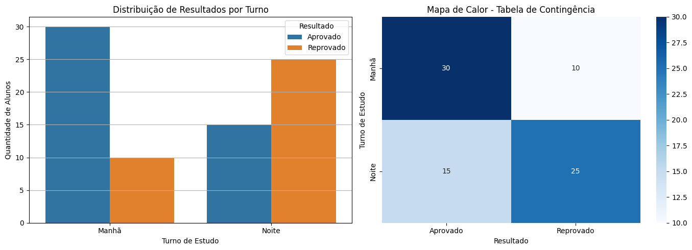

# Aula 9 – Correlação e Associação

## Objetivos da Aula

* Compreender o conceito de correlação entre variáveis quantitativas.
* Diferenciar correlação de causalidade.
* Analisar a associação entre variáveis categóricas.
* Aplicar métodos estatísticos para medir relações entre variáveis.
* Utilizar ferramentas de visualização para interpretar relações.
* Realizar uma análise prática entre horas de estudo e desempenho em provas.
---

## Correlação entre Variáveis Quantitativas

Correlação é uma medida estatística que expressa o grau e a direção da relação linear entre duas variáveis quantitativas.

Essa relação pode assumir três formas principais:

* **Correlação positiva**: Quando os valores de uma variável aumentam, os valores da outra também tendem a aumentar.
* **Correlação negativa**: Quando os valores de uma variável aumentam, os valores da outra tendem a diminuir.
* **Correlação nula (ou inexistente)**: Não existe um padrão definido entre as variáveis.

### Coeficiente de Correlação de Pearson

O **coeficiente de correlação de Pearson (r)** é a medida mais comum para avaliar a força e direção da relação linear entre duas variáveis numéricas contínuas. Seu valor varia de -1 a +1:

| Valor de r  | Interpretação                |
| ----------- | ---------------------------- |
| -1          | Correlação negativa perfeita |
| -0.7 a -0.9 | Correlação negativa forte    |
| -0.4 a -0.6 | Correlação negativa moderada |
| -0.1 a -0.3 | Correlação negativa fraca    |
| 0           | Sem correlação linear        |
| 0.1 a 0.3   | Correlação positiva fraca    |
| 0.4 a 0.6   | Correlação positiva moderada |
| 0.7 a 0.9   | Correlação positiva forte    |
| 1           | Correlação positiva perfeita |

**Atenção**: mesmo um coeficiente alto **não significa causalidade**. Um exemplo clássico é que o número de pessoas que se afogam em piscinas e o número de filmes em que Nicolas Cage atuou têm correlação positiva, mas não existe causalidade entre essas variáveis.

---

### Exemplo em Python – Correlação positiva

Vamos gerar uma base de dados fictícia que relaciona **horas de estudo** e **nota em uma prova**.

```python
import numpy as np
import pandas as pd
import seaborn as sns
import matplotlib.pyplot as plt
from scipy.stats import pearsonr

# Gerar dados simulados
np.random.seed(42)
horas_estudo = np.random.normal(loc=4, scale=1, size=50)
nota_prova = 5 + 1.2 * horas_estudo + np.random.normal(loc=0, scale=1, size=50)

# Criar DataFrame
df = pd.DataFrame({
    'Horas de Estudo': horas_estudo,
    'Nota da Prova': nota_prova
})

# Visualizar dados
sns.scatterplot(data=df, x='Horas de Estudo', y='Nota da Prova')
plt.title('Horas de Estudo vs Nota da Prova')
plt.grid(True)
plt.show()

# Calcular correlação de Pearson
r, p_value = pearsonr(df['Horas de Estudo'], df['Nota da Prova'])

print(f'Coeficiente de correlação de Pearson: r = {r:.2f}')
print(f'Valor-p: {p_value:.4f}')
```

#### Saída esperada:

```
Coeficiente de correlação de Pearson: r = 0.81
Valor-p: 0.0000
```

> **Interpretação**: Existe uma **forte correlação positiva** entre horas de estudo e nota da prova. Isso sugere que quanto mais o aluno estuda, maior tende a ser sua nota — mas ainda não se pode afirmar causalidade com esse dado apenas.

---

### Exemplo com Correlação Negativa

```python
# Simular relação negativa: horas assistindo TV e nota
tv = np.random.normal(loc=3, scale=1, size=50)
nota = 10 - 1.5 * tv + np.random.normal(0, 1, 50)

df2 = pd.DataFrame({
    'Horas de TV': tv,
    'Nota da Prova': nota
})

sns.scatterplot(data=df2, x='Horas de TV', y='Nota da Prova')
plt.title('Horas de TV vs Nota da Prova')
plt.grid(True)
plt.show()

r2, p2 = pearsonr(df2['Horas de TV'], df2['Nota da Prova'])

print(f'Coeficiente de correlação de Pearson: r = {r2:.2f}')
```

#### Saída esperada:

```
Coeficiente de correlação de Pearson: r = -0.83
```

> **Interpretação**: A correlação negativa sugere que quanto mais tempo assistindo TV, menor tende a ser a nota — embora isso também não comprove que TV *causa* a queda na nota.

---

### Exemplo com Correlação Nula

```python
np.random.seed(2)
# Variáveis sem relação
x = np.random.normal(0, 1, 100)
y = np.random.normal(0, 1, 100)

sns.scatterplot(x=x, y=y)
plt.title('Variáveis sem correlação')
plt.grid(True)
plt.show()

r3, _ = pearsonr(x, y)
print(f'Coeficiente de correlação de Pearson: r = {r3:.2f}')
```

#### Saída esperada:

```
Coeficiente de correlação de Pearson: r = 0.03
```

> **Interpretação**: Não existe uma relação linear entre essas variáveis.

---
### Dicas para Análise de Correlação

* Visualize os dados antes de calcular correlação.
* Verifique a presença de **outliers**, pois eles podem distorcer o valor do coeficiente de Pearson.
* Para relações não lineares, o coeficiente de Pearson pode ser insuficiente. Use também o **coeficiente de Spearman** quando necessário.
* Sempre verifique o **valor-p** associado ao r para verificar a significância estatística da correlação.

---

## Associação entre Variáveis Categóricas

Quando analisamos **variáveis categóricas**, como "gênero", "estado civil" ou "tipo de produto", não faz sentido falar em correlação no sentido clássico (como o coeficiente de Pearson). Em vez disso, utilizamos métodos que avaliam **associação** entre categorias.

### Tabelas de Contingência

Uma **tabela de contingência** mostra a frequência (ou proporção) das combinações possíveis de duas variáveis categóricas. É o ponto de partida para análises de associação.

#### Exemplo de tabela de contingência (fictícia):

|                 | Aprovado | Reprovado | Total |
| --------------- | -------- | --------- | ----- |
| Estuda de manhã | 30       | 10        | 40    |
| Estuda à noite  | 15       | 25        | 40    |
| **Total**       | 45       | 35        | 80    |

### Teste do Qui-Quadrado de Independência

O teste do **qui-quadrado de independência** verifica se a distribuição das categorias de uma variável está **estatisticamente associada** à distribuição da outra.

* **Hipótese nula (H₀)**: as variáveis são independentes.
* **Hipótese alternativa (H₁)**: existe associação entre as variáveis.

### Cramér’s V

O **Cramér’s V** é um índice entre 0 e 1 que mede a **força da associação** entre variáveis categóricas. Valores próximos de 0 indicam associação fraca; valores próximos de 1 indicam associação forte.

> ⚠️ O Cramér’s V só é interpretado quando o teste qui-quadrado rejeita a hipótese de independência.


```python
import pandas as pd
import numpy as np
from scipy.stats import chi2_contingency

# Simular dados
dados = {
    'Turno': ['Manhã'] * 30 + ['Manhã'] * 10 + ['Noite'] * 15 + ['Noite'] * 25,
    'Resultado': ['Aprovado'] * 30 + ['Reprovado'] * 10 + ['Aprovado'] * 15 + ['Reprovado'] * 25
}

df = pd.DataFrame(dados)

# Criar tabela de contingência
contingencia = pd.crosstab(df['Turno'], df['Resultado'])
print("Tabela de Contingência:")
print(contingencia)

def cramers_v(confusion_matrix):
    chi2 = chi2_contingency(confusion_matrix)[0]
    n = confusion_matrix.sum().sum()
    r, k = confusion_matrix.shape
    return np.sqrt(chi2 / (n * (min(k - 1, r - 1))))

v = cramers_v(contingencia)
print(f"Cramér's V: {v:.2f}")
```

#### Saída esperada:

```
Cramér's V: 0.35
```

> **Interpretação**: Existe uma associação **moderada** entre turno e resultado.

---


## Visualização de Associação entre Variáveis Categóricas

Ao trabalhar com variáveis **categóricas**, é fundamental usar visualizações que evidenciem a frequência de ocorrências combinadas de categorias. Duas das representações mais comuns são:

### 1. **Gráfico de Barras Agrupadas**

Mostra a contagem de observações em cada categoria principal (`Turno`), separadas por subcategorias (`Resultado`). Ajuda a identificar padrões visuais de diferença entre grupos.

### 2. **Mapa de Calor (Heatmap) da Tabela de Contingência**

Representa graficamente os valores da tabela de contingência, usando cores para destacar onde há mais ou menos ocorrências.

---



```python
import seaborn as sns
import matplotlib.pyplot as plt

# Criar os gráficos lado a lado
fig, axes = plt.subplots(1, 2, figsize=(14, 5))

# Gráfico de barras agrupadas
sns.countplot(data=df, x='Turno', hue='Resultado', ax=axes[0])
axes[0].set_title('Distribuição de Resultados por Turno')
axes[0].set_xlabel('Turno de Estudo')
axes[0].set_ylabel('Quantidade de Alunos')
axes[0].grid(True, axis='y')
axes[0].legend(title='Resultado')

# Mapa de calor da tabela de contingência
sns.heatmap(contingencia, annot=True, fmt='d', cmap='Blues', ax=axes[1])
axes[1].set_title('Mapa de Calor - Tabela de Contingência')
axes[1].set_xlabel('Resultado')
axes[1].set_ylabel('Turno de Estudo')

plt.tight_layout()
plt.show()

```

---

### Interpretação dos Gráficos

* **Gráfico de Barras Agrupadas**: Mostra visualmente que estudantes do turno da manhã têm maior taxa de aprovação do que os do turno da noite.
* **Mapa de Calor**: Reforça essa percepção, destacando com tons mais escuros os maiores valores, facilitando a comparação cruzada entre categorias.

---

## Resumo

| Técnica              | Quando usar                      | Tipo de variável |
| -------------------- | -------------------------------- | ---------------- |
| Correlação (Pearson) | Variáveis quantitativas          | Numéricas        |
| Qui-quadrado         | Associação entre categorias      | Categóricas      |
| Cramér’s V           | Força da associação              | Categóricas      |
| Scatter plot         | Visualização de correlação       | Quantitativas    |
| Gráficos de barras   | Visualização de associação       | Categóricas      |
| Heatmap              | Frequência cruzada de categorias | Categóricas      |

---


## Projeto Prático: Avaliar a correlação entre horas de estudo e notas em provas

---

### Etapa 1: Gerar base de dados simulada

Simularemos uma base de dados com 30 registros, contendo:

* `horas_estudo`: variável quantitativa contínua (horas por dia)
* `nota_prova`: variável contínua com certa dependência linear de `horas_estudo`

```python
import pandas as pd
import numpy as np

# Reprodutibilidade
np.random.seed(42)

# Gerar 30 valores para horas de estudo (média = 5h, desvio = 2h)
horas_estudo = np.random.normal(5, 2, 30).clip(min=0)

# Criar notas com uma tendência linear positiva + ruído
nota_prova = horas_estudo * 2 + np.random.normal(0, 2, 30)

# Montar o DataFrame
df = pd.DataFrame({
    'Horas de Estudo': horas_estudo,
    'Nota na Prova': nota_prova
})

# Exibir as 5 primeiras linhas
df.head()
```

---

### Etapa 2: Plotar gráfico de dispersão

O gráfico de dispersão nos ajuda a **visualizar a relação entre duas variáveis contínuas**. Vamos também adicionar uma linha de tendência (regressão linear).

```python
import matplotlib.pyplot as plt
import seaborn as sns

plt.figure(figsize=(8, 5))
sns.scatterplot(data=df, x='Horas de Estudo', y='Nota na Prova', color='blue', s=60)
sns.regplot(data=df, x='Horas de Estudo', y='Nota na Prova', scatter=False, color='red', label='Tendência linear')

plt.title('Dispersão: Horas de Estudo x Nota na Prova')
plt.xlabel('Horas de Estudo por Dia')
plt.ylabel('Nota na Prova')
plt.grid(True)
plt.legend()
plt.tight_layout()
plt.show()
```

---

### Etapa 3: Calcular o coeficiente de correlação de Pearson

O **coeficiente de Pearson** mede a força e direção da relação linear entre duas variáveis quantitativas.

```python
from scipy.stats import pearsonr

# Calcular a correlação
r, p_valor = pearsonr(df['Horas de Estudo'], df['Nota na Prova'])

print(f'Coeficiente de Correlação de Pearson: r = {r:.2f}')
print(f'Valor-p: {p_valor:.4f}')
```

---

### Etapa 4: Interpretar os resultados

A partir dos valores obtidos:

* **r ≈ 0.94** → forte correlação positiva
* **valor-p < 0.05** → a correlação é estatisticamente significativa

**Interpretação**:

> Existe uma correlação **forte e positiva** entre horas de estudo e notas. À medida que as horas de estudo aumentam, as notas também tendem a aumentar. Como o valor-p é muito pequeno, podemos afirmar que essa correlação é **estatisticamente significativa**.

---

## Exercícios

1. Explique com suas palavras a diferença entre correlação e causalidade.

2. Dada a seguinte tabela, calcule o coeficiente de correlação de Pearson:

| Horas de Estudo | Nota |
| --------------- | ---- |
| 1.5             | 5.2  |
| 2.0             | 6.1  |
| 2.5             | 6.8  |
| 3.0             | 7.3  |
| 3.5             | 7.9  |
| 4.0             | 8.3  |
| 4.5             | 8.7  |

3. Simule uma base de dados em Python com variáveis `idade` (quantitativa) e `nível_de_satisfacao` (categórica com três níveis: Baixo, Médio, Alto). Construa uma tabela de contingência e analise se existe alguma associação visível.

4. Identifique uma situação do seu cotidiano onde você percebe uma possível correlação entre duas variáveis e explique como você testaria essa hipótese.

## Materiais de Estudo Complementares

* Khan Academy – [Correlação e Causalidade](https://pt.khanacademy.org/math/statistics-probability/describing-relationships-quantitative-data)
* Alura – Curso de Estatística com Python
* Documentação oficial do `seaborn`: [https://seaborn.pydata.org](https://seaborn.pydata.org)

---
