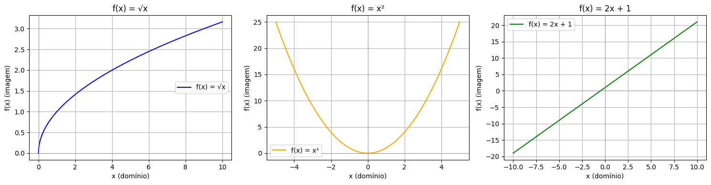
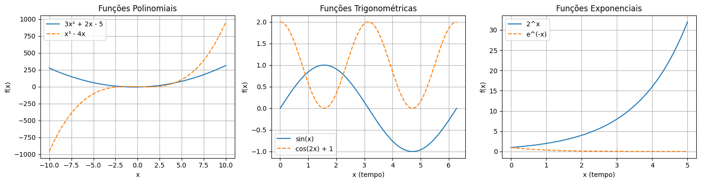

# Aula 10 – Funções Matemáticas em Data Science

## Objetivos da Aula

* Compreender a representação de funções matemáticas.
* Identificar domínio, contradomínio e imagem de uma função.
* Reconhecer e diferenciar tipos de funções: polinomiais, trigonométricas e exponenciais.
* Aplicar esses conceitos na prática com Python e bibliotecas de visualização.

## Representação de Funções

Uma **função** é uma relação que associa **cada elemento** de um conjunto $A$, chamado de **domínio**, a **um único elemento** de um conjunto $B$, chamado de **contradomínio**.

Formalmente, dizemos que uma função $f$ é definida como:

$$
f: A \rightarrow B
$$

Isso significa que $f$ associa cada elemento $x \in A$ a um único valor $f(x) \in B$.

### Notação

A notação padrão para representar uma função é:

$$
f(x) = \text{expressão matemática}
$$

Essa expressão indica a **regra de formação** da função: como o valor de saída (a imagem) é calculado a partir de um valor de entrada (o argumento).

### Exemplo 1: Função Afim (ou do 1º grau)

Considere a função:

$$
f(x) = 2x + 1
$$

Essa é uma função afim, em que:

* O coeficiente 2 representa a inclinação da reta.
* O termo independente 1 representa o valor de $f(x)$ quando $x = 0$ (ou seja, o ponto em que a reta intercepta o eixo $y$).

O gráfico dessa função é uma reta crescente, já que o coeficiente de $x$ é positivo.

| x  | f(x) = 2x + 1 |
| -- | ------------- |
| -2 | -3            |
| -1 | -1            |
| 0  | 1             |
| 1  | 3             |
| 2  | 5             |

### Exemplo 2: Função Quadrática

Outra forma comum de função é a função quadrática, ou de 2º grau:

$$
f(x) = ax^2 + bx + c
$$

Exemplo:

$$
f(x) = x^2 - 4x + 3
$$

Essa função representa uma parábola. O comportamento (concavidade para cima ou para baixo) depende do sinal de $a$.


## Domínio, Contradomínio e Imagem

Uma função matemática é completamente descrita não apenas pela sua expressão algébrica, mas também pelos **conjuntos envolvidos** na associação:

* **Domínio**: conjunto de todos os valores possíveis para a variável de entrada $x$.
* **Contradomínio**: conjunto ao qual pertencem todos os valores possíveis de saída $f(x)$, definidos a priori.
* **Imagem**: conjunto dos valores de saída realmente produzidos por $f(x)$ a partir dos valores do domínio.

Formalmente:

$$
f: A \rightarrow B
$$

* $A$ é o **domínio**
* $B$ é o **contradomínio**
* $\text{Im}(f) \subseteq B$




### Exemplo 1: Função Raiz Quadrada

Considere a função:

$$
f(x) = \sqrt{x}
$$

Neste caso:

* O domínio é $[0, \infty)$, pois a raiz quadrada de números negativos não está definida nos reais.
* O contradomínio pode ser definido como $\mathbb{R}$, mas o **valor real da imagem** é apenas $[0, \infty)$, ou seja, os reais não-negativos.

#### Visualizando com Python

```python
import numpy as np
import matplotlib.pyplot as plt

# Domínio: x >= 0
x = np.linspace(0, 10, 400)
y = np.sqrt(x)

plt.plot(x, y, label='f(x) = √x')
plt.title('Função f(x) = √x')
plt.xlabel('x (domínio)')
plt.ylabel('f(x) (imagem)')
plt.grid(True)
plt.axhline(0, color='gray', linewidth=0.5)
plt.axvline(0, color='gray', linewidth=0.5)
plt.legend()
plt.show()
```

### Exemplo 2: Função Quadrática

Considere:

$$
f(x) = x^2
$$

* O domínio é $\mathbb{R}$ (todos os números reais).
* O contradomínio pode ser $\mathbb{R}$, mas a imagem da função é apenas $[0, \infty)$, já que quadrados nunca são negativos.

#### Visualizando com Python

```python
x = np.linspace(-5, 5, 400)
y = x**2

plt.plot(x, y, label='f(x) = x²', color='orange')
plt.title('Função f(x) = x²')
plt.xlabel('x (domínio)')
plt.ylabel('f(x) (imagem)')
plt.grid(True)
plt.axhline(0, color='gray', linewidth=0.5)
plt.axvline(0, color='gray', linewidth=0.5)
plt.legend()
plt.show()
```

### Exemplo 3: Função Linear

Considere:

$$
f(x) = 2x + 1
$$

* Domínio: $\mathbb{R}$
* Contradomínio: $\mathbb{R}$
* Imagem: $\mathbb{R}$, pois todos os valores reais podem ser obtidos a partir de algum valor de $x$

```python
x = np.linspace(-10, 10, 400)
y = 2*x + 1

plt.plot(x, y, label='f(x) = 2x + 1', color='green')
plt.title('Função f(x) = 2x + 1')
plt.xlabel('x (domínio)')
plt.ylabel('f(x) (imagem)')
plt.grid(True)
plt.axhline(0, color='gray', linewidth=0.5)
plt.axvline(0, color='gray', linewidth=0.5)
plt.legend()
plt.show()
```

## Tipos de Funções

Em Ciência de Dados e TI, as funções matemáticas são amplamente utilizadas para **modelagem**, **análise de padrões** e **resolução de problemas computacionais**. A seguir, vamos explorar os principais tipos de funções com exemplos reais e implementações em Python.



### **1. Funções Polinomiais**

São expressões compostas por somas de potências de $x$ multiplicadas por coeficientes.

$$
f(x) = a_nx^n + a_{n-1}x^{n-1} + \dots + a_1x + a_0
$$

#### Exemplos no contexto de TI:

* **Análise de complexidade algorítmica**: Algoritmos de ordenação quadráticos têm tempo de execução proporcional a $f(n) = an^2 + bn + c$.
* **Interpolação polinomial**: Usada para estimar valores desconhecidos em gráficos.

#### Exemplo em Python

```python
import numpy as np
import matplotlib.pyplot as plt

x = np.linspace(-10, 10, 400)
f1 = 3*x**2 + 2*x - 5    # Polinômio de 2º grau
f2 = x**3 - 4*x          # Polinômio de 3º grau

plt.figure(figsize=(10, 4))
plt.plot(x, f1, label='f(x) = 3x² + 2x - 5')
plt.plot(x, f2, label='f(x) = x³ - 4x', linestyle='--')
plt.title('Funções Polinomiais')
plt.xlabel('x')
plt.ylabel('f(x)')
plt.grid(True)
plt.legend()
plt.show()
```


### **2. Funções Trigonométricas**

São funções periódicas que descrevem ciclos e oscilações, essenciais em:

* **Análise de sinais** (ex: áudio, rede, sensores)
* **Detecção de padrões sazonais em séries temporais**
* **Gráficos em jogos** (movimentos cíclicos, ondas)

#### Exemplos:

$$
f(x) = \sin(x), \quad f(x) = \cos(2x) + 1
$$

#### Exemplo em Python

```python
x = np.linspace(0, 2*np.pi, 400)
f1 = np.sin(x)
f2 = np.cos(2*x) + 1

plt.figure(figsize=(10, 4))
plt.plot(x, f1, label='f(x) = sin(x)')
plt.plot(x, f2, label='f(x) = cos(2x) + 1', linestyle='--')
plt.title('Funções Trigonométricas (sinais periódicos)')
plt.xlabel('x (tempo)')
plt.ylabel('f(x) (sinal)')
plt.grid(True)
plt.legend()
plt.show()
```

### **3. Funções Exponenciais**

Modelam crescimento ou decaimento acelerado. Muito comuns em:

* **Modelos de crescimento de dados ou tráfego de rede**
* **Propagação viral de informações**
* **Decaimento exponencial em algoritmos de aprendizado**

#### Forma geral:

$$
f(x) = a^x \quad \text{ou} \quad f(x) = e^{-x}
$$

#### Exemplos em Python

```python
x = np.linspace(0, 5, 400)
f1 = 2**x         # Crescimento exponencial
f2 = np.exp(-x)   # Decaimento exponencial

plt.figure(figsize=(10, 4))
plt.plot(x, f1, label='f(x) = 2^x')
plt.plot(x, f2, label='f(x) = e^(-x)', linestyle='--')
plt.title('Funções Exponenciais')
plt.xlabel('x (tempo)')
plt.ylabel('f(x)')
plt.grid(True)
plt.legend()
plt.show()
```


### Comparativo Rápido

| Tipo de Função | Aplicações em TI                                         |
| -------------- | -------------------------------------------------------- |
| Polinomial     | Complexidade algorítmica, interpolação, machine learning |
| Trigonométrica | Sinais, séries temporais, jogos                          |
| Exponencial    | Crescimento de dados, decaimento, propagação viral       |


## Projeto Prático: Criar e plotar gráficos de diferentes funções aplicadas à Ciência de Dados

### **Bibliotecas necessárias**

```python
import numpy as np
import matplotlib.pyplot as plt
```


### 1: Função Polinomial e Tendência de Crescimento

> **Contexto**: Você está analisando a tendência de crescimento de acessos diários a uma plataforma. A curva observada se assemelha a um polinômio de 2º grau.

```python
x = np.linspace(0, 30, 100)  # Dias
y = 0.5 * x**2 + 2 * x + 5   # Acessos simulados com crescimento acelerado

plt.plot(x, y, label='f(x) = 0.5x² + 2x + 5')
plt.title('Tendência de Crescimento de Acessos (Função Polinomial)')
plt.xlabel('Dias')
plt.ylabel('Acessos')
plt.grid(True)
plt.legend()
plt.show()
```


### 2: Função Trigonométrica e Sazonalidade

> **Contexto**: Ao analisar o tráfego em um site, você nota variações sazonais (picos e vales) ao longo do tempo. Isso pode ser modelado com funções trigonométricas.

```python
x = np.linspace(0, 12, 400)  # Meses (1 ano)
y = 1000 + 300 * np.sin(2 * np.pi * x / 12)  # Média + sazonalidade

plt.plot(x, y, label='f(x) = 1000 + 300·sen(2πx/12)')
plt.title('Padrão Sazonal de Tráfego (Função Trigonométrica)')
plt.xlabel('Mês')
plt.ylabel('Visitas Mensais')
plt.grid(True)
plt.legend()
plt.show()
```


### 3: Função Exponencial e Crescimento de Usuários

> **Contexto**: Um produto recém-lançado apresenta crescimento exponencial de usuários nas primeiras semanas.

```python
x = np.linspace(0, 10, 200)  # Semanas
y = 100 * np.exp(0.4 * x)    # Crescimento exponencial de usuários

plt.plot(x, y, label='f(x) = 100·e^(0.4x)')
plt.title('Crescimento de Usuários (Função Exponencial)')
plt.xlabel('Semanas')
plt.ylabel('Usuários')
plt.grid(True)
plt.legend()
plt.show()
```

## Exercícios

### 1. Funções Polinomiais (1º e 2º Grau)

1. Preço do Ingresso:
   Uma casa de shows cobra R\$ 30,00 por ingresso. Para cada real que o preço aumenta, 10 pessoas deixam de ir. Sabendo que 500 pessoas iriam ao show com o preço inicial, determine a função que expressa a arrecadação em função do aumento $x$ no preço. Qual o preço que maximiza a arrecadação?

2. Custo de Produção:
   O custo $C(x)$ para produzir $x$ unidades de um produto é dado por $C(x) = 2x + 150$. Determine o custo para 100 unidades e o ponto de equilíbrio se o preço de venda for R\$ 5 por unidade.

3. Lucro de um Aplicativo:
   Um desenvolvedor de apps estima que o lucro $L(x)$ em mil reais é dado por $L(x) = -2x^2 + 40x - 100$, onde $x$ é o número de milhares de downloads pagos. Qual o número ótimo de downloads para lucro máximo?

4. Queda de Objeto:
   A altura $h(t)$ de um objeto lançado do alto de um prédio é dada por $h(t) = -5t^2 + 20t + 50$. Em quanto tempo ele atinge o solo?

5. Variação de Temperatura:
   A temperatura de um líquido ao longo do tempo é dada por $T(t) = -t^2 + 8t + 10$. Quando a temperatura é máxima? Qual o valor dessa temperatura?

6. Tarifa de Táxi:
   Uma corrida de táxi custa R\$ 4,00 de bandeirada mais R\$ 2,50 por km rodado. Modele a função e calcule o custo para 15 km.

7. Área de um Terreno:
   Um fazendeiro quer construir um cercado retangular com 100m de cerca. A área $A(x)$ do terreno é dada por $A(x) = x(50 - x)$, onde $x$ é o comprimento. Qual a largura para máxima área?

8. Movimento Uniforme:
   Um carro percorre uma estrada com velocidade constante. Sua posição em função do tempo é $s(t) = 80t$, onde $t$ é o tempo em horas. Qual a distância após 2h30min?

9. Lucro de uma Loja:
   Uma loja vende camisetas por R\$ 40,00 e o custo de produção é $C(x) = 20x + 100$. Determine a função lucro e calcule o lucro para 30 camisetas vendidas.

10. Altura de um Projétil:
    A trajetória de uma bola lançada para cima é dada por $h(t) = -4.9t^2 + 14t$. Em que tempo a bola atinge a altura máxima e qual essa altura?

### 2. Funções Trigonométricas

11. Altura da Maré:
    A altura da maré em metros é dada por $h(t) = 2\sin\left(\frac{\pi t}{6}\right) + 3$, onde $t$ é o tempo em horas. Qual a altura da maré às 3h, 6h e 9h?

12. Rotação de um Painel Solar:
    O ângulo $\theta(t)$ de inclinação de um painel solar varia com o tempo segundo $\theta(t) = 30\cos\left(\frac{\pi t}{12}\right)$, onde $t$ é em horas. Qual a inclinação ao meio-dia e às 18h?

13. Pêndulo:
    A posição $s(t)$ de um pêndulo é dada por $s(t) = 5\cos(2t)$. Qual é o valor máximo e mínimo da oscilação?

14. Oscilação de Tensão:
    A tensão alternada em um circuito é $V(t) = 110\sin(100\pi t)$. Qual a frequência da tensão? E a amplitude?

15. Fase de um Mecanismo Cíclico:
    Um pistão de motor se move de acordo com $x(t) = 4\sin(2\pi t)$, onde $x$ é o deslocamento. Qual o período do movimento?

### 3. Funções Exponenciais

16. Crescimento Populacional:
    A população de uma bactéria dobra a cada 3 horas. Se inicialmente há 200 bactérias, quantas existirão após 12 horas?

17. Decaimento Radioativo:
    A massa $M(t)$ de uma substância radioativa é dada por $M(t) = 100e^{-0.2t}$. Qual a massa após 5 horas?

18. Juros Compostos:
    Um valor de R\$ 1.000,00 é aplicado a 5% ao mês em juros compostos. Qual o montante após 12 meses?

19. Resfriamento de um Corpo:
    A temperatura $T(t)$ de um corpo resfriando é dada por $T(t) = 25 + (75)e^{-0.1t}$. Qual será a temperatura após 10 minutos?

20. Carga de uma Bateria:
    A carga $Q(t)$ de uma bateria segue $Q(t) = 100(1 - e^{-0.05t})$, onde $t$ está em minutos. Após quanto tempo a carga será 95% da carga máxima?


## Materiais de Apoio

* Livro: *Matemática para Cientistas de Dados – João Carlos Ferreira*
* Desmos (visualizador online): [https://www.desmos.com/calculator](https://www.desmos.com/calculator)
