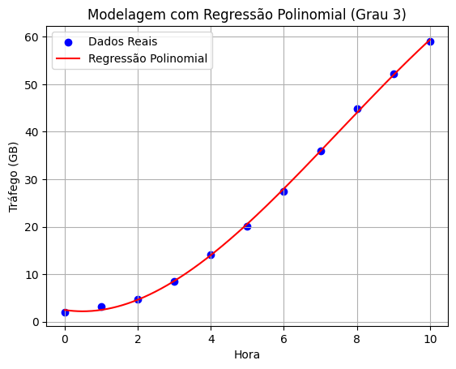
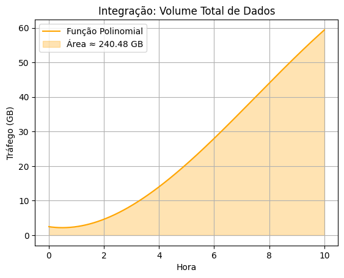
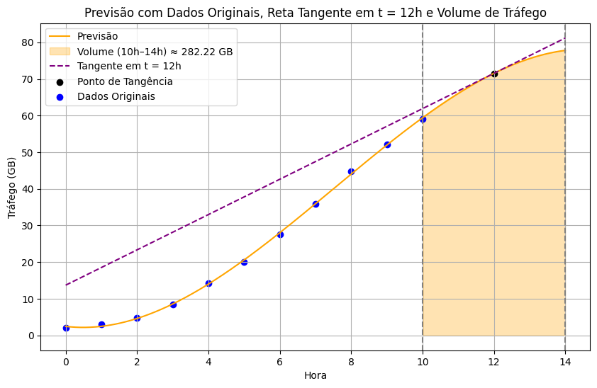

# Regressão Polinomial, Derivada e Integração

## Cenário: Análise de tráfego de dados em um servidor

Uma equipe de infraestrutura de TI está analisando o comportamento do tráfego de rede (em **GB**) em um servidor durante as primeiras 10 horas do dia, para prever picos, otimizar o balanceamento de carga e estimar o total de dados transferidos.

Eles coletaram os seguintes dados:

| Hora (t) | Tráfego (GB) |
| -------- | ------------ |
| 0        | 2            |
| 1        | 3.1          |
| 2        | 4.8          |
| 3        | 8.5          |
| 4        | 14.2         |
| 5        | 20.1         |
| 6        | 27.5         |
| 7        | 35.9         |
| 8        | 44.8         |
| 9        | 52.2         |
| 10       | 59.0         |


```python
import numpy as np
import matplotlib.pyplot as plt
from numpy.polynomial import Polynomial
from scipy.integrate import quad

# Dados coletados
t = np.array([0, 1, 2, 3, 4, 5, 6, 7, 8, 9, 10])
trafego = np.array([2, 3.1, 4.8, 8.5, 14.2, 20.1, 27.5, 35.9, 44.8, 52.2, 59.0])

```


### 1. Modelagem por Regressão Polinomial

* A curva vermelha ajusta os dados com um polinômio de grau 3.
* Equação ajustada:

$$
f(t) = -0.055t^3 + 1.232t^2 - 1.168t + 2.467
$$



```python

# Regressão polinomial de grau 3
coef = np.polyfit(t, trafego, 3)
p = np.poly1d(coef)

# Pontos para gráfico suave
t_fine = np.linspace(0, 10, 500)
trafego_fit = p(t_fine)

# Gráfico da regressão polinomial
plt.scatter(t, trafego, color='blue', label='Dados Reais')
plt.plot(t_fine, trafego_fit, color='red', label='Regressão Polinomial')
plt.title("Modelagem com Regressão Polinomial (Grau 3)")
plt.xlabel("Hora")
plt.ylabel("Tráfego (GB)")
plt.legend()
plt.grid(True)


print("Função Polinomial do Tráfego:")
print(f"{p[3]:.3f}t³ + {p[2]:.3f}t² + {p[1]:.3f}t + {p[0]:.3f}")

```

### 2. Derivada: Taxa de Variação do Tráfego

* A derivada da função é:

$$
f'(t) = -0.164t^2 + 2.464t - 1.168
$$

```python

# Derivada da função
dp = np.polyder(p)

# Imprimir a função derivada
print("Função derivada (Taxa de Variação do Tráfego):")
print(f"{dp[2]:.3f}t² + {dp[1]:.3f}t + {dp[0]:.3f}")

```


### 3. Integração: Volume Total de Dados Transferidos

* A área laranja sob a curva representa o **volume acumulado de dados** entre 0h e 10h.
* Resultado:

$$
\int_0^{10} f(t)\,dt \approx \boxed{240.48\ \text{GB}}
$$




```python

# Integração da função
integral_total, _ = quad(p, 0, 10)

# Área sob a curva (integração)
plt.plot(t_fine, trafego_fit, color='orange', label='Função Polinomial')
plt.fill_between(t_fine, trafego_fit, color='orange', alpha=0.3, label=f'Área ≈ {integral_total:.2f} GB')
plt.title("Integração: Volume Total de Dados")
plt.xlabel("Hora")
plt.ylabel("Tráfego (GB)")
plt.legend()
plt.grid(True)
plt.show()


print(f"Volume acumulado de dados:≈ {integral_total:.2f} GB")

ip = np.polyint(p)
print("Função Integral do Tráfego (Indefinida):")
print(f"{ip[4]:.3f}t⁴ + {ip[3]:.3f}t³ + {ip[2]:.3f}t² + {ip[1]:.3f}t + c")


```


### 4. Previsão de Tráfego para as Próximas 4 Horas:

| Hora | Tráfego Estimado (GB) |
| ---- | --------------------- |
| 11h  | 66,04 GB              |
| 12h  | 71,53 GB              |
| 13h  | 75,56 GB              |
| 14h  | 77,80 GB              |




```python

# Previsão até 14h
t_extended = np.linspace(0, 14, 500)
trafego_pred = p(t_extended)

# Reta tangente em t = 12
t1 = 12
y1 = p(t1)
slope_12 = dp(t1)
tangent_line_12 = slope_12 * (t_extended - t1) + y1

# Integração entre 10h e 14h
integral_future, _ = quad(p, 10, 14)

# Plot
plt.figure(figsize=(10, 6))
plt.plot(t_extended, trafego_pred, color='orange', label='Previsão')
plt.fill_between(t_extended, trafego_pred, where=(t_extended >= 10) & (t_extended <= 14), 
                 color='orange', alpha=0.3, label=f'Volume (10h–14h) ≈ {integral_future:.2f} GB')
plt.plot(t_extended, tangent_line_12, '--', color='purple', label='Tangente em t = 12h')
plt.scatter([t1], [y1], color='black', label='Ponto de Tangência')
plt.scatter(t, trafego, color='blue', label='Dados Originais')
plt.axvline(10, color='gray', linestyle='--')
plt.axvline(14, color='gray', linestyle='--')
plt.title("Previsão com Dados Originais, Reta Tangente em t = 12h e Volume de Tráfego")
plt.xlabel("Hora")
plt.ylabel("Tráfego (GB)")
plt.legend()
plt.grid(True)
plt.show()


```


## Exercícios

### Exercício 1 – Análise de Consumo de CPU em Servidores de Nuvem

**Contexto:**
Você está monitorando o uso de CPU de uma aplicação hospedada em um servidor em nuvem ao longo do tempo. Foram coletadas amostras de utilização (%) a cada hora durante o dia de pico.

**Dataset (amostral):**

```python
horas = np.array([0, 1, 2, 3, 4, 5, 6, 7, 8, 9, 10])
cpu = np.array([5, 7, 10, 18, 30, 45, 60, 75, 82, 85, 87])
```

**Tarefas:**

1. Ajuste uma regressão polinomial (grau 3) para modelar o comportamento da CPU.
2. Gere previsões para as próximas 3 horas (até 13h).
3. Calcule a **derivada** da função para saber a taxa de variação no uso da CPU em **t = 6h** e **t = 11h**.
4. Calcule o **uso acumulado da CPU (integral)** entre 8h e 12h.
5. Exiba os gráficos da regressão, das derivadas, e destaque a área sob a curva para a integral.

### Exercício 2 – Tráfego de Dados em uma API de Microserviços

**Contexto:**
Um sistema baseado em microserviços coleta dados de requisições por minuto em um endpoint crítico. Esses dados representam o tráfego de entrada e são importantes para escalar o serviço.

**Dataset (amostral):**

```python
minutos = np.array([0, 2, 4, 6, 8, 10, 12, 14, 16, 18, 20])
requisicoes = np.array([10, 25, 40, 70, 110, 160, 210, 260, 300, 330, 350])
```

**Tarefas:**

1. Crie um modelo de regressão polinomial que represente o tráfego de requisições.
2. Faça a previsão do número de requisições até o minuto 25.
3. Calcule a derivada para entender o crescimento das requisições em t = 10 e t = 20.
4. Determine, por meio da integração, o total de requisições esperadas entre os minutos 10 e 20.
5. Gere um gráfico com a curva de tráfego, a previsão futura, as tangentes e a área integrada.


### Exercício 3 – Análise de Vendas de um E-commerce

**Contexto:**
Um e-commerce de produtos eletrônicos deseja analisar o comportamento das vendas ao longo de uma campanha promocional de 12 dias.

**Dataset (amostral):**

```python
dias = np.array([0, 1, 2, 3, 4, 5, 6, 7, 8, 9, 10, 11, 12])
vendas = np.array([5, 12, 28, 50, 85, 130, 180, 220, 245, 260, 268, 272, 275])
```

**Tarefas:**

1. Modele a evolução das vendas com uma **regressão polinomial de grau adequado**.
2. Realize a **previsão para os dias 13 a 15**, caso a campanha seja estendida.
3. Calcule a **derivada da função de vendas em t = 5 e t = 10** para analisar o ritmo de crescimento das vendas.
4. Estime o **volume total de vendas acumuladas** entre os dias 6 e 12 (integração).
5. Visualize os dados com gráficos: modelo, previsão, derivadas e área integrada.


### Exercício 4 – Gestão de Estoque em Loja Física

**Contexto:**
Um gerente está analisando o estoque de um item que tem alta rotatividade. Ele registrou o número de unidades restantes a cada 2 dias ao longo de um período de reposição para entender o consumo.

**Dataset (amostral):**

```python
dias = np.array([0, 2, 4, 6, 8, 10, 12])
estoque = np.array([300, 270, 230, 180, 120, 60, 20])
```

**Tarefas:**

1. Aplique uma **regressão polinomial** para modelar o consumo de estoque.
2. Estime quando o estoque chegará a zero (use a função estimada).
3. Calcule a **taxa de consumo** em t = 4 e t = 10 (derivada).
4. Determine o **número total de unidades consumidas** entre o dia 0 e o dia 12 (integração).
5. Faça a visualização gráfica com os pontos reais, curva estimada, derivadas e área de consumo.

