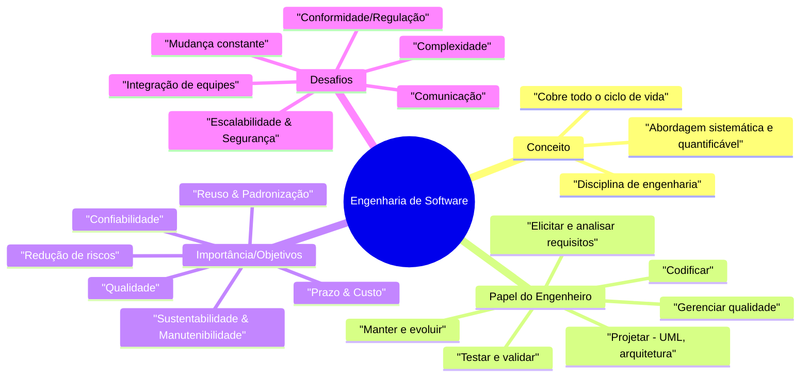
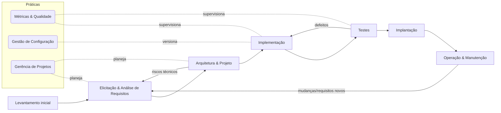
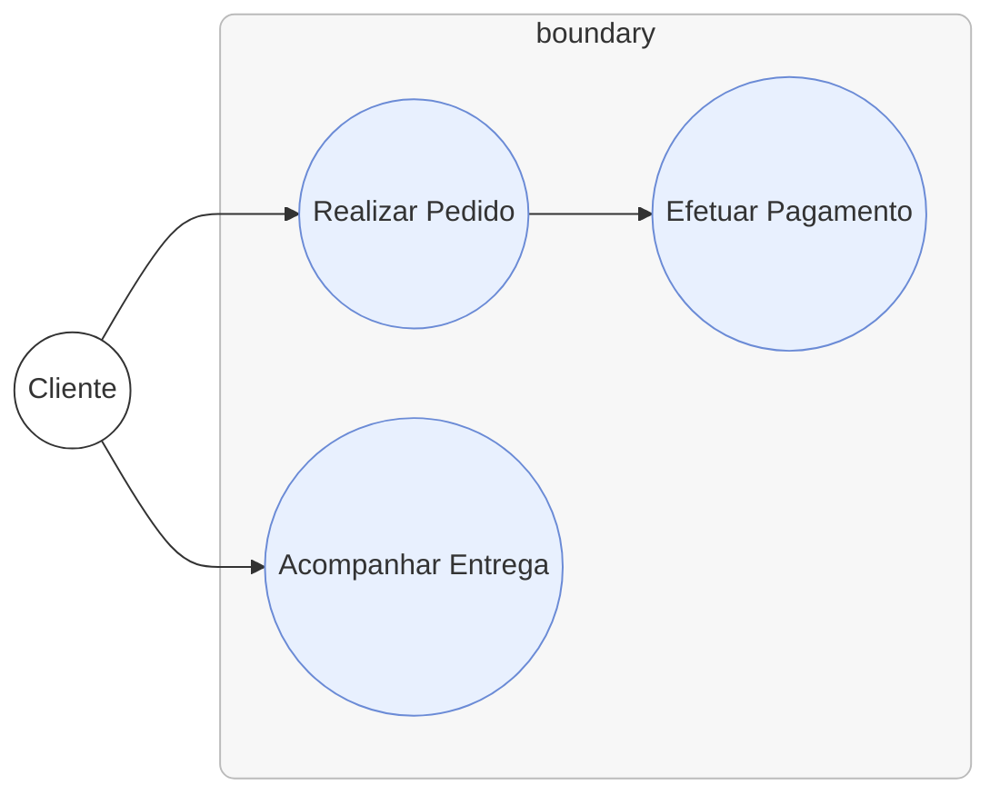
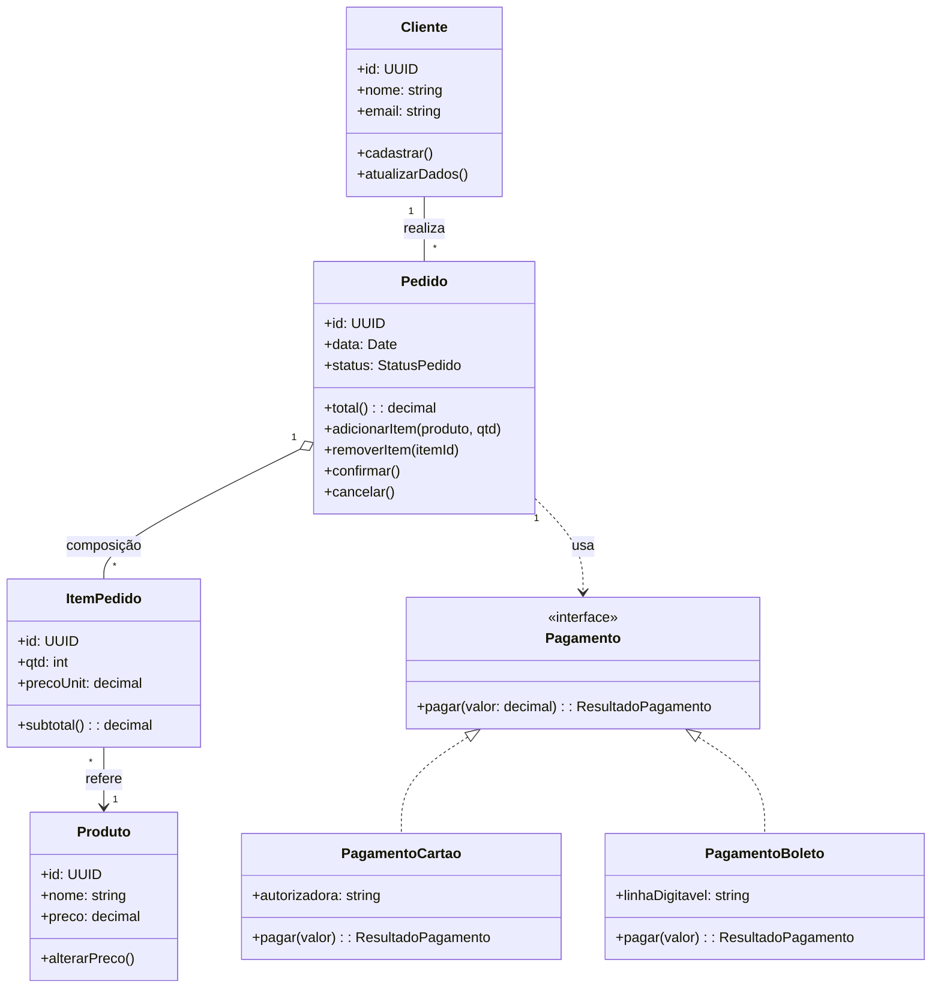
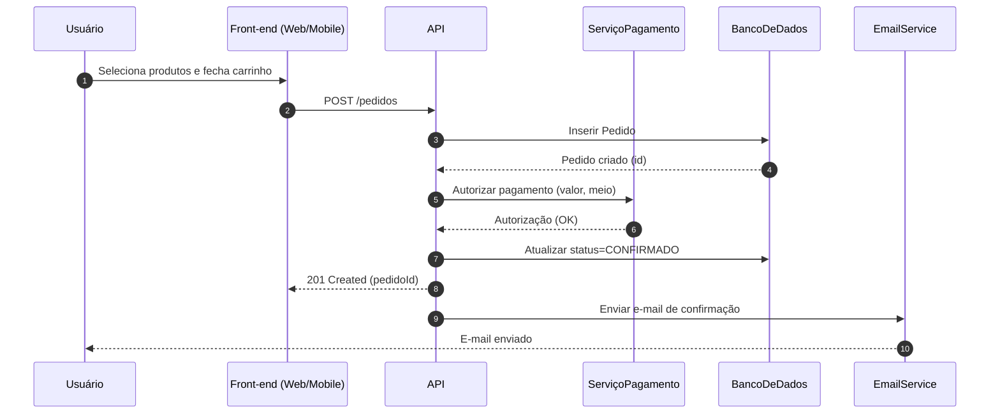
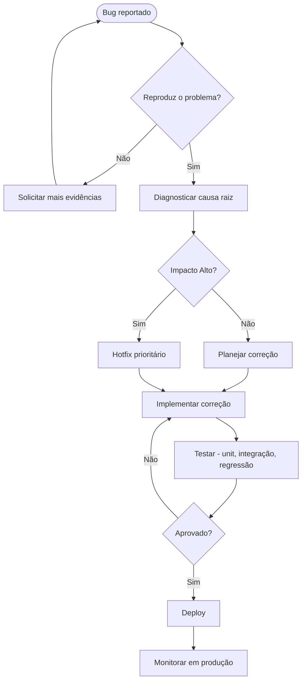
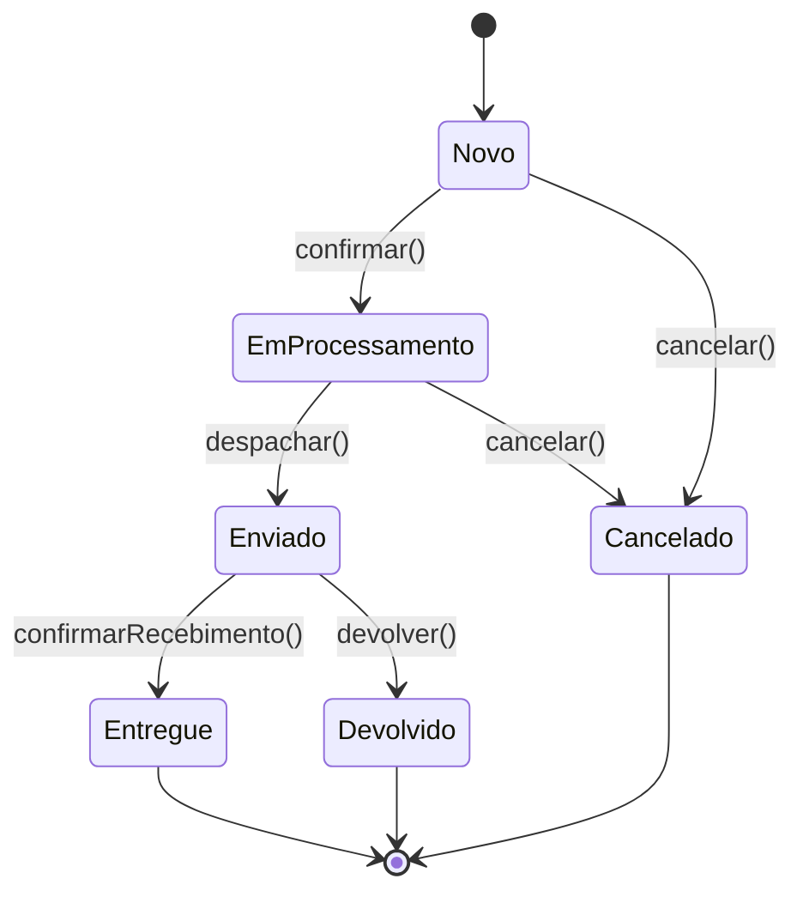

# Fundamentos de Engenharia de Software – Visuais de estudo

## 1) Mapa mental – Fundamentos da Engenharia de Software

## 2) Fluxograma – Processo genérico de desenvolvimento

## 3) UML – **Diagrama de Casos de Uso** (sistema de vendas)

> Representa objetivos do usuário e fronteiras do sistema (útil para comunicar requisitos de alto nível). Caso seu renderizador não suporte `usecaseDiagram`, utilize o **fluxo alternativo** abaixo com `flowchart`.

**Opção A – Simulação via flowchart**

## 4) UML – **Diagrama de Classes** (núcleo de domínio de vendas)

**Notas de projeto (Bezerra):**

* **Composição** entre `Pedido` e `ItemPedido` (itens não existem sem o pedido).
* **Interface** `Pagamento` permite **polimorfismo** (método `pagar`).
* **Associações** e multiplicidades documentam regras do domínio.

## 5) UML – **Diagrama de Sequência** (checkout simplificado)

## 6) UML – **Diagrama de Atividades** (tratativa de bug)

## 7) UML – **Diagrama de Estados** (ciclo de vida de Pedido)

## 8) Roteiro de estudo sugerido (com os visuais)

1. **Mapa mental** (Panorama geral, glossário).
2. **Fluxograma de processo** (entender o ciclo de vida e feedbacks).
3. **Casos de uso** (objetivos do usuário/sistema).
4. **Classes** (estrutura e regras do domínio).
5. **Sequência** (interações e responsabilidades em tempo).
6. **Atividades** (fluxos de trabalho e decisões).
7. **Estados** (ciclo de vida de entidades chave).

> Dica: durante estudos, peça aos alunos para **adaptarem os diagramas** ao projeto da disciplina (ex.: trocar "vendas" por seu domínio) e justificarem **decisões de modelagem** com base em **Pressman & Maxim** (processo/qualidade), **Sommerville** (contexto humano/organizacional) e **Bezerra** (clareza e padronização com UML).
