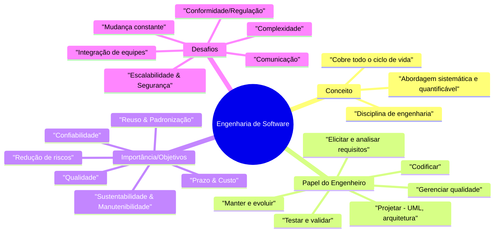
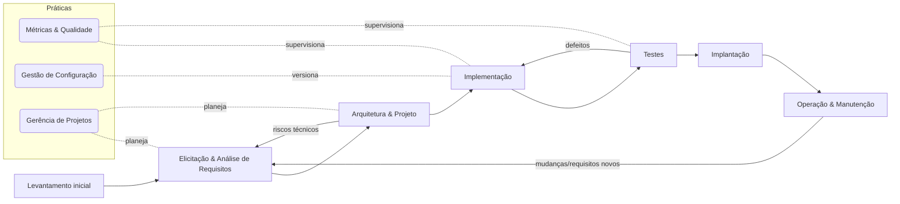

# 1. Fundamentos da Engenharia de Software

## 1.1 Conceito de Engenharia de Software

A Engenharia de Software pode ser entendida como a aplicação sistemática de métodos, técnicas e ferramentas para o desenvolvimento e manutenção de software de alta qualidade.

* **Sommerville (2019):** destaca o conjunto de princípios, métodos e ferramentas voltados para o desenvolvimento econômico de software confiável.
* **Pressman & Maxim (2016):** enfatizam a disciplina de engenharia voltada para garantir que o software seja entregue dentro do prazo, do orçamento e atenda às necessidades do cliente.
* **Bezerra (2015):** reforça a importância da modelagem com UML como recurso de padronização para análise e projeto.

**Resumo:** Engenharia de Software não trata apenas de programar, mas de **construir soluções completas**, com qualidade, organização e viabilidade econômica.

**Visual de apoio:**

## 1.2 Papel do Engenheiro de Software

O engenheiro de software atua em todas as fases do ciclo de vida de um sistema, desde a **análise de requisitos** até a **manutenção após a entrega**.
Suas responsabilidades incluem:

* Identificação e análise de requisitos
* Modelagem (ex.: casos de uso, diagramas de atividades)
* Projeto de arquitetura e interfaces
* Codificação, testes e integração
* Garantia da qualidade
* Evolução e manutenção de sistemas em operação

**Comparação dos autores:**

* **Pressman & Maxim:** papel estratégico em métodos, métricas e qualidade.
* **Sommerville:** papel humano e organizacional, incluindo trabalho em equipe e impacto social.
* **Bezerra:** papel prático na modelagem e documentação padronizada.

**Visual de apoio:**

## 1.3 Importância e Objetivos da Disciplina

A disciplina de Engenharia de Software é essencial porque o software:

* Está presente em praticamente todos os setores (bancos, saúde, governo, indústria, entretenimento).
* Requer **qualidade, confiabilidade e segurança**, pois falhas podem gerar altos custos ou riscos à vida.
* Exige métodos organizados para lidar com projetos cada vez mais complexos.

**Principais objetivos:**

* Garantir **qualidade** (confiabilidade, eficiência, segurança)
* Reduzir **custos e riscos** de falhas
* Padronizar processos de desenvolvimento
* Aumentar o **reuso e a manutenção** de soluções
* Apoiar a evolução contínua de sistemas

**Exemplo prático:** Um sistema hospitalar precisa ser planejado para integrações futuras com novas tecnologias, evitando retrabalho.

## 1.4 Principais Desafios no Desenvolvimento de Software

O desenvolvimento de software enfrenta uma série de obstáculos:

* **Complexidade crescente:** projetos envolvem milhões de linhas de código e múltiplos módulos.
* **Mudança constante de requisitos:** clientes e usuários mudam suas necessidades ao longo do projeto.
* **Garantia de qualidade:** é necessário assegurar que o software funcione em diversos cenários.
* **Custo e prazo:** conciliar qualidade com restrições financeiras e de tempo.
* **Comunicação entre equipes:** problemas de entendimento entre analistas, programadores e clientes.

**Visão dos autores:**

* **Pressman & Maxim:** foco em processos e métricas para mitigar riscos.
* **Sommerville:** ênfase no aspecto humano e social da colaboração.
* **Bezerra:** uso da UML como forma de reduzir ambiguidades de comunicação.

## 1.5 Evolução Histórica da Disciplina

* **Década de 1960:** "Crise do Software", marcada por atrasos, custos excessivos e sistemas que falhavam após a entrega.
* **Anos 1970-1980:** consolidação da Engenharia de Software como disciplina acadêmica e profissional.
* **Modelos clássicos:** surgimento dos métodos cascata, prototipação e espiral.
* **Década de 2000 em diante:** métodos ágeis, integração contínua, DevOps.
* **Cenário atual:** integração com Inteligência Artificial, computação em nuvem, automação de testes e análise preditiva de falhas.

## 1.6 Resumo Comparativo dos Autores

| Autor                | Ênfase Principal                            | Contribuição Relevante                                 |
| -------------------- | ------------------------------------------- | ------------------------------------------------------ |
| **Sommerville**      | Confiabilidade, contexto humano e social    | Engenharia como disciplina interdisciplinar            |
| **Pressman & Maxim** | Métodos, métricas, planejamento e qualidade | Processos organizados e gestão de projetos de software |
| **Bezerra**          | UML e modelagem como recurso central        | Comunicação clara e documentação padronizada           |

