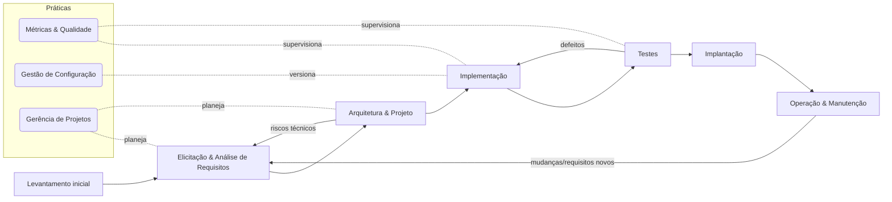
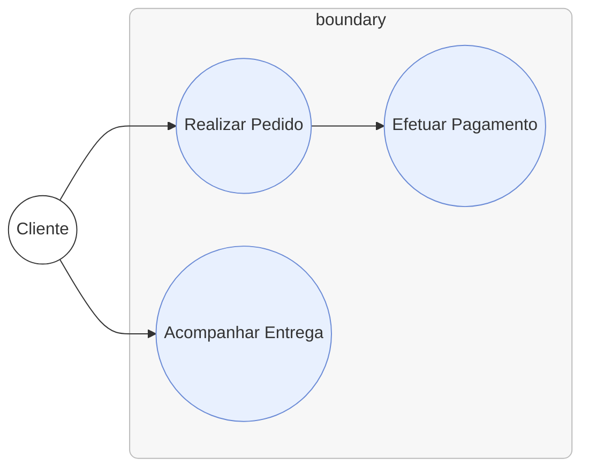
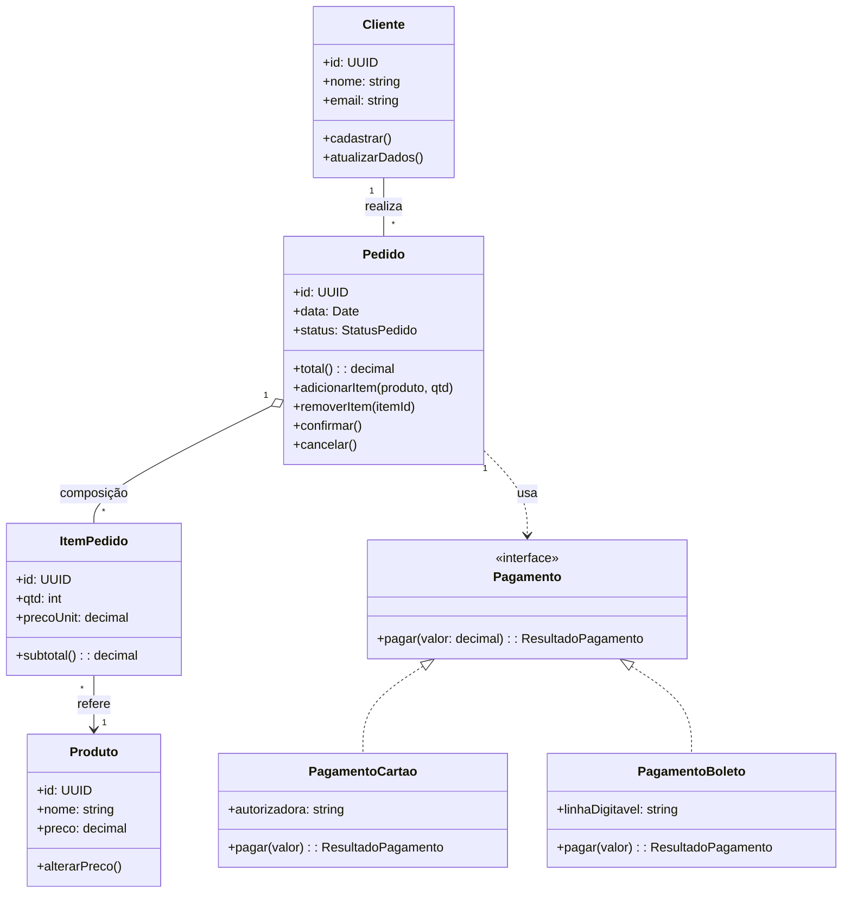
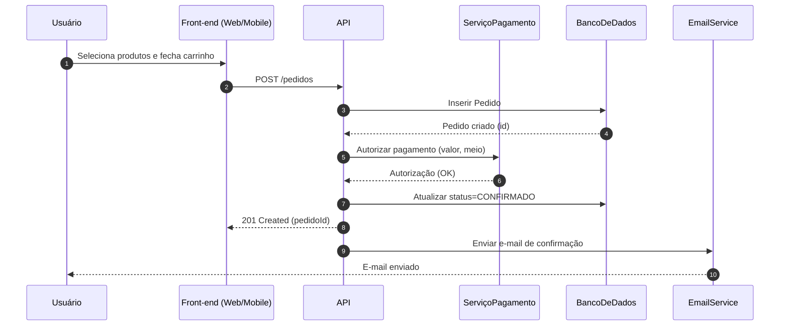
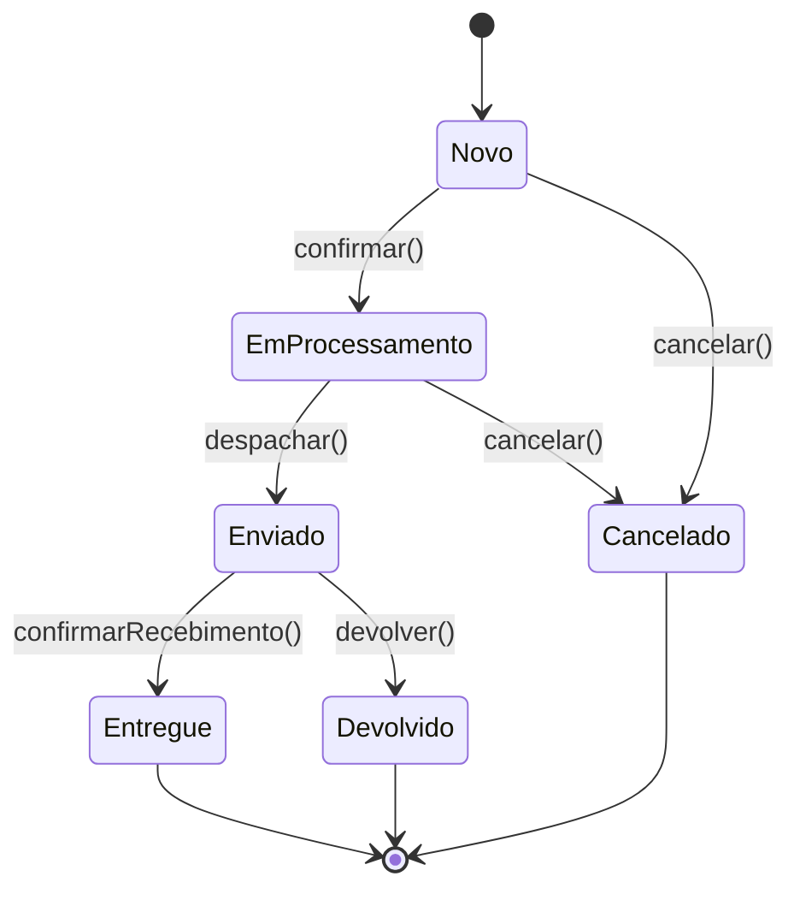

# **Fundamentos da Engenharia de Software**

## 1.1 Conceito de Engenharia de Software

### Definições Clássicas:

* **Sommerville (2019):** Engenharia de Software é uma disciplina de engenharia que envolve todos os aspectos da produção de software, desde a especificação, desenvolvimento e manutenção, até a gestão de projetos e qualidade.
* **Pressman & Maxim (2016):** É a aplicação de uma abordagem sistemática, disciplinada e quantificável para o desenvolvimento, operação e manutenção de software.
* **Bezerra (2015):** Relaciona a Engenharia de Software com a utilização de metodologias, ferramentas e notações (como a UML) para construir sistemas mais robustos e confiáveis.

**Resumo integrado:**
Engenharia de Software é a aplicação de princípios de engenharia e boas práticas ao processo de desenvolvimento de sistemas de software, com o objetivo de produzir soluções que sejam **úteis, confiáveis, eficientes, fáceis de manter e economicamente viáveis**.


## 1.2 Papel do Engenheiro de Software

O engenheiro de software vai além de programar: ele atua em **todas as fases do ciclo de vida do software**.

### Principais responsabilidades:

1. **Analisar requisitos** → entender o problema do cliente e traduzi-lo em especificações claras.
2. **Projetar soluções** → utilizar notações (ex.: UML, diagramas) para estruturar o sistema.
3. **Codificar** → transformar o projeto em código-fonte.
4. **Testar e validar** → garantir que o software atende às necessidades e está livre de erros críticos.
5. **Manter e evoluir** → adaptar o software às mudanças de contexto (usuários, negócios, tecnologia).
6. **Gerenciar qualidade** → aplicar métricas e boas práticas para entregar software confiável.

**Comparação dos autores:**

* **Sommerville:** foca na visão interdisciplinar (engenheiro de software precisa entender pessoas, processos e tecnologia).
* **Pressman & Maxim:** destacam a aplicação de métodos e ferramentas formais.
* **Bezerra:** enfatiza o uso da UML como linguagem de apoio ao papel do engenheiro.


## 1.3 Importância e Objetivos da Disciplina

### Por que Engenharia de Software é importante?

* O **software está em tudo**: sistemas bancários, saúde, indústria, transporte, redes sociais.
* A demanda por **qualidade e confiabilidade** é cada vez maior.
* O custo de falhas pode ser **altíssimo** (ex.: sistemas críticos como aviação ou hospitais).

### Objetivos centrais (segundo a bibliografia):

1. **Produzir software de qualidade**, dentro de prazos e orçamentos realistas.
2. **Reduzir riscos** no desenvolvimento, antecipando problemas.
3. **Padronizar processos** para facilitar manutenção e evolução.
4. **Promover reuso** de componentes e boas práticas.
5. **Garantir sustentabilidade** (software durável e adaptável).

**Exemplo prático (Sommerville):**
Um sistema de gestão hospitalar precisa ser desenvolvido não só para atender requisitos atuais, mas também preparado para futuras integrações com dispositivos de monitoramento remoto de pacientes.


## 1.4 Principais Desafios no Desenvolvimento de Software

Apesar de avanços metodológicos, **desenvolver software ainda é difícil**. Os três autores destacam obstáculos recorrentes:

### 1. **Complexidade**

* Softwares modernos possuem milhares/milhões de linhas de código.
* A interação entre múltiplos sistemas torna difícil prever todos os cenários.

### 2. **Mudança constante**

* Requisitos mudam ao longo do tempo (mercado, legislação, usuários).
* Engenharia de Software precisa prever mecanismos de adaptação.

### 3. **Qualidade e Confiabilidade**

* Erros de software podem causar prejuízos financeiros, danos à reputação ou até riscos à vida.

### 4. **Custo e Prazo**

* Projetos frequentemente estouram orçamento ou atrasam (Standish Group relatou taxa alta de falhas em projetos de TI).

### 5. **Integração de equipes e comunicação**

* Projetos de software envolvem **equipes multidisciplinares** (analistas, programadores, testadores, clientes, gestores).
* Comunicação falha é uma das maiores causas de insucesso.

**Visão dos autores:**

* **Pressman & Maxim:** reforçam a importância da **gestão de processos** e do uso de métricas.
* **Sommerville:** destaca a necessidade de **compreensão do contexto social e humano** do software.
* **Bezerra:** aponta a UML como ferramenta para reduzir ambiguidades e melhorar comunicação.

---

# **Resumo Esquemático para Estudo**

| Aspecto                | Pressman & Maxim (2016)                             | Sommerville (2019)                                      | Bezerra (2015)                                     |
| ---------------------- | --------------------------------------------------- | ------------------------------------------------------- | -------------------------------------------------- |
| **Definição**          | Abordagem sistemática, disciplinada e quantificável | Disciplina de engenharia que cobre todo o ciclo de vida | Uso de metodologias e UML para estruturar sistemas |
| **Foco do Engenheiro** | Métodos, processos e métricas                       | Pessoas, processos e tecnologia                         | Modelagem com UML                                  |
| **Objetivo**           | Software de qualidade, dentro de prazos             | Software útil, confiável e sustentável                  | Comunicação clara e padronizada                    |
| **Desafios**           | Processos, métricas, prazos                         | Contexto social, mudança constante                      | Ambiguidade na comunicação                         |


# Fundamentos de Engenharia de Software – Visuais de estudo

## 1) Mapa mental – Fundamentos da Engenharia de Software

```mermaid
mindmap
  root((Engenharia de Software))
    Conceito
      "Disciplina de engenharia"
      "Abordagem sistemática e quantificável"
      "Cobre todo o ciclo de vida"
    Papel do Engenheiro
      "Elicitar e analisar requisitos"
      "Projetar (UML, arquitetura)"
      "Codificar"
      "Testar e validar"
      "Manter e evoluir"
      "Gerenciar qualidade"
    Importância/Objetivos
      "Qualidade"
      "Confiabilidade"
      "Prazo & Custo"
      "Sustentabilidade & Manutenibilidade"
      "Reuso & Padronização"
      "Redução de riscos"
    Desafios
      "Complexidade"
      "Mudança constante"
      "Comunicação"
      "Integração de equipes"
      "Conformidade/Regulação"
      "Escalabilidade & Segurança"
```


## 2) Fluxograma – Processo genérico de desenvolvimento




## 3) UML – **Diagrama de Casos de Uso** (sistema de vendas)

> Representa objetivos do usuário e fronteiras do sistema (útil para comunicar requisitos de alto nível). Caso seu renderizador não suporte `usecaseDiagram`, utilize o **fluxo alternativo** abaixo com `flowchart`.

**Opção A – Simulação via flowchart**




## 4) UML – **Diagrama de Classes** (núcleo de domínio de vendas)



**Notas de projeto (Bezerra):**

* **Composição** entre `Pedido` e `ItemPedido` (itens não existem sem o pedido).
* **Interface** `Pagamento` permite **polimorfismo** (método `pagar`).
* **Associações** e multiplicidades documentam regras do domínio.


## 5) UML – **Diagrama de Sequência** (checkout simplificado)




## 6) UML – **Diagrama de Atividades** (tratativa de bug)

```mermaid
flowchart TD
  A([Bug reportado]) --> B{Reproduz o problema?}
  B -- Não --> C[Solicitar mais evidências]
  C --> A
  B -- Sim --> D[Diagnosticar causa raiz]
  D --> E{Impacto Alto?}
  E -- Não --> F[Planejar correção]
  E -- Sim --> G[Hotfix prioritário]
  F --> H[Implementar correção]
  G --> H
  H --> I[Testar (unit, integração, regressão)]
  I --> J{Aprovado?}
  J -- Não --> H
  J -- Sim --> K[Deploy]
  K --> L[Monitorar em produção]
```


## 7) UML – **Diagrama de Estados** (ciclo de vida de Pedido)




## 8) Roteiro de estudo sugerido (com os visuais)

1. **Mapa mental** (Panorama geral, glossário).
2. **Fluxograma de processo** (entender o ciclo de vida e feedbacks).
3. **Casos de uso** (objetivos do usuário/sistema).
4. **Classes** (estrutura e regras do domínio).
5. **Sequência** (interações e responsabilidades em tempo).
6. **Atividades** (fluxos de trabalho e decisões).
7. **Estados** (ciclo de vida de entidades chave).

> Dica: durante estudos, peça aos alunos para **adaptarem os diagramas** ao projeto da disciplina (ex.: trocar "vendas" por seu domínio) e justificarem **decisões de modelagem** com base em **Pressman & Maxim** (processo/qualidade), **Sommerville** (contexto humano/organizacional) e **Bezerra** (clareza e padronização com UML).
