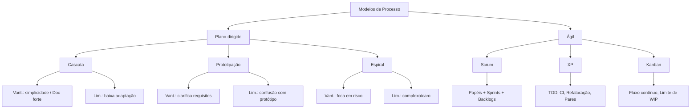

# 2. Modelos de Processo de Software

## 2.1 Definição de processo de software

Um **processo de software** é o conjunto organizado de atividades, papéis, artefatos e regras que guiam da ideia ao produto em produção (especificar, projetar, implementar, testar, entregar e manter).

* **Sommerville (2019):** processos variam conforme produto, equipe e contexto; nenhum modelo serve para tudo.
* **Pressman & Maxim (2016):** a escolha do processo impacta diretamente **qualidade**, **prazo** e **custo**; adaptar é essencial.
* **Bezerra (2015):** reforça o papel da **modelagem e documentação** para reduzir ambiguidade (UML como apoio, inclusive em ambientes ágeis de forma leve).

**Plano-dirigido x Ágil (visão integrada):**

* **Plano-dirigido (cascata/espiral):** planejamento e documentação extensos; adequado a requisitos estáveis e ambientes regulados.
* **Ágil (Scrum/XP/Kanban):** entregas frequentes, colaboração intensa com cliente, adaptação contínua; adequado a alta incerteza e necessidade de velocidade.

## 2.2 Modelo Cascata

**Ideia:** fases sequenciais com pouca volta atrás (Requisitos → Análise/Projeto → Implementação → Testes → Manutenção).
**Quando usar:** requisitos bem definidos e estáveis; setores regulados (ex.: medical devices) com ênfase em rastreabilidade.
**Vantagens:** simplicidade; forte documentação e marcos claros.
**Limitações:** baixa adaptabilidade; feedback tardio; risco de descobrir problemas tarde.

## 2.3 Modelo de Prototipação

**Ideia:** construir rapidamente um **protótipo** para validar entendimento antes de investir pesado na solução final.
**Quando usar:** muita incerteza de interação/UX; produtos novos.
**Vantagens:** reduz ambiguidades; engaja usuários cedo.
**Limitações:** risco de “apaixonar-se” pelo protótipo; confusões sobre qualidade/escopo do protótipo.

## 2.4 Modelo Espiral

**Ideia:** ciclos iterativos com **análise explícita de riscos** a cada volta (planejamento → avaliação de riscos → desenvolvimento → validação).
**Quando usar:** projetos grandes/complexos; alta criticidade.
**Vantagens:** foco em risco; combina o melhor de prototipação e plano-dirigido.
**Limitações:** mais caro e complexo de gerenciar; exige maturidade do time.

## 2.5 Modelos Ágeis – Visão Introdutória

**Princípios (Manifesto Ágil, conforme apresentados por Sommerville e Pressman):**

* **Indivíduos e interações** acima de processos e ferramentas
* **Software funcionando** acima de documentação extensiva
* **Colaboração com o cliente** acima de negociação de contratos
* **Responder a mudanças** acima de seguir um plano rígido

**Quando usar:** ambientes de alta mudança, busca de time-to-market curto, necessidade de aprendizado contínuo com o cliente.
**Cuidados:** disciplina técnica (testes, integração contínua), gestão de dívidas técnicas, alinhamento com compliance/documentação quando necessário.

### 2.5.1 Scrum (time-boxed, empírico)

**Papéis:**

* **Product Owner (PO):** prioriza valor, gerencia **Product Backlog**.
* **Scrum Master:** facilita o processo e remove impedimentos.
* **Time de Desenvolvimento:** multidisciplinar, responsável pelo **Incremento**.

**Eventos (timeboxed):**

* **Sprint** (iteração, tipicamente 1–4 semanas)
* **Sprint Planning, Daily Scrum, Sprint Review, Retrospective**

**Artefatos:**

* **Product Backlog, Sprint Backlog, Incremento** (com Definição de Pronto/DoD)

**Forças:** cadência previsível; transparência; foco em valor.
**Riscos se mal aplicado:** “mini-cascatas” dentro da sprint; backlog mal priorizado.

### 2.5.2 Extreme Programming (XP) – engenharia ágil

**Práticas-chave:**

* **TDD (Test-Driven Development)**
* **Refatoração contínua**
* **Programação em par (Pair Programming)**
* **Integração contínua**
* **Design simples** e **lançamentos pequenos**
* **Padrões de código**, **cliente presente** e **ritmo sustentável**

**Forças:** eleva qualidade técnica; feedback rápido.
**Riscos:** exige forte disciplina; pode ser difícil escalar sem adaptação.

### 2.5.3 Kanban (fluxo contínuo, puxado)

**Princípios:**

* Visualizar o trabalho (**quadro Kanban**)
* **Limitar WIP** (work in progress - trabalho em progresso)
* Gerir fluxo (métricas como lead time/cycle time)
* Políticas explícitas, melhoria contínua

**Forças:** altíssima flexibilidade; ótimo para **suporte/ops** e times com demanda variável.
**Riscos:** sem timeboxes, pode perder cadência se prioridades não forem bem geridas.

## 2.6 Comparação entre modelos e aplicações práticas

| Modelo/Família | Direção básica             | Ritmo                             | Foco                           | Vantagens                      | Limitações                   | Aplicações típicas                            |
| -------------- | -------------------------- | --------------------------------- | ------------------------------ | ------------------------------ | ---------------------------- | --------------------------------------------- |
| Cascata        | Plano-dirigido, sequencial | Marcos por fase                   | Conformidade e previsibilidade | Simples; documentação forte    | Baixa adaptação a mudanças   | Requisitos estáveis; ambientes regulados      |
| Prototipação   | Iterativo para aprender    | Ciclos curtos de validação        | Esclarecer requisitos/UX       | Reduz ambiguidades             | Protótipos podem confundir   | Produtos novos; foco em UX                    |
| Espiral        | Iterativo com **risco**    | Voltas da espiral                 | Gerir riscos                   | Flexível; robusto              | Complexo; caro               | Grandes projetos críticos                     |
| Scrum          | Ágil, empírico             | **Sprints**                       | Valor de negócio               | Cadência, transparência        | Pode virar “scrum-but”       | Produtos com roadmap evolutivo                |
| XP             | Ágil, engenharia           | **Sprints** (ou iterações curtas) | Qualidade técnica              | TDD, CI, refatoração           | Requer alta disciplina       | Plataformas evolutivas; bases de código vivas |
| Kanban         | Ágil, fluxo puxado         | **Contínuo**                      | Eficiência de fluxo            | Flexível; mede lead/cycle time | Risco de prioridades difusas | Suporte/ops; times de manutenção              |

**Híbridos úteis:**

* **Scrumban:** Scrum + Kanban (cadência de sprint com limites de WIP e foco em fluxo).
* **Ágil + Espiral:** iterações com checkpoint de risco explícito para contextos críticos.
* **Scrum + XP:** muito comum; Scrum para gestão, XP para práticas técnicas.

## 2.7 Visuais de apoio

Fluxograma comparativo dos modelos (incluindo ágeis):

## 2.8 Síntese dos autores

* **Sommerville:** escolha **contextual**; valoriza colaboração com o cliente e entregas incrementais em cenários incertos; reconhece a necessidade de processos mais formais em domínios regulados.
* **Pressman & Maxim:** processo deve ser **medido e adaptado**; qualidade e risco são guias para a seleção; práticas ágeis combinam bem com engenharia sólida (métricas, automação).
* **Bezerra:** **UML como suporte** à comunicação e documentação, inclusive em equipes ágeis, com **modelagem leve** (diagramas essenciais, atualizados conforme necessário).
