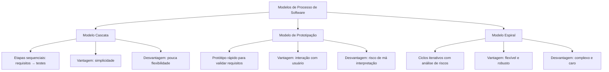

# 2. Modelos de Processo de Software

## 2.1 Conceito de Processo de Software

Um **processo de software** é o conjunto estruturado de atividades necessárias para especificar, desenvolver, testar e manter um sistema de software.

* **Sommerville (2019):** define processo como um conjunto organizado de atividades com papéis e resultados claramente definidos.
* **Pressman & Maxim (2016):** destacam que o processo deve ser adaptável à realidade do projeto, buscando qualidade e previsibilidade.
* **Bezerra (2015):** associa o processo à etapa de modelagem e padronização da documentação, facilitando a comunicação.

**Resumo:** O processo é o “caminho” que orienta como transformar ideias em software funcional, minimizando riscos e maximizando a qualidade.

---

## 2.2 Modelo Cascata

O modelo cascata foi um dos primeiros processos formais de desenvolvimento de software.
**Características:**

* Etapas sequenciais (Requisitos → Análise → Projeto → Implementação → Testes → Manutenção).
* Só se avança para a fase seguinte após a conclusão da anterior.

**Vantagens:**

* Simples de entender e aplicar.
* Boa documentação.

**Desvantagens:**

* Pouca flexibilidade para mudanças.
* Alto risco de falhas quando requisitos mudam.

**Exemplo prático:** desenvolvimento de software embarcado em equipamentos hospitalares, onde mudanças são menos frequentes e a documentação precisa ser rigorosa.

## 2.3 Modelo de Prototipação

O modelo de prototipação busca criar versões simplificadas do sistema para validar requisitos com os usuários antes da implementação final.

**Características:**

* Protótipo inicial construído rapidamente.
* Usuários validam e sugerem alterações.
* Protótipo é descartado ou evoluído para o produto final.

**Vantagens:**

* Melhor compreensão dos requisitos.
* Reduz ambiguidades na comunicação com usuários.

**Desvantagens:**

* Pode gerar protótipos mal planejados que confundem os stakeholders.
* Risco de usuários acreditarem que o protótipo já é o sistema pronto.

**Exemplo prático:** desenvolvimento de aplicativos móveis, onde a interação e usabilidade precisam ser validadas rapidamente com os usuários.

## 2.4 Modelo Espiral

Criado por Barry Boehm, combina características do **cascata** e da **prototipação**, com forte ênfase na **análise de riscos**.

**Características:**

* Ciclos iterativos (planejamento → análise de riscos → desenvolvimento → validação).
* Cada ciclo adiciona novas funcionalidades.

**Vantagens:**

* Forte foco em risco, ideal para projetos complexos.
* Flexível e adaptável.

**Desvantagens:**

* Complexidade de gerenciamento.
* Alto custo de aplicação.

**Exemplo prático:** projetos de grande porte, como sistemas de controle de tráfego aéreo ou sistemas bancários de missão crítica.

## 2.5 Comparação entre os Modelos

| Modelo           | Vantagens                                       | Desvantagens                               | Melhor Aplicação                  |
| ---------------- | ----------------------------------------------- | ------------------------------------------ | --------------------------------- |
| **Cascata**      | Simples, estruturado, boa documentação          | Rígido, pouco adaptável                    | Projetos estáveis e regulados     |
| **Prototipação** | Clareza de requisitos, interação com usuário    | Pode gerar confusão, risco de improvisação | Apps móveis, sistemas interativos |
| **Espiral**      | Análise de riscos, flexibilidade, iteratividade | Complexo, custo alto                       | Projetos grandes e críticos       |

## 2.6 Visuais de Apoio

**Fluxograma comparativo dos modelos de processo (Mermaid):**

## 2.7 Síntese dos Autores

* **Sommerville:** valoriza a adaptabilidade e lembra que nenhum modelo é universal.
* **Pressman & Maxim:** reforçam a importância de alinhar o modelo com as metas de qualidade e os riscos do projeto.
* **Bezerra:** destaca a documentação e a UML como mecanismos para apoiar qualquer processo escolhido.
