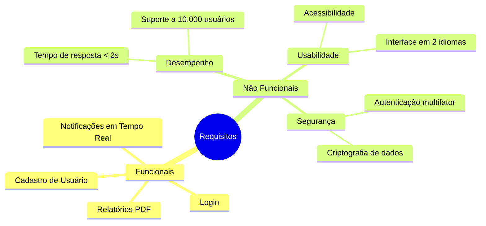

# 3. Engenharia de Requisitos – Introdução

## 3.1 Importância dos Requisitos no Sucesso do Projeto

A fase de requisitos é uma das mais críticas no desenvolvimento de software. Estudos (Pressman & Maxim, 2016; Sommerville, 2019) apontam que **falhas de requisitos são responsáveis por até 60% dos problemas encontrados em projetos de software**.

**Por que requisitos são importantes?**

* Evitam retrabalho e custos elevados.
* Permitem alinhar expectativas entre cliente, usuários e equipe técnica.
* Servem como base para todas as fases subsequentes (projeto, implementação, testes e manutenção).
* Melhoram a comunicação entre **stakeholders**.

**Exemplo prático:**
Um aplicativo de transporte (tipo Uber) sem requisitos claros pode falhar em funcionalidades críticas:

* O cliente quer visualizar o tempo estimado de chegada do motorista.
* O motorista precisa receber notificações em tempo real.
* O administrador necessita de relatórios de desempenho.
  Sem requisitos bem definidos, o sistema pode atender parcialmente um grupo e falhar totalmente para outro.

## 3.2 Diferença entre Requisitos Funcionais e Não Funcionais

Os requisitos podem ser classificados em duas grandes categorias:

### Requisitos Funcionais

Definem **o que o sistema deve fazer**, descrevendo funcionalidades ou serviços.

* Exemplo 1: “O sistema deve permitir que o usuário realize login com e-mail e senha.”
* Exemplo 2: “O sistema deve gerar relatórios de vendas mensais em formato PDF.”

**Fonte:** Sommerville (2019) descreve requisitos funcionais como declarações dos serviços que o sistema deve fornecer, incluindo entradas, saídas e comportamento.

### Requisitos Não Funcionais

Definem **como o sistema deve se comportar**, estabelecendo restrições ou atributos de qualidade.

* Exemplo 1: “O sistema deve suportar 10.000 acessos simultâneos.”
* Exemplo 2: “O tempo de resposta deve ser inferior a 2 segundos em 95% das operações.”
* Exemplo 3: “A interface deve estar disponível em português e inglês.”

**Fonte:** Pressman & Maxim (2016) reforçam que requisitos não funcionais influenciam a experiência do usuário e a aceitação do produto.

### Comparação em Tabela

| Tipo de Requisito | Descrição           | Exemplos                                          |
| ----------------- | ------------------- | ------------------------------------------------- |
| Funcional         | O que o sistema faz | Login, cadastro, relatórios, envio de e-mails     |
| Não Funcional     | Como o sistema faz  | Desempenho, segurança, usabilidade, portabilidade |

## 3.3 Características de Bons Requisitos

Um requisito de qualidade deve apresentar certas características fundamentais (Sommerville, 2019; Pressman & Maxim, 2016).

1. **Clareza e não ambiguidade**

   * Deve ser escrito de forma objetiva, evitando termos vagos como “rápido”, “intuitivo”.
   * Exemplo: em vez de “o sistema deve ser rápido”, usar “o sistema deve responder em até 2 segundos”.

2. **Testabilidade (verificabilidade)**

   * O requisito deve poder ser validado por meio de testes, protótipos ou inspeções.
   * Exemplo: “O sistema deve processar até 1.000 transações por minuto” → possível medir.

3. **Consistência**

   * Não deve haver conflitos entre diferentes requisitos.
   * Exemplo: um requisito que exige “armazenar dados por 5 anos” não pode entrar em conflito com outro que determina “exclusão após 2 anos”.

4. **Completude**

   * Todos os cenários relevantes devem ser descritos.
   * Exemplo: se existe login, também deve haver requisitos sobre recuperação de senha.

5. **Rastreabilidade**

   * Deve ser possível relacionar cada requisito às suas origens (usuário, regra de negócio, norma técnica) e às etapas do projeto (implementação, teste).

6. **Viabilidade**

   * O requisito precisa ser implementável dentro das restrições de tempo, orçamento e tecnologia.

## 3.4 Exemplos Visuais

### Exemplo de Requisitos Funcionais vs Não Funcionais (Mermaid Mindmap)

## 3.5 Síntese dos Autores

* **Sommerville (2019):** destaca requisitos como “contrato” entre cliente e desenvolvedor.
* **Pressman & Maxim (2016):** enfatizam que requisitos mal definidos são a principal causa de falhas em projetos.
* **Bezerra (2015):** relaciona requisitos à modelagem em UML, que facilita a documentação e comunicação entre partes.

