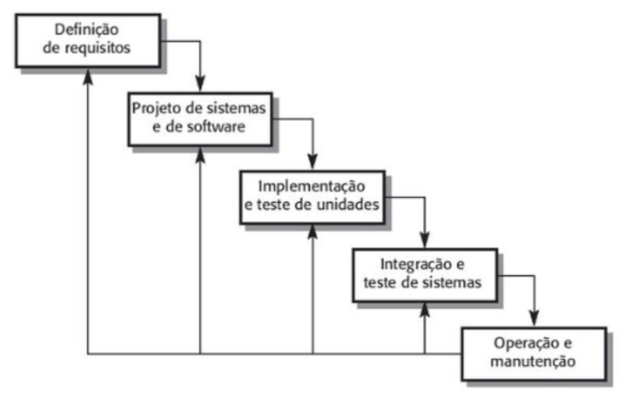

# Ciclo de Vida de Software

O desenvolvimento de software é uma atividade complexa que envolve diversas etapas, profissionais e decisões técnicas. Diferentemente de tarefas simples de programação individual, projetos de software geralmente demandam planejamento, coordenação de equipes, controle de qualidade, gestão de recursos e alinhamento com as necessidades dos usuários ou da organização.

Para lidar com essa complexidade, a Engenharia de Software utiliza o conceito de **Ciclo de Vida de Software**, que descreve o conjunto organizado de etapas pelas quais um sistema passa desde a identificação de uma necessidade até sua eventual substituição ou descontinuação.

O ciclo de vida pode ser entendido como **uma estrutura conceitual que organiza o processo de desenvolvimento**, estabelecendo:

* quais atividades devem ser realizadas
* em que ordem essas atividades ocorrem
* quais resultados ou artefatos são produzidos em cada etapa
* quem são os responsáveis por cada fase

Essa estrutura permite que o desenvolvimento seja conduzido de forma **mais previsível, controlada e transparente**, reduzindo riscos associados à construção de sistemas complexos.

### Exemplo

Imagine uma empresa que decide desenvolver um sistema para **controle de estoque**.

Sem um ciclo de vida estruturado, os desenvolvedores poderiam começar diretamente a programar, sem compreender completamente:

* quais funcionalidades o sistema precisa ter
* quais usuários irão utilizá-lo
* quais dados precisam ser armazenados
* quais relatórios são necessários

Como resultado, o sistema poderia não atender às necessidades reais da empresa.

Ao utilizar um ciclo de vida estruturado, primeiro ocorre a **análise das necessidades**, depois o **planejamento da solução**, seguido da **implementação**, **testes** e **implantação**, reduzindo a probabilidade de erros graves no projeto.

## Conceito de Ciclo de Vida de Software

O **Ciclo de Vida de Software (Software Development Life Cycle – SDLC)** é um modelo conceitual que descreve as etapas necessárias para planejar, desenvolver, implantar e manter um sistema de software ao longo do tempo.

Ele não define apenas atividades técnicas, mas também inclui aspectos organizacionais, como:

* comunicação entre equipes
* validação com usuários
* documentação do sistema
* gestão de mudanças

O ciclo de vida busca responder três perguntas fundamentais em projetos de software:

1. **O que deve ser construído?**
2. **Como o sistema será desenvolvido?**
3. **Como garantir que o sistema atende às necessidades dos usuários?**

Para responder a essas perguntas, o ciclo de vida organiza o processo de desenvolvimento em fases bem definidas.

Essas fases podem variar dependendo do modelo utilizado, mas geralmente incluem:

* levantamento de requisitos
* projeto do sistema
* implementação
* testes
* implantação
* manutenção

Cada fase gera **artefatos específicos**, que são produtos do processo de desenvolvimento.

Exemplos de artefatos incluem:

* documentos de requisitos
* diagramas de arquitetura
* código-fonte
* scripts de banco de dados
* relatórios de teste
* manuais do usuário

### Exemplo

No desenvolvimento de um **sistema de matrícula online para uma universidade**, o ciclo de vida pode gerar os seguintes artefatos:

| Fase          | Artefato                          |
| ------------- | --------------------------------- |
| Requisitos    | Documento com regras de matrícula |
| Projeto       | Diagrama de banco de dados        |
| Implementação | Código do sistema                 |
| Testes        | Relatórios de testes              |
| Implantação   | Manual do usuário                 |

Esses artefatos servem como registros formais do progresso do projeto.

## Importância do Ciclo de Vida no Desenvolvimento de Software

A adoção de um ciclo de vida estruturado é fundamental para garantir a qualidade e a viabilidade de projetos de software.

Projetos conduzidos sem planejamento adequado frequentemente enfrentam problemas como:

* atrasos significativos
* aumento de custos
* retrabalho frequente
* falhas de comunicação entre equipes
* sistemas que não atendem às necessidades dos usuários

O ciclo de vida ajuda a evitar esses problemas ao fornecer **uma estrutura organizada para o desenvolvimento**.

Entre os principais benefícios estão:

### Planejamento mais preciso

A divisão do projeto em etapas permite estimar prazos, custos e recursos necessários de maneira mais realista.

#### Exemplo

Se um projeto prevê:

* 2 semanas para levantamento de requisitos
* 3 semanas para projeto
* 6 semanas para implementação
* 2 semanas para testes

então é possível estimar um cronograma aproximado de desenvolvimento.

### Controle do progresso do projeto

Cada fase do ciclo de vida possui entregas específicas, permitindo que o progresso seja acompanhado.

#### Exemplo

Ao finalizar a fase de requisitos, a equipe deve entregar um **documento de requisitos aprovado pelos usuários**.

Isso permite verificar se o projeto está avançando conforme planejado.

### Melhoria da comunicação

Quando todos os participantes compreendem as etapas do processo, a comunicação entre desenvolvedores, analistas e gestores torna-se mais eficiente.

#### Exemplo

Durante a fase de requisitos, reuniões entre usuários e analistas ajudam a esclarecer dúvidas sobre funcionalidades do sistema.

### Redução de riscos

Ao dividir o desenvolvimento em fases, problemas podem ser detectados mais cedo.

#### Exemplo

Se um erro de requisito for identificado ainda na fase de análise, o impacto é pequeno.
Se o erro só for percebido após a implementação, pode ser necessário refazer grande parte do sistema.

## Fases Típicas do Ciclo de Vida de Software

Embora existam diferentes modelos de processo, a maioria deles compartilha um conjunto de fases fundamentais.

## Levantamento e Análise de Requisitos

A fase de requisitos é responsável por compreender **o problema que o sistema deve resolver**.

Nessa etapa, os analistas procuram identificar:

* quais funcionalidades o sistema deve possuir
* quais dados precisam ser armazenados
* quem são os usuários do sistema
* quais restrições técnicas ou legais existem

O levantamento de requisitos pode utilizar diversas técnicas, como:

* entrevistas com usuários
* questionários
* observação de processos
* análise de documentos existentes
* workshops com especialistas

Os requisitos geralmente são classificados em duas categorias:

### Requisitos funcionais

Descrevem **o que o sistema deve fazer**.

Exemplo:

* cadastrar clientes
* registrar pedidos
* emitir relatórios

### Requisitos não funcionais

Descrevem **características de qualidade do sistema**.

Exemplo:

* tempo de resposta inferior a 2 segundos
* disponibilidade de 99% do tempo
* acesso seguro com autenticação

### Exemplo

Em um **sistema de biblioteca**, alguns requisitos podem ser:

Requisitos funcionais:

* cadastrar livros
* registrar empréstimos
* controlar devoluções

Requisitos não funcionais:

* acesso apenas para usuários autenticados
* backup diário do banco de dados

## Projeto ou Design do Sistema

Após compreender os requisitos, a equipe precisa definir **como o sistema será construído**.

Essa fase envolve decisões arquiteturais importantes.

Entre elas:

* estrutura do banco de dados
* divisão do sistema em módulos
* tecnologias utilizadas
* comunicação entre componentes

Ferramentas de modelagem são frequentemente utilizadas nessa etapa.

Entre os diagramas mais comuns estão:

* diagramas de classes
* diagramas de componentes
* diagramas de sequência
* diagramas de arquitetura

### Exemplo

Em um **sistema de comércio eletrônico**, o projeto pode dividir o sistema em módulos como:

* módulo de usuários
* módulo de catálogo de produtos
* módulo de carrinho de compras
* módulo de pagamentos

Cada módulo possui responsabilidades específicas.

## Implementação

A implementação corresponde à fase de **construção do sistema**.

Nesta etapa os desenvolvedores transformam o projeto em código executável.

As atividades incluem:

* programação das funcionalidades
* criação de bancos de dados
* integração entre módulos
* configuração de servidores

A implementação pode utilizar diversas linguagens e tecnologias, como:

* Java
* Python
* JavaScript
* bancos de dados relacionais ou NoSQL
* frameworks de desenvolvimento

### Exemplo

Em um sistema web, a implementação pode incluir:

* backend em Node.js
* frontend em React
* banco de dados PostgreSQL

## Testes

A fase de testes tem como objetivo verificar se o sistema funciona corretamente.

Os testes ajudam a identificar erros que podem comprometer o funcionamento do sistema.

Existem diferentes tipos de testes:

### Testes unitários

Verificam partes individuais do código.

Exemplo: testar uma função que calcula o valor total de um pedido.

### Testes de integração

Verificam se diferentes módulos funcionam corretamente juntos.

Exemplo: verificar se o módulo de pagamento comunica corretamente com o banco de dados.

### Testes de sistema

Avaliam o sistema completo.

Exemplo: simular uma compra completa em um sistema de e-commerce.

### Testes de aceitação

Realizados pelos usuários finais para validar se o sistema atende às necessidades.

## Implantação

A implantação ocorre quando o sistema é disponibilizado para uso real.

Essa fase pode envolver diversas atividades técnicas e organizacionais.

Entre elas:

* instalação em servidores
* configuração de ambiente de produção
* migração de dados antigos
* treinamento de usuários
* monitoramento inicial do sistema

### Exemplo

Ao implantar um sistema de gestão escolar, pode ser necessário:

* importar dados de alunos
* cadastrar professores
* configurar permissões de acesso

## Manutenção

Após a implantação, o sistema continua evoluindo.

A manutenção pode ocorrer por diferentes motivos:

* correção de erros
* melhoria de desempenho
* adaptação a mudanças tecnológicas
* inclusão de novas funcionalidades

A manutenção costuma ser dividida em categorias:

### Manutenção corretiva

Correção de falhas identificadas após o uso do sistema.

### Manutenção evolutiva

Adição de novas funcionalidades.

### Manutenção adaptativa

Ajustes para adaptação a novos ambientes tecnológicos.

### Exemplo

Um sistema de vendas pode receber uma nova funcionalidade para **integração com meios de pagamento digitais**, caracterizando manutenção evolutiva.

## O Modelo Cascata

O **Modelo Cascata** é um dos primeiros modelos de processo utilizados na Engenharia de Software.

Ele organiza o desenvolvimento de forma **sequencial**, onde cada fase depende da conclusão da anterior.

As etapas do modelo cascata normalmente incluem:

1. Requisitos
2. Projeto
3. Implementação
4. Testes
5. Implantação
6. Manutenção

Cada etapa gera resultados que servem de base para a próxima fase.

### Representação do Modelo Cascata

A representação gráfica facilita a compreensão da natureza linear do modelo.

### Vantagens do Modelo Cascata

O modelo cascata apresenta algumas vantagens importantes.

#### Estrutura clara

As fases são bem definidas, facilitando o planejamento.

Exemplo: uma equipe pode estabelecer que o projeto só avança para implementação após aprovação formal dos requisitos.

#### Facilidade de gestão

Gestores conseguem acompanhar o progresso do projeto por meio da conclusão das etapas.

Exemplo: a entrega do documento de requisitos indica a conclusão da primeira fase.

#### Boa documentação

A forte ênfase em documentação facilita manutenção futura.

Exemplo: novos desenvolvedores podem compreender o sistema analisando documentos existentes.

### Limitações do Modelo Cascata

Apesar de suas vantagens, o modelo cascata apresenta limitações.

#### Rigidez

Mudanças tardias podem exigir retrabalho significativo.

Exemplo: alterar um requisito após a implementação pode exigir modificações extensas no código.

#### Feedback tardio

Usuários só interagem com o sistema nas fases finais.

Exemplo: um usuário pode perceber apenas na implantação que uma funcionalidade não atende às necessidades reais.

#### Baixa flexibilidade

O modelo não se adapta bem a projetos com requisitos incertos ou que mudam com frequência.

## Aplicação no Projeto da Disciplina

No contexto de projetos acadêmicos, o modelo cascata pode ser utilizado como **estrutura inicial de organização do desenvolvimento**.

Um projeto pode seguir as etapas:

1. definição do problema
2. levantamento de requisitos
3. modelagem do sistema
4. implementação inicial
5. testes
6. avaliação final

## Estudo de Caso

Considere o desenvolvimento de um **Sistema de Biblioteca Digital**.

O sistema deve permitir:

* cadastro de livros
* controle de empréstimos
* busca por títulos ou autores
* geração de relatórios de utilização

Descreva como cada fase do **modelo cascata** poderia ser aplicada no desenvolvimento desse sistema.

## Exercício

Uma instituição educacional deseja desenvolver um **Sistema de Agendamento de Laboratórios de Informática**.

Atualmente, os horários são controlados manualmente por planilhas, o que gera conflitos entre turmas e dificuldade de organização.

O novo sistema deve permitir:

* agendamento online de laboratórios
* consulta de disponibilidade
* registro de manutenção de equipamentos
* geração de relatórios de utilização

Analise como o desenvolvimento desse sistema poderia seguir o **modelo cascata**, identificando as atividades realizadas em cada etapa.