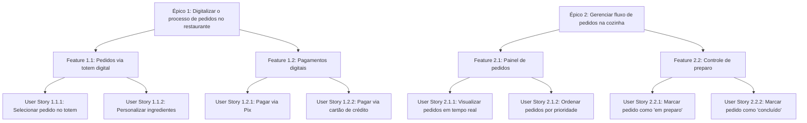

# 5.User Stories (Histórias de Usuário)

As **User Stories**, ou histórias de usuário, são uma técnica ágil de documentação de requisitos funcionais do sistema sob a perspectiva do usuário final. Elas descrevem uma funcionalidade de forma simples e centrada nas necessidades do usuário, facilitando a comunicação entre as equipes de desenvolvimento, negócios e usuários.

## 5.1. Estrutura de uma História de Usuário

A estrutura clássica de uma user story é baseada no seguinte formato:

> **Como** \[tipo de usuário],
> **Quero** \[ação ou funcionalidade],
> **Para que** \[benefício ou valor agregado].

Essa estrutura permite que as funcionalidades sejam documentadas com foco no valor de negócio, tornando a necessidade mais clara para todos os envolvidos.

### 5.Exemplo de estrutura

> **Como** cliente,
> **Quero** selecionar meu pedido pelo totem digital,
> **Para que** eu não precise esperar na fila.

## 5.2. Critérios de Aceitação

Os **critérios de aceitação** são condições objetivas que devem ser satisfeitas para que uma história de usuário seja considerada completa e funcional. Eles servem como base para testes e validações.

Cada história de usuário deve possuir um ou mais critérios de aceitação, expressos de forma clara e verificável. Eles ajudam a eliminar ambiguidades e alinhar expectativas entre o time técnico e os stakeholders.

## 5.3. Histórias de Usuário Detalhadas

### User Story 1 – Pedido via Totem Digital

> **Como** cliente,
> **Quero** selecionar meu pedido pelo totem digital,
> **Para que** eu não precise esperar na fila.

**Critérios de Aceitação:**

* O totem deve exibir o cardápio completo com todos os produtos disponíveis.
* O cliente deve poder selecionar itens e adicionar ao carrinho.
* Deve ser possível adicionar e remover itens de forma intuitiva.
* O sistema deve apresentar a quantidade de itens no carrinho antes da finalização do pedido.

### User Story 2 – Pagamento Digital

> **Como** cliente,
> **Quero** pagar com cartão ou Pix diretamente no totem,
> **Para que** meu pedido seja processado rapidamente.

**Critérios de Aceitação:**

* O totem deve oferecer as opções de pagamento via Pix ou cartão de crédito/débito.
* O sistema deve processar o pagamento e retornar uma confirmação imediata.
* O cliente deve receber confirmação tanto do pagamento quanto do pedido.

### User Story 3 – Personalização de Pedidos

> **Como** cliente,
> **Quero** personalizar os ingredientes do meu lanche,
> **Para que** eu possa adaptar o pedido ao meu gosto.

**Critérios de Aceitação:**

* O totem deve permitir a personalização de ingredientes (por exemplo: remover cebola, adicionar bacon extra).
* As alterações devem ser exibidas de forma clara antes da finalização.
* O preço final do pedido deve ser ajustado automaticamente com base nas personalizações.

## 5.4. Revisão e Validação Colaborativa

As user stories devem ser revisadas e validadas de forma colaborativa, preferencialmente com a participação dos seguintes perfis:

* Product Owner ou cliente final (responsável pelas necessidades de negócio),
* Equipe de desenvolvimento (responsável por transformar a necessidade em código),
* Stakeholders relevantes (gerentes, atendentes, usuários).

**Técnicas comuns de validação:**

* Revisões em grupo (workshops de backlog grooming),
* Demonstrações de protótipos,
* Testes de aceitação com base nos critérios definidos,
* Validação incremental em ciclos de sprint.

## 5.5. User Stories x Artefatos do Scrum (Épicos e Features)

No contexto do **Scrum**, as user stories não estão isoladas — elas fazem parte de uma hierarquia maior de requisitos e planejamento.

* **Épico**
  *Descrição de alto nível de uma grande necessidade ou objetivo de negócio.*
  Normalmente é **muito amplo** para ser implementado diretamente em uma sprint.
  → Exemplo: *"Digitalizar o processo de pedidos no restaurante"*.

* **Feature**
  *Funcionalidade específica derivada de um épico.*
  São divisões menores que ainda podem englobar várias user stories.
  → Exemplo: *"Permitir pedidos via totem digital"*.

* **User Story**
  *Funcionalidade vista do ponto de vista do usuário final.*
  → Exemplo: *"Como cliente, quero selecionar meu pedido pelo totem digital para não esperar na fila"*.

**Resumo da Hierarquia:**
Épico → conjunto de Features → cada Feature decomposta em User Stories.

Essa hierarquia facilita o alinhamento entre estratégia de negócio (épicos), funcionalidades entregáveis (features) e tarefas práticas (user stories).

