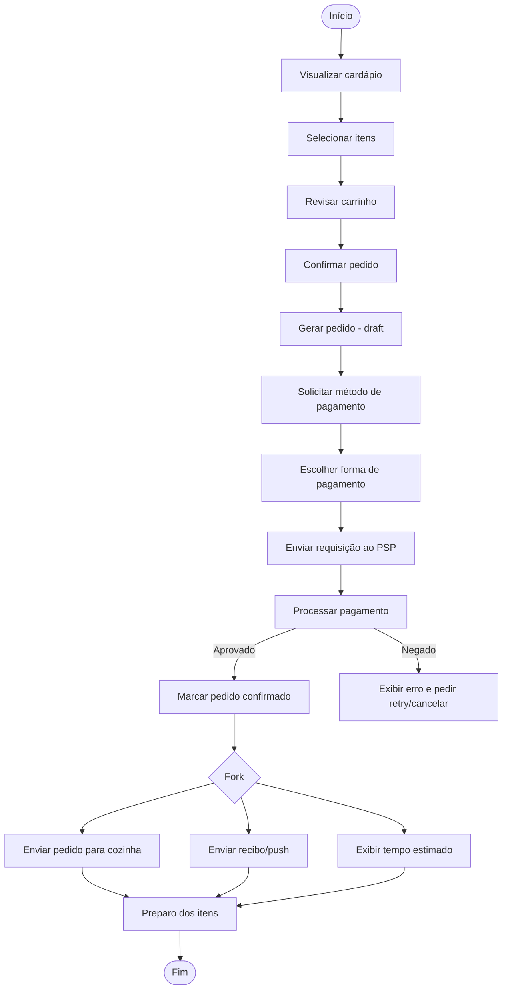
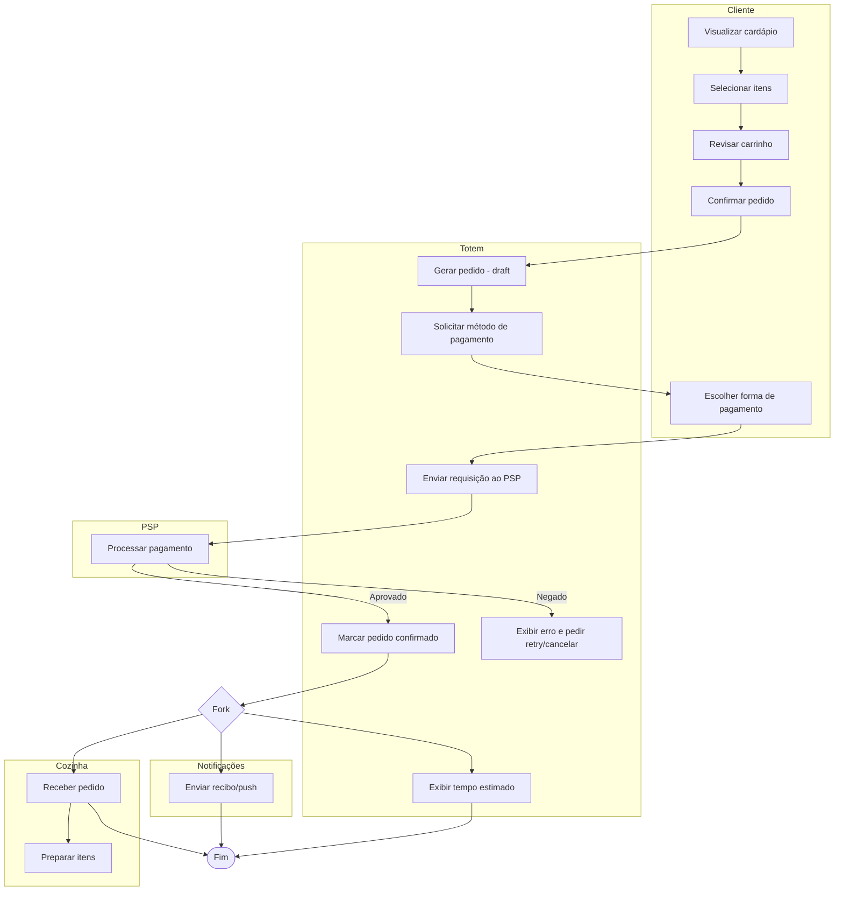

# Diagramas de Atividades (UML)

## 1 — O que é um Diagrama de Atividades?

O **Diagrama de Atividades** é um dos diagramas comportamentais da UML, usado para representar **processos, fluxos de trabalho e lógicas de negócio**.

Ele mostra:

* **Atividades/Ações** → passos que devem ser realizados.
* **Ordem e dependência** → sequência, paralelismo, decisões.
* **Fluxo de dados** → informações que circulam entre as atividades.
* **Responsabilidades** → atores ou sistemas responsáveis (via *swimlanes*).

👉 Pense nele como um **fluxograma evoluído**, com semântica mais precisa e elementos adicionais para modelar cenários reais (paralelismo, exceções, interrupções).

## 2 — Para que serve?

* Entender **processos de negócio** ponta a ponta.
* Documentar **casos de uso complexos** (onde texto seria insuficiente).
* Comunicar **responsabilidades** entre diferentes atores e sistemas.
* Identificar **pontos críticos**: decisões, integrações, exceções, gargalos.
* Transformar fluxos em **user stories, testes e tarefas técnicas**.

## 3 — Elementos principais

| Elemento                        | Uso prático                                          |
| ------------------------------- | ---------------------------------------------------- |
| **Nó inicial**                  | Marca o começo do processo.                          |
| **Nó final de atividade**       | Encerra o processo inteiro.                          |
| **Ação/Atividade**              | Passo do processo (“Validar pagamento”).             |
| **Decisão/Merge**               | Ramificação condicional (`[sucesso]`, `[falha]`).    |
| **Fork / Join**                 | Representa paralelismo e sincronização.              |
| **Objeto/dados**                | Dados que trafegam (ex.: `Pedido`, `Pagamento`).     |
| **Partições (Swimlanes)**       | Indicam quem (ator/sistema) executa a atividade.     |
| **Subprocessos**                | Encapsulam lógicas complexas.                        |
| **Regiões interruptíveis**      | Processos que podem ser cancelados ou interrompidos. |

## 4 — Partições (Swimlanes)

As *partições* dividem o diagrama para mostrar **quem faz o quê**.

* **Ator humano** → Cliente, Atendente.
* **Sistema** → Totem, PSP, API.
* **Departamento** → Cozinha, Operações.

Benefícios:

* Clareza de responsabilidades.
* Identificação de **handoffs** (transferências entre atores/sistemas).
* Facilita derivar **tarefas para o backlog** (cada lane pode virar um conjunto de tasks).

⚠️ Evite granularidade excessiva → foque em papéis/sistemas, não em indivíduos.

## 5 — Como o Diagrama de Atividades se relaciona com outros diagramas UML?

| Diagrama         | Semelhança                             | Diferença                                                                                    |
| ---------------- | -------------------------------------- | -------------------------------------------------------------------------------------------- |
| **Casos de Uso** | Ambos mostram atores e sistema.        | Casos de uso são estáticos (quem interage), atividades são dinâmicas (como o processo flui). |
| **Sequência**    | Ambos mostram ordem de eventos.        | Sequência detalha mensagens entre objetos; atividade mostra fluxo de processo/negócio.       |
| **Estado**       | Ambos lidam com transições.            | Estado foca no ciclo de vida de um objeto; atividade foca em processos completos.            |
| **Componentes**  | Ambos podem incluir sistemas externos. | Componentes = estrutura estática; atividade = comportamento dinâmico.                        |

Em resumo:

* **Atividades** = visão **de processo**.
* **Sequência** = visão **de interação técnica** (mensagens).
* **Casos de uso** = visão **funcional estática**.
* **Estados** = visão **ciclo de vida de objetos**.

## 6 — Padrões de modelagem úteis

1. **Workflow de aprovação**: decisões com aprovar/rejeitar, forks para aprovações paralelas.
2. **Integração externa (pagamento, APIs)**: chamadas assíncronas + espera por resposta.
3. **Processamento por item**: *expansion region* (processar coleção).
4. **Cancelamentos/Exceções**: regiões interruptíveis para abortar subprocessos.

## 7 — Anti-padrões comuns

- Muitas *lanes* (micro-responsabilidades).
- Decisões sem guardas (`[condição]`).
- Detalhe técnico de implementação (SQL, funções específicas).
- Diagrama ilegível, com excesso de cruzamentos → prefira modularizar.

## 8 — Checklist rápido

- Existe nó inicial e pelo menos um nó final?
- Decisões têm guardas claros?
- Lanes representam papéis/sistemas, não indivíduos?
- Forks/joins estão balanceados?
- Exceções e cancelamentos aparecem?
- O diagrama é legível em uma página ou dividido em subprocessos?

## 9 — Exemplos em Mermaid

### a) Visão geral (sem swimlanes)

### b) Visão detalhada com swimlanes

## 10 — Do diagrama para requisitos ágeis

* **Epic**: Pedido no Totem.
* **Feature**: Processamento de pagamento integrado.
* **User Story**: “Como cliente, quero pagar meu pedido no totem para receber confirmação e tempo estimado.”
* **Tasks**: implementar `POST /order`, integração PSP, UI de confirmação, retries, tratamento de exceções.
* **Critérios de aceitação**:

  * Pagamento aprovado → pedido confirmado + notificação.
  * Pagamento negado → mensagem clara com opção de retry/cancelar.
  * Timeout → retry automático 3x.

## 11 — Estratégia para diagramas complexos

1. **Visão macro**: diagrama simples, só com as etapas principais.
2. **Subprocessos**: detalhar partes específicas (ex.: pagamento, cancelamento).
3. **Exceções**: separar em um diagrama próprio.
4. **Diagramas técnicos**: para devs, mostrando chamadas de API, contratos e SLAs.

# Conclusão

O **Diagrama de Atividades** é uma ferramenta poderosa para conectar **negócio** e **tecnologia**, servindo tanto para **documentação clara** quanto para **planejamento ágil**.
Ele deve ser lido como um **mapa de processo**: quem faz o quê, em que ordem, e o que acontece em casos de exceção.

> **Dica prática**: sempre valide o diagrama com os stakeholders — cada lane deve ser revisada pelo responsável (cliente, dev, ops, integração).
