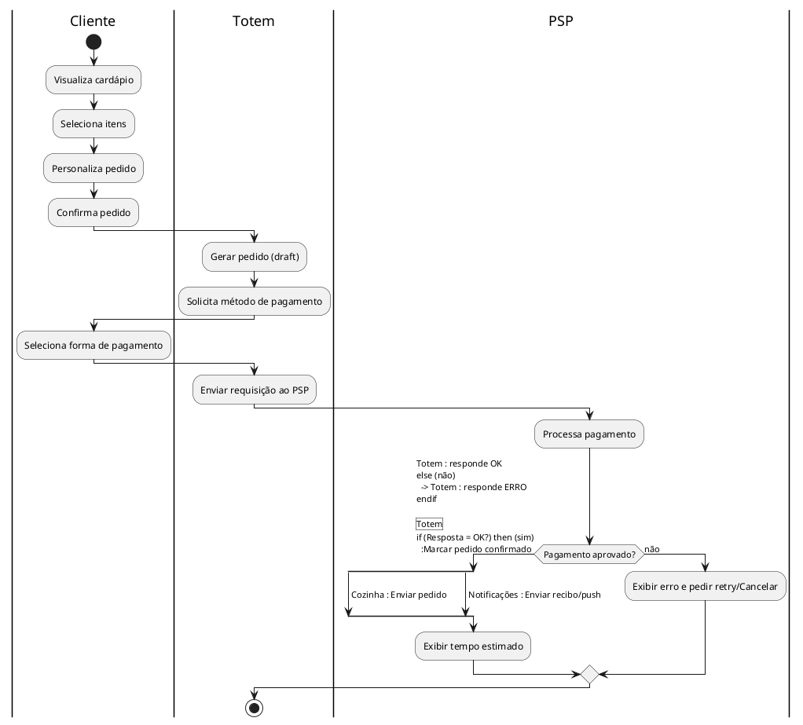

# Diagramas de Atividades (UML)

# 1 — Propósito e valor das *partições* (swimlanes)

As *partições* (ActivityPartition em UML, aka *swimlanes*) dividem o diagrama em áreas que representam **quem** ou **qual elemento** é responsável por executar cada ação: ator humano, sistema, subsistema, departamento, componente.
Benefícios principais:

* **Responsabilidade explícita**: fica claro “quem faz o quê”.
* **Detecção de handoffs**: você vê onde as responsabilidades passam entre atores (pontos de integração).
* **Base para testes e tarefas**: cada lane vira um conjunto de atividades que podem ser transformadas em tarefas/estórias.
* **Comunicação com stakeholders**: fácil de entender por analistas, devs e operação.

Quando usar: sempre que houver mais de um ator/sistema envolvido; em processos com integração entre sistemas; para workflows com aprovações.

# 2 — Notação detalhada (o que usar e quando)

Use o vocabulário UML clássico; aqui está uma síntese com significado prático:

* **Nó Inicial (Initial node)**: marca começo do fluxo.
  *Uso*: um por diagrama (ou por subprocesso).
  *Aparência*: círculo preenchido.

* **Ação / Atividade (Action / ActivityNode)**: unidade de trabalho (UI, serviço, script).
  *Uso*: nome curto e verbo no infinitivo (“Validar cartão”, “Exibir cardápio”).

* **Nó de Decisão / Merge (Decision / Merge Node)**: ramifica e reúne caminhos.
  *Uso*: rotular saídas com guardas entre colchetes — por exemplo `[sucesso]`, `[falha]`.
  *Regra*: todas as saídas devem ser mutuamente compreensíveis; evite decisões com muitas saídas (>3) sem documentação.

* **Fork / Join (Barra grossa)**: paralelismo e sincronização.
  *Semântica de token*: um token que chega ao fork é duplicado para cada saída; o join espera tokens de todas as entradas.

* **Nó Final de Atividade (Activity Final)**: termina **toda** a atividade (todos os fluxos encerram).
  *Uso*: quando o processo deve abortar tudo.

* **Flow Final Node**: finaliza **apenas aquele fluxo**; outras saídas continuam.
  *Uso*: encerrar uma das ramificações sem parar o resto do diagrama.

* **Objeto / ObjectNode (dados)**: mostra que dados (ex.: `Pedido`, `Pagamento`) fluem entre ações; use pins para entrada/saída em ações.

* **Send Signal / Accept Event / Call Behavior**: para chamadas assíncronas (enviar notificação) e aceitar eventos externos (após pagamento).
  *Uso*: diferenciar chamadas síncronas (espera resposta) de assíncronas.

* **Interruptible Activity Region**: região que pode ser interrompida por um evento externo (ex.: cancelamento pelo usuário).
  *Uso*: modelar cancelamentos e timeouts.

* **Structured Nodes / Subprocess (CallBehaviorAction)**: encapsula lógica complexa dentro de um “subprocesso” reusável.
  *Uso*: manter diagramas legíveis — exporte para outro diagrama.

* **Expansion Region**: processa coleções (por item do pedido, paralelamente ou sequencialmente).

* **Notas / Comentários**: explique decisões, restrições, SLAs.

# 3 — Partições: formato e boas escolhas

* **Horizontal vs Vertical**: escolha conforme facilidade de leitura. Em telas largas, vertical (colunas) costuma ficar melhor; em documentos impressos, horizontal também funciona.

* **Nomenclatura**: usar `Ator: Cliente`, `Sistema: Totem`, `Componente: PSP (Payment Service Provider)`, `Depto: Cozinha`.

* **Granularidade**:

  * Não crie lanes para cada pessoa (evite micro-granularidade).
  * Faça lanes por **papel** ou **sistema**.
  * Se necessário, **sub-partições** podem agrupar atividades internas.

* **Layout**:

  * Minimize travessias de fluxo entre lanes (muitos cruzamentos = mau sinal).
  * Agrupe atividades sequenciais em uma mesma lane.
  * Se tiver muitos crossings, considere mover ações para um subprocesso.

# 4 — Padrões de modelagem (úteis em projetos reais)

1. **Workflow de aprovação (Approval pattern)**

   * Decisão com rota para `Aprovar`/`Rejeitar`.
   * Use *fork* se múltiplas aprovações paralelas forem necessárias; *join* para sincronizar.
   * Use *interruptible region* para permitir cancelamento por timeout.

2. **Processo com integração externa (Payment)**

   * `Totem` → `PSP` (send signal) → aguarda resposta (accept event) → decisões.
   * Modele retries e timeouts explicitamente (ex.: `tentar 3x`, `timeout 30s`).

3. **Processamento por item (Expansion region)**

   * Para cada item do pedido, executar checagens / produção em paralelo.

4. **Transações e compensações**

   * Use *subprocesso* e *interruptible region* para modelar rollback/compensação em caso de falha em etapa posterior.

# 5 — Anti-padrões (o que evitar)

* **Demasiadas lanes** (cada micro-tarefa num lane).
* **Decisões sem guardas** (caminhos ambíguos).
* **Описание técnica de implementação** (ex.: “chamar função X() com SQL”) — mantenha um nível de abstração que favoreça entendimento.
* **Muito detalhe de UI**: não liste cada clique se o objetivo é mapear fluxo de negócio; crie um diagrama UI separado se necessário.
* **Muitos cruzamentos**: sinal de que você precisa decompor em subprocessos.

# 6 — Checklist de Qualidade (validação rápida)

* [ ] Existe nó inicial e pelo menos um nó final?
* [ ] Cada decisão tem guardas claros e exaustivos?
* [ ] Partições representam atores/sistemas relevantes e não pessoas individuais?
* [ ] Fluxos paralelos têm forks e joins balanceados?
* [ ] Exceções/timeouts/cancelamentos estão representados?
* [ ] Dados importantes são modelados como ObjectNodes?
* [ ] Diagrama é legível em 1 página (ou bem dividido em subprocessos)?

# 7 — Exemplo detalhado: Totem de pedido (com partições, exceções e paralelismo)

**Partições:** `Cliente` | `Totem` | `PSP (Pagamento)` | `Cozinha` | `Notificações/Operação`

**Fluxo ampliado (texto com responsabilidades e exceções)**

1. *(Cliente)* — `Início` → `Visualizar cardápio`

2. *(Cliente)* — `Selecionar itens`

3. *(Cliente)* — `Personalizar itens (opcional)`

4. *(Cliente)* — `Revisar carrinho` → `Confirmar pedido`

5. *(Totem)* — `Gerar pedido (Pedido: draft)` → `Solicitar método de pagamento`

6. *(Cliente)* — `Escolher forma de pagamento`

7. *(Totem)* — `Enviar requisição ao PSP` (chamada assíncrona)

8. *(PSP)* — `Processar pagamento`

   * **Timeout/Retry:** se não responder em 30s → retry até 3x → se falhar, retornar `[erro_contatar_psp]`.

9. **Decisão** `(PSP responde: aprovado?)`

   * **Sim:**
     a. *(Totem)* — `Marcar pedido como confirmado`
     b. *(Totem → Cozinha)* — `Enviar pedido para cozinha` (fork)
     c. *(Cozinha)* — `Iniciar preparo` (para cada item: expansion region)
     d. *(Notificações)* — `Enviar recibo/push para cliente` (paralelo)
     e. *(Totem)* — `Exibir tempo estimado`
   * **Não:**
     a. *(Totem)* — `Exibir erro` → *(Cliente)* `Opção: tentar novamente / cancelar`
     b. Se cancelar → *(Totem)* `Cancelar pedido`, *(Notificações)* informar operação.

10. **Cancela por usuário**: numa `Interruptible Activity Region` que engloba as etapas 5–9, caso o cliente pressione `Cancelar`, o subprocesso é interrompido: enviar `Pedido cancelado` à cozinha (se já tiver sido enviado) e executar compensações (se pagamento já tiver sido capturado).

11. **Fim**.

> Observações práticas: cartão pré-autorizado vs captura — modele como duas atividades distintas (`Autorização` e `Captura`) se o fluxo do PSP suportar.

# 8 — PlantUML: exemplo pronto (Totem com swimlanes, decisão, fork/join, timeout simulado)

Cole o texto abaixo num renderer PlantUML (ex.: site PlantUML, VSCode + extensão PlantUML) para gerar a imagem:

> Nota: PlantUML tem várias formas de modelar forks, joins e regions; o código acima é uma base e pode ser refinado (por exemplo, usar `split` / `end split` para paralelismo e `partition` se preferir).

# 9 — Template de documentação (para Word / documento de requisitos)

Use uma tabela por **caso de uso** ou **subprocesso**:

| Nº | Partição | Ação / Passo            | Tipo (Automático/Manual) | Entrada             | Saída               | Pré-condição     | Pós-condição             | Exceções                | Observações / SLA             |
| -: | -------- | ----------------------- | ------------------------ | ------------------- | ------------------- | ---------------- | ------------------------ | ----------------------- | ----------------------------- |
|  1 | Cliente  | Visualiza cardápio      | Manual                   | —                   | Cardápio exibido    | Totem ligado     | Cardápio apresentado     | Falha UI                | Tempo de resposta < 200ms     |
|  2 | Cliente  | Seleciona itens         | Manual                   | Cardápio            | Carrinho preenchido | Cardápio exibido | Itens adicionados        | Timeout de sessão       | Salvar rascunho local         |
|  5 | Totem    | Envia requisição ao PSP | Automático               | Pedido/dados cartão | Resultado pagamento | Cliente confirma | Pedido confirmado / erro | PSP timeout / 3 retries | Retry 3x, backoff exponencial |

Esse formato facilita a transformação em tarefas/estórias no backlog (cada linha vira uma task com responsável = partição).

# 10 — Mapeamento para Ágil / Scrum (prático)

* **Epic**: `Pedido no Totem`
* **Feature**: `Processamento de pagamento integrado`
* **User Story**: “Como *cliente*, quero *pagar meu pedido no totem* para *receber confirmação e tempo estimado*.”
* **Tasks técnicas**: implementar endpoint `POST /order`, integração PSP, UI confirma, tratativa de retries, testes de aceitação (Cypress/Robot), documentação de exceções.
* **Critérios de aceitação** (exemplo): pagamento aprovado → pedido confirmado e notificação enviada; pagamento recusado → mensagem clara com opção de retry; timeout → retry automático 3x.

# 11 — Como dividir diagramas complexos (estratégia de modularização)

1. **Visão macro** (alta abstração): apenas lanes e etapas principais.
2. **Subprocessos**: cada caixa “Subprocesso X” leva a um diagrama separado (call behavior).
3. **Diagrama de exceção**: separa caminhos de erro e compensação.
4. **Diagramas técnicos**: apenas para devs — mostra chamadas de API, contratos, tempo limite.

# 12 — Dicas avançadas e recomendações finais

* **Documente guardas e timeouts** como `[retries < 3]`, `[timeout > 30s]`.
* **Use ObjectNodes** com tipos (ex.: `Pedido : Order`) para rastrear informações que viajam entre ações.
* **Marque SLAs / não-funcionais** em notas (ex.: “tempo de resposta PSP < 2s em 95% das chamadas”).
* **Automatize a geração**: mantenha PlantUML/diagrama versãoada no repositório (`/docs/diagrams/`) e integre ao CI para gerar imagens.
* **Valide com stakeholders**: revisão por responsáveis das lanes para evitar suposições sobre responsabilidades.
* **Testes de aceitação**: transforme fluxos principais em cenários de BDD (Given/When/Then).
