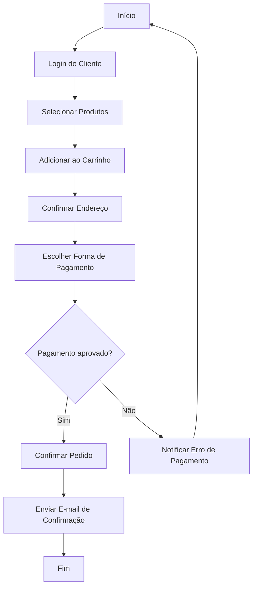
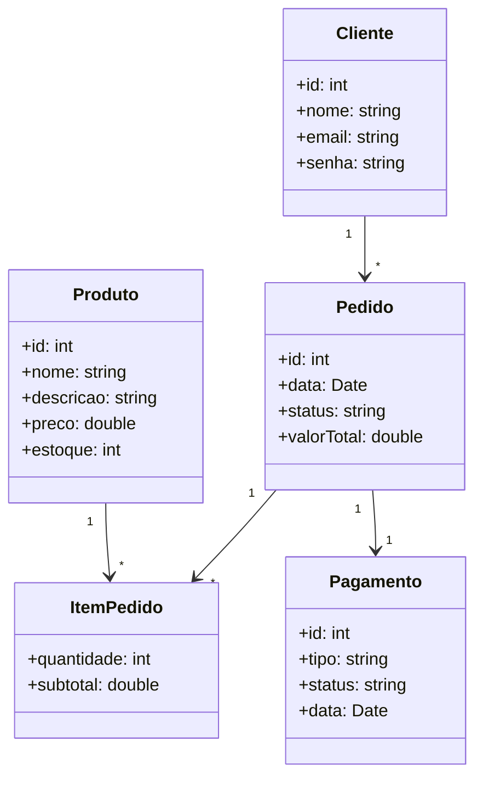
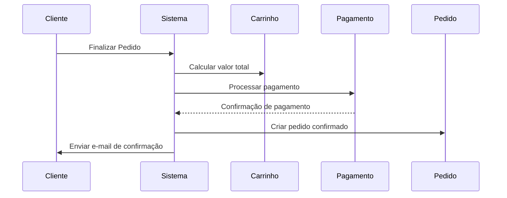
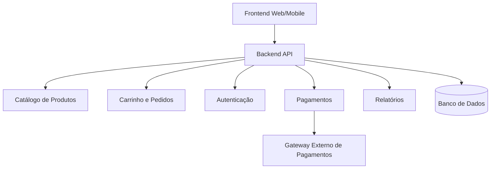
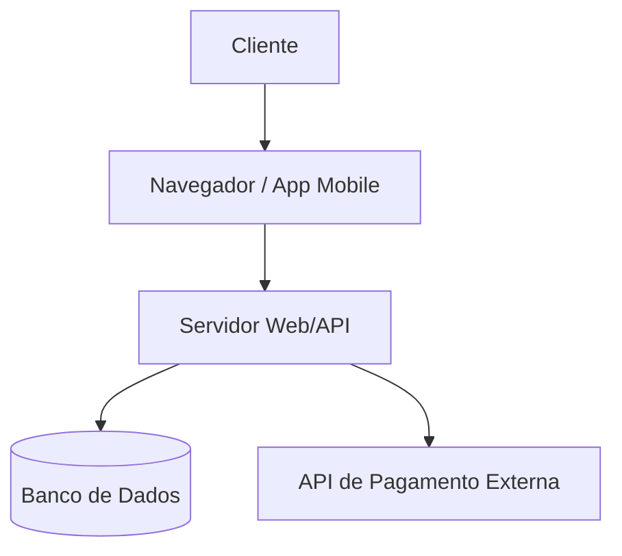

# UML aplicada a um Sistema de E-commerce

## 1. Levantamento de Requisitos

### 1.1 Requisitos Funcionais

Definem **o que o sistema deve fazer**.
São as funcionalidades principais que entregam valor ao usuário.

Exemplos em um e-commerce:

* Cadastrar e gerenciar produtos no catálogo.
* Permitir login, cadastro e recuperação de senha de clientes.
* Adicionar produtos ao carrinho de compras.
* Calcular valor total e aplicar cupons de desconto.
* Finalizar compra com diferentes métodos de pagamento (cartão, PIX, boleto).
* Gerar relatórios de vendas para o administrador.
* Rastrear pedidos em andamento.

### 1.2 Requisitos Não Funcionais

Definem **qualidades, restrições ou critérios de desempenho**.

Exemplos em um e-commerce:

* O sistema deve responder em **menos de 2 segundos** em operações simples.
* O pagamento deve seguir protocolos de segurança (**SSL, PCI-DSS**).
* O sistema deve estar disponível **24/7**, com tolerância a falhas.
* Interface responsiva e acessível em dispositivos **desktop e mobile**.
* Banco de dados deve suportar até **100 mil usuários ativos simultâneos**.


## 2. Modelagem de Requisitos

### 2.1 Histórias do Usuário

Formato: **Como \[ator], quero \[funcionalidade] para \[benefício].**

Exemplos:

* “Como **cliente**, quero adicionar produtos ao carrinho para concluir uma compra.”
* “Como **administrador**, quero cadastrar novos produtos para manter o catálogo atualizado.”
* “Como **cliente**, quero rastrear meu pedido para acompanhar a entrega.”

#### **User Story no Contexto do UML e Scrum**

Uma **User Story (História do Usuário)** é uma descrição curta e simples de uma funcionalidade do ponto de vista do **usuário ou ator**.

* Formato clássico:

  ```
  Como [ator], quero [funcionalidade] para [benefício].
  ```
* Exemplo:
  *Como cliente, quero adicionar produtos ao carrinho para concluir uma compra.*

No **UML**, a user story se relaciona principalmente com **Diagramas de Casos de Uso**, pois ambos descrevem **o que o sistema deve fazer do ponto de vista do usuário**.

* **Casos de uso** representam visualmente essas interações.
* **User stories** detalham o requisito de forma textual e orientada ao Scrum.


#### **Correlação com Scrum**

No Scrum, uma User Story é **um item do Product Backlog** e segue uma hierarquia:

1. **Épico:** Grande objetivo de negócio (ex.: “Gestão de Pedidos”).
2. **Feature:** Funcionalidade que atende parte do épico (ex.: “Carrinho de compras”).
3. **User Story:** Requisito do usuário (ex.: “Adicionar produto ao carrinho”).
4. **Task:** Tarefas concretas para implementar a User Story (ex.: “Criar botão ‘Adicionar ao carrinho’”).

**Artefatos Scrum relacionados:**

* **Product Backlog:** Lista priorizada de User Stories, Épicos e Features.
* **Sprint Backlog:** Conjunto de User Stories selecionadas para a sprint e suas tasks.
* **Increment:** Conjunto de funcionalidades entregues após a sprint.

**Cerimônias Scrum que usam User Stories:**

* **Sprint Planning:** Seleção das User Stories para a sprint.
* **Daily Scrum:** Verificação do progresso nas tasks das User Stories.
* **Sprint Review:** Demonstração do incremento de funcionalidades implementadas a partir das User Stories.


#### **Resumo**

| Scrum / Ágil | UML                                             | Observação                                       |
| ------------ | ----------------------------------------------- | ------------------------------------------------ |
| Épico        | —                                               | Grande objetivo de negócio, não detalhado em UML |
| Feature      | Pacote ou componente                            | Representa uma funcionalidade do sistema         |
| User Story   | Caso de Uso                                     | Mostra interação usuário-sistema                 |
| Task         | Mensagens em Diagrama de Sequência / Atividades | Implementação técnica de uma User Story          |

**Observação:**

* Uma **User Story** pode originar **um ou mais casos de uso** no UML.
* As **tasks** correspondem a atividades detalhadas que podem ser mapeadas em **diagramas de atividades ou de sequência**, mostrando como a funcionalidade será implementada.


### 2.2 Diagrama de Casos de Uso

- Para que serve: Mostra as interações entre os usuários (atores) e o sistema, representando funcionalidades que o sistema deve oferecer.
- Foco: Requisitos e visão do sistema pelo usuário.

```bash
usecaseDiagram
  actor Cliente
  actor Administrador
  actor "Sistema de Pagamento" as Pagamento

  Cliente --> (Pesquisar Produto)
  Cliente --> (Adicionar ao Carrinho)
  Cliente --> (Finalizar Pedido)
  Cliente --> (Rastrear Pedido)

  Administrador --> (Cadastrar Produto)
  Administrador --> (Gerar Relatório)

  (Finalizar Pedido) --> Pagamento
```

## 3. Modelagem de Processos

### 3.1 Diagrama de Atividades

- Para que serve: Representa o fluxo de atividades ou processos dentro do sistema, incluindo decisões e paralelismos.
- Foco: Processos e workflows, visualizando o comportamento do sistema.




## 4. Modelagem Estrutural

### 4.1 Diagrama de Classes

- Para que serve: Representa as classes do sistema, seus atributos, métodos e relacionamentos.
- Foco: Estrutura estática do sistema e modelagem de dados.




### 4.2 Modelo de Dados (DER e Lógico)

Embora não faça parte da UML, é **essencial** para o projeto de banco de dados.

#### DER Conceitual

Entidades:

* **Cliente(id, nome, email, senha)**
* **Produto(id, nome, descricao, preco, estoque)**
* **Pedido(id, data, status, valorTotal, clienteId)**
* **ItemPedido(id, quantidade, subtotal, pedidoId, produtoId)**
* **Pagamento(id, tipo, status, data, pedidoId)**

Relacionamentos:

* Cliente faz → Pedido
* Pedido contém → ItemPedido
* ItemPedido refere-se → Produto
* Pedido gera → Pagamento

#### Modelo Lógico (tabelas simplificadas)

```sql
CREATE TABLE Clientes (
  id INT PRIMARY KEY,
  nome VARCHAR(100),
  email VARCHAR(100) UNIQUE,
  senha VARCHAR(200)
);

CREATE TABLE Produtos (
  id INT PRIMARY KEY,
  nome VARCHAR(100),
  descricao TEXT,
  preco DECIMAL(10,2),
  estoque INT
);

CREATE TABLE Pedidos (
  id INT PRIMARY KEY,
  data TIMESTAMP,
  status VARCHAR(50),
  valorTotal DECIMAL(10,2),
  clienteId INT,
  FOREIGN KEY (clienteId) REFERENCES Clientes(id)
);

CREATE TABLE ItensPedido (
  id INT PRIMARY KEY,
  quantidade INT,
  subtotal DECIMAL(10,2),
  pedidoId INT,
  produtoId INT,
  FOREIGN KEY (pedidoId) REFERENCES Pedidos(id),
  FOREIGN KEY (produtoId) REFERENCES Produtos(id)
);

CREATE TABLE Pagamentos (
  id INT PRIMARY KEY,
  tipo VARCHAR(50),
  status VARCHAR(50),
  data TIMESTAMP,
  pedidoId INT,
  FOREIGN KEY (pedidoId) REFERENCES Pedidos(id)
);
```


## 5. Modelagem Comportamental

### 5.1 Diagrama de Sequência

- Para que serve: Mostra a sequência de mensagens ou interações entre objetos ao longo do tempo.
- Foco: Comportamento dinâmico do sistema durante a execução de um caso de uso.



## 6. Modelagem Arquitetural

### 6.1 Diagrama de Componentes

- Para que serve: Mostra os componentes físicos ou lógicos do sistema e como eles se relacionam.
- Foco: Arquitetura do sistema e organização modular.



### 6.2 Diagrama de Implantação (Deployment)

- Para que serve: Representa como o sistema será fisicamente instalado, incluindo hardware, nós, dispositivos e conexões.
- Foco: Infraestrutura e distribuição física do software.



## Resumo

* **Levantamento de Requisitos** → descreve o que o sistema deve ter.
* **Casos de Uso / Histórias** → mostram quem usa e para quê.
* **Atividades** → descrevem os fluxos principais.
* **Classes / DER / Lógico** → organizam dados e estrutura.
* **Sequência** → detalha interações dinâmicas.
* **Componentes / Implantação** → explicam arquitetura lógica e física.
