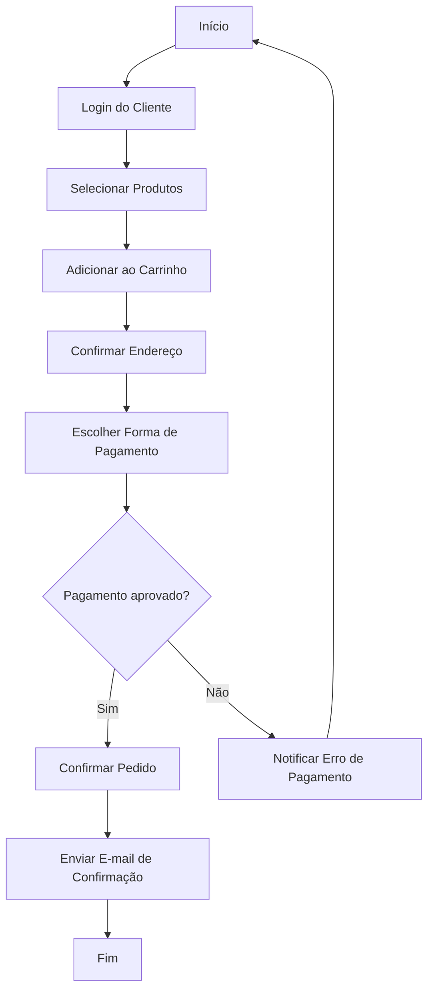
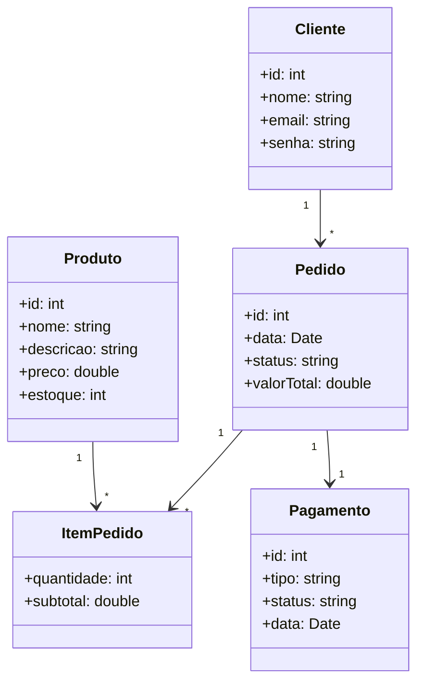
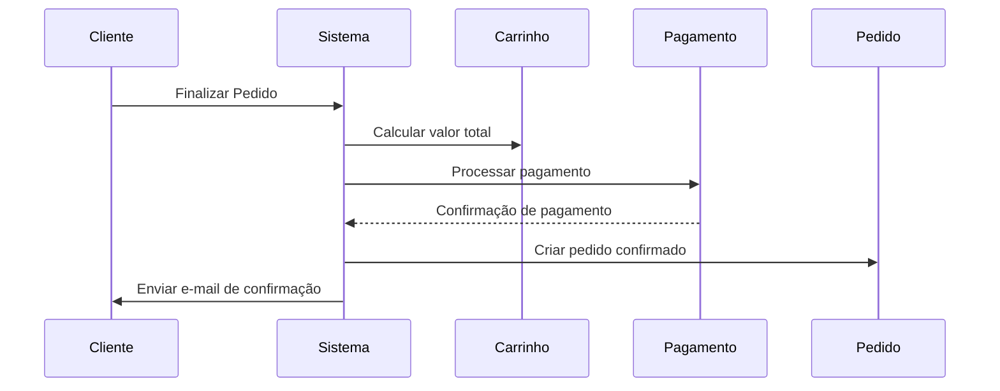
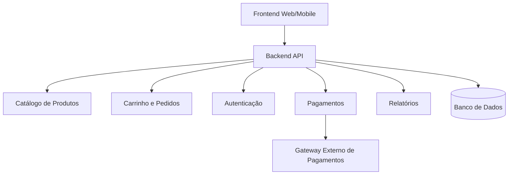
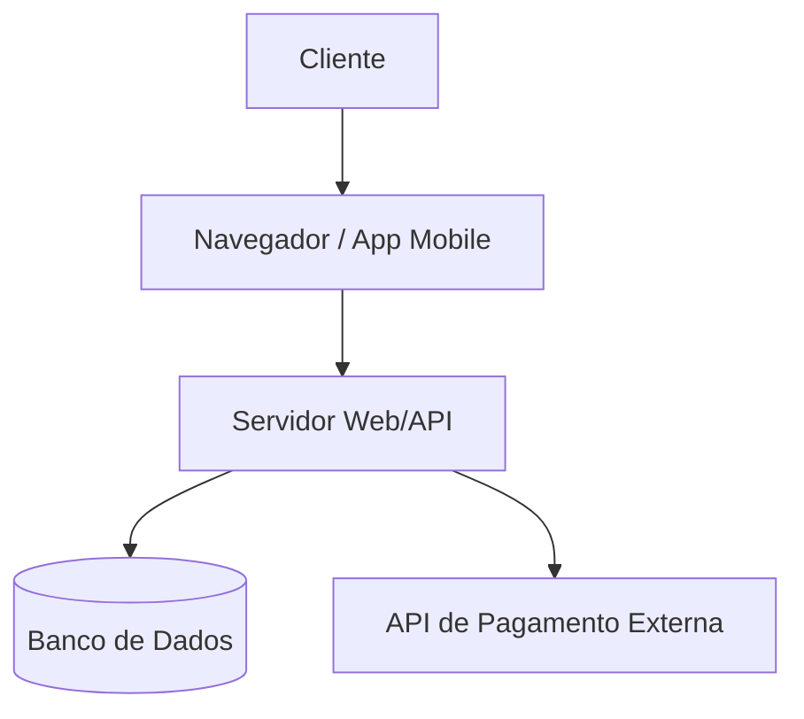

# UML aplicada a um Sistema de E-commerce

## 1. Levantamento de Requisitos

### 1.1 Requisitos Funcionais

Definem **o que o sistema deve fazer**.

Exemplos em um e-commerce:

* Cadastrar novos produtos no catálogo.
* Permitir login e cadastro de clientes.
* Adicionar produtos ao carrinho de compras.
* Calcular valor total e descontos do pedido.
* Integrar com sistema de pagamento (cartão, PIX, boleto).
* Gerar relatórios de vendas para o administrador.

### 1.2 Requisitos Não Funcionais

Definem **restrições ou qualidades do sistema**.

Exemplos:

* O sistema deve responder em menos de 2 segundos em consultas simples.
* O pagamento deve seguir protocolos de segurança (ex.: SSL, PCI-DSS).
* A aplicação deve estar disponível 24/7.
* Interface responsiva para desktop e mobile.


## 2. Modelagem de Requisitos

### 2.1 Histórias do Usuário

Formato: **Como \[ator], quero \[funcionalidade] para \[benefício].**

Exemplos:

* “Como cliente, quero adicionar produtos ao carrinho para realizar uma compra completa.”
* “Como administrador, quero cadastrar novos produtos para manter o catálogo atualizado.”
* “Como cliente, quero rastrear meu pedido para acompanhar a entrega.”

### 2.2 Diagrama de Casos de Uso

Representa **atores** e **funcionalidades principais**.

Exemplo para e-commerce:

* **Cliente**: pesquisar produto, adicionar ao carrinho, finalizar pedido, rastrear entrega.
* **Administrador**: cadastrar produto, gerenciar estoque, gerar relatórios.
* **Sistema de Pagamento**: processar transações.

```mermaid
usecaseDiagram
  actor Cliente
  actor Administrador
  actor "Sistema de Pagamento" as Pagamento

  Cliente --> (Pesquisar Produto)
  Cliente --> (Adicionar ao Carrinho)
  Cliente --> (Finalizar Pedido)
  Cliente --> (Rastrear Pedido)

  Administrador --> (Cadastrar Produto)
  Administrador --> (Gerar Relatório)

  (Finalizar Pedido) --> Pagamento
```


## 3. Modelagem de Processos

### 3.1 Diagrama de Atividades

Mostra os **fluxos de ações** do sistema.

Exemplo: **Processo de Finalização de Compra**

1. Cliente faz login.
2. Seleciona produtos e adiciona ao carrinho.
3. Confirma endereço de entrega.
4. Escolhe forma de pagamento.
5. Sistema processa pagamento.
6. Pedido é confirmado.
7. Cliente recebe notificação por e-mail.

👉 Dica didática: usar **partições (swimlanes)** para separar responsabilidades:

* Cliente
* Sistema de E-commerce
* Gateway de Pagamento

#### Diagrama de Atividades – **Fluxo de Compra**



## 4. Modelagem Estrutural

### 4.1 Diagrama de Classes

Mostra a **estrutura estática**.

Exemplo de classes em e-commerce:

* **Cliente** (id, nome, e-mail, senha)
* **Produto** (id, nome, descrição, preço, estoque)
* **Pedido** (id, data, status, valorTotal)
* **ItemPedido** (quantidade, subtotal)
* **Pagamento** (id, tipo, status, data)

Relacionamentos:

* Um Cliente pode realizar vários Pedidos.
* Um Pedido contém vários ItensPedido.
* Cada ItemPedido está associado a um Produto.
* Um Pedido gera um Pagamento.



### 4.2 Modelo de Dados (DER e Lógico)

* Tabelas correspondem às classes principais.
* Exemplo: `Clientes`, `Produtos`, `Pedidos`, `ItensPedido`, `Pagamentos`.
* DER mostra chaves primárias e estrangeiras.


## 5. Modelagem Comportamental

### 5.1 Diagrama de Sequência

Mostra **a troca de mensagens ao longo do tempo**.

Exemplo: **Checkout do Pedido**

1. Cliente → Sistema: “Finalizar Pedido”.
2. Sistema → Carrinho: calcular valor total.
3. Sistema → Gateway de Pagamento: processar transação.
4. Gateway → Sistema: confirmação de pagamento.
5. Sistema → Pedido: alterar status para “Confirmado”.
6. Sistema → Cliente: enviar notificação por e-mail.



## 6. Modelagem Arquitetural

### 6.1 Diagrama de Componentes

Mostra a divisão em **módulos de software**.

Exemplo de módulos em e-commerce:

* **Catálogo de Produtos**
* **Carrinho e Pedidos**
* **Autenticação de Usuários**
* **Pagamentos**
* **Relatórios e Promoções**




### 6.2 Diagrama de Implantação (Deployment)

Mostra **a infraestrutura**.

Exemplo simplificado:

* **Servidor Web** (frontend e backend).
* **Servidor de Banco de Dados** (armazenamento de clientes, pedidos, produtos).
* **API de Pagamento** (serviço externo).
* **Cliente** (navegador web ou aplicativo mobile).




## Resumo Didático

* **Levantamento de Requisitos** → descreve o que o sistema deve ter.
* **Casos de Uso / Histórias** → mostram quem usa e para quê.
* **Atividades** → descrevem os fluxos principais.
* **Classes / Dados** → organizam a estrutura estática.
* **Sequência** → detalha as interações dinâmicas.
* **Componentes / Implantação** → explicam a arquitetura lógica e física.