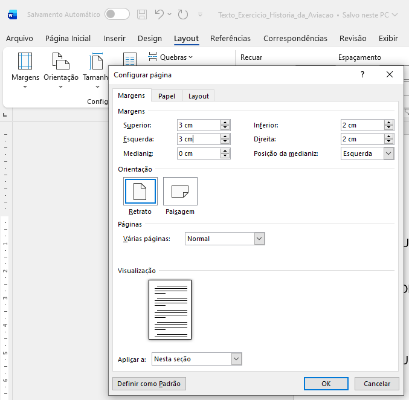
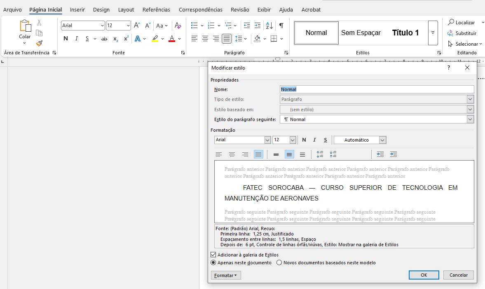
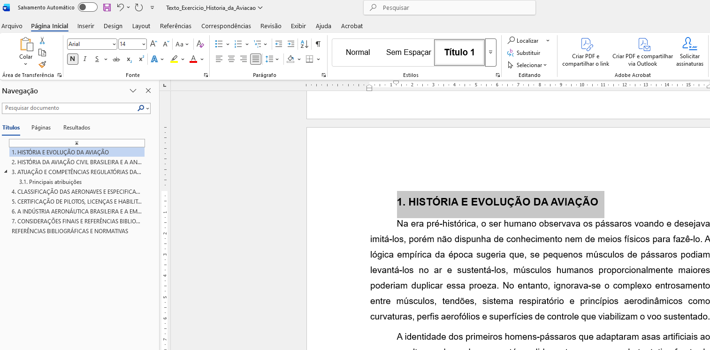
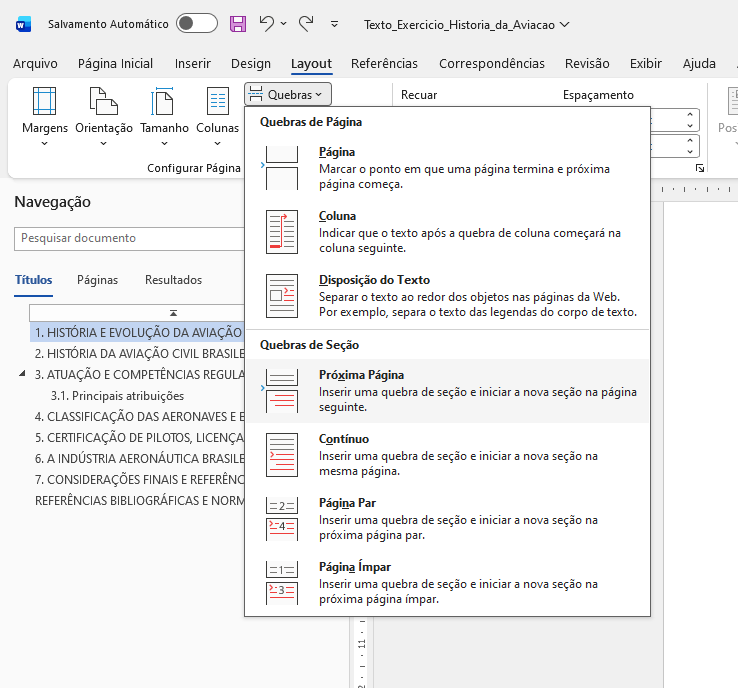
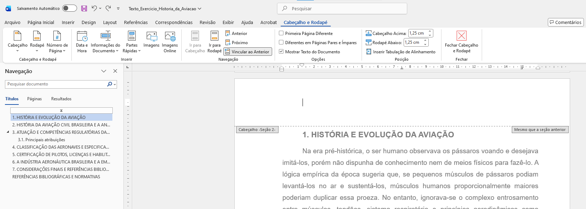
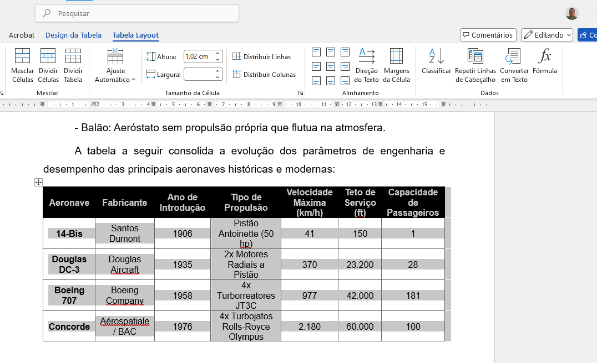
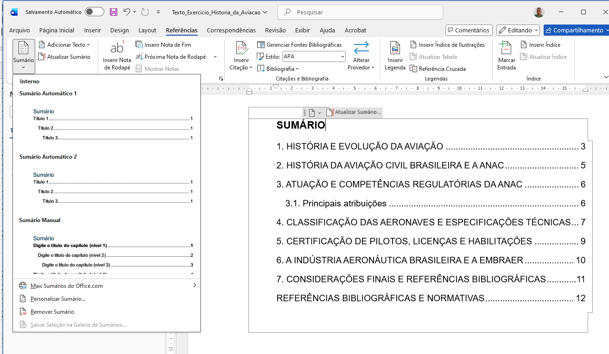
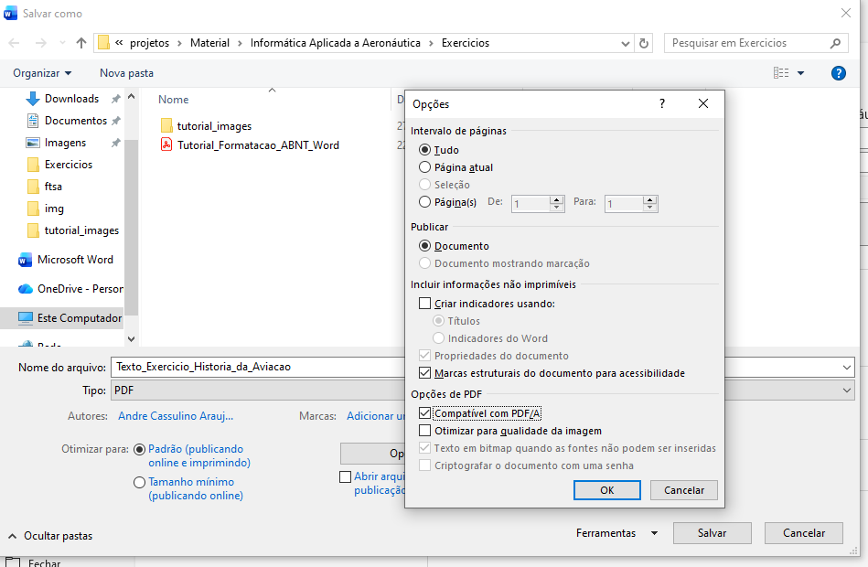

# GUIA PRÁTICO ILUSTRADO: FORMATAÇÃO ABNT NO MICROSOFT WORD
**Componente Curricular:** INF-117 — Informática Aplicada a Aeronáutica  
**Instituição:** Fatec Sorocaba — CST em Manutenção de Aeronaves  
**Professor:** André Souza  
**Arquivo Base de Exemplo:** [`Exercicios/Texto_Exercicio_Historia_da_Aviacao.txt`](Texto_Exercicio_Historia_da_Aviacao.txt)  
**Versão em PDF Diagramada:** [`Exercicios/Tutorial_Formatacao_ABNT_Word.pdf`](Tutorial_Formatacao_ABNT_Word.pdf)  

---

## Sumário do Tutorial

1. [Configuração da Página e Margens ABNT (3-3-2-2)](#1-configuração-da-página-e-margens-abnt-3-3-2-2)
2. [Padronização do Estilo "Normal" (Corpo de Texto)](#2-padronização-do-estilo-normal-corpo-de-texto)
3. [Hierarquia de Estilos de Título e Painel de Navegação](#3-hierarquia-de-estilos-de-título-e-painel-de-navegação)
4. [Criação da Capa e Inserção de Quebras de Seção](#4-criação-da-capa-e-inserção-de-quebras-de-seção)
5. [Desvinculação de Cabeçalhos e Numeração ABNT (Iniciar em 3)](#5-desvinculação-de-cabeçalhos-e-numeração-abnt-iniciar-em-3)
6. [Formatação de Tabelas Técnicas e Legendas de Figuras](#6-formatação-de-tabelas-técnicas-e-legendas-de-figuras)
7. [Geração do Sumário Automático e a Tecla F9](#7-geração-do-sumário-automático-e-a-tecla-f9)
8. [Exportação Oficial no Padrão PDF/A (ISO 19005)](#8-exportação-oficial-no-padrão-pdfa-iso-19005)
9. [Checklist Final de Autoavaliação](#9-checklist-final-de-autoavaliação)

---

## 1. Configuração da Página e Margens ABNT (3-3-2-2)

A norma **ABNT NBR 14724** exige margens assimétricas para acomodar a encadernação e furação à esquerda sem encavalar o texto:

### Passo a Passo:
1. Abra o Microsoft Word com o seu documento base.
2. Acesse a guia superior **Layout**.
3. No grupo *Configurar Página*, clique em **Tamanho** e confirme se está selecionado **A4 (21 x 29,7 cm)**.
4. Clique no botão **Margens** -> **Margens Personalizadas...** (no rodapé do menu suspenso).
5. Na caixa de diálogo **Configurar página** (aba *Margens*), defina:
   - **Superior:** `3 cm`
   - **Esquerda:** `3 cm` *(espaço reservado para encadernação)*
   - **Inferior:** `2 cm`
   - **Direita:** `2 cm`
   - **Orientação:** **Retrato** | **Várias páginas:** **Normal**
6. Clique em **OK** para aplicar as margens.

---

## 2. Padronização do Estilo "Normal" (Corpo de Texto)

> [!IMPORTANT]
> **Regra de Engenharia:** Nunca formate parágrafos selecionando texto com o mouse manualmente. Configure o estilo **Normal** para que todo o corpo do documento assuma o padrão ABNT instantaneamente!

### Passo a Passo:
1. Na guia **Página Inicial**, localize o grupo **Estilos**.
2. Clique com o **BOTÃO DIREITO** sobre o botão **Normal** -> selecione **Modificar...**
3. Na janela *Modificar estilo*:
   - Em *Formatação*: Selecione Fonte **Arial** (ou **Calibri**) | Tamanho **12 pt** | Cor **Automático (Preto)**.
   - Clique no ícone de alinhamento **Justificado** (`Ctrl + J`).
   - Clique no ícone de entrelinhas **1,5 linha**.
4. No canto inferior esquerdo da janela, clique em **Formatar** -> **Parágrafo...**:
   - **Alinhamento:** Justificado.
   - **Especial:** Selecione **Primeira linha** em **1,25 cm** *(recuo padrão ABNT)*.
   - **Espaçamento Antes:** `0 pt` | **Depois:** `6 pt`.
   - **Espaçamento entre linhas:** **1,5 linha**.
5. Clique em **OK** na janela de Parágrafo e em **OK** na janela Modificar Estilo.

---

## 3. Hierarquia de Estilos de Título e Painel de Navegação

Os títulos das seções e subseções devem ser vinculados aos estilos nativos **Título 1** e **Título 2** para estruturar o documento e viabilizar o Sumário Automático:

### Parâmetros dos Títulos:
| Nível de Título | Estilo no Word | Fonte / Tamanho | Formato Visual | Espaçamento | Atalho |
| :--- | :--- | :--- | :--- | :--- | :--- |
| **Capítulo Principal** | **Título 1** | Arial 14 pt | **Negrito, MAIÚSCULAS** | Antes: 12 pt / Depois: 6 pt | `Ctrl + Alt + 1` |
| **Subseção** | **Título 2** | Arial 12 pt | **Negrito, Caixa Mista** | Antes: 6 pt / Depois: 6 pt | `Ctrl + Alt + 2` |
| **Corpo do Relatório** | **Normal** | Arial 12 pt | Sem negrito, Justificado | Entrelinhas 1,5 linha, Depois: 6 pt | `Ctrl + Shift + N` |

### Passo a Passo:
1. Selecione os títulos principais (ex: `1. HISTÓRIA E EVOLUÇÃO DA AVIAÇÃO`, `2. HISTÓRIA DA ANAC...`) e aplique o estilo **Título 1**.
2. Selecione as subseções (ex: `3.1. Principais atribuições`) e aplique o estilo **Título 2**.
3. Pressione `Ctrl + F` (ou acesse a guia *Exibir -> Painel de Navegação*) e clique na aba **Títulos** para visualizar a árvore hierárquica completa em tempo real.

---

## 4. Criação da Capa e Inserção de Quebras de Seção

> [!CAUTION]
> Para que a Capa e o Sumário não exibam números de página impressos (exigência da ABNT), o documento precisa ser dividido em **SEÇÕES** independentes utilizando **Quebras de Seção (Próxima Página)**.

### Passo a Passo:
1. **Página 1 (Capa):** Preencha os dados institucionais centralizados (Instituição, Curso, Autor, Título, Local e Ano).
2. No final da Capa (após o ano), acesse a guia **Layout** -> grupo *Configurar Página* -> clique em **Quebras** -> selecione **Quebras de Seção: Próxima Página**.
3. **Página 2 (Sumário):** Digite a palavra `SUMÁRIO` centralizada (página reservada para o sumário automático).
4. No final da página do Sumário, insira OUTRA **Quebras de Seção: Próxima Página**.
5. **Página 3 em diante (Corpo Textual):** A partir daqui inicia-se a **Seção 2** (onde começa o capítulo `1. HISTÓRIA E EVOLUÇÃO DA AVIAÇÃO`), totalmente isolada da Capa e do Sumário!

---

## 5. Desvinculação de Cabeçalhos e Numeração ABNT (Iniciar em 3)

### O Passo Mais Crítico:
1. Vá até a **Página 3** (onde começa a Introdução / Seção 2) e dê um **DUPLO CLIQUE** na área do Cabeçalho.
2. Observe a guia contextual superior **Cabeçalho e Rodapé** e as etiquetas: `Cabeçalho -Seção 2-` à esquerda e `Mesmo que a seção anterior` à direita.
3. No grupo *Navegação*, localize o botão **"Vincular ao Anterior"** (que estará ativado/destacado).
4. **CLIQUE NO BOTÃO "VINCULAR AO ANTERIOR" PARA DESATIVÁ-LO!** A etiqueta `Mesmo que a seção anterior` desaparecerá, cortando o vínculo com a Capa e o Sumário.
5. Ainda na guia *Cabeçalho e Rodapé*:
   - No grupo à esquerda, clique em **Número de Página** -> **Formatar Números de Página...**
   - Marque a opção **Iniciar em:** e digite o número **3** (contando Capa=1 e Sumário=2) -> clique em **OK**.
   - Clique novamente em **Número de Página** -> **Início da Página** -> **Número Sem Formatação 3** (canto superior direito).
6. Clique no botão vermelho **Fechar Cabeçalho e Rodapé** (ou dê duplo clique no meio da folha).
7. **Verificação Obrigatória:** Role para cima e confirme que a Capa e o Sumário continuam limpos, **sem numeração visível**, enquanto o número 3 aparece perfeitamente no topo direito da Introdução!

---

## 6. Formatação de Tabelas Técnicas e Legendas de Figuras

### Passo a Passo:
1. **Tabela Técnica de Aeronaves (Seção 4):**
   - Converta os dados na grade técnica de 7 colunas x 8 linhas.
   - Na guia **Design da Tabela**, aplique sombreamento escuro e texto branco em negrito na primeira linha (cabeçalho).
   - Na guia **Tabela Layout** -> grupo **Alinhamento**, clique em **Alinhar ao Centro** (ícone central da grade 3x3) para centralizar os dados vertical e horizontalmente.
   - Na guia **Tabela Layout** -> grupo **Dados**, clique em **Repetir Linhas de Cabeçalho** para garantir que o cabeçalho reapareça no topo caso a tabela quebre em mais de uma página.
2. **Legenda Oficial da Tabela (ABNT):**
   - Clique com o botão direito na alça da tabela -> **Inserir Legenda...** -> Rótulo: **Tabela** -> `: Comparativo de especificações de aeronaves históricas e modernas` (Posição: *Acima do item selecionado*).
   - Abaixo da tabela, digite em 10 pt: `Fonte: Cartilha ANAC e Manuais Operacionais (2026).`
3. **Figuras Técnicas:**
   - Centralize a imagem da aeronave (Embraer E195-E2 ou 14-Bis).
   - Botão direito na foto -> **Inserir Legenda...** -> Rótulo: **Figura** -> `: Aeronave comercial moderna com materiais compostos e motores Geared Turbofan`.
   - Abaixo da foto, digite em 10 pt: `Fonte: Embraer Media Center (2026).`

---

## 7. Geração do Sumário Automático e a Tecla F9

### Passo a Passo:
1. Posicione o cursor na **Página 2** (abaixo da palavra `SUMÁRIO`).
2. Acesse a guia superior **Referências** -> grupo *Sumário* -> botão **Sumário** -> **Sumário Automático 1**.
3. O Word varre todos os estilos `Título 1` e `Título 2` e indexa os capítulos, subseções e páginas correspondentes com linha pontilhada.
4. **Atualização Dinâmica (`F9`):** Sempre que editar textos, adicionar figuras ou renomear seções, clique em qualquer ponto do sumário e pressione a tecla **F9** (ou clique no botão flutuante **"Atualizar Sumário..."**) -> selecione *Atualizar o índice inteiro* -> OK!

---

## 8. Exportação Oficial no Padrão PDF/A (ISO 19005)

### Passo a Passo:
1. Acesse **Arquivo -> Salvar Como** (ou tecla `F12`).
2. Escolha o local e digite o nome do arquivo: `Relatorio_ABNT_SeuNome_RA.pdf`.
3. Em *Tipo*, escolha **PDF (*.pdf)**.
4. Clique no botão **Opções...** (ou **Mais opções...**).
5. Na janela de Opções, na seção *Opções de PDF*, **marque a caixa: "Compatível com PDF/A"** (norma ISO 19005 de preservação inviolável).
6. Clique em **OK** e depois em **Salvar**.

---

## 9. Checklist Final de Autoavaliação

- [ ] Margens configuradas em Superior: 3 cm, Esquerda: 3 cm, Inferior: 2 cm, Direita: 2 cm (Papel A4).
- [ ] Estilo Normal em Arial 12 pt, Justificado, 1,5 linha, recuo de 1ª linha em 1,25 cm, depois 6 pt.
- [ ] Estilos Título 1 (14 pt, Negrito, MAIÚSCULAS) e Título 2 (12 pt, Negrito) aplicados em todas as 7 seções.
- [ ] Painel de Navegação aberto com `Ctrl + F` exibindo a árvore de tópicos completa.
- [ ] Quebra de Seção (Próxima Página) inserida no final da Capa e no final do Sumário.
- [ ] Botão "Vincular ao Anterior" desativado no cabeçalho da Seção 2 (Página 3).
- [ ] Numeração ABNT visível apenas a partir da página 3 (Introdução), no canto superior direito.
- [ ] Tabela técnica com alinhamento ao centro (grade 3x3), cabeçalho repetível, legenda acima e fonte abaixo em 10 pt.
- [ ] Figura técnica centralizada com legenda oficial e fonte em 10 pt.
- [ ] Sumário Automático gerado na Página 2 e atualizado dinamicamente com a tecla F9.
- [ ] Arquivo editável (`.docx`) e arquivo inviolável (`.pdf` em PDF/A) gerados e prontos para envio.
