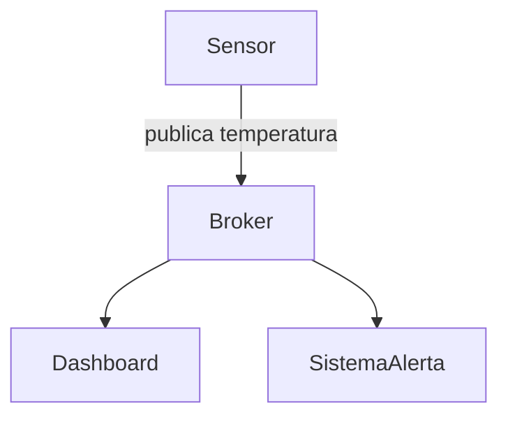
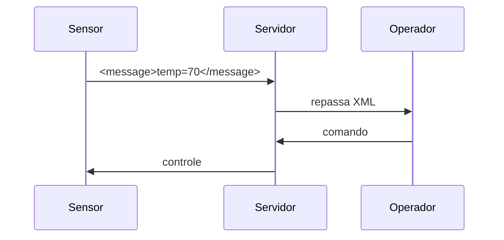
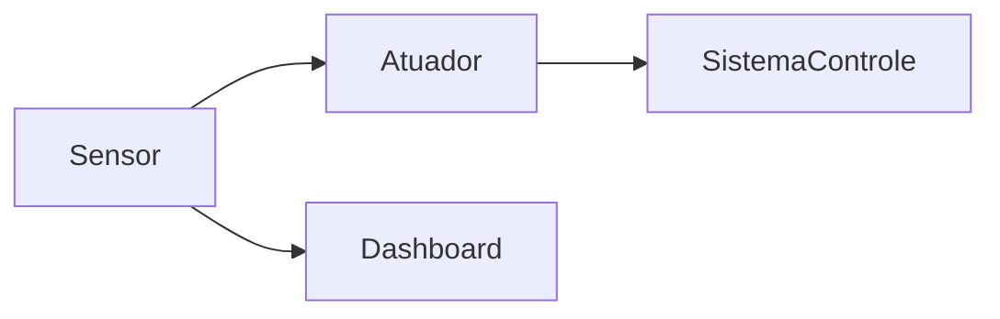
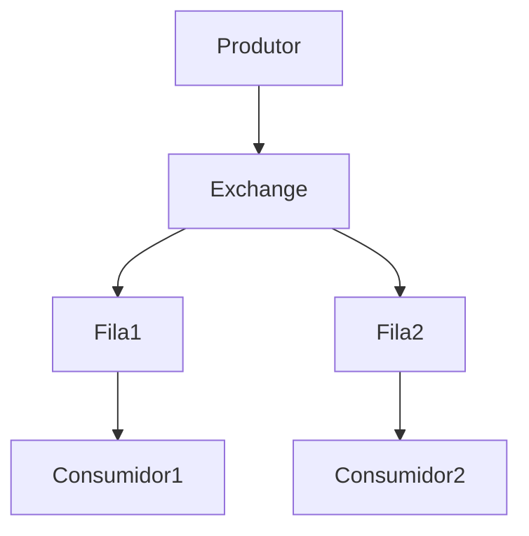
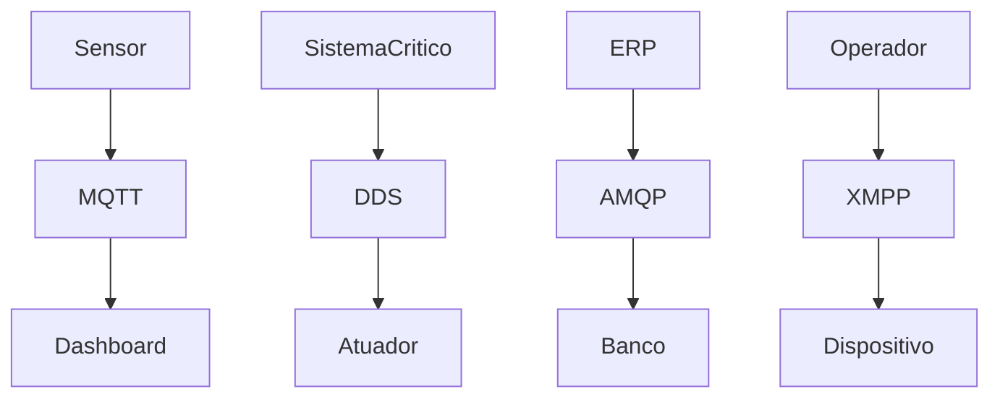

# Protocolos de Comunicação para IIoT

A comunicação em **IIoT (Industrial Internet of Things)** não é apenas uma questão de “enviar dados”, mas de **como garantir que esses dados cheguem no tempo certo, com confiabilidade e consumindo poucos recursos**. Em ambientes industriais, uma escolha errada de protocolo pode significar desde perda de eficiência até falhas operacionais críticas. Por isso, entender como cada protocolo funciona na prática — e não só conceitualmente — é essencial.


No caso do **MQTT**, o que o torna tão popular é a sua simplicidade combinada com eficiência. Ele segue o modelo *publish/subscribe*, em que os dispositivos não se comunicam diretamente entre si. Em vez disso, tudo passa por um intermediário chamado *broker*. Isso desacopla completamente quem envia e quem recebe os dados.

Na prática, imagine um sensor de temperatura em uma máquina industrial. Ele não precisa saber quem vai usar essa informação — apenas publica o valor em um “tópico”. Qualquer sistema interessado (dashboard, alerta, banco de dados) simplesmente se inscreve nesse tópico.



Essa arquitetura facilita escalabilidade: novos consumidores podem ser adicionados sem alterar o sensor.

Um exemplo simples em Python deixa isso claro. Aqui, o sensor publica dados continuamente:

```python
import paho.mqtt.client as mqtt
import time
import random

client = mqtt.Client()
client.connect("localhost", 1883, 60)

while True:
    temp = random.randint(20, 80)
    client.publish("fabrica/maquina1/temperatura", temp)
    print(f"Enviado: {temp}")
    time.sleep(2)
```

Do outro lado, qualquer sistema pode consumir:

```python
import paho.mqtt.client as mqtt

def on_message(client, userdata, msg):
    print(f"Recebido: {msg.payload.decode()}")

client = mqtt.Client()
client.connect("localhost", 1883, 60)

client.subscribe("fabrica/maquina1/temperatura")
client.on_message = on_message

client.loop_forever()
```

Observe que não há conexão direta entre os dois. Essa é a grande força do MQTT: **baixo acoplamento + leveza**. Por isso, ele domina cenários com sensores simples e redes limitadas.


Já o **XMPP** segue uma lógica diferente. Ele foi criado para comunicação em tempo real (como chats), e por isso carrega um conceito importante: **presença**. Em sistemas industriais, isso significa saber se um dispositivo está online, ativo ou indisponível.

A comunicação ocorre por mensagens estruturadas em XML, o que traz flexibilidade, mas também aumenta o custo de processamento.



Diferente do MQTT, aqui há uma relação mais explícita entre os participantes. Isso permite, por exemplo, enviar comandos diretamente a um dispositivo específico.

Um exemplo simples em Python:

```python
from slixmpp import ClientXMPP

class SensorXMPP(ClientXMPP):
    def __init__(self, jid, password):
        super().__init__(jid, password)
        self.add_event_handler("session_start", self.start)

    async def start(self, event):
        self.send_presence()
        await self.get_roster()

        self.send_message(
            mto="operador@localhost",
            mbody="<temp>75</temp>",
            mtype='chat'
        )
        self.disconnect()

xmpp = SensorXMPP("sensor@localhost", "123")
xmpp.connect()
xmpp.process()
```

Aqui já aparece uma diferença importante: além de enviar dados, o cliente também se registra, autentica e informa sua presença. Isso faz do XMPP uma boa escolha quando **identidade e estado dos dispositivos são relevantes**.


Quando entramos no **DDS**, o cenário muda significativamente. Esse protocolo foi projetado para sistemas onde **tempo real é crítico**, como robótica, defesa ou veículos autônomos. A principal diferença é que ele elimina completamente o broker.

Ou seja, os dispositivos se comunicam diretamente, em uma arquitetura *peer-to-peer*.



Essa ausência de intermediário reduz latência e aumenta previsibilidade — dois fatores essenciais em sistemas críticos.

No DDS, os dados são organizados em “tópicos”, mas com uma abordagem *data-centric*. Isso significa que o foco não é a mensagem em si, mas o estado do dado no sistema.

Embora o uso real em Python dependa de bibliotecas específicas (como FastDDS ou RTI Connext), podemos representar o comportamento de forma didática:

```python
import time
import random

def publicar():
    while True:
        dado = random.randint(0, 100)
        print(f"[DDS Publisher] {dado}")
        time.sleep(1)

def consumir():
    print("[DDS Subscriber] escutando dados...")

# Em um ambiente real:
# writer.write(dado)
# reader.take()
```

O ponto importante aqui não é o código em si, mas o conceito: **não existe servidor central**. Isso exige mais configuração, mas entrega desempenho superior.


Por fim, o **AMQP** traz uma abordagem orientada a filas, muito comum em sistemas corporativos. Diferente do MQTT, que é leve e simples, o AMQP é mais robusto e permite controle avançado do fluxo de mensagens.

A comunicação passa por um componente chamado *exchange*, que decide como as mensagens serão roteadas para as filas.



Isso permite cenários complexos, como:

* balanceamento de carga
* roteamento por tipo de mensagem
* processamento assíncrono

Um exemplo prático com RabbitMQ:

```python
import pika

connection = pika.BlockingConnection(pika.ConnectionParameters('localhost'))
channel = connection.channel()

channel.queue_declare(queue='fila_iiot')

channel.basic_publish(
    exchange='',
    routing_key='fila_iiot',
    body='Temperatura: 65'
)

print("Mensagem enviada")
connection.close()
```

E o consumidor:

```python
import pika

def callback(ch, method, properties, body):
    print(f"Recebido: {body.decode()}")

connection = pika.BlockingConnection(pika.ConnectionParameters('localhost'))
channel = connection.channel()

channel.queue_declare(queue='fila_iiot')

channel.basic_consume(
    queue='fila_iiot',
    on_message_callback=callback,
    auto_ack=True
)

print("Aguardando mensagens...")
channel.start_consuming()
```

Aqui, diferente do MQTT, a mensagem pode ficar armazenada na fila até ser processada. Isso garante confiabilidade, mesmo em cenários de falha.


Ao observar os quatro protocolos em conjunto, fica claro que eles não competem diretamente — eles **se complementam**. Em uma arquitetura industrial real, é comum encontrar mais de um deles sendo utilizado ao mesmo tempo.



Essa combinação permite equilibrar:

* leveza (MQTT)
* estrutura e controle (XMPP)
* tempo real (DDS)
* confiabilidade (AMQP)


No fim, a escolha do protocolo não deve ser baseada em popularidade, mas sim em requisitos do sistema. Quando o problema é bem entendido — latência, confiabilidade, consumo de energia — a escolha do protocolo se torna quase natural.
