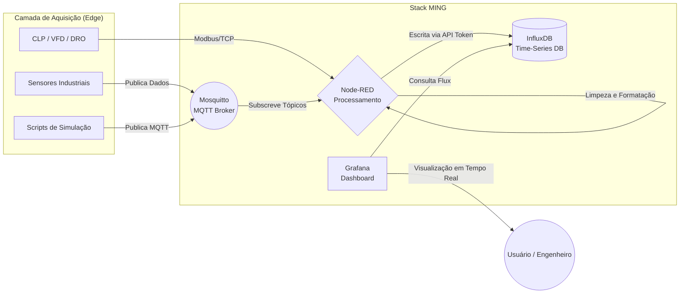

# Laboratórios em IIoT: Arquiteturas e Fluxos de Dados com a Stack MING

## 1. Introdução
Os laboratórios de Internet das Coisas Industrial (IIoT) são ambientes fundamentais para validar conceitos teóricos por meio da experimentação prática. Eles permitem explorar arquiteturas reais, simulando o chão de fábrica e a computação de borda (*Edge Computing*). 

Com a transição das operações industriais para a inteligência em tempo real, a capacidade de normalizar e processar dados localmente tornou-se uma necessidade estratégica. Nesse contexto, a **Stack MING** tem se destacado. Inspirada na clássica Stack LAMP do desenvolvimento web, a Stack MING padroniza a coleta, o armazenamento e a visualização de dados IoT usando ferramentas de código aberto bem estabelecidas: **M**osquitto (MQTT), **I**nfluxDB, **N**ode-RED e **G**rafana. Essa padronização reduz o atrito e permite que os desenvolvedores criem pipelines robustos sem "reinventar a roda".


## 2. Pipeline de Dados IIoT com a Stack MING
A arquitetura típica de um laboratório baseado na Stack MING segue um fluxo de desacoplamento eficiente, onde cada serviço executa seu papel de forma independente, geralmente dentro de contêineres Docker. 

Abaixo, um diagrama da arquitetura de dados representando a Stack MING:



Neste pipeline, o **Mosquitto** atua como o mensageiro leve e tolerante a falhas, o **Node-RED** como o motor de regras e integração, o **InfluxDB** como o repositório otimizado para séries temporais e o **Grafana** como a interface de consumo analítico.


## 3. Simulação de Dispositivos e Aquisição de Dados (O "M" - Mosquitto/MQTT)
Em um ambiente de laboratório, nem sempre temos hardwares físicos disponíveis em escala. Por isso, a geração de dados sintéticos e testes de carga são vitais. O **MQTT** desempenha um papel central ao desacoplar a aquisição de dados do armazenamento.

Abaixo, apresentamos um código em **Python** (utilizando a biblioteca `paho-mqtt`) para simular um sensor de vibração industrial que publica dados sintéticos continuamente no broker Mosquitto local:

```python
import paho.mqtt.client as mqtt
import random
import time

# Configurações do Broker Mosquitto local
BROKER = "localhost"
PORT = 1883
TOPIC = "Factory_Machine/Vibration"

# Inicializa o Cliente MQTT
client = mqtt.Client(client_id="Vibration_Simulator")
client.connect(BROKER, PORT, 60)
client.loop_start()

print(f"Iniciando simulação de vibração no tópico: {TOPIC}")

try:
    while True:
        # Gera valor sintético de vibração (ex: aceleração RMS em mm/s)
        vibration_value = round(random.uniform(0.5, 5.0), 3)
        payload = f'{{"sensor": "vibration_01", "value": {vibration_value}}}'
        
        # Publica no Mosquitto
        client.publish(TOPIC, payload, qos=1)
        print(f"Publicado: {payload}")
        
        time.sleep(2) # Intervalo de publicação
except KeyboardInterrupt:
    print("Simulação encerrada.")
    client.loop_stop()
    client.disconnect()
```
Essa abordagem permite estressar o pipeline com alto volume de mensagens (alterando o tempo de `sleep` e disparando múltiplos scripts), validando a confiabilidade e escalabilidade da Stack.


## 4. Processamento de Dados (O "N" - Node-RED)
O **Node-RED** é o coração lógico da arquitetura. Ele fornece uma interface de programação visual (*low-code*) para conectar dispositivos, APIs e fluxos de dados. 

Um fluxo (flow) típico em laboratório para a Stack MING segue o padrão:
1. **MQTT In / Modbus Read**: Recebe os dados brutos da máquina (por vezes criptografados em hexadecimal ou arrays).
2. **Function Node (Transformação)**: Aplica um script em JavaScript para filtrar e construir o payload (JSON) que o banco de dados exige.
3. **Debug Node**: Facilita a visualização do tráfego interno no console para resolução de problemas.
4. **InfluxDB Out**: Envia os pontos estruturados ao banco via HTTP usando um *API Token*.

**Exemplo de código dentro do "Function Node" no Node-RED:**
```javascript
// O payload chega via MQTT como string de um JSON
let rawData = JSON.parse(msg.payload);

// Formatação para envio ao módulo do InfluxDB
// O InfluxDB exige definição de 'measurement', 'fields' e opcionalmente 'tags'
msg.payload = [{
    measurement: "vibration_metrics",
    fields: {
        value: rawData.value
    },
    tags: {
        sensor_id: rawData.sensor,
        machine: "Lathe_01"
    }
}];

return msg;
```


## 5. Armazenamento (O "I" - InfluxDB)
Para análise de telemetria IIoT, bancos relacionais não são adequados devido à alta carga de escrita e dependência de "carimbos de tempo". O **InfluxDB** soluciona isso por ser um banco de dados de séries temporais focado em alta velocidade de armazenamento, recuperação e compressão.

No InfluxDB moderno (v2.x), os laboratórios devem configurar:
* Uma **Organization** (ex: `lab_industrial`).
* Um **Bucket** de armazenamento com política de retenção (ex: deletar dados maiores que 720 horas para evitar estouro de memória no *Edge Gateway*).
* Um **API Token** para autenticar de forma segura as gravações advindas do Node-RED e a leitura feita pelo Grafana.


## 6. Visualização e Monitoramento (O "G" - Grafana)
O **Grafana** consome diretamente o InfluxDB para apresentar as métricas operacionais, tendências de eficiência e disparar alertas preditivos. 

Ao configurar o InfluxDB como *Data Source* no Grafana, utilizamos a linguagem de consulta **Flux** para exibir séries temporais avançadas e painéis interativos. 

**Exemplo de Query Flux no Grafana para exibir o histórico de vibração:**
```flux
from(bucket: "lab_industrial")
  |> range(start: v.timeRangeStart, stop: v.timeRangeStop)
  |> filter(fn: (r) => r["_measurement"] == "vibration_metrics")
  |> filter(fn: (r) => r["_field"] == "value")
  |> filter(fn: (r) => r["sensor_id"] == "vibration_01")
  |> aggregateWindow(every: 10s, fn: mean, createEmpty: false)
  |> yield(name: "mean")
```
Com o Grafana, é possível visualizar falhas potenciais antes de acontecerem, criando limites (thresholds) que alertam os engenheiros em casos de pico (ex: vibração acima de 4.0 mm/s).


## 7. Implantação e Análise de Desempenho
A beleza da Stack MING é que ela pode ser executada em um simples Raspberry Pi (usando sistemas como o *IoT Stack* ou *Balena*), PCs Industriais IPCs, ou Edge Gateways industriais robustos (ex: Robustel EG5120 rodando Debian).

Para a orquestração em laboratório, a ferramenta mais comum é o **Docker Compose**. Todos os serviços rodam de forma conteinerizada compartilhando uma rede interna.

**Snippet conceitual de um `docker-compose.yml` para a Stack MING:**
```yaml
version: '3'
services:
  mosquitto:
    image: eclipse-mosquitto:latest
    ports:
      - "1883:1883"
      
  influxdb:
    image: influxdb:latest
    ports:
      - "8086:8086"
      
  nodered:
    image: nodered/node-red:latest
    ports:
      - "1880:1880"
    depends_on:
      - mosquitto
      - influxdb
      
  grafana:
    image: grafana/grafana:latest
    ports:
      - "3000:3000"
    depends_on:
      - influxdb
```

Com o sistema rodando, a **análise de desempenho** do laboratório foca em avaliar latência, escalabilidade e sobrecarga de CPU. Observa-se que gateways de borda conseguem consolidar toda esta infraestrutura pesada diminuindo o uso excessivo de banda de internet, pois apenas *insights* relevantes ou dados comprimidos precisam ser enviados a uma possível nuvem.


## 8. Integração Completa e Conclusão
Os laboratórios que adotam a Stack MING consolidam a arquitetura IIoT em sua plenitude, eliminando a dependência de plataformas opacas ou *softwares* legados complexos. Essa abordagem (*low-code* / *open-source*) converte a coleta de dados - desde os bits incompreensíveis dos registradores Modbus do chão de fábrica, passando pelas tomadas de decisão no Node-RED e InfluxDB, até dashboards altamente iterativos no Grafana - em fluxos de dados contínuos, flexíveis e à prova de obsolescência. 

Essa base também é estendida com facilidade para a Inteligência Artificial na Borda (Edge AI), utilizando tecnologias combinadas (como o Edge Impulse) para processamento inferencial local, acionando manutenções preditivas, controles avançados ou integração completa com sistemas de negócio de forma fluida.