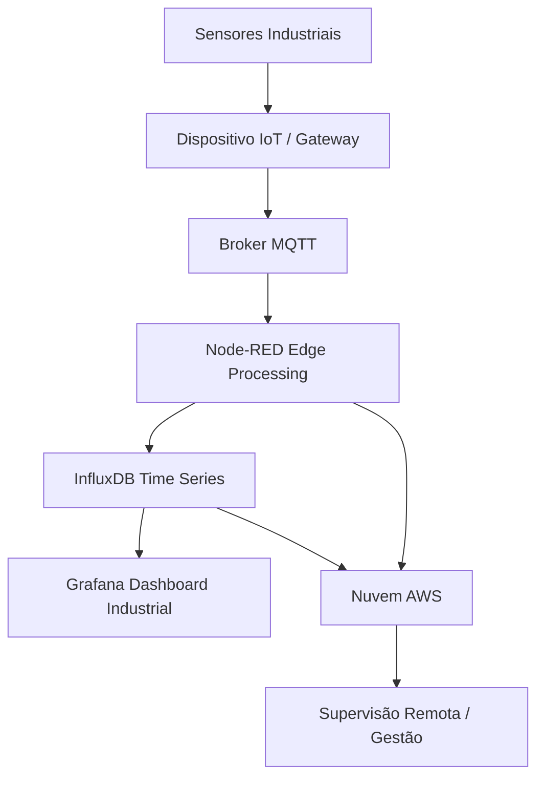

# Projeto Prático — IIoT em Montadora de Veículos com Stack MING

## Objetivo do Projeto

Sua equipe deverá desenvolver uma **solução IIoT aplicada a um processo de uma montadora de veículos**, implementando uma arquitetura industrial moderna capaz de:

✔ coletar dados de sensores industriais
✔ transmitir dados via MQTT
✔ processar informações em borda
✔ armazenar dados históricos
✔ monitorar operações em tempo real
✔ integrar supervisão à nuvem da Amazon Web Services (AWS)

O sistema deve representar o fluxo completo **do chão de fábrica até a supervisão digital**.

## Contexto Industrial Obrigatório

Seu projeto deve simular ou implementar um processo típico de uma montadora, como:

* Linha de montagem automatizada
* Monitoramento de robôs industriais
* Controle de qualidade de produção
* Monitoramento de máquinas
* Cabine de pintura
* Manutenção preditiva
* Monitoramento energético
* Rastreamento de peças

## Arquitetura Tecnológica Obrigatória

Seu sistema deverá utilizar integralmente a **stack MING**:

* MQTT → comunicação de dados industriais
* Node-RED → processamento em borda
* InfluxDB → armazenamento de séries temporais
* Grafana → supervisão e dashboards

Além disso:

* integração com serviços educacionais em nuvem AWS

## Componentes Técnicos Obrigatórios

### 1️ Dispositivos IIoT

Use ao menos um:

* ESP32 / ESP8266
* Raspberry Pi
* Gateway IoT
* PLC simulado
* Dispositivo virtual

### 2️ Sensores Industriais

Escolher conforme o processo:

* temperatura
* vibração
* corrente elétrica
* proximidade
* torque
* produção (contagem)
* ambiente industrial

### 3️ Comunicação

Obrigatório:

* protocolo MQTT
* broker MQTT configurado
* estrutura de tópicos organizada

### 4️ Edge Computing (Node-RED)

Implementar pelo menos:

✔ filtragem de dados
✔ regras de decisão
✔ detecção de anomalias
✔ alertas
✔ pré-processamento

### 5️ Armazenamento e Monitoramento

* dados gravados no InfluxDB
* dashboards em tempo real no Grafana

### 6 Integração em Nuvem

Implementar pelo menos uma função:

* hospedagem de serviço
* armazenamento
* backend
* integração IoT
* processamento remoto
* visualização remota

## Fluxo Funcional Esperado

1. Sensor coleta dados
2. Dados enviados via MQTT
3. Node-RED processa e aplica regras
4. Dados armazenados no InfluxDB
5. Grafana exibe dashboards
6. Sistema envia ou replica dados para nuvem AWS

## Diagrama Oficial da Arquitetura

Copie e visualize em qualquer renderizador Mermaid.

## Entregas Obrigatórias

### Sistema funcional ou simulado

* geração de dados
* comunicação MQTT
* processamento Node-RED
* armazenamento InfluxDB
* dashboard Grafana
* integração com nuvem

### Documentação técnica do sistema

Deve conter:

* descrição do processo industrial
* arquitetura do sistema
* dispositivos utilizados
* estrutura MQTT
* lógica de processamento
* estrutura do banco de dados
* dashboards implementados
* integração com nuvem
* resultados obtidos

### Apresentação prática

Demonstrar ao vivo:

✔ fluxo de dados
✔ processamento em borda
✔ monitoramento em tempo real
✔ funcionamento da solução industrial

## O que será avaliado

* funcionamento técnico da arquitetura
* coerência industrial da solução
* uso correto da stack MING
* implementação de edge computing
* qualidade dos dashboards
* integração com nuvem
* clareza da documentação
* domínio do funcionamento do sistema

## Resultado Esperado

Ao final do projeto, sua equipe deverá ter construído um **sistema de monitoramento industrial completo**, semelhante aos utilizados em ambientes reais da Indústria 4.0.
