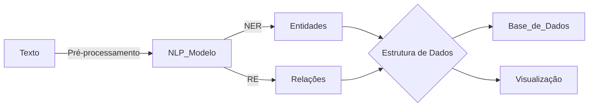

# Descoberta de Conhecimento em Textos (KDT)

A **Descoberta de Conhecimento em Textos** (*Knowledge Discovery in Texts – KDT*), ou **mineração de textos**, é uma área interdisciplinar voltada para a extração automatizada de informações úteis, padrões ou conhecimento implícito a partir de grandes volumes de dados textuais não estruturados. Essa abordagem é cada vez mais relevante diante do crescimento exponencial de dados gerados em redes sociais, documentos corporativos, artigos científicos, entre outros.

O processo de KDT envolve etapas como **pré-processamento textual**, **extração de características**, **mineração de padrões** e **interpretação dos resultados**, adaptadas às peculiaridades da linguagem natural.

Entre as tarefas comuns estão:

* **Extração de informação**
* **Classificação de textos**
* **Agrupamento de documentos**
* **Extração de tópicos**
* **Análise de sentimentos e opinião**
* **Resumo automático**

Ferramentas modernas utilizam **PLN**, **aprendizado de máquina**, **linguística computacional**, e **deep learning** com modelos como BERT e GPT. A tendência é integrar abordagens simbólicas e neurais para obter melhores resultados.

---

## Objetivos do Estudo em KDT

1. Compreender o ciclo completo da mineração de textos;
2. Aplicar técnicas de pré-processamento textual;
3. Empregar algoritmos de classificação, clustering e modelagem de tópicos;
4. Avaliar os resultados utilizando métricas apropriadas;
5. Refletir sobre desafios e oportunidades da aplicação de KDT em contextos reais.

---


## Extração de Informação (Information Extraction - IE)

### Definição

A **Extração de Informação** é o processo de **identificar e estruturar automaticamente informações relevantes em textos não estruturados**. Em geral, envolve identificar:

* **Entidades nomeadas** (*Named Entities*): pessoas, organizações, locais, datas, valores monetários, etc.
* **Relações entre entidades**: como "trabalha para", "nasceu em", "foi fundada por", etc.
* **Eventos**: acontecimentos que envolvem uma ou mais entidades, como "assinatura de contrato", "lançamento de produto", etc.

Esse processo transforma dados textuais em uma **forma estruturada**, como tabelas ou grafos, tornando possível realizar buscas, análises e inferências sobre os dados.

---

### Técnicas Comuns

* **Reconhecimento de Entidades Nomeadas (NER)** – Identificar e classificar nomes no texto.
* **Reconhecimento de Relações (RE)** – Detectar relações entre entidades.
* **Extração de Eventos** – Detectar eventos mencionados no texto.
* **Templates de Preenchimento** – Organizar informações extraídas em formatos estruturados.

---

### Exemplo Prático em Python com spaCy

Vamos usar a biblioteca **spaCy**, que é eficiente e muito usada para PLN e tarefas de IE.

#### 1. Instalar spaCy e carregar modelo

```bash
pip install spacy
python -m spacy download en_core_web_sm
```

#### 2. Código para NER (Reconhecimento de Entidades Nomeadas)

```python
import spacy

# Carregar o modelo de idioma em inglês
nlp = spacy.load("en_core_web_sm")

# Texto de exemplo
text = "Elon Musk is the CEO of SpaceX and was born in Pretoria, South Africa."

# Processar o texto
doc = nlp(text)

# Exibir entidades nomeadas
for ent in doc.ents:
    print(f"{ent.text} ({ent.label_})")
```

#### Saída Esperada:

```
Elon Musk (PERSON)
SpaceX (ORG)
Pretoria (GPE)
South Africa (GPE)
```

#### 3. Visualização com displacy

```python
from spacy import displacy

displacy.serve(doc, style="ent")
```

Isso abrirá um servidor local com uma visualização colorida das entidades no navegador.

---

### Extração de Relações (Simples com regras)

```python
for token in doc:
    if token.dep_ == "ROOT":
        subject = [w for w in token.lefts if w.dep_ in ("nsubj", "nsubjpass")]
        object_ = [w for w in token.rights if w.dep_ in ("dobj", "attr")]
        if subject and object_:
            print(f"'{subject[0]}' {token.lemma_} '{object_[0]}'")
```

#### Exemplo com texto:

```python
text = "Jeff Bezos founded Amazon in 1994."
```

#### Saída simplificada:

```
'Jeff Bezos' found 'Amazon'
```

---

### Alternativas e Complementos

* `nltk`: bom para tarefas básicas e estudo.
* `stanza` (Stanford NLP): mais preciso, especialmente em outras línguas.
* `transformers` com modelos como `bert-base-cased` + `bertforTokenClassification` (HuggingFace) para NER e RE de alto desempenho.
* `spaCy + Matcher/EntityRuler`: regras personalizadas para detectar entidades específicas do domínio.

---

### Aplicações em Diferentes Áreas

| Área      | Aplicação de IE                                   |
| --------- | ------------------------------------------------- |
| Saúde     | Extrair sintomas, diagnósticos, tratamentos       |
| Direito   | Identificar partes, datas e termos em sentenças   |
| Negócios  | Detectar menções de concorrentes ou produtos      |
| Educação  | Mapear autores e conceitos em artigos científicos |
| Segurança | Monitoramento de ameaças em redes sociais         |

---

### Fluxo de Extração de Informação



---

Ferramentas modernas de KDT utilizam técnicas de **Processamento de Linguagem Natural (PLN)**, **aprendizado de máquina**, **linguística computacional**, e, mais recentemente, **modelos baseados em deep learning** e **transformers** como o BERT e GPT. A integração entre métodos simbólicos (como regras e dicionários) e métodos estatísticos e neurais é uma tendência que proporciona resultados mais robustos.

O KDT possui aplicações em áreas como **negócios**, **biomedicina**, **educação**, **direito**, **segurança pública**, entre outros. Por exemplo, pode-se utilizar KDT para analisar grandes volumes de decisões judiciais, identificar padrões de tratamento de doenças em prontuários eletrônicos, ou monitorar a percepção de marca em redes sociais.

### **Objetivos principais do estudo de KDT incluem:**

1. Entender o processo completo de mineração de texto e suas etapas;
2. Aplicar técnicas de pré-processamento textual (tokenização, remoção de stopwords, lematização);
3. Utilizar algoritmos de classificação, agrupamento e extração de tópicos em textos;
4. Avaliar criticamente os resultados obtidos com base em métricas adequadas;
5. Discutir os desafios e oportunidades na aplicação de KDT em diferentes contextos.

---


## Classificação de Textos (Text Classification)

### Definição

A **classificação de textos** é o processo de **atribuir categorias predefinidas a documentos ou trechos de texto** com base em seu conteúdo. Trata-se de uma tarefa fundamental em mineração de textos e Processamento de Linguagem Natural (PLN), sendo amplamente utilizada para organizar, filtrar e interpretar grandes volumes de informação textual.

Essa tarefa pode ser:

* **Binária**: por exemplo, "spam" ou "não spam".
* **Multiclasse**: por exemplo, categorias de notícias como "esportes", "política", "tecnologia".
* **Multirrótulo**: um texto pode pertencer a várias classes simultaneamente.

---

### Exemplos de Aplicações

* Filtragem de spam em e-mails.
* Categorização de notícias.
* Detecção de linguagem ofensiva ou discurso de ódio.
* Classificação de comentários por sentimento.
* Organização de documentos jurídicos ou acadêmicos.

---

### Etapas do Processo

1. **Coleta e pré-processamento dos textos**: remoção de stopwords, tokenização, lematização, etc.
2. **Extração de características**: conversão do texto em vetores (TF-IDF, embeddings).
3. **Treinamento de um classificador**: uso de algoritmos como Naive Bayes, SVM, Random Forest ou modelos baseados em deep learning.
4. **Avaliação**: medição de acurácia, precisão, recall, F1-score.
5. **Predição em novos textos**.

---

### Exemplo Prático com scikit-learn (Classificação de Notícias)

Vamos usar o dataset `20newsgroups`, que contém textos de fóruns categorizados em 20 tópicos.

#### 1. Instalar bibliotecas necessárias

```bash
pip install scikit-learn
```

#### 2. Código completo

```python
from sklearn.datasets import fetch_20newsgroups
from sklearn.feature_extraction.text import TfidfVectorizer
from sklearn.naive_bayes import MultinomialNB
from sklearn.pipeline import make_pipeline
from sklearn.model_selection import train_test_split
from sklearn.metrics import classification_report

# Carregar dados
data = fetch_20newsgroups(subset='all', categories=['sci.space', 'rec.sport.hockey', 'talk.politics.mideast'])

# Dividir em treino e teste
X_train, X_test, y_train, y_test = train_test_split(data.data, data.target, test_size=0.2, random_state=42)

# Criar pipeline com TF-IDF + Naive Bayes
model = make_pipeline(TfidfVectorizer(), MultinomialNB())

# Treinar o modelo
model.fit(X_train, y_train)

# Avaliação
y_pred = model.predict(X_test)
print(classification_report(y_test, y_pred, target_names=data.target_names))
```

#### Exemplo de predição com novo texto:

```python
text = ["NASA discovered a new planet close to the solar system."]
print(model.predict(text))  # Saída: índice da categoria
print(data.target_names[model.predict(text)[0]])  # Nome da categoria
```

---

### Alternativas de Modelos

* **Tradicionais**:

  * Naive Bayes
  * SVM
  * Logistic Regression
* **Deep Learning**:

  * Redes neurais com LSTM, CNN
  * Transformers (como BERT, RoBERTa, DistilBERT)

---

### Exemplo com Transformers (Hugging Face)

```bash
pip install transformers torch
```

```python
from transformers import pipeline

classifier = pipeline("text-classification", model="distilbert-base-uncased-finetuned-sst-2-english")

# Exemplo
print(classifier("This movie was absolutely fantastic!"))
```

---

### Considerações Finais

* A escolha do modelo depende do tamanho do dataset e da complexidade da tarefa.
* Modelos baseados em deep learning, especialmente transformers, tendem a ter melhor desempenho em tarefas complexas e textos com linguagem natural variada.
* É essencial realizar uma boa preparação dos dados e avaliar os modelos com métricas apropriadas.

---


## Agrupamento de Documentos (Clustering)

### Definição

O **agrupamento de documentos** é uma técnica não supervisionada de **descoberta automática de grupos (clusters)** em coleções de textos, onde documentos similares entre si são agrupados na mesma categoria, **sem a necessidade de rótulos prévios**.

Diferente da classificação, o clustering é usado para **explorar dados, detectar padrões ocultos ou organizar informações de maneira automatizada**.

---

### Aplicações Comuns

* Agrupamento de notícias semelhantes (por assunto).
* Organização automática de documentos em bibliotecas digitais.
* Descoberta de tópicos em respostas de questionários.
* Análise exploratória de grandes volumes de feedbacks ou comentários.
* Pré-processamento para outras tarefas de KDT, como classificação ou recomendação.

---

### Etapas do Processo

1. **Pré-processamento**: normalização, tokenização, remoção de stopwords, lematização.
2. **Vetorização**: transformação dos textos em representações numéricas (TF-IDF, embeddings).
3. **Agrupamento**: aplicação de algoritmos como K-Means, DBSCAN ou Hierárquico.
4. **Análise dos clusters**: identificação dos temas presentes em cada grupo.
5. **Visualização (opcional)**: uso de técnicas como PCA, t-SNE ou UMAP para explorar os dados.

---

### Algoritmos Populares

* **K-Means**: divide os dados em *k* clusters com base na minimização da distância intra-cluster.
* **DBSCAN**: identifica agrupamentos com base na densidade, detectando também ruídos.
* **Agglomerative Hierarchical Clustering**: cria uma árvore de fusão de clusters hierárquicos.

---

### Exemplo Prático em Python (K-Means com TF-IDF)

#### 1. Instale as dependências

```bash
pip install scikit-learn matplotlib
```

#### 2. Código completo

```python
from sklearn.datasets import fetch_20newsgroups
from sklearn.feature_extraction.text import TfidfVectorizer
from sklearn.cluster import KMeans
from sklearn.decomposition import PCA
import matplotlib.pyplot as plt

# Coleta de dados
data = fetch_20newsgroups(subset='all', categories=['sci.space', 'rec.sport.hockey', 'talk.politics.mideast'])
texts = data.data

# Vetorização TF-IDF
vectorizer = TfidfVectorizer(stop_words='english', max_df=0.5)
X = vectorizer.fit_transform(texts)

# Aplicar K-Means com 3 clusters
k = 3
model = KMeans(n_clusters=k, random_state=42)
model.fit(X)

# Redução de dimensionalidade para visualização
pca = PCA(n_components=2)
X_reduced = pca.fit_transform(X.toarray())

# Plot dos clusters
plt.figure(figsize=(10, 6))
plt.scatter(X_reduced[:, 0], X_reduced[:, 1], c=model.labels_, cmap='rainbow', alpha=0.6)
plt.title("Agrupamento de documentos com K-Means")
plt.xlabel("PCA 1")
plt.ylabel("PCA 2")
plt.grid(True)
plt.show()
```

---

### Exibindo Palavras Representativas dos Clusters

```python
import numpy as np

terms = vectorizer.get_feature_names_out()
order_centroids = model.cluster_centers_.argsort()[:, ::-1]

print("\nPalavras principais por cluster:")
for i in range(k):
    print(f"\nCluster {i}:")
    for j in order_centroids[i, :10]:
        print(f"- {terms[j]}")
```

---

### Variações Avançadas

* Clustering com **BERT embeddings** e **UMAP** para reduzir dimensionalidade.
* **Clustering hierárquico** para visualizar fusões entre documentos em forma de dendrograma.
* Uso de **Top2Vec** ou **BERTopic** para clustering + extração de tópicos automaticamente.

---

### Considerações Finais

* O clustering é útil quando **não se conhece previamente o número ou os tipos de categorias** nos dados.
* A **qualidade dos vetores** e a **escolha do algoritmo** têm grande impacto nos resultados.
* A interpretação dos clusters exige **análise qualitativa** das palavras ou documentos que compõem cada grupo.

---


## Extração de Tópicos (Topic Modeling)

### Definição

A **extração de tópicos** ou *topic modeling* é uma técnica não supervisionada que visa identificar **temas latentes** recorrentes em um conjunto de documentos, **sem conhecer previamente suas categorias**. Um tópico é representado por um **conjunto de palavras que frequentemente aparecem juntas**.

Essa técnica ajuda a **resumir grandes coleções de texto** e é muito usada em análise exploratória de dados textuais.

---

### Aplicações Comuns

* Resumo temático de grandes corpora (artigos científicos, notícias, avaliações).
* Organização automática de conteúdos educacionais ou legais.
* Análise de opinião por temas (por exemplo, tópicos de reclamações em reviews).
* Apoio à curadoria de conteúdo e sistemas de recomendação.

---

### Técnicas Populares

* **LDA (Latent Dirichlet Allocation)** — o mais tradicional.
* **NMF (Non-negative Matrix Factorization)** — alternativa mais simples e rápida.
* **BERTopic** — usa embeddings + clustering para tópicos mais precisos.
* **Top2Vec** — combina representação semântica e redução de dimensionalidade.

---

### Etapas Típicas do Processo

1. **Pré-processamento**: tokenização, remoção de stopwords, lematização.
2. **Vetorização**: transformação dos textos em uma matriz de termos (TF-IDF ou Bag-of-Words).
3. **Modelagem de tópicos**: aplicação de algoritmos como LDA ou NMF.
4. **Visualização e interpretação**: exibição de tópicos e palavras associadas.

---

### Exemplo Prático com LDA (Latent Dirichlet Allocation)

#### 1. Instalação

```bash
pip install scikit-learn numpy nltk gensim pyLDAvis
```

#### 2. Código com LDA usando Gensim

```python
import nltk
from nltk.corpus import stopwords
from gensim import corpora, models
import pyLDAvis.gensim_models as gensimvis
import pyLDAvis

nltk.download('stopwords')
stop_words = set(stopwords.words('english'))

# Conjunto de documentos simples
documents = [
    "Artificial intelligence is transforming industry.",
    "Machine learning improves business analytics.",
    "Deep learning and neural networks are hot topics.",
    "Football is a popular sport in Europe.",
    "The World Cup is watched by millions of people.",
    "Messi and Ronaldo are legendary football players."
]

# Pré-processamento
texts = [[word.lower() for word in doc.split() if word.lower() not in stop_words] for doc in documents]

# Criação do dicionário e corpus
dictionary = corpora.Dictionary(texts)
corpus = [dictionary.doc2bow(text) for text in texts]

# Modelagem LDA
lda_model = models.LdaModel(corpus, num_topics=2, id2word=dictionary, passes=10)

# Exibir tópicos
for idx, topic in lda_model.print_topics(num_words=5):
    print(f"\nTópico {idx}: {topic}")
```

---

### Visualização Interativa

```python
pyLDAvis.enable_notebook()
vis = gensimvis.prepare(lda_model, corpus, dictionary)
pyLDAvis.display(vis)
```

---

### Saída Esperada (exemplo)

```
Tópico 0: 0.076*"football" + 0.056*"cup" + 0.055*"world" + 0.045*"popular" + 0.042*"players"
Tópico 1: 0.068*"learning" + 0.062*"deep" + 0.059*"neural" + 0.055*"networks" + 0.049*"machine"
```

---

### Alternativas Avançadas

* **BERTopic**: combina `transformers` (BERT), UMAP e clustering para gerar tópicos com **semântica profunda e interpretável**.
* **Top2Vec**: não exige definição prévia do número de tópicos.
* **Guided LDA**: permite supervisionar parcialmente os temas.

---

### Considerações

* LDA assume que cada documento é uma mistura de tópicos, e cada tópico uma distribuição de palavras.
* A escolha do número de tópicos (`num_topics`) afeta bastante o resultado — requer análise qualitativa.
* Pré-processamento de qualidade melhora muito a coerência dos tópicos.


---

## Análise de Sentimentos e Opinião

### Definição

A **Análise de Sentimentos** é uma técnica de mineração de texto que tem como objetivo **identificar automaticamente a polaridade emocional** expressa em um texto:

* **Positiva**
* **Negativa**
* **Neutra**

Ela também pode identificar **emoções específicas** (como raiva, alegria, tristeza) ou **opiniões** sobre produtos, serviços, marcas ou tópicos.

---

### Aplicações Comuns

* Avaliações de produtos (reviews).
* Monitoramento de redes sociais.
* Pesquisa de mercado e reputação de marca.
* Análise política e de opinião pública.
* Atendimento ao cliente (feedback automatizado).

---

### Técnicas Utilizadas

* **Regras linguísticas**: dicionários de palavras positivas/negativas (ex.: SentiLex, VADER).
* **Aprendizado de máquina tradicional**: Naive Bayes, SVM, Regressão Logística com vetores TF-IDF.
* **Deep learning**: LSTM, GRU, CNN aplicados a embeddings.
* **Transformers**: BERT, RoBERTa, DistilBERT com ajuste fino para classificação de sentimentos.

---

### Exemplo Prático 1 – Classificação Simples com `TextBlob`

```bash
pip install textblob
python -m textblob.download_corpora
```

```python
from textblob import TextBlob

frases = [
    "I love this product! It’s amazing.",
    "The experience was terrible and disappointing.",
    "It was okay, nothing special."
]

for frase in frases:
    blob = TextBlob(frase)
    print(f"\nFrase: {frase}")
    print(f"Polaridade: {blob.sentiment.polarity:.2f}")
```

#### Interpretação:

* **polaridade > 0** → sentimento positivo
* **polaridade < 0** → sentimento negativo
* **polaridade ≈ 0** → sentimento neutro

---

### Exemplo Prático 2 – Classificação com Transformers (`transformers` + `pipeline`)

```bash
pip install transformers
```

```python
from transformers import pipeline

analisador = pipeline("sentiment-analysis")

frases = [
    "Eu adorei o atendimento e a qualidade do produto.",
    "Foi uma das piores compras que já fiz.",
    "Achei razoável, mas poderia ser melhor."
]

for frase in frases:
    resultado = analisador(frase)[0]
    print(f"\nFrase: {frase}")
    print(f"Sentimento: {resultado['label']}, Confiança: {resultado['score']:.2f}")
```

> Por padrão, usa um modelo como `distilbert-base-uncased-finetuned-sst-2-english`. Para português, podemos usar o **BERTimbau** ou **nlptown/bert-base-multilingual-uncased-sentiment**.

---

### Exemplo com Modelo em Português (via Hugging Face)

```python
from transformers import AutoTokenizer, AutoModelForSequenceClassification
from transformers import pipeline

modelo = "nlptown/bert-base-multilingual-uncased-sentiment"

analisador = pipeline("sentiment-analysis", model=modelo, tokenizer=modelo)

frase = "O produto chegou rápido e funciona perfeitamente!"
print(analisador(frase))
```

Esse modelo retorna uma **nota de 1 a 5 estrelas**, permitindo avaliações mais graduais.

---

### Desafios da Análise de Sentimentos

* **Sarcasmo e ironia**: “Que ótimo! Chegou com duas semanas de atraso.”
* **Contexto cultural e linguístico**.
* **Ambiguidade emocional**: textos com sentimentos mistos.
* **Polaridade implícita**: opiniões expressas de forma indireta.
* **Domínio específico**: modelos treinados para um domínio podem falhar em outro.

---

### Complementos Avançados

* **Aspect-Based Sentiment Analysis (ABSA)**: identifica **opiniões específicas sobre atributos**.
  Ex: “A bateria dura pouco, mas a câmera é excelente.”
* **Análise temporal de sentimentos**: como a opinião evolui ao longo do tempo.
* **Mapeamento geográfico de opiniões** (com metadados de localização).

---


## Resumo Automático

### Definição

**Resumo automático** é o processo de gerar **uma versão reduzida e coerente de um texto original**, mantendo as informações mais relevantes. Essa tarefa busca ajudar usuários a **compreender rapidamente o conteúdo essencial** de grandes volumes de dados textuais.

---

### Tipos de Resumo

1. **Extrativo**: seleciona **frases ou trechos do texto original** considerados mais importantes.

   * Exemplo: “pegue as 3 sentenças mais relevantes”.
   * Técnicas: TF-IDF, centralidade, algoritmos de grafos como TextRank.

2. **Abstrativo**: gera **novas frases**, reescrevendo o conteúdo com linguagem natural e mais compacta.

   * Técnicas: Modelos de PLN com deep learning, especialmente Transformers (BART, T5, GPT).

---

### Aplicações

* Resumo de notícias e artigos científicos.
* Geração automática de chamadas e descrições.
* Assistentes de leitura para documentos longos.
* Relatórios corporativos, legais ou médicos.
* Resumo de transcrições de reuniões ou áudios.

---

### Exemplo Prático 1 – Resumo Extrativo com `sumy`

```bash
pip install sumy
```

```python
from sumy.parsers.plaintext import PlaintextParser
from sumy.nlp.tokenizers import Tokenizer
from sumy.summarizers.lex_rank import LexRankSummarizer

texto = """
O avanço da inteligência artificial tem causado transformações profundas em diversos setores da sociedade. 
Na saúde, algoritmos ajudam no diagnóstico precoce de doenças. Na educação, sistemas adaptativos personalizam o ensino. 
Ao mesmo tempo, surgem debates éticos sobre o uso e os limites da tecnologia.
"""

parser = PlaintextParser.from_string(texto, Tokenizer("portuguese"))
summarizer = LexRankSummarizer()
resumo = summarizer(parser.document, sentences_count=2)

for frase in resumo:
    print(frase)
```

> Usa o algoritmo **LexRank**, baseado em grafos de similaridade entre sentenças.

---

### Exemplo Prático 2 – Resumo Abstrativo com Transformers (`t5-small`)

```bash
pip install transformers
```

```python
from transformers import pipeline

resumidor = pipeline("summarization", model="t5-small", tokenizer="t5-small")

texto = """
Artificial Intelligence is revolutionizing industries. In healthcare, it improves diagnostics. 
In education, it enables personalized learning. However, it also raises concerns regarding data privacy and ethical use.
"""

resumo = resumidor("summarize: " + texto, max_length=40, min_length=10, do_sample=False)

print(resumo[0]['summary_text'])
```

---

### Exemplo com Modelo em Português (Hugging Face)

Modelo recomendado: `"csebuetnlp/mT5_multilingual_XLSum"`

```python
from transformers import AutoTokenizer, AutoModelForSeq2SeqLM, pipeline

modelo = "csebuetnlp/mT5_multilingual_XLSum"

tokenizer = AutoTokenizer.from_pretrained(modelo)
modelo = AutoModelForSeq2SeqLM.from_pretrained(modelo)

resumidor = pipeline("summarization", model=modelo, tokenizer=tokenizer)

texto = """
A energia solar tem se tornado uma alternativa viável e sustentável em muitos países. 
Com a queda dos custos de instalação e o aumento da eficiência dos painéis, 
cada vez mais residências e empresas têm adotado esse tipo de energia limpa.
"""

resumo = resumidor(texto, max_length=50, min_length=15, do_sample=False)
print(resumo[0]['summary_text'])
```

---

### Desafios do Resumo Automático

* **Coerência textual**: evitar contradições ou repetições.
* **Captação da ideia central** em textos longos e não estruturados.
* **Resumo fiel** (sem distorções, especialmente em resumos abstrativos).
* **Domínio do texto**: modelos treinados em um domínio podem não funcionar bem em outro.

---

### Complementos Avançados

* **Resumo multimodal**: combinar texto + imagem + áudio.
* **Resumo guiado por pergunta** (*query-based summarization*): resumo baseado em interesse específico.
* **Resumo incremental**: para textos que crescem ao longo do tempo (ex: notícias ao vivo, chats).

---


## **Referências Bibliográficas**

1. Feldman, R., & Sanger, J. (2007). *The Text Mining Handbook: Advanced Approaches in Analyzing Unstructured Data*. Cambridge University Press.
   \[ISBN: 9780521836579]

   > Uma referência clássica que cobre tanto os fundamentos quanto técnicas avançadas de mineração de textos.

2. Aggarwal, C. C., & Zhai, C. (2012). *Mining Text Data*. Springer.
   \[DOI: 10.1007/978-1-4614-3223-4]

   > Coletânea moderna com diversos capítulos sobre tarefas específicas de KDT, como extração de tópicos, mineração de opiniões e classificação de texto.

3. Cambria, E., & White, B. (2014). Jumping NLP Curves: A Review of Natural Language Processing Research. *IEEE Computational Intelligence Magazine*, 9(2), 48–57.
   \[DOI: 10.1109/MCI.2014.2307227]

   > Aborda os avanços recentes em PLN que impactam diretamente as técnicas de KDT.

4. Jurafsky, D., & Martin, J. H. (2023). *Speech and Language Processing* (3rd ed. draft).
   [https://web.stanford.edu/\~jurafsky/slp3/](https://web.stanford.edu/~jurafsky/slp3/)

   > Livro fundamental que cobre técnicas modernas de PLN e deep learning para textos.

5. Hotho, A., Nürnberger, A., & Paaß, G. (2005). A Brief Survey of Text Mining. *LDV Forum*, 20(1), 19–62.

   > Uma introdução concisa sobre as principais abordagens e desafios de KDT.
