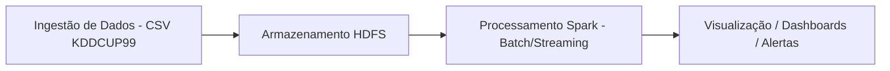
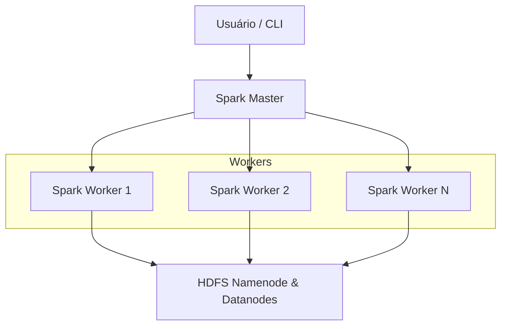

# Escalabilidade e Arquitetura Big Data para Detecção em Tempo Real

Uma empresa de cibersegurança deseja processar grandes volumes de dados de rede em tempo real para detectar anomalias e ataques. O desafio é entender, simular e executar uma arquitetura Big Data que suporte **análise contínua** com alta escalabilidade e desempenho.


## Contexto

Em ambientes de cibersegurança, milhões de eventos de rede podem ser gerados a cada segundo. Para lidar com esse **volume**, **velocidade**, **variedade**, **veracidade** e extrair **valor**, arquiteturas distribuídas são essenciais.

Entre as tecnologias mais usadas estão:

* **Apache Hadoop**: sistema de armazenamento distribuído (HDFS) e processamento em lote.
* **Apache Spark**: framework de processamento distribuído em memória, suportando **batch** e **streaming**.
* **Kafka** (opcional para ingestão de streaming em produção).


## Conceitos Fundamentais

### Desafios do Big Data - Os 5 V's

| V              | Descrição detalhada                                                                                                                                                               |
| -------------- | --------------------------------------------------------------------------------------------------------------------------------------------------------------------------------- |
| **Volume**     | Quantidade massiva de dados gerados continuamente, que não cabem em um único servidor. Em cibersegurança, milhões de registros de conexão precisam ser processados e armazenados. |
| **Velocidade** | Rapidez com que os dados são gerados e precisam ser processados. A detecção de anomalias exige processamento quase em tempo real.                                                 |
| **Variedade**  | Diferentes formatos e fontes de dados: logs de firewall, pacotes de rede, tráfego HTTP/HTTPS, sensores de IoT, etc. A arquitetura Big Data deve lidar com essa diversidade.       |
| **Veracidade** | Garantia de confiabilidade e consistência dos dados. Informações incompletas ou corrompidas podem comprometer a detecção de ataques.                                              |
| **Valor**      | Refere-se à utilidade prática dos dados processados. O objetivo final é extrair insights acionáveis, como identificar ataques e comportamentos suspeitos.                         |


### Componentes de uma Arquitetura Big Data

| Camada            | Função                           | Tecnologias                       |
| ----------------- | -------------------------------- | --------------------------------- |
| **Ingestão**      | Coleta e transporte de dados     | Kafka, Flume, MQTT                |
| **Processamento** | Transformação e análise de dados | Spark Streaming, Flink, MapReduce |
| **Armazenamento** | Persistência e replicação        | HDFS, Cassandra, MongoDB          |
| **Visualização**  | Monitoramento e dashboards       | Grafana, Power BI, Kibana         |


### Batch vs Streaming

* **Batch**: processamento periódico de grandes volumes de dados (ex: MapReduce no Hadoop).
* **Streaming**: processamento contínuo, quase em tempo real (ex: Spark Streaming).


## Hadoop e Spark

### Apache Hadoop

* **HDFS (Hadoop Distributed File System)**: divide arquivos grandes em blocos replicados entre vários nós, garantindo disponibilidade.
* **MapReduce**: modelo de programação para processamento distribuído de grandes volumes.
* **Pontos fortes**: alta confiabilidade e escalabilidade horizontal.
* **Limitações**: latência maior, não ideal para streaming.

### Apache Spark

* **Processamento em memória**: mais rápido que Hadoop MapReduce.
* **Suporte a Batch e Streaming**: Spark Core (batch) e Spark Streaming (quase real-time).
* **APIs**: DataFrame, SQL, MLlib (machine learning), GraphX.
* **Integração**: leitura de HDFS, Kafka, S3, entre outros.


## Arquitetura Big Data para Detecção de Anomalias com KDDCUP99

### 1. Visão Geral do Pipeline



**Fluxo resumido:**

1. Arquivo CSV do **KDDCUP99 10%** é copiado para o container `namenode`.
2. Arquivo é carregado no **HDFS**, garantindo replicação e disponibilidade.
3. **Spark** lê os dados do HDFS, processa em batch ou streaming, e aplica lógica de detecção de anomalias.
4. Resultados podem ser enviados para dashboards ou logs de alerta.


### 2. Arquitetura Distribuída no Docker



**Descrição dos componentes:**

* **Spark Master:** coordena os jobs Spark e distribui tarefas aos Workers.
* **Spark Worker:** executa tarefas de processamento distribuído (leitura, transformação, cálculo).
* **HDFS:** armazena dados distribuídos e replicados.
* **Containers Docker:** simulam cluster local, permitindo testes sem infraestrutura física.


### 3. Pipeline Detalhado com KDDCUP99

```mermaid
flowchart TD
    CSV[Arquivo CSV KDDCUP99] --> Docker[Docker: Copiar para /tmp]
    Docker --> HDFS_DIR[HDFS: /user/root/input/]
    HDFS_DIR --> SparkJob[Spark Job: stream_job.py]

    SparkJob --> Parse[Leitura e parsing do CSV]
    SparkJob --> DataFrame[Conversão para DataFrame Spark]
    SparkJob --> Rules[Aplicação de regras de detecção ex: src_bytes > 50k]
    SparkJob --> AlertCol[Criação coluna "alerta" - Normal/Anomalia]
    
    AlertCol --> Output[Output: Console / Log / Dashboard]

```

**Notas importantes:**

* O Spark pode processar dados **em batch** (arquivo inteiro) ou **em streaming** (novos registros adicionados continuamente).
* As regras de detecção podem ser mais complexas (classificadores ML, detecção de padrões, correlação de eventos).
* HDFS garante que o dado não se perca e pode ser lido por múltiplos Workers simultaneamente.


## Atividade Prática - Pipeline com KDDCUP99

### Objetivo

Simular um pipeline Big Data usando **Hadoop + Spark em Docker** para analisar o **KDDCUP99 10% dataset**, que contém registros de conexões de rede e ataques rotulados.

**Dataset KDDCUP99 (10%)**

* Contém ~494.000 registros de conexões de rede.
* Classes de ataques: `normal`, `dos`, `probe`, `r2l`, `u2r`.
* Link: [KDD Cup 1999 Data](https://kdd.ics.uci.edu/databases/kddcup99/kddcup.data_10_percent.gz)

### Passos do Pipeline

1. **Executar Docker com Hadoop e Spark**

   * Containers: `namenode`, `datanode`, `spark-master`, `spark-worker`.
   * `docker-compose.yml` conforme fornecido.

2. **Enviar dataset para HDFS**

```powershell
docker cp ".\data\kddcup.data_10_percent_corrected" namenode:/tmp/
docker exec namenode hdfs dfs -mkdir -p /user/root/input/
docker exec namenode hdfs dfs -put -f /tmp/kddcup.data_10_percent_corrected /user/root/input/
docker exec namenode hdfs dfs -ls /user/root/input/
```

3. **Script Spark (`stream_job.py`)**

```python
from pyspark.sql import SparkSession
from pyspark.sql.functions import col, when

spark = SparkSession.builder.appName("KDDCupStream").getOrCreate()

# Ler dataset do HDFS
df = spark.read.csv("hdfs://namenode:9000/user/root/input/kddcup.data_10_percent_corrected")
df = df.withColumnRenamed("_c0","duration").withColumnRenamed("_c1","protocol_type") \
       .withColumnRenamed("_c2","service").withColumnRenamed("_c3","flag") \
       .withColumnRenamed("_c4","src_bytes").withColumnRenamed("_c5","dst_bytes") \
       .withColumnRenamed("_c41","label")  # ajustar conforme schema

# Lógica simples de detecção
alertas = df.withColumn("alerta",
    when(col("src_bytes") > 50000, "Anomalia").otherwise("Normal")
)

alertas.show(5)
```

4. **Executar via PowerShell**

```powershell
docker exec -it spark-master /spark/bin/spark-submit --master spark://spark-master:7077 /opt/spark/app/stream_job.py
```


## Exercício Contextualizado - UNSW-NB15

**Cenário:**
A empresa agora recebe dados de rede mais recentes (UNSW-NB15) com ataques rotulados.

**Tarefa para o aluno:**

1. Adaptar o pipeline KDDCUP99 para ler UNSW-NB15.
2. Criar lógica de detecção simples (ex: alertas por volume de bytes, portas suspeitas).
3. Rodar em **Spark + HDFS local** (Docker).
4. Comparar a quantidade de alertas entre KDDCUP99 e UNSW-NB15.


## Discussão

1. Como a mudança de dataset afeta a performance e a arquitetura do pipeline?
2. Que ajustes seriam necessários para lidar com **streams de dados contínuos** em produção?
3. Quais desafios aparecem ao processar **streaming** em ambiente local vs produção?
4. Como o Spark pode ser integrado com **ferramentas de monitoramento** (Kafka, Grafana, Power BI)?
5. Qual a diferença de processamento entre Hadoop MapReduce e Spark Streaming?
6. Como lidar com **dados massivos** que não cabem na memória de um único nó?
