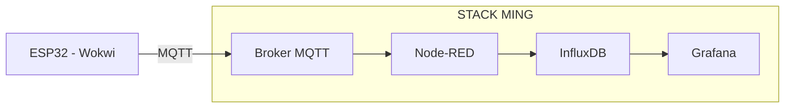
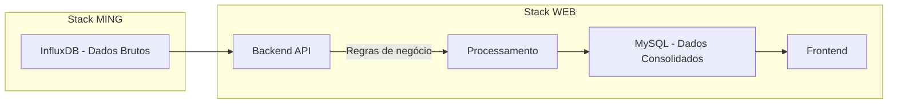

# Projeto: IoT Data Pipeline na AWS

**Do dispositivo à inteligência de dados**

## 1. CONTEXTO DO PROJETO

Cada grupo (até 3 alunos) deverá desenvolver uma solução completa de **coleta, processamento e visualização de dados IoT**, utilizando serviços e ferramentas modernas.

O projeto simula um cenário real de mercado, onde dispositivos enviam dados continuamente, que são processados, armazenados e transformados em informação útil para tomada de decisão.

Os alunos deverão **escolher um tema livre**, como por exemplo:

* Monitoramento ambiental (temperatura, umidade, CO₂)
* Agricultura inteligente
* Smart home
* Monitoramento de máquinas (indústria 4.0)
* Saúde (batimentos simulados, atividade física)
* Logística (rastreamento simulado)

## 2. ARQUITETURA GERAL

O projeto será dividido em duas etapas evolutivas.

## ETAPA 01 — Stack MING (Pipeline IoT básico)

### Objetivo

Criar um fluxo funcional de dados do dispositivo até a visualização.

### Stack obrigatória (MING)

* MQTT (broker)
* Node-RED
* InfluxDB
* Grafana

### Fluxo esperado



### Dispositivo (simulado)

* Utilizar ESP32 no Wokwi
* Simular sensores (ex: temperatura, umidade, etc.)
* Enviar dados via MQTT (JSON)

### Visualização

* Criar dashboard simples no Grafana:

  * Gráfico de linha
  * Métrica em tempo real
  * (Opcional) alerta simples

## ETAPA 02 — Stack Web

### Objetivo

Adicionar uma camada de aplicação com backend, frontend e banco relacional, aplicando regras de negócio sobre os dados coletados.

### Stack sugerida (flexível)

Backend: **Node.js**
Frontend: **React**
Banco relacional: **MySQL**

### Fluxo de dados



### Regras de negócio (exemplos)

Os alunos devem implementar ao menos uma regra de transformação:

* Média por período (ex: média por hora)
* Detecção de anomalias (valores fora do padrão)
* Classificação simples (normal / alerta / crítico)
* Consolidação de dados (redução de granularidade)

### Frontend (mínimo esperado)

* Tela com:

  * Visualização dos dados processados
  * Indicadores (cards ou gráficos simples)
* Consumo de API REST do backend

## 3. USO DA AWS

O projeto deve ser hospedado na AWS (nível básico é suficiente).

Sugestões:

* EC2 para hospedar backend, Node-RED e MQTT
* Docker para containerização (opcional, recomendado)

## 4. ORGANIZAÇÃO DO GRUPO

Até 3 alunos, com papéis sugeridos:

* IoT / Dados → ESP32 + MQTT + Node-RED
* Backend → API + regras de negócio + MySQL
* Frontend → interface + integração com API

## 5. ENTREGÁVEIS

### 1. Vídeo Pitch (5 a 10 minutos)

Deve apresentar:

* Problema escolhido
* Arquitetura da solução
* Demonstração funcionando (end-to-end)
* Destaque técnico do projeto

### 2. Repositório no GitHub

#### Estrutura mínima

```plaintext
/frontend
/backend
/iot (ESP32 + Wokwi)
/nodered (flows exportados)
/docs
```

### Documentação obrigatória

* Descrição do projeto
* Arquitetura (diagrama)
* Explicação da Stack MING
* Explicação da Camada de Aplicação
* Como executar o projeto
* Prints ou dashboards

### IoT

* Código do ESP32 (Wokwi)
* Explicação dos dados enviados

### Node-RED

* Export do fluxo (.json)
* Explicação do pipeline

### Backend

* Código documentado
* Explicação das regras de negócio

### Frontend

* Código funcional mínimo
* Integração com API

## 6. CRITÉRIOS DE AVALIAÇÃO

* Funcionamento do pipeline (IoT → Dashboard)
* Integração entre componentes
* Clareza da arquitetura
* Implementação da regra de negócio
* Qualidade do código e organização
* Documentação
* Apresentação (pitch)


## 7. DIFERENCIAIS (OPCIONAL)

* Deploy com Docker Compose
* Alertas automatizados
* Dashboard avançado
* Autenticação no sistema
