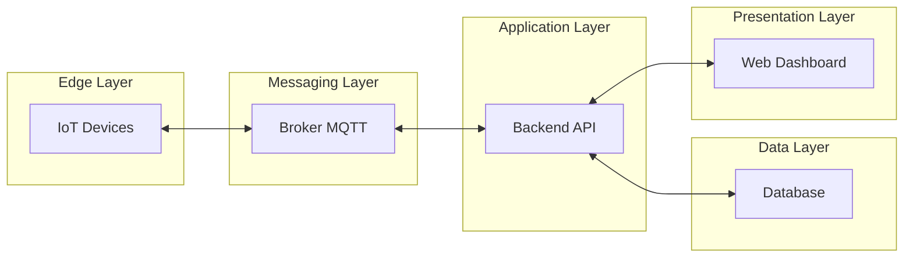

# PBL1 — Etapa 2

# Documentação da Etapa de Projeto da Arquitetura

A Etapa 2 formaliza a estrutura arquitetural do sistema de monitoramento ambiental. Com base na compreensão do problema e nos requisitos definidos anteriormente, esta fase estabelece como os componentes do sistema serão organizados, como se comunicarão e como os dados percorrerão a infraestrutura.

Esta etapa define a organização lógica do sistema distribuído, o modelo de comunicação entre seus componentes e a forma como os dados fluem desde a origem (sensores) até a visualização final.

O resultado é a definição clara das camadas do sistema e de suas responsabilidades, além do diagrama arquitetural que representa a estrutura global da solução.

## 1. Princípios Arquiteturais Adotados

O sistema é estruturado a partir de princípios que garantem escalabilidade, desacoplamento e processamento contínuo de dados.

Os principais princípios são:

* arquitetura distribuída
* comunicação assíncrona orientada a eventos
* separação em camadas funcionais
* desacoplamento entre dispositivos e processamento
* ingestão contínua de dados em tempo real
* armazenamento especializado em séries temporais
* visualização independente da fonte de dados

Esses princípios permitem que o sistema evolua gradualmente, suporte crescimento do volume de dados e mantenha independência entre componentes.

## 2. Organização em Camadas

O sistema é estruturado em cinco camadas principais, cada uma com responsabilidades específicas e bem definidas.

Essa separação organiza o fluxo de dados e reduz dependências diretas entre componentes.

### 2.1 Edge Layer (Camada de Dispositivos)

Esta camada representa a origem dos dados ambientais.

Responsabilidades:

* coletar medições do ambiente físico
* produzir leituras periódicas de sensores
* publicar dados no sistema de mensageria

Os dispositivos operam como produtores de eventos ambientais, gerando um fluxo contínuo de medições.

Não realizam processamento complexo nem armazenamento histórico.

### 2.2 Messaging Layer (Camada de Mensageria)

Esta camada atua como intermediária entre dispositivos e serviços da aplicação.

Responsabilidades:

* receber eventos publicados pelos dispositivos
* distribuir mensagens para consumidores interessados
* desacoplar produtores e consumidores de dados
* permitir comunicação assíncrona

A mensageria elimina a necessidade de comunicação direta entre sensores e backend, aumentando a robustez do sistema.

### 2.3 Application Layer (Camada de Aplicação)

Esta camada contém a lógica central do sistema.

Responsabilidades:

* receber dados provenientes da mensageria
* validar e processar medições
* transformar dados em formato persistente
* disponibilizar dados para consulta
* aplicar regras de negócio
* expor serviços por meio de API

Essa camada funciona como ponto central de processamento e acesso ao sistema.

### 2.4 Data Layer (Camada de Dados)

Esta camada é responsável pela persistência das medições ambientais.

Responsabilidades:

* armazenar séries temporais de medições
* indexar dados por tempo
* permitir consultas por intervalo temporal
* suportar agregações e análises históricas

O armazenamento é otimizado para dados contínuos indexados por timestamp.

### 2.5 Presentation Layer (Camada de Apresentação)

Esta camada fornece a interface de visualização do sistema.

Responsabilidades:

* exibir dados ambientais em tempo real
* apresentar histórico de medições
* permitir interpretação visual das condições ambientais
* consumir dados disponibilizados pela API

A apresentação é desacoplada do armazenamento e do processamento.

## 3. Modelo de Comunicação do Sistema

O sistema adota comunicação orientada a eventos baseada no modelo publish/subscribe.

Características desse modelo:

* sensores publicam eventos
* serviços consomem eventos
* comunicação indireta mediada por broker
* ausência de dependência temporal entre produtor e consumidor
* possibilidade de múltiplos consumidores para a mesma mensagem

Esse modelo é especialmente adequado para sistemas IoT com fluxo contínuo de dados.

A comunicação entre backend, banco de dados e dashboard ocorre por requisições diretas via API.

## 4. Fluxo de Dados no Sistema

O fluxo de dados segue uma sequência lógica desde a geração até a visualização.

1. Sensores coletam medições ambientais
2. Dispositivos publicam eventos no broker de mensageria
3. O backend consome os eventos publicados
4. O backend processa e valida os dados
5. Os dados são armazenados como séries temporais
6. O dashboard consulta o backend
7. O usuário visualiza medições em tempo real ou históricas

Esse fluxo define um pipeline contínuo de ingestão, processamento, persistência e visualização.

## 5. Desacoplamento Estrutural

A arquitetura garante independência entre camadas.

Isso significa que:

* sensores podem ser alterados sem modificar o backend
* o banco de dados pode evoluir sem impactar dispositivos
* a interface pode mudar sem alterar o modelo de dados
* novos serviços podem consumir mensagens sem alterar produtores

Esse desacoplamento é fundamental para escalabilidade e manutenção do sistema.

## 6. Representação Arquitetural

A arquitetura lógica do sistema é representada pelo seguinte diagrama de camadas e comunicação.

## 7. Interpretação do Diagrama

O diagrama representa as relações estruturais entre as camadas.

Dispositivos e mensageria mantêm comunicação bidirecional para envio e confirmação de eventos.

A aplicação consome eventos da mensageria e interage diretamente com o banco de dados para persistência e consulta.

A interface de visualização acessa o sistema exclusivamente por meio da API.

Não há comunicação direta entre sensores e banco de dados, nem entre sensores e interface de usuário.

## 8. Decisões Arquiteturais Consolidadas

A definição arquitetural resultante estabelece que o sistema:

* possui separação clara entre geração, transporte, processamento e visualização de dados
* utiliza mensageria como mecanismo central de integração
* processa dados de forma assíncrona
* armazena medições como séries temporais
* expõe dados exclusivamente por meio de API
* mantém independência entre camadas

Essas decisões garantem que o sistema suporte crescimento do número de sensores e aumento contínuo do volume de dados.

## 9. Síntese da Etapa

A Etapa 2 define a estrutura organizacional do sistema distribuído e estabelece como seus componentes interagem.

São formalizados:

* o modelo de camadas
* o padrão de comunicação
* o fluxo completo de dados
* a representação arquitetural

Com essa definição, o sistema passa a ter uma estrutura clara que orienta a implementação da mensageria, do backend, do armazenamento temporal e da visualização em tempo real nas etapas seguintes.

