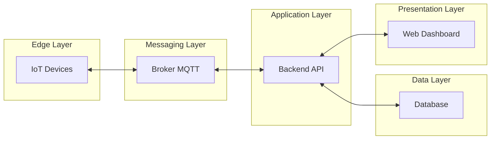

# PBL1 — Sistema Inteligente de Monitoramento de Ambientes Educacionais

## 1. Contexto do Problema

Após a pandemia, aumentou significativamente a preocupação com qualidade do ar, conforto térmico, ventilação adequada e uso eficiente dos espaços físicos em instituições educacionais.

Atualmente, muitas escolas e centros de ensino realizam esse controle de forma:

* manual
* esporádica
* sem registro histórico
* sem análise automatizada
* sem suporte à tomada de decisão baseada em dados

Isso gera diversos problemas:

* ambientes desconfortáveis para aprendizagem
* desperdício energético
* ausência de rastreabilidade de condições ambientais
* incapacidade de identificar padrões ao longo do tempo
* inexistência de alertas preventivos

Diante desse cenário, a instituição contratou uma equipe de desenvolvimento para projetar e implementar um sistema inteligente capaz de monitorar, registrar e analisar dados ambientais em tempo real.

Os alunos assumem o papel dessa equipe de desenvolvimento.

## 2. Objetivo do Projeto

Desenvolver um sistema distribuído de monitoramento ambiental que:

* capture dados de sensores IoT em tempo real
* transmita os dados por mensageria orientada a eventos
* processe e armazene dados históricos
* gere alertas automáticos quando limites forem ultrapassados
* disponibilize visualização em dashboard web em tempo real
* permita análise histórica das condições ambientais
* utilize arquitetura escalável baseada em serviços
* seja desenvolvido com versionamento colaborativo

## 3. Cenário de Aplicação

O sistema será implantado em ambientes educacionais como:

* salas de aula
* laboratórios
* bibliotecas
* auditórios

Sensores monitoram variáveis como:

* temperatura
* umidade
* qualidade do ar
* presença ou ocupação
* luminosidade

Esses dados serão utilizados para:

* melhorar o conforto ambiental
* apoiar decisões de gestão de infraestrutura
* reduzir desperdício energético
* detectar situações críticas automaticamente

## 4. Tecnologias Utilizadas

### Dispositivos e Simulação

* Sensores IoT reais ou simulados
* Ambiente de simulação de hardware embarcado

### Comunicação e Mensageria

* Protocolo publish/subscribe
* Broker MQTT

### Backend

* API para ingestão e consulta de dados
* Serviço de processamento de eventos

### Armazenamento

* Banco de dados NoSQL ou orientado a séries temporais
* Persistência de dados históricos

### Visualização

* Dashboard web em tempo real
* Visualização gráfica de métricas ambientais

### Engenharia de Software

* Controle de versionamento distribuído
* Desenvolvimento colaborativo em equipe

## 5. Arquitetura do Sistema

O sistema segue uma arquitetura distribuída orientada a eventos, organizada em camadas.

### Camadas Arquiteturais

**Device / Edge Layer**

* Sensores capturam dados ambientais
* Dispositivos publicam eventos

**Messaging / Event Layer**

* Broker recebe e distribui mensagens
* Comunicação desacoplada entre componentes

**Application / Service Layer**

* API centraliza ingestão e acesso aos dados
* Serviços realizam validação e processamento

**Data Layer**

* Persistência em banco NoSQL ou séries temporais
* Armazenamento histórico para análise

**Presentation Layer**

* Dashboard web para monitoramento em tempo real
* Visualização e interação com dados

## 6. Diagrama da Arquitetura

## 7. Fluxo de Funcionamento do Sistema

1. Sensores coletam dados ambientais continuamente
2. Dispositivos publicam eventos no broker MQTT
3. A API recebe eventos encaminhados pelo broker
4. Serviços processam, validam e transformam os dados
5. Dados são armazenados no banco histórico
6. Dashboard consulta a API para visualização em tempo real
7. Regras de alerta são avaliadas continuamente

## 8. Etapas de Desenvolvimento do PBL

### Etapa 1 — Compreensão do Problema

* Análise do cenário real
* Definição de requisitos funcionais e não funcionais
* Modelagem conceitual do sistema

### Etapa 2 — Projeto da Arquitetura

* Definição das camadas do sistema
* Escolha do modelo de comunicação
* Modelagem do fluxo de dados
* Desenho do diagrama arquitetural

### Etapa 3 — Simulação ou Integração IoT

* Configuração de sensores ou simuladores
* Publicação de dados via MQTT
* Testes de conectividade

### Etapa 4 — Implementação da Mensageria

* Configuração do broker
* Definição de tópicos
* Publicação e assinatura de eventos

### Etapa 5 — Desenvolvimento do Backend

* Criação da API
* Recepção de eventos
* Processamento de dados
* Persistência em banco

### Etapa 6 — Modelagem do Banco de Dados

* Estruturação de séries temporais ou documentos
* Estratégias de retenção
* Consulta histórica

### Etapa 7 — Desenvolvimento do Dashboard Web

* Interface de monitoramento
* Visualização gráfica
* Atualização em tempo real

### Etapa 8 — Regras de Negócio e Alertas

* Definição de limites críticos
* Detecção de anomalias
* Notificações automáticas

### Etapa 9 — Integração Completa do Sistema

* Comunicação entre todas as camadas
* Testes de fluxo ponta a ponta

### Etapa 10 — Versionamento e Trabalho Colaborativo

* Organização de repositório
* Controle de versões
* Gestão de tarefas em equipe

## 9. Competências Técnicas Desenvolvidas

* Arquiteturas distribuídas orientadas a eventos
* Integração entre hardware e software
* Mensageria publish/subscribe
* Ingestão de dados em tempo real
* Persistência de séries temporais
* Desenvolvimento de APIs
* Visualização de dados em tempo real
* Modelagem de sistemas IoT
* Trabalho colaborativo com versionamento

## 10. Entregável Esperado

Sistema funcional capaz de:

* coletar dados ambientais de sensores
* transmitir dados por mensageria
* armazenar dados históricos
* disponibilizar dashboard web em tempo real
* gerar alertas automatizados
* demonstrar arquitetura distribuída operacional

## 11. Observações Importantes

* Este projeto não utiliza desenvolvimento dirigido a testes (TDD).
* O foco está na arquitetura distribuída, ingestão de dados em tempo real e integração IoT.

