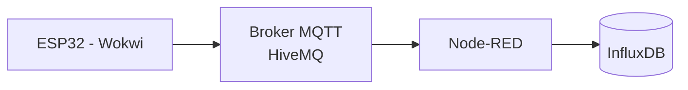

## Camada IoT


## 1. Objetivo da Camada de Simulação IoT

Esta etapa do projeto tem como objetivo simular a geração de eventos industriais de uma fábrica automotiva utilizando um microcontrolador ESP32 no ambiente de simulação online Wokwi.

A simulação representa sensores responsáveis por indicar as etapas pelas quais um veículo está passando durante o processo produtivo.

Essa camada é responsável exclusivamente por:

* Gerar eventos de produção
* Publicar mensagens via MQTT
* Simular fluxo de fabricação
* Reproduzir comportamento orientado a eventos

Não há regra de negócio nesta camada.


## 2. Justificativa da Escolha do ESP32

O ESP32 foi escolhido porque:

* Possui conectividade Wi-Fi nativa
* Suporta MQTT facilmente
* É amplamente utilizado em projetos IoT reais
* Permite simulação completa no Wokwi
* Tem baixo custo no mundo físico

A simulação no Wokwi permite que todos os alunos desenvolvam sem necessidade de hardware físico.


## 3. Papel do ESP32 na Arquitetura

Na arquitetura geral do projeto:

ESP32
→ Publica evento MQTT
→ Broker (HiveMQ)

O dispositivo não se comunica diretamente com:

* Banco de dados
* Backend
* Web
* Mobile

Ele apenas gera eventos.

Isso reforça o modelo de arquitetura desacoplada.


## 4. Modelo Conceitual da Simulação de Produção

Cada ESP32 simula um veículo em produção.

Fluxo simulado de etapas:

1. Montagem Estrutural
2. Pintura
3. Instalação de Motor
4. Acabamento Interno
5. Inspeção Final
6. Liberação para Transporte

Cada etapa gera um evento MQTT.


## 5. Estrutura da Mensagem MQTT

### 5.1 Tópico MQTT

Padrão proposto:

fabrica/veiculo/{vin}/etapa

Exemplo:

fabrica/veiculo/9BWZZZ377VT004251/etapa


### 5.2 Payload (JSON)

```json
{
  "vin": "9BWZZZ377VT004251",
  "modelo": "SUV-X",
  "etapa": "PINTURA",
  "timestamp": "2026-03-10T10:23:45Z",
  "linha_producao": "LINHA_01",
  "status": "INICIADA"
}
```


## 6. Padrões Técnicos Adotados

### 6.1 Comunicação Assíncrona

O ESP32 publica mensagens sem esperar resposta.

Modelo:

Publish/Subscribe

Isso caracteriza sistema orientado a eventos.


### 6.2 Formato de Dados

JSON foi escolhido por:

* Facilidade de leitura
* Compatibilidade com Node-RED
* Facilidade de integração com Backend
* Padrão amplamente utilizado em APIs REST


### 6.3 Identificação do Veículo

O VIN (Vehicle Identification Number) é utilizado como identificador único.

Ele será a chave de rastreamento em:

* InfluxDB
* Banco relacional
* Backend
* Camada de aplicação


## 7. Simulação de Tempo de Produção

O ESP32 deve:

* Aguardar intervalo aleatório entre etapas
* Simular duração variável
* Publicar evento de início e fim de etapa

Exemplo de fluxo:

PINTURA - INICIADA
(aguarda 5 segundos)
PINTURA - FINALIZADA

Isso permitirá ao Node-RED:

* Calcular tempo real
* Persistir no InfluxDB
* Encaminhar evento consolidado ao backend


## 8. Comportamento Esperado do Dispositivo

O firmware deve:

1. Conectar ao Wi-Fi
2. Conectar ao broker MQTT
3. Publicar evento de etapa
4. Aguardar intervalo
5. Avançar para próxima etapa
6. Repetir ciclo ou finalizar produção


## 9. Arquitetura da Camada IoT (Visão Parcial)




## 10. Separação de Responsabilidades

ESP32:

* Apenas gera eventos
* Não armazena histórico
* Não aplica regra de negócio

Node-RED:

* Processa eventos
* Persiste dados brutos
* Encaminha eventos ao backend

Backend:

* Consolida informações
* Atualiza estado do veículo

Essa separação evita acoplamento indevido.


## 11. Escalabilidade da Simulação

É possível simular:

* Múltiplos ESP32
* Várias linhas de produção
* Centenas de veículos

Basta alterar:

* VIN
* Linha de produção
* Intervalos de tempo

Isso permite testar:

* Carga de mensagens
* Comportamento do broker
* Performance do Node-RED


## 12. Evolução Futura

Ao migrar para cloud:

Broker MQTT → AWS IoT Core
Simulador pode ser substituído por dispositivos reais

A arquitetura não precisa ser alterada, apenas o endpoint do broker.


## 13. Objetivos Acadêmicos desta Etapa

Permitir que o aluno compreenda:

* Comunicação MQTT
* Arquitetura Publish/Subscribe
* IoT orientado a eventos
* Serialização JSON
* Identificação única de dispositivos
* Simulação de telemetria industrial
