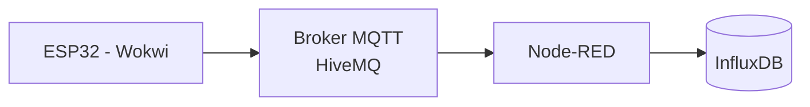

## Camada IoT


## 1. Objetivo da Camada de Simulação IoT

Esta etapa do projeto tem como objetivo simular a geração de eventos industriais de uma fábrica automotiva utilizando um microcontrolador ESP32 no ambiente de simulação online Wokwi.

A simulação representa sensores responsáveis por indicar as etapas pelas quais um veículo está passando durante o processo produtivo.

Essa camada é responsável exclusivamente por:

* Gerar eventos de produção
* Publicar mensagens via MQTT
* Simular fluxo de fabricação
* Reproduzir comportamento orientado a eventos

Não há regra de negócio nesta camada.


## 2. Justificativa da Escolha do ESP32

O ESP32 foi escolhido porque:

* Possui conectividade Wi-Fi nativa
* Suporta MQTT facilmente
* É amplamente utilizado em projetos IoT reais
* Permite simulação completa no Wokwi
* Tem baixo custo no mundo físico

A simulação no Wokwi permite que todos os alunos desenvolvam sem necessidade de hardware físico.


## 3. Papel do ESP32 na Arquitetura

Na arquitetura geral do projeto:

ESP32
→ Publica evento MQTT
→ Broker (HiveMQ)

O dispositivo não se comunica diretamente com:

* Banco de dados
* Backend
* Web
* Mobile

Ele apenas gera eventos.

Isso reforça o modelo de arquitetura desacoplada.


## 4. Modelo Conceitual da Simulação de Produção

Cada ESP32 simula um veículo em produção.

Fluxo simulado de etapas:

1. Montagem Estrutural
2. Pintura
3. Instalação de Motor
4. Acabamento Interno
5. Inspeção Final
6. Liberação para Transporte

Cada etapa gera um evento MQTT.


## 5. Estrutura da Mensagem MQTT

### 5.1 Tópico MQTT

Padrão proposto:

fabrica/veiculo/{vin}/etapa

Exemplo:

fabrica/veiculo/9BWZZZ377VT004251/etapa


### 5.2 Payload (JSON)

```json
{
  "vin": "9BWZZZ377VT004251",
  "modelo": "SUV-X",
  "etapa": "PINTURA",
  "timestamp": "2026-03-10T10:23:45Z",
  "linha_producao": "LINHA_01",
  "status": "INICIADA"
}
```


## 6. Padrões Técnicos Adotados

### 6.1 Comunicação Assíncrona

O ESP32 publica mensagens sem esperar resposta.

Modelo:

Publish/Subscribe

Isso caracteriza sistema orientado a eventos.


### 6.2 Formato de Dados

JSON foi escolhido por:

* Facilidade de leitura
* Compatibilidade com Node-RED
* Facilidade de integração com Backend
* Padrão amplamente utilizado em APIs REST


### 6.3 Identificação do Veículo

O VIN (Vehicle Identification Number) é utilizado como identificador único.

Ele será a chave de rastreamento em:

* InfluxDB
* Banco relacional
* Backend
* Camada de aplicação


## 7. Simulação de Tempo de Produção

O ESP32 deve:

* Aguardar intervalo aleatório entre etapas
* Simular duração variável
* Publicar evento de início e fim de etapa

Exemplo de fluxo:

PINTURA - INICIADA
(aguarda 5 segundos)
PINTURA - FINALIZADA

Isso permitirá ao Node-RED:

* Calcular tempo real
* Persistir no InfluxDB
* Encaminhar evento consolidado ao backend


## 8. Comportamento Esperado do Dispositivo

O firmware deve:

1. Conectar ao Wi-Fi
2. Conectar ao broker MQTT
3. Publicar evento de etapa
4. Aguardar intervalo
5. Avançar para próxima etapa
6. Repetir ciclo ou finalizar produção


## 9. Arquitetura da Camada IoT (Visão Parcial)




## 10. Separação de Responsabilidades

ESP32:

* Apenas gera eventos
* Não armazena histórico
* Não aplica regra de negócio

Node-RED:

* Processa eventos
* Persiste dados brutos
* Encaminha eventos ao backend

Backend:

* Consolida informações
* Atualiza estado do veículo

Essa separação evita acoplamento indevido.


## 11. Escalabilidade da Simulação

É possível simular:

* Múltiplos ESP32
* Várias linhas de produção
* Centenas de veículos

Basta alterar:

* VIN
* Linha de produção
* Intervalos de tempo

Isso permite testar:

* Carga de mensagens
* Comportamento do broker
* Performance do Node-RED


Segue o material com um **texto explicativo antes de cada código**, em linguagem didática, para contextualizar o aluno.


## 12. Códigos base Wokwi

Este projeto simula uma linha de produção industrial utilizando o **ESP32**, LEDs e botões no ambiente de simulação Wokwi.

A proposta é representar seis etapas de produção. Cada etapa possui:

* Um **botão** → representa o início da etapa
* Um **LED** → representa a etapa em execução
* Um controle via **Monitor Serial** → para informar o VIN (número do chassi)

Quando o botão é pressionado:

1. O sistema solicita o VIN pelo Monitor Serial.
2. Após receber o VIN, o LED correspondente é acionado.
3. A etapa permanece ativa por um tempo determinado.
4. Após esse tempo, o LED é desligado e a etapa é finalizada.


## diagram.json

O arquivo `diagram.json` define toda a **estrutura física do circuito no simulador Wokwi**.

Ele descreve:

* A placa **ESP32 DevKit**
* A protoboard
* 6 LEDs
* 6 botões
* 6 resistores
* Todas as conexões elétricas entre os componentes

Em outras palavras, esse arquivo representa o **esquema elétrico do projeto**, indicando:

* Quais pinos do ESP32 estão conectados aos LEDs
* Quais pinos estão conectados aos botões
* Onde estão os resistores
* Como estão distribuídas as conexões de GND

Sem esse arquivo, o simulador não saberia como montar o circuito virtualmente.

```json
{
  "version": 1,
  "author": "André Souza",
  "editor": "wokwi",
  "parts": [
    {
      "type": "wokwi-breadboard-half",
      "id": "bb1",
      "top": -31.8,
      "left": 98.8,
      "attrs": { "color": "#eeefed" }
    },
    { "type": "board-esp32-devkit-c-v4", "id": "esp", "top": -38.4, "left": -119.96, "attrs": {} },
    { "type": "wokwi-led", "id": "led1", "top": -13.2, "left": 119, "attrs": { "color": "red" } },
    { "type": "wokwi-led", "id": "led2", "top": -13.2, "left": 167, "attrs": { "color": "red" } },
    { "type": "wokwi-led", "id": "led3", "top": -13.2, "left": 215, "attrs": { "color": "red" } },
    { "type": "wokwi-led", "id": "led4", "top": -13.2, "left": 263, "attrs": { "color": "red" } },
    { "type": "wokwi-led", "id": "led5", "top": -13.2, "left": 311, "attrs": { "color": "red" } },
    { "type": "wokwi-led", "id": "led6", "top": -13.2, "left": 359, "attrs": { "color": "red" } },
    { "type": "wokwi-pushbutton-6mm", "id": "btn1", "top": 87.9, "left": 138.9, "rotate": 90, "attrs": { "color": "green", "xray": "1" }},
    {
      "type": "wokwi-pushbutton-6mm",
      "id": "btn2",
      "top": 87.9,
      "left": 186.9,
      "rotate": 90,
      "attrs": { "color": "green", "xray": "1" }
    },
    {
      "type": "wokwi-pushbutton-6mm",
      "id": "btn3",
      "top": 87.9,
      "left": 234.9,
      "rotate": 90,
      "attrs": { "color": "green", "xray": "1" }
    },
    {
      "type": "wokwi-pushbutton-6mm",
      "id": "btn4",
      "top": 87.9,
      "left": 282.9,
      "rotate": 90,
      "attrs": { "color": "green", "xray": "1" }
    },
    {
      "type": "wokwi-pushbutton-6mm",
      "id": "btn5",
      "top": 87.9,
      "left": 330.9,
      "rotate": 90,
      "attrs": { "color": "green", "xray": "1" }
    },
    {
      "type": "wokwi-pushbutton-6mm",
      "id": "btn6",
      "top": 87.9,
      "left": 378.9,
      "rotate": 90,
      "attrs": { "color": "green", "xray": "1" }
    },
    {
      "type": "wokwi-resistor",
      "id": "r1",
      "top": 72,
      "left": 105.05,
      "rotate": 90,
      "attrs": { "value": "150" }
    },
    {
      "type": "wokwi-resistor",
      "id": "r2",
      "top": 72,
      "left": 153.05,
      "rotate": 90,
      "attrs": { "value": "150" }
    },
    {
      "type": "wokwi-resistor",
      "id": "r3",
      "top": 72,
      "left": 201.05,
      "rotate": 90,
      "attrs": { "value": "150" }
    },
    {
      "type": "wokwi-resistor",
      "id": "r4",
      "top": 72,
      "left": 249.05,
      "rotate": 90,
      "attrs": { "value": "150" }
    },
    {
      "type": "wokwi-resistor",
      "id": "r5",
      "top": 72,
      "left": 297.05,
      "rotate": 90,
      "attrs": { "value": "150" }
    },
    {
      "type": "wokwi-resistor",
      "id": "r6",
      "top": 72,
      "left": 345.05,
      "rotate": 90,
      "attrs": { "value": "150" }
    }
  ],
  "connections": [
    [ "esp:TX", "$serialMonitor:RX", "", [] ],
    [ "esp:RX", "$serialMonitor:TX", "", [] ],
    [ "bb1:bn.25", "bb1:tn.25", "black", [ "v-1.3", "h40", "v-172.8" ] ],
    [ "bb1:bp.25", "bb1:tp.25", "red", [ "v-0.9", "h30.4", "v-173.1" ] ],
    [ "bb1:5b.j", "esp:13", "gold", [ "v57.6", "h-307.2", "v-57.6" ] ],
    [ "bb1:10b.j", "esp:12", "gold", [ "v67.2", "h-364.8", "v-86.4" ] ],
    [ "bb1:15b.j", "esp:14", "gold", [ "v76.8", "h-422.4", "v-105.6" ] ],
    [ "bb1:20b.j", "esp:27", "gold", [ "v86.4", "h-480", "v-124.8" ] ],
    [ "bb1:25b.j", "esp:26", "gold", [ "v96", "h-537.6", "v-144" ] ],
    [ "bb1:30b.j", "esp:25", "gold", [ "v105.6", "h-595.2", "v-163.2" ] ],
    [ "esp:GND.2", "bb1:tn.1", "black", [ "v0" ] ],
    [ "bb1:bn.2", "bb1:3b.j", "black", [ "v0" ] ],
    [ "bb1:8b.j", "bb1:bn.6", "black", [ "v0" ] ],
    [ "bb1:13b.j", "bb1:bn.11", "black", [ "v0" ] ],
    [ "bb1:18b.j", "bb1:bn.15", "black", [ "v0" ] ],
    [ "bb1:23b.j", "bb1:bn.19", "black", [ "v0" ] ],
    [ "bb1:28b.j", "bb1:bn.23", "black", [ "v0" ] ],
    [ "bb1:2b.j", "bb1:bn.1", "black", [ "v0" ] ],
    [ "bb1:7b.j", "bb1:bn.5", "black", [ "v0" ] ],
    [ "bb1:12b.j", "bb1:bn.10", "black", [ "v0" ] ],
    [ "bb1:17b.j", "bb1:bn.14", "black", [ "v0" ] ],
    [ "bb1:22b.j", "bb1:bn.18", "black", [ "v0" ] ],
    [ "bb1:27b.j", "bb1:bn.22", "black", [ "v28.8" ] ],
    [ "bb1:28t.e", "esp:21", "violet", [ "v9.6", "h9.6", "v-153.6", "h-393.6", "v124.8" ] ],
    [ "bb1:23t.e", "esp:19", "violet", [ "v9.6", "h9.6", "v-144", "h-336", "v134.4" ] ],
    [ "bb1:18t.e", "esp:18", "violet", [ "v9.6", "h9.6", "v-134.4", "h-278.4", "v134.4" ] ],
    [ "bb1:13t.e", "esp:5", "violet", [ "v9.6", "h9.6", "v-124.8", "h-220.8", "v134.4" ] ],
    [ "bb1:8t.e", "esp:4", "violet", [ "v9.6", "h9.6", "v-115.2", "h-163.2", "v153.6" ] ],
    [ "bb1:3t.e", "esp:2", "violet", [ "v9.6", "h9.6", "v-105.6", "h-105.6", "v163.2" ] ],
    [ "led1:A", "bb1:3t.b", "", [ "$bb" ] ],
    [ "led1:C", "bb1:2t.b", "", [ "$bb" ] ],
    [ "led2:A", "bb1:8t.b", "", [ "$bb" ] ],
    [ "led2:C", "bb1:7t.b", "", [ "$bb" ] ],
    [ "led3:A", "bb1:13t.b", "", [ "$bb" ] ],
    [ "led3:C", "bb1:12t.b", "", [ "$bb" ] ],
    [ "led4:A", "bb1:18t.b", "", [ "$bb" ] ],
    [ "led4:C", "bb1:17t.b", "", [ "$bb" ] ],
    [ "led5:A", "bb1:23t.b", "", [ "$bb" ] ],
    [ "led5:C", "bb1:22t.b", "", [ "$bb" ] ],
    [ "led6:A", "bb1:28t.b", "", [ "$bb" ] ],
    [ "led6:C", "bb1:27t.b", "", [ "$bb" ] ],
    [ "btn1:1.l", "bb1:5b.f", "", [ "$bb" ] ],
    [ "btn1:2.l", "bb1:3b.f", "", [ "$bb" ] ],
    [ "btn1:1.r", "bb1:5b.i", "", [ "$bb" ] ],
    [ "btn1:2.r", "bb1:3b.i", "", [ "$bb" ] ],
    [ "btn2:1.l", "bb1:10b.f", "", [ "$bb" ] ],
    [ "btn2:2.l", "bb1:8b.f", "", [ "$bb" ] ],
    [ "btn2:1.r", "bb1:10b.i", "", [ "$bb" ] ],
    [ "btn2:2.r", "bb1:8b.i", "", [ "$bb" ] ],
    [ "btn3:1.l", "bb1:15b.f", "", [ "$bb" ] ],
    [ "btn3:2.l", "bb1:13b.f", "", [ "$bb" ] ],
    [ "btn3:1.r", "bb1:15b.i", "", [ "$bb" ] ],
    [ "btn3:2.r", "bb1:13b.i", "", [ "$bb" ] ],
    [ "btn4:1.l", "bb1:20b.f", "", [ "$bb" ] ],
    [ "btn4:2.l", "bb1:18b.f", "", [ "$bb" ] ],
    [ "btn4:1.r", "bb1:20b.i", "", [ "$bb" ] ],
    [ "btn4:2.r", "bb1:18b.i", "", [ "$bb" ] ],
    [ "btn5:1.l", "bb1:25b.f", "", [ "$bb" ] ],
    [ "btn5:2.l", "bb1:23b.f", "", [ "$bb" ] ],
    [ "btn5:1.r", "bb1:25b.i", "", [ "$bb" ] ],
    [ "btn5:2.r", "bb1:23b.i", "", [ "$bb" ] ],
    [ "btn6:1.l", "bb1:30b.f", "", [ "$bb" ] ],
    [ "btn6:2.l", "bb1:28b.f", "", [ "$bb" ] ],
    [ "btn6:1.r", "bb1:30b.i", "", [ "$bb" ] ],
    [ "btn6:2.r", "bb1:28b.i", "", [ "$bb" ] ],
    [ "r1:1", "bb1:2t.d", "", [ "$bb" ] ],
    [ "r1:2", "bb1:2b.h", "", [ "$bb" ] ],
    [ "r2:1", "bb1:7t.d", "", [ "$bb" ] ],
    [ "r2:2", "bb1:7b.h", "", [ "$bb" ] ],
    [ "r3:1", "bb1:12t.d", "", [ "$bb" ] ],
    [ "r3:2", "bb1:12b.h", "", [ "$bb" ] ],
    [ "r4:1", "bb1:17t.d", "", [ "$bb" ] ],
    [ "r4:2", "bb1:17b.h", "", [ "$bb" ] ],
    [ "r5:1", "bb1:22t.d", "", [ "$bb" ] ],
    [ "r5:2", "bb1:22b.h", "", [ "$bb" ] ],
    [ "r6:1", "bb1:27t.d", "", [ "$bb" ] ],
    [ "r6:2", "bb1:27b.h", "", [ "$bb" ] ]
  ],
  "dependencies": {}
}
```


## sketch.ino

O arquivo `sketch.ino` contém o **código do programa que será executado pelo ESP32**.

Ele é responsável por:

* Configurar os pinos como entrada ou saída
* Monitorar o pressionamento dos botões
* Controlar o acionamento dos LEDs
* Receber o VIN via comunicação serial
* Controlar o tempo de cada etapa
* Exibir mensagens no Monitor Serial

A lógica implementada simula um processo industrial com controle de etapas e rastreabilidade (VIN).

### Estrutura geral do código

O código está organizado em:

1. **Definição de pinos**
2. **Definição das etapas**
3. **Variáveis de controle**
4. Função `setup()`
5. Função `loop()`


### 1. Definição dos pinos

Aqui são definidos os pinos do ESP32 utilizados para os LEDs e botões.

```c
const int leds[6] = {2, 4, 5, 18, 19, 21};
const int botoes[6] = {13, 12, 14, 27, 26, 25};
```

Utiliza-se vetor para facilitar a repetição de código dentro de estruturas `for`.


### 2. Definição das etapas da produção

Cada índice corresponde a uma etapa da linha de produção.

```c
const char* etapas[6] = {
  "MONTAGEM_ESTRUTURAL",
  "PINTURA",
  "INSTALACAO_MOTOR",
  "ACABAMENTO_INTERNO",
  "INSPECAO_FINAL",
  "LIBERACAO_TRANSPORTE"
};
```

Essa estrutura permite associar:

* Botão 1 → Etapa 1
* LED 1 → Etapa 1
* Texto da etapa → Índice 0


### 3. Variáveis de controle

Controlam o estado do sistema:

* Estado anterior dos botões (para detectar borda de descida)
* Se o LED está ativo
* Tempo de acionamento
* Controle de leitura do VIN

```c
bool ultimoEstado[6];
bool ledAtivo[6];
unsigned long tempoAcionamento[6];
const unsigned long tempoLigado = 10000;

bool aguardandoVIN = false;
int etapaAtual = -1;
String vinAtual = "";
```


### 4. Função setup()

Executada uma única vez quando o ESP32 é iniciado.

Responsável por:

* Iniciar comunicação serial
* Configurar pinos
* Inicializar estados

```c
void setup() {
  Serial.begin(115200);
  Serial.println("=== SIMULADOR DE PRODUCAO ===");

  for (int i = 0; i < 6; i++) {
    pinMode(leds[i], OUTPUT);
    pinMode(botoes[i], INPUT_PULLUP);

    digitalWrite(leds[i], LOW);

    ultimoEstado[i] = HIGH;
    ledAtivo[i] = false;
  }
}
```

Observação didática importante:
Os botões utilizam `INPUT_PULLUP`, portanto:

* Solto → HIGH
* Pressionado → LOW


### 5. Função loop()

Executada continuamente.

Ela possui duas partes principais:

#### A) Quando está aguardando VIN

```c
if (aguardandoVIN) {
  if (Serial.available()) {

    vinAtual = Serial.readStringUntil('\n');
    vinAtual.trim();

    Serial.print("VIN recebido: ");
    Serial.println(vinAtual);

    Serial.print("Iniciando etapa: ");
    Serial.println(etapas[etapaAtual]);

    digitalWrite(leds[etapaAtual], HIGH);
    ledAtivo[etapaAtual] = true;
    tempoAcionamento[etapaAtual] = millis();

    aguardandoVIN = false;
  }
  return;
}
```

Enquanto o sistema espera o VIN:

* Ele pausa a leitura dos botões
* Só continua após receber o número do chassi


#### B) Leitura dos botões

```c
for (int i = 0; i < 6; i++) {

  bool estadoAtual = digitalRead(botoes[i]);

  if (ultimoEstado[i] == HIGH && estadoAtual == LOW && !ledAtivo[i]) {

    Serial.print("Botao ");
    Serial.print(i + 1);
    Serial.println(" pressionado");

    Serial.println("Digite o numero do chassi (VIN):");

    aguardandoVIN = true;
    etapaAtual = i;
  }

  ultimoEstado[i] = estadoAtual;
```

Aqui é feita a detecção de **borda de descida** (quando o botão passa de solto para pressionado).


#### C) Controle de tempo da etapa

```c
  if (ledAtivo[i] && millis() - tempoAcionamento[i] >= tempoLigado) {

    digitalWrite(leds[i], LOW);
    ledAtivo[i] = false;

    Serial.print("Etapa finalizada: ");
    Serial.println(etapas[i]);
  }
}
```

A função `millis()` permite controlar o tempo sem bloquear o programa (não utiliza `delay()`).

Após 10 segundos:

* O LED é desligado
* A etapa é finalizada
* O sistema fica pronto para nova operação


### Código completo

```c
// =======================
// PINOS
// =======================

const int leds[6] = {2, 4, 5, 18, 19, 21};
const int botoes[6] = {13, 12, 14, 27, 26, 25};

const char* etapas[6] = {
  "MONTAGEM_ESTRUTURAL",
  "PINTURA",
  "INSTALACAO_MOTOR",
  "ACABAMENTO_INTERNO",
  "INSPECAO_FINAL",
  "LIBERACAO_TRANSPORTE"
};

// =======================

bool ultimoEstado[6];
bool ledAtivo[6];
unsigned long tempoAcionamento[6];
const unsigned long tempoLigado = 10000;

bool aguardandoVIN = false;
int etapaAtual = -1;
String vinAtual = "";

// =======================

void setup() {
  Serial.begin(115200);
  Serial.println("=== SIMULADOR DE PRODUCAO ===");

  for (int i = 0; i < 6; i++) {
    pinMode(leds[i], OUTPUT);
    pinMode(botoes[i], INPUT_PULLUP);

    digitalWrite(leds[i], LOW);

    ultimoEstado[i] = HIGH;
    ledAtivo[i] = false;
  }
}

// =======================

void loop() {

  // =======================
  // Se estiver aguardando VIN
  // =======================

  if (aguardandoVIN) {
    if (Serial.available()) {

      vinAtual = Serial.readStringUntil('\n');
      vinAtual.trim();

      Serial.print("VIN recebido: ");
      Serial.println(vinAtual);

      Serial.print("Iniciando etapa: ");
      Serial.println(etapas[etapaAtual]);

      digitalWrite(leds[etapaAtual], HIGH);
      ledAtivo[etapaAtual] = true;
      tempoAcionamento[etapaAtual] = millis();

      aguardandoVIN = false;
    }
    return; // pausa leitura de botoes enquanto espera VIN
  }

  // =======================
  // Leitura dos botoes
  // =======================

  for (int i = 0; i < 6; i++) {

    bool estadoAtual = digitalRead(botoes[i]);

    if (ultimoEstado[i] == HIGH && estadoAtual == LOW && !ledAtivo[i]) {

      Serial.print("Botao ");
      Serial.print(i + 1);
      Serial.println(" pressionado");

      Serial.println("Digite o numero do chassi (VIN):");

      aguardandoVIN = true;
      etapaAtual = i;
    }

    ultimoEstado[i] = estadoAtual;

    // Desliga LED após 3 segundos
    if (ledAtivo[i] && millis() - tempoAcionamento[i] >= tempoLigado) {

      digitalWrite(leds[i], LOW);
      ledAtivo[i] = false;

      Serial.print("Etapa finalizada: ");
      Serial.println(etapas[i]);
    }
  }
}
```