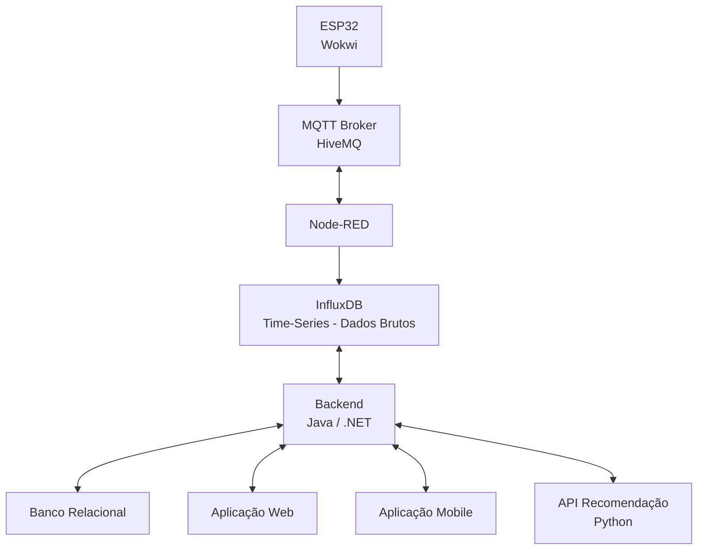
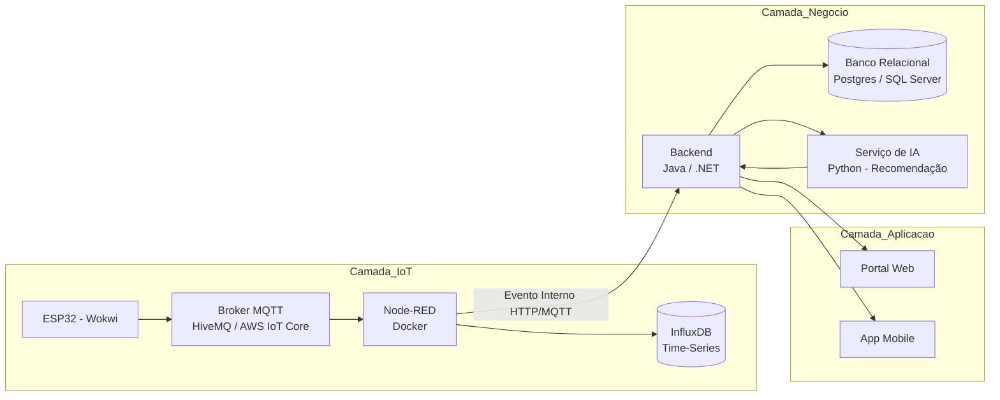

# Portal Automotivo Inteligente - Arquitetura IoT + Event-Driven + Backend + IA

## 1. Visão Geral

Este repositório documenta a arquitetura de um **Portal Automotivo Inteligente**, projetado para acompanhar toda a jornada do cliente:

* Simulação e orçamento na concessionária
* Geração do pedido
* Acompanhamento da produção na fábrica
* Entrega do veículo
* Pós-venda e manutenção
* Financiamento
* Sistema de Recomendação Inteligente de Opcionais

O projeto foi concebido como um **ecossistema distribuído**, utilizando:

* Arquitetura orientada a eventos (Event-Driven)
* Processamento de dados de série temporal
* Separação entre dados brutos e dados consolidados
* Microserviços desacoplados
* Neutralidade tecnológica (Java e .NET)

## 2. Objetivo Arquitetural

A proposta simula um cenário real de indústria 4.0, no qual:

* Sensores enviam eventos de produção
* Eventos são processados em pipeline IoT
* Dados brutos são armazenados em banco time-series
* Eventos consolidados são persistidos em banco relacional
* Um serviço de IA gera recomendações inteligentes
* Web e Mobile consomem APIs unificadas

O projeto prepara o ambiente para futura migração para cloud (ex: AWS IoT Core), mantendo os princípios de arquitetura enterprise.

## 3. Contexto Arquitetural Atual

Fluxo proposto:

Estamos tratando de:

* Telemetria de produção
* Eventos de mudança de etapa
* Dados orientados a tempo
* Processamento assíncrono

Trata-se de um sistema essencialmente:

Event-Driven + Time-Series Oriented 

## 4. Princípio Arquitetural Enterprise

A arquitetura adota separação clara entre:

### Dados Brutos

Armazenados no InfluxDB
Contêm:

* Timestamp
* ID do veículo
* Etapa de produção
* Métricas industriais

### Dados Consolidados

Armazenados no banco relacional
Contêm:

* Entrada do veículo na etapa
* Tempo consolidado
* Status atual
* Informações de negócio

Node-RED:

* Salva dados brutos no InfluxDB
* Publica evento interno para o Backend

Backend:

* Aplica regras de negócio
* Consolida eventos relevantes
* Persiste estado oficial no relacional

Esse padrão é comum em arquiteturas industriais modernas.

## 5. Divisão Conceitual do Projeto

### Camada IoT

Responsável pela geração e ingestão de eventos industriais.

Componentes:

* ESP32 (simulado no Wokwi)
* Broker MQTT (HiveMQ)
* Node-RED
* InfluxDB

Função:

* Capturar telemetria
* Persistir dados brutos
* Encaminhar eventos ao backend

Documentação detalhada:

* 01 - IoT - Wokwi.md
* 02 - IoT - Broker.md
* 03 - IoT - NodeRed.md
* 04 - IoT - InfluxDB.md

### Camada de Negócio

Responsável por regras empresariais e consolidação de eventos.

Componentes:

* Backend Java ou .NET
* Banco relacional (PostgreSQL ou SQL Server)

Função:

* Gerenciar pedidos
* Gerenciar clientes
* Consolidar eventos de produção
* Integrar com serviço de IA

Documentação detalhada:

* 05 - Backend.md

### Camada de Inteligência Artificial

Responsável por recomendações inteligentes de opcionais.

Componente:

* Microserviço Python (API REST)

Função:

* Treinar modelo
* Expor endpoint de recomendação
* Retornar ranking de opcionais

Documentação detalhada:

* 06 - Recomendacao IA.md

### Camada de Aplicação

Responsável pela experiência do usuário.

Componentes:

* Portal Web
* Aplicativo Mobile

Função:

* Exibir status da produção
* Permitir seleção de opcionais
* Exibir recomendações inteligentes

Documentação detalhada:

* 07 - Camada de Aplicacao.md

## 6. Arquitetura Lógica Completa

## 7. Justificativas Técnicas

#### 7.1 Por que Time-Series (InfluxDB)?

Dados de produção:

* São eventos frequentes
* São orientados a timestamp
* Podem crescer rapidamente

Time-series DB é otimizado para:

* Escrita massiva
* Consultas por intervalo de tempo
* Agregações temporais

#### 7.2 Por que Separar Dados Brutos e Consolidados?

Permite:

* Alta performance de ingestão
* Resiliência
* Independência entre camadas
* Melhor organização de responsabilidades

#### 7.3 Por que IA como Microserviço?

* Neutralidade entre Java e .NET
* Escalabilidade independente
* Evolução futura para cloud
* Atualização de modelo sem impactar backend

## 8. Preparação para Cloud

Arquitetura preparada para futura migração:

* MQTT → AWS IoT Core
* InfluxDB → AWS Timestream
* Backend → Containers em ECS
* IA → SageMaker
* Banco relacional → RDS

A estrutura já nasce compatível com padrões modernos de arquitetura distribuída.

## 9. Objetivo Acadêmico

O projeto permite trabalhar de forma integrada:

* IoT
* Event-driven architecture
* Banco NoSQL e relacional
* Microserviços
* Machine Learning aplicado
* Integração entre linguagens
* Arquitetura enterprise realista
