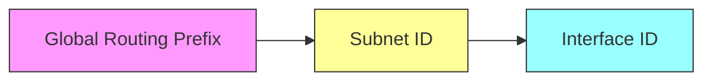

# 07 — Endereçamento IPv6

## Objetivos de aprendizagem

* Entender por que o IPv6 foi criado e quais problemas do IPv4 ele resolve.
* Conhecer a estrutura de um endereço IPv6 e as formas de representação e compressão.
* Distinguir os tipos de endereços (unicast, multicast, anycast) e os endereços especiais mais importantes.
* Dominar conceitos práticos: SLAAC, EUI-64, DHCPv6, NDP/ICMPv6 e prefixos (/64, /56, /48).
* Ser capaz de calcular sub-redes IPv6, planejar endereçamento e configurar dispositivos (Windows/Linux/Cisco).
* Realizar exercícios práticos e laboratórios em simuladores (Packet Tracer, GNS3) ou em equipamentos reais.


## 1. Introdução — por que o IPv6?

IPv6 (Internet Protocol version 6) foi desenvolvido porque o IPv4, com seus 32 bits de endereçamento, sofre da **escassez de endereços públicos**. Além do espaço maior (128 bits), o IPv6 oferece melhorias arquiteturais:

* Endereçamento muito maior (128 bits).
* Remoção do conceito de broadcast (uso de multicast).
* Mecanismos modernos para autoconfiguração (SLAAC) e descoberta de vizinhos (NDP).
* Projeto para roteamento hierárquico mais eficiente.
* Suporte nativo para extensões de cabeçalho e mobilidade.
* Integração de funcionalidades de segurança (IPsec foi definido como parte opcional do padrão IPv6 desde o início).


## 2. Representação e regras de compressão

Um endereço IPv6 tem 128 bits, normalmente mostrado em 8 grupos hexadecimais de 16 bits (4 dígitos hex) separados por dois-pontos: `2001:0db8:85a3:0000:0000:8a2e:0370:7334`.

### Regras de simplificação

1. **Remover zeros à esquerda em cada bloco**: `2001:db8:85a3:0:0:8a2e:370:7334`.
2. **Substituir sequências contínuas de blocos `0000` por `::`** — apenas **uma vez** por endereço. Ex.: `2001:db8:85a3::8a2e:370:7334`.
3. O endereço todo zerado é `::` (endereçamento não especificado).

**Exemplos**

* Expandido: `2001:0db8:0000:0000:0000:ff00:0042:8329`
* Comprimido: `2001:db8::ff00:42:8329`

> Observação: `::` só pode aparecer uma vez. Para representar `::1` (loopback), escreva exatamente assim.


## 3. Estrutura lógica de um endereço IPv6

Apesar de não haver um campo rígido único (como era parcialmente usado no IPv4), é comum dividir um endereço em três componentes lógicos:



* **Global Routing Prefix**: atribuído pelo RIR/ISP — permite roteamento global.
* **Subnet ID**: identifica sub-redes internas dentro do prefixo que o site recebeu.
* **Interface ID**: normalmente os últimos 64 bits (em redes /64) — identifica a interface do host.

> Prática comum: **/64** é o tamanho de rede recomendado para LANs — protocolos como SLAAC assumem /64.


## 4. Tipos de endereços

* **Unicast**: identifica uma única interface (um host). Pacotes enviados para um unicast vão para aquele host.
* **Multicast**: identifica um grupo de interfaces; pacotes enviados a um multicast chegam a todos os membros do grupo.
* **Anycast**: um endereço anycast pode ser atribuído a várias interfaces (normalmente em locais diferentes); o roteamento entregue ao **membro mais próximo**.

### Endereços especiais importantes

* **Unspecified**: `::` — significado “não especificado” (usado temporariamente, por exemplo antes do host receber um endereço).
* **Loopback**: `::1` — equivale ao `127.0.0.1` no IPv4.
* **Link-Local**: `fe80::/10` — usado para comunicação na mesma ligação (segmento). Não é roteável.
* **Unique Local (ULA)**: `fc00::/7` — equivalentes a endereços privados do IPv4 (RFC 4193).
* **Global Unicast**: `2000::/3` — endereços roteáveis pela Internet pública.
* **Multicast**: `ff00::/8` — blocos e escopos (link-local, site-local, etc.).
* **Solicited-node multicast**: `ff02::1:ffXX:XXXX` — usado por NDP para resolução de vizinhança (semelhante ao ARP).


## 5. Prefixos e cálculos de sub-rede 

**Prefixo** é a parte inicial do endereço que define a rede (ex.: `/64`). Em IPv6 é comum trabalhar com prefixos como `/64`, `/56`, `/48`.

### Exercícios de cálculo e soluções explicadas

1. **Se a rede é `2001:db8:abcd::/64`, qual a faixa de endereços?**

   * Primeiro endereço da rede (tudo zeros nos últimos 64 bits): `2001:db8:abcd:0000:0000:0000:0000:0000` → `2001:db8:abcd::`
   * Último endereço (todos uns nos últimos 64 bits): `2001:db8:abcd:0000:ffff:ffff:ffff:ffff` → `2001:db8:abcd::ffff:ffff:ffff:ffff`

   **Observação importante**: diferente do IPv4, **não há broadcast** e não existe a regra de "endereço de rede" e "último utilizável" — em IPv6 praticamente todos os endereços são utilizáveis (exceto usos especiais como endereços reservados por políticas locais).

2. **Quantas sub-redes /64 cabem em um /48?**

   * Diferença de bits: `64 - 48 = 16`.
   * Número de sub-redes = `2^16`.

     * Calcule passo a passo: `2^16 = 2^(10 + 6) = 2^10 * 2^6 = 1024 * 64 = 65536`.
   * Resultado: **65.536 sub-redes /64** dentro de um /48. (Ex.: `2001:db8:abcd:0000::/64` até `2001:db8:abcd:ffff::/64`).

3. **Quantos endereços há em uma rede /64?**

   * Bits para hosts: `128 - 64 = 64`.
   * Número de endereços = `2^64`.

     * `2^64 = (2^32)^2 = 4.294.967.296^2 = 18.446.744.073.709.551.616`.
   * Resultado: **18.446.744.073.709.551.616** endereços (aprox. 1,84×10^19).

4. **Quantos endereços em um /56?**

   * Bits para hosts: `128 - 56 = 72`.
   * `2^72 = 2^(64+8) = 2^64 * 2^8`.
   * `2^64 = 18.446.744.073.709.551.616` (como acima) e `2^8 = 256`.
   * Multiplicando: `18.446.744.073.709.551.616 × 256 = 4.722.366.482.869.645.213.696`.
   * Resultado: **4.722.366.482.869.645.213.696** endereços.

> Dica prática: para calcular quantas sub-redes /64 cabem em /48, basta lembrar que cada incremento de prefixo de 1 bit dobra o número de sub-redes. De /48 para /64 são 16 bits → `2^16`.


## 6. Autoconfiguração: SLAAC, EUI-64 e Privacy Extensions

### SLAAC (Stateless Address Autoconfiguration)

* Hosts escutam **Router Advertisements (RA)** enviados por roteadores via ICMPv6 (NDP).
* O RA traz o prefixo e indica se usar DHCPv6 para obter informações adicionais (flags M e O — Managed e Other).

### EUI-64

* Método para formar o Interface ID (last 64 bits) a partir do endereço MAC (48 bits) inserindo `FFFE` no meio e invertendo o bit U/L (bit universal/local).
* Exemplo rápido: MAC `00:11:22:33:44:55` → Interface ID `0211:22ff:fe33:4455` (explicação passo a passo no material).

### Privacy Extensions (RFC 4941)

* EUI-64 expõe o MAC — para privacidade, sistemas modernos usam **identificadores temporários aleatórios** (privacy addresses) que mudam ao longo do tempo.


## 7. DHCPv6 vs SLAAC

* **SLAAC**: estateless, o host constrói seu endereço com o prefixo do RA + interface ID.
* **DHCPv6**: pode operar em modo **stateful** (atribui endereços e mantém estado) ou **stateless** (fornece apenas parâmetros adicionais como DNS, sem atribuir endereços).
* RAs têm flags M (Managed) e O (Other) para indicar o papel do DHCPv6.


## 8. NDP (Neighbor Discovery Protocol) e ICMPv6

* NDP substitui ARP no IPv6. Funções principais:

  * Descoberta de vizinhos (Neighbor Solicitation/Advertisement).
  * Router Solicitation/Advertisement (autoconfiguração).
  * Redirects.
* **Solicited-node multicast**: para resolver o endereço de link-local equivalente ao ARP. Endereço: `ff02::1:ffXX:XXXX` (onde `XX:XXXX` são os últimos 24 bits do endereço unicast).


## 9. Cabeçalho IPv6 e extensões (visão prática)

* O cabeçalho básico do IPv6 é fixo e menor que o conjunto de opções do IPv4 (tamanho fixo de 40 bytes), ajudando no roteamento rápido.
* Opções são implementadas via **extensão de cabeçalho**, por exemplo: Hop-by-Hop, Routing, Fragment, Destination Options.
* Fragmentação: no IPv6 **hosts** fragmentam; roteadores não fragmentam (o mecanismo tradicional foi alterado). A fragmentação é feita utilizando o cabeçalho de extensão Fragment.


## 10. Transição e interoperabilidade

* **Dual stack**: executar IPv4 e IPv6 simultaneamente (mais simples e recomendado em muitos cenários).
* **Tunneling**: 6to4, ISATAP, Teredo — encapsulam IPv6 em IPv4 para atravessar redes IPv4.
* **NAT64/DNS64**: tradução entre redes IPv6-only e IPv4.


## 11. Comandos práticos (Windows / Linux / Cisco)

### Windows

* Verificar configurações: `ipconfig /all`
* Adicionar endereço manual: `netsh interface ipv6 set address "Ethernet" 2001:db8::10/64`
* Ping IPv6: `ping -6 2001:db8::1`

### Linux

* Verificar interfaces: `ip -6 addr show` ou `ip addr show`
* Adicionar endereço: `sudo ip -6 addr add 2001:db8::10/64 dev eth0`
* Roteamento: `sudo ip -6 route add default via 2001:db8::1`
* Ping: `ping6 2001:db8::1` ou `ping -6 2001:db8::1`

### Cisco IOS (exemplo básico)

```
interface GigabitEthernet0/0
  ipv6 enable
  ipv6 address 2001:db8:abcd:1::1/64
!
ipv6 route ::/0 2001:db8:abcd:1::fe
```


## 12. Planejamento de endereçamento — recomendações práticas

* **Sempre** use `/64` para sub-redes de link local (necessário para SLAAC).
* Para clientes/pequenas filiais, ISPs costumam atribuir `/56` ou `/48` a clientes:

  * `/56` → 256 sub-redes `/64` por cliente (prático para residências e pequenas empresas).
  * `/48` → 65.536 sub-redes `/64` (bom para organizações maiores).
* Use ULA (`fc00::/7`) para redes internas que **não** precisam ser roteadas na Internet.


## 13. Segurança e boas práticas

* Habilite **RA-guard** e **ND inspection** em switches onde disponível para reduzir ataques de spoofing via NDP.
* Use listas de acesso (ACL) IPv6 para controlar tráfego indesejado.
* Considere endereços temporários (privacy extensions) em estações clientes quando necessário.
* Monitore tráfego ICMPv6 — NDP e RAs são essenciais; bloquear ICMPv6 totalmente **quebra** o IPv6.


## 14. Exercícios práticos

### Exercícios de compreensão rápida

1. Expanda e comprima o endereço: `2001:0db8:0000:0000:0000:ff00:0042:8329`.
2. Qual o endereço de loopback? E qual o endereço unspecified?
3. Para o endereço `fe80::a00:27ff:fe4e:66a1`, identifique o tipo e explique onde ele é válido.

### Exercícios de cálculo (com respostas parciais)

4. Quantas sub-redes /64 existem em um `/48`? (Explique o cálculo). — *Resposta esperada: 65.536*.
5. Quantos endereços existem em um `/64`? Mostre o cálculo. — *Resposta esperada: `2^64 = 18.446.744.073.709.551.616`*.
6. Dado o endereço `2001:db8:abcd:1234::/64`, qual é o primeiro e último endereço da faixa? Mostre em forma comprimida.

### Exercícios práticos de laboratório (Packet Tracer / GNS3 / equipamentos reais)

7. **Plano de endereçamento**: Você é responsável por uma filial com 3 departamentos (TI, Financeiro, Comercial). O ISP forneceu `2001:db8:abcd::/48`. Crie um plano com sub-redes /64 para cada departamento e atribua os primeiros três endereços utilizáveis para: roteador, servidor DNS local e gateway do departamento. (Entregáveis: planilha com prefixos e endereços definidos).

8. **SLAAC vs DHCPv6**: Configure em um roteador R1 o RA para anunciar o prefixo `2001:db8:abcd:1::/64` com as flags M=0, O=1. Configure um servidor DHCPv6 para fornecer DNS. Em máquinas clientes, verifique que a interface obteve o endereço via SLAAC e obteve DNS via DHCPv6 (stateful vs stateless). (Entregáveis: captura `ip -6 addr` e saída do `ip -6 route` / `ipconfig /all`).

9. **NDP e spoofing**: Simule em um laboratório uma tentativa de NDP spoofing (por exemplo, um atacante enviando Neighbor Advertisement falsos). Em seguida, implemente RA-Guard/ND inspection (ou configurações equivalentes no Linux) e mostre que a técnica mitiga o ataque.

10. **Conversão e solicited-node**: Para o endereço `2001:db8:abcd:1234:5678:9abc:def0:1234`, calcule o endereço solicited-node multicast correspondente.


