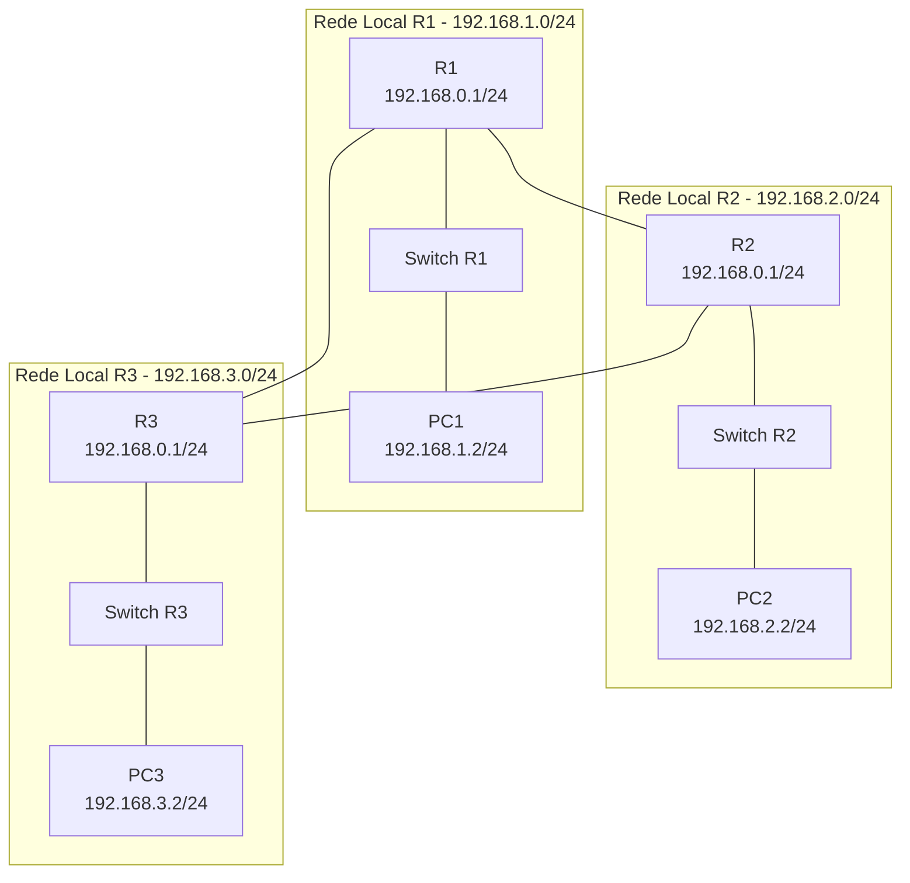

# Exercício: Integração de Roteamento Estático e Dinâmico no Packet Tracer

Simular, no Cisco Packet Tracer, uma rede com três roteadores interligados por conexões seriais, onde parte da comunicação usa **roteamento estático** e outra parte usa **roteamento dinâmico**.
O objetivo é compreender a integração entre ambos, o uso do NAT e a comunicação completa entre as redes locais.


## Cenário Proposto

A empresa possui três roteadores interligados entre si:

* **Roteadores A e B:** comunicação configurada com **roteamento estático**.
* **Roteadores B e C:** comunicação configurada com **roteamento dinâmico (RIP)**.
* **Roteadores A e C:** conexão adicional (redundância) via serial.

Cada roteador atende uma rede local idêntica com:

* Interface local: `192.168.0.1/24`
* PC local: `192.168.0.2/24` (gateway 192.168.0.1)


## Topologia sugerida



Cada roteador possui uma LAN local com um switch e um PC conectado.


## Endereçamento IP

| Conexão    | Interface Roteador    | Endereço IP         | Máscara         | Observação            |
| ---------- | --------------------- | ------------------- | --------------- | --------------------- |
| R1 LAN     | R1 G0/0               | 192.168.0.1         | 255.255.255.0   | Gateway da rede local |
| R2 LAN     | R2 G0/0               | 192.168.0.1         | 255.255.255.0   | Gateway da rede local |
| R3 LAN     | R3 G0/0               | 192.168.0.1         | 255.255.255.0   | Gateway da rede local |
| Serial A–B | R1 S0/0/0 – R2 S0/0/0 | 10.0.1.1 / 10.0.1.2 | 255.255.255.252 | Estático              |
| Serial B–C | R2 S0/0/1 – R3 S0/0/0 | 10.0.2.1 / 10.0.2.2 | 255.255.255.252 | Dinâmico              |
| Serial A–C | R1 S0/0/1 – R3 S0/0/1 | 10.0.3.1 / 10.0.3.2 | 255.255.255.252 | Redundância           |


## Tarefas

### Parte 1 – Montagem da Topologia

1. Insira três roteadores (R1, R2, R3).
2. Configure as conexões seriais entre eles conforme a tabela.
3. Adicione um switch e um PC para cada roteador (com IP 192.168.0.2/24 e gateway 192.168.0.1).


### Configuração dos roteadores

A seguir estão os **scripts de configuração completos** de cada roteador.


### **Roteador A (R1)**

```bash
enable
configure terminal
hostname R1

interface g0/0
 ip address 192.168.0.1 255.255.255.0
 ip nat inside
 no shutdown

interface s0/0/0
 ip address 10.0.1.1 255.255.255.252
 ip nat outside
 clock rate 64000
 no shutdown

interface s0/0/1
 ip address 10.0.3.1 255.255.255.252
 ip nat outside
 clock rate 64000
 no shutdown

ip route 10.0.2.0 255.255.255.252 10.0.1.2
ip route 192.168.0.0 255.255.255.0 10.0.1.2

access-list 1 permit 192.168.0.0 0.0.0.255
ip nat inside source list 1 interface s0/0/0 overload

end
write memory
```


### **Roteador B (R2)**

```bash
enable
configure terminal
hostname R2

interface g0/0
 ip address 192.168.0.1 255.255.255.0
 ip nat inside
 no shutdown

interface s0/0/0
 ip address 10.0.1.2 255.255.255.252
 ip nat outside
 no shutdown

interface s0/0/1
 ip address 10.0.2.1 255.255.255.252
 ip nat outside
 clock rate 64000
 no shutdown

ip route 10.0.3.0 255.255.255.252 10.0.1.1
ip route 192.168.0.0 255.255.255.0 10.0.1.1

router rip
 version 2
 network 10.0.2.0
 network 192.168.0.0
 no auto-summary

access-list 1 permit 192.168.0.0 0.0.0.255
ip nat inside source list 1 interface s0/0/0 overload

end
write memory
```


### **Roteador C (R3)**

```bash
enable
configure terminal
hostname R3

interface g0/0
 ip address 192.168.0.1 255.255.255.0
 ip nat inside
 no shutdown

interface s0/0/0
 ip address 10.0.2.2 255.255.255.252
 ip nat outside
 no shutdown

interface s0/0/1
 ip address 10.0.3.2 255.255.255.252
 ip nat outside
 no shutdown

router rip
 version 2
 network 10.0.2.0
 network 192.168.0.0
 no auto-summary

access-list 1 permit 192.168.0.0 0.0.0.255
ip nat inside source list 1 interface s0/0/0 overload

end
write memory
```


### Testes e Análise

1. Faça **ping entre os PCs** de cada rede (PC-A → PC-B, PC-B → PC-C, PC-A → PC-C).
2. Use `show ip route` em cada roteador para confirmar:

   * R1 e R2 trocando rotas estáticas;
   * R2 e R3 trocando rotas dinamicamente via RIP.
3. Use o modo **Simulation** para observar o caminho dos pacotes.
4. Teste o NAT com `show ip nat translations` para visualizar conversões de endereços.


### Exercício

* Configure OSPF no lugar de RIP entre B e C.
* Adicione uma rota de backup entre A e C (usando a interface serial 10.0.3.0/30).
* Compare o comportamento da rede quando um link é desligado.

