# Segurança em Redes

## 1. Introdução à Segurança em Redes

### 1.1 O que é Segurança em Redes?

**Segurança em redes** é o conjunto de políticas, práticas e tecnologias usadas para proteger a integridade, confidencialidade e disponibilidade dos dados e recursos de uma rede de computadores.

Ela envolve:

* Proteção contra **acessos não autorizados**
* Garantia de que os dados **não sejam alterados ou corrompidos**
* Disponibilidade dos serviços **mesmo sob ataque**

#### Analogia:

Imagine a rede como uma casa:

* A **porta com chave** é o controle de acesso.
* As **câmeras de segurança** são os sistemas de monitoramento.
* Um **cofre trancado** representa a criptografia dos dados.
* O **síndico que registra tudo** representa os logs de auditoria.

---

### 1.2 Ameaças Comuns a Redes de Computadores

| Ameaça                       | Descrição                                             | Exemplo real                                  |
| ---------------------------- | ----------------------------------------------------- | --------------------------------------------- |
| **Malware**                  | Programas maliciosos que infectam dispositivos        | Vírus que se espalha por e-mail               |
| **Phishing**                 | Engenharia social para enganar usuários e obter dados | E-mail falso do banco pedindo senha           |
| **Ataques DDoS**             | Tornam serviços indisponíveis através de sobrecarga   | Ataque ao GitHub em 2018                      |
| **Interceptação (Sniffing)** | Captura de pacotes na rede para roubar informações    | Ataque em redes Wi-Fi públicas                |
| **Spoofing**                 | Falsificação de identidade (IP, ARP, DNS, etc.)       | Enviar pacotes com IP falso para acessar rede |

#### Diagrama – Tipos de Ameaças:

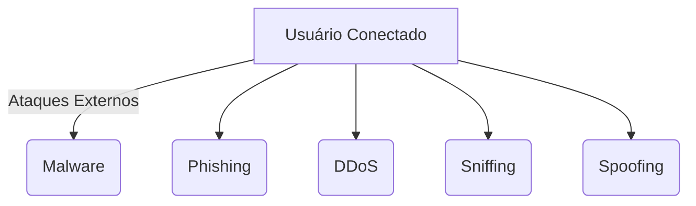

---

### 1.3 Objetivos da Segurança: CID

A sigla **CID** representa os três pilares da segurança da informação:

| Pilar                 | Descrição                                                         |
| --------------------- | ----------------------------------------------------------------- |
| **Confidencialidade** | Apenas pessoas autorizadas devem acessar os dados                 |
| **Integridade**       | Garantia de que os dados não foram alterados de forma indevida    |
| **Disponibilidade**   | Os recursos e serviços devem estar disponíveis quando necessários |

#### Exemplo prático:

**Sistema bancário online**

* Confidencialidade: seus dados bancários são criptografados.
* Integridade: o valor de uma transferência não pode ser alterado durante o processo.
* Disponibilidade: o serviço precisa estar acessível 24/7.

#### Diagrama – Tríade CID:

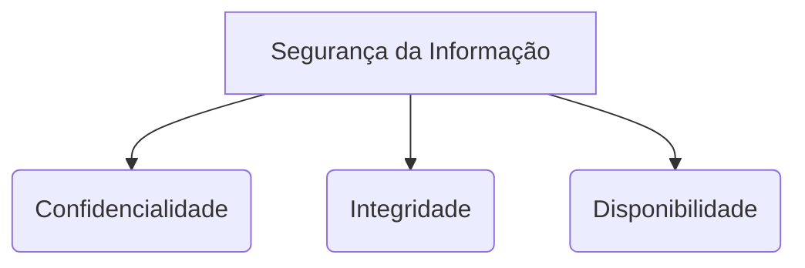

---

A **Segurança em Redes** é uma área fundamental que visa proteger dados e serviços contra uma grande variedade de ameaças. Compreender os **conceitos de ameaça** e os **princípios da tríade CIA** é o primeiro passo para entender como ferramentas como **firewalls, VPNs e controle de acesso** funcionam e são aplicados no mundo real.

---

## 2. Firewalls

### 2.1 Conceito de Firewall

Um **firewall** é um sistema de segurança que **monitora, filtra e controla o tráfego de rede** com base em regras de segurança predefinidas. Ele age como uma **barreira entre redes confiáveis (internas)** e redes **não confiáveis (externas)**, como a Internet.

#### Analogia:

Imagine um **porteiro de um prédio**. Ele decide quem entra e quem sai, com base em uma lista de regras. O firewall funciona da mesma forma com os dados que entram ou saem da sua rede.

---

### 2.2 Tipos de Firewalls

#### 2.2.1 Firewalls de Filtragem de Pacotes

* Atua na **Camada 3 (Rede)** e **Camada 4 (Transporte)** do modelo OSI.
* Analisa cabeçalhos IP, porta e protocolo.
* Regras simples (ex: bloquear IPs ou portas).

```plaintext
Regra: Bloquear todo tráfego vindo da porta 23 (Telnet)
```

#### 2.2.2 Firewalls de Inspeção com Estado (Stateful)

* Monitora o **estado das conexões** (ex: TCP SYN, ACK, FIN).
* Permite ou bloqueia pacotes com base no **contexto da conexão**.
* Mais seguro que o filtrador simples.

```plaintext
Permitir respostas apenas de conexões já estabelecidas (estado: ESTABLISHED)
```

#### 2.2.3 Firewalls de Aplicação (Layer 7)

* Opera na **camada de aplicação** (HTTP, SMTP, FTP, etc.).
* Analisa o conteúdo das mensagens.
* Ideal para proteger contra ataques como **SQL Injection** e **XSS**.

```plaintext
Bloquear requisições HTTP que contenham "DROP TABLE"
```

#### 2.2.4 Firewalls Host-based

* Instalados diretamente em um **host individual**.
* Controlam o tráfego que entra e sai **de uma máquina específica**.
* Ex: Windows Defender Firewall, `ufw` no Linux.

---

### 2.3 Políticas de Regras em Firewalls

* **Default deny**: bloqueia tudo e permite somente o necessário.
* **Default allow**: permite tudo e bloqueia apenas o que for perigoso (menos seguro).

#### Exemplo de política default deny:

```plaintext
Bloquear todas as portas
Permitir apenas porta 80 (HTTP) e 443 (HTTPS)
Permitir SSH somente para IP 192.168.0.10
```

---

### 2.4 Exemplos de Implementação

#### 2.4.1 Firewall com `iptables` no Linux

```bash
# Bloquear todo o tráfego por padrão
sudo iptables -P INPUT DROP
sudo iptables -P OUTPUT ACCEPT
sudo iptables -P FORWARD DROP

# Permitir conexões existentes
sudo iptables -A INPUT -m conntrack --ctstate ESTABLISHED,RELATED -j ACCEPT

# Permitir HTTP e HTTPS
sudo iptables -A INPUT -p tcp --dport 80 -j ACCEPT
sudo iptables -A INPUT -p tcp --dport 443 -j ACCEPT

# Permitir SSH apenas de um IP
sudo iptables -A INPUT -p tcp -s 192.168.0.10 --dport 22 -j ACCEPT
```

#### 2.4.2 Firewall em roteadores domésticos

* Interface web comum em roteadores TP-Link, D-Link, etc.
* Permite bloquear portas, ativar NAT, e criar listas de controle de acesso.

#### 2.4.3 Exemplo com UFW (Uncomplicated Firewall) no Ubuntu

```bash
sudo ufw default deny incoming
sudo ufw default allow outgoing
sudo ufw allow 22     # SSH
sudo ufw allow 80     # HTTP
sudo ufw allow 443    # HTTPS
sudo ufw enable
```

---

### Diagrama – Funcionamento de um Firewall na Rede

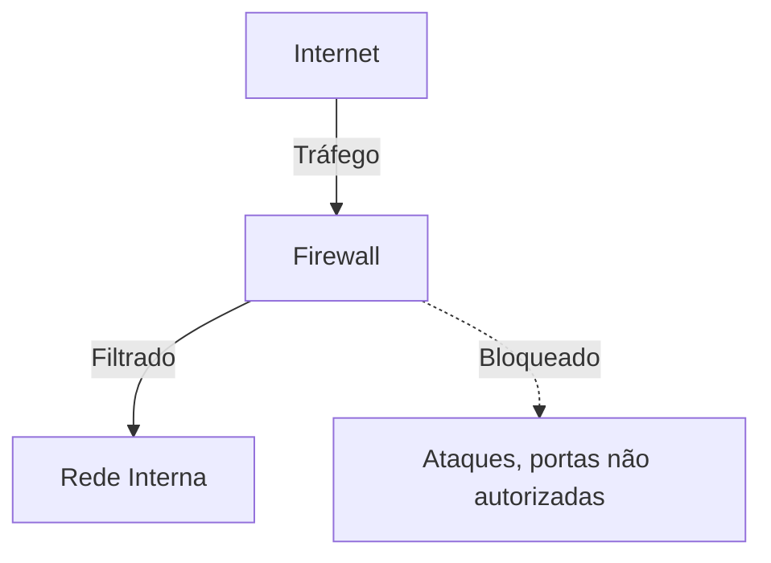

---

Firewalls são a **primeira linha de defesa** em uma rede. Eles atuam de diferentes formas dependendo do modelo, sendo capazes de **filtrar tráfego com base em IPs, portas, estados de conexão e até mesmo conteúdo**. Saber configurar corretamente um firewall é essencial para proteger qualquer sistema conectado à internet.

---


## 3. VPNs (Redes Privadas Virtuais)

### 3.1 O que é uma VPN?

Uma **VPN (Virtual Private Network)** é uma tecnologia que permite criar uma **conexão segura e criptografada** sobre uma rede pública (como a Internet), funcionando como um **túnel privado** entre o usuário e um servidor remoto.

#### Objetivos:

* Proteger dados em trânsito
* Garantir anonimato e privacidade
* Acessar redes internas remotamente
* Bypassar restrições geográficas

#### Analogia:

Imagine uma **estrada pública (Internet)**. Uma VPN é como **um túnel subterrâneo exclusivo** que protege seu carro (dados) de olhares externos. Ninguém vê quem está dirigindo ou para onde vai.

---

### 3.2 Funcionamento de uma VPN

1. O cliente VPN se conecta a um **servidor VPN remoto**.
2. Todo o tráfego é **criptografado** entre cliente e servidor.
3. O servidor VPN envia/recebe os dados da internet em nome do cliente.
4. Para o mundo externo, parece que os dados vieram do servidor VPN, não do usuário.

#### Diagrama – Comunicação com e sem VPN:

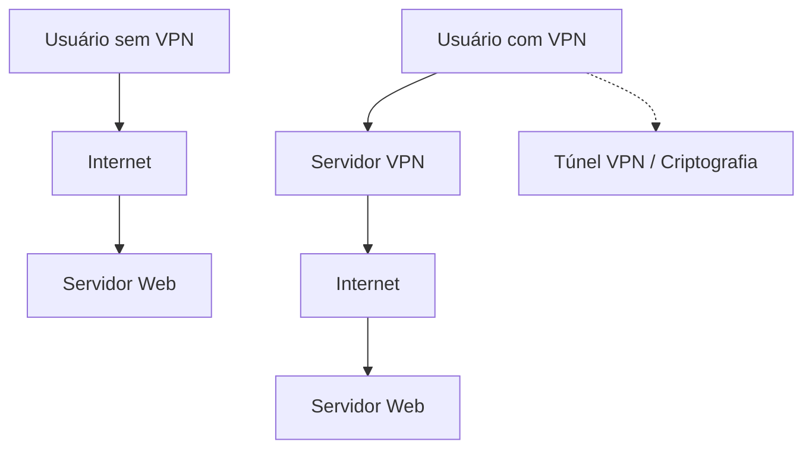

---

### 3.3 Protocolos de VPN

| Protocolo  | Segurança  | Velocidade | Facilidade de configuração | Observações                     |
| ---------- | ---------- | ---------- | -------------------------- | ------------------------------- |
| PPTP       | Baixa      | Alta       | Muito fácil                | Obsoleto e vulnerável           |
| L2TP/IPsec | Alta       | Média      | Moderada                   | Usa dupla encapsulação          |
| OpenVPN    | Muito alta | Média      | Flexível, mais complexo    | Código aberto, altamente seguro |
| WireGuard  | Alta       | Muito alta | Simples                    | Leve, moderno, em crescimento   |

---

### 3.4 Vantagens e Limitações das VPNs

#### Vantagens:

* **Privacidade**: oculta seu IP real
* **Segurança**: criptografa dados sensíveis (especialmente em Wi-Fi público)
* **Acesso remoto**: conecta filiais ou funcionários externos
* **Bypass de censura**: permite acessar sites bloqueados

#### Limitações:

* Pode **reduzir a velocidade da conexão**
* Requer **configuração adequada** para segurança real
* **Alguns serviços detectam e bloqueiam VPNs** (ex: Netflix, bancos)

---


As **VPNs** são ferramentas essenciais para **proteger a comunicação em redes inseguras**, como redes públicas ou conexões remotas. Elas garantem **sigilo e segurança** na troca de informações e são amplamente utilizadas tanto por **usuários comuns quanto por empresas**. Saber como configurar e aplicar os diferentes protocolos é essencial para qualquer profissional de redes ou segurança.

---


## 4. Controle de Acesso em Redes

### 4.1 O que é Controle de Acesso?

**Controle de Acesso** é o conjunto de métodos, políticas e mecanismos que **regulam quem pode acessar o quê** em um sistema ou rede. Ele garante que apenas **usuários, dispositivos ou processos autorizados** possam interagir com recursos específicos, como arquivos, aplicações, serviços de rede, entre outros.

> 🔐 **Objetivo:** Proteger ativos de TI contra acesso não autorizado, vazamentos e uso indevido.

---

### 4.2 Modelos de Controle de Acesso

Os modelos de controle de acesso definem **como as permissões são atribuídas e gerenciadas**. A escolha do modelo depende das necessidades da organização.

#### 4.2.1 Discricionário (DAC – Discretionary Access Control)

* O **dono ou criador do recurso** decide quem pode acessá-lo.
* Permissões podem ser alteradas pelos próprios usuários.
* Baseado em ACLs (listas de controle de acesso).

**Exemplo:**
No Linux, um usuário pode usar `chmod` para permitir que outro acesse seu arquivo:

```bash
chmod 744 documento.txt
```

---

#### 4.2.2 Obrigatório (MAC – Mandatory Access Control)

* As permissões são definidas por **políticas centrais de segurança**.
* Usuários **não têm controle direto** sobre os recursos.
* Usa classificações e rótulos de segurança (ex: Confidencial, Secreto).

**Exemplo:**
Um usuário com acesso “Confidencial” não pode acessar dados marcados como “Secreto”.

**Aplicação:** Ambientes militares, órgãos governamentais e sistemas críticos.

---

#### 4.2.3 Baseado em Papéis (RBAC – Role-Based Access Control)

* O acesso é concedido com base em **funções (roles)** atribuídas ao usuário.
* Simplifica a administração em grandes organizações.

**Exemplo:**

| Papel         | Permissões                  |
| ------------- | --------------------------- |
| Técnico       | Atualizar ordens de serviço |
| Supervisor    | Criar e atribuir ordens     |
| Administrador | Acesso total ao sistema     |

**Benefício:** Gerenciamento centralizado e escalável.

---

#### 4.2.4 Baseado em Atributos (ABAC – Attribute-Based Access Control)

* O acesso é determinado por **atributos** do usuário, recurso ou contexto.
* A decisão considera regras como horário, local, função, etc.

**Exemplo de regra ABAC:**

> "Permitir acesso a relatórios apenas para usuários do setor financeiro com autenticação multifator, entre 8h e 18h."

**Benefício:** Alta flexibilidade e controle contextual.

---

### 4.3 Autenticação, Autorização e Auditoria (AAA)

O modelo **AAA** define três componentes críticos da segurança em redes:

#### Autenticação

> **Verifica a identidade** do usuário ou dispositivo.

**Exemplos:**

* Login com senha
* Biometria
* Certificados digitais

#### Autorização

> **Determina o que o usuário pode fazer** após ser autenticado.

**Exemplos:**

* Acesso a uma pasta específica
* Permissão para imprimir documentos

#### Auditoria (Accounting)

> **Registra as ações realizadas** no sistema para fins de rastreamento e segurança.

**Exemplos:**

* Logs de acesso
* Histórico de comandos

---

### 4.4 Exemplos e Aplicações

#### 4.4.1 Controle de Acesso em Active Directory

O **Active Directory (AD)** é uma solução da Microsoft para gerenciamento centralizado de identidades e permissões.

**Exemplo de aplicação:**

* Um usuário entra no domínio da empresa (`empresa.local`)
* AD verifica suas **credenciais**
* Ele recebe permissões com base nos **grupos** atribuídos

**Exemplo de grupos:**

```plaintext
Grupo "Financeiro": acesso a \\servidor\financeiro
Grupo "TI": acesso a \\servidor\configuracoes
```

**Diagrama simplificado:**

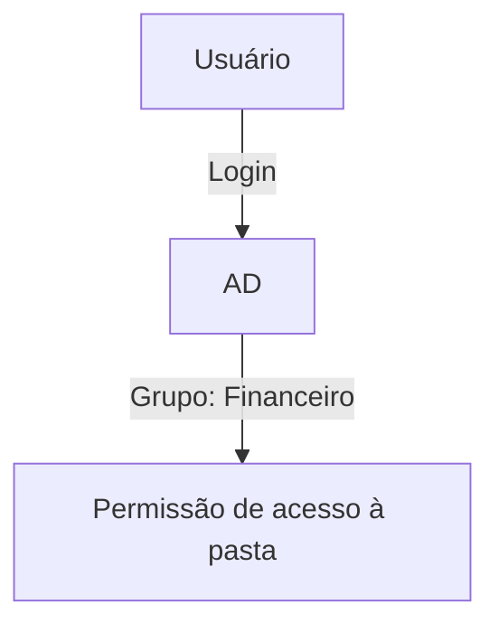

---

#### 4.4.2 Uso de ACLs (Access Control Lists) em Roteadores

ACLs são **listas de regras aplicadas em interfaces de roteadores e switches** para filtrar tráfego com base em IPs, portas, protocolos, etc.

##### Exemplo: Bloquear acesso da rede 192.168.10.0/24 à porta 80

```bash
access-list 100 deny tcp 192.168.10.0 0.0.0.255 any eq 80
access-list 100 permit ip any any
interface GigabitEthernet0/0
 ip access-group 100 in
```

**Resultado:** Nenhum dispositivo da rede 192.168.10.0 pode acessar servidores HTTP.

---

#### 4.4.3 Integração com servidores RADIUS e LDAP

##### RADIUS (Remote Authentication Dial-In User Service)

* Autenticação centralizada
* Usado em Wi-Fi corporativo, VPNs, switches gerenciáveis

**Fluxo:**

1. Dispositivo envia credenciais ao roteador/switch
2. Este repassa ao servidor RADIUS
3. O RADIUS autentica e retorna resposta

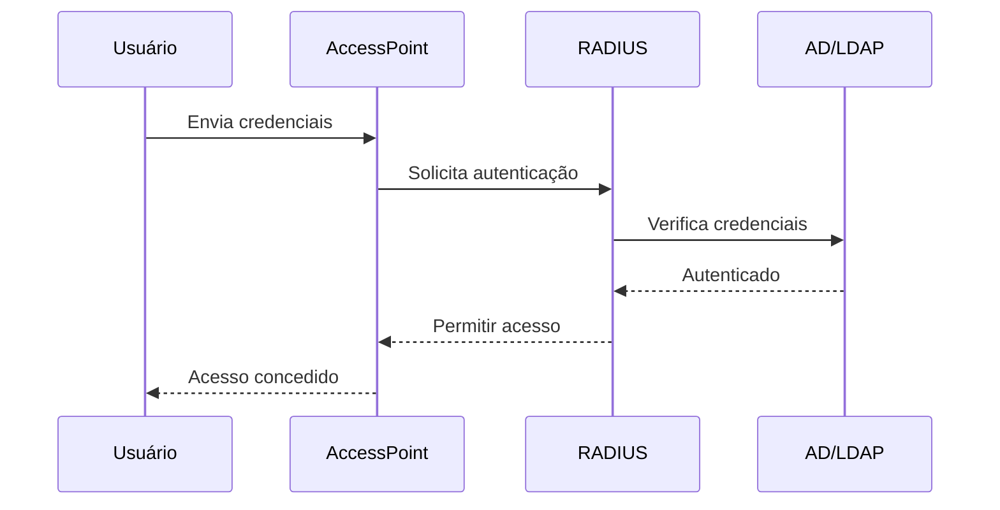

##### LDAP (Lightweight Directory Access Protocol)

* Usado para consultar diretórios como o Active Directory
* Amplamente empregado em sistemas de autenticação centralizada, como:

```plaintext
- Portais web
- Aplicações corporativas
- Serviços de e-mail
```

---


O **controle de acesso em redes é uma base essencial da segurança digital**, garantindo que os recursos sejam usados apenas por pessoas e sistemas autorizados. Dominar os diferentes modelos (DAC, MAC, RBAC, ABAC) e tecnologias (AD, ACLs, RADIUS, LDAP) é fundamental para proteger redes corporativas e evitar violações de segurança.

---


## 5. Boas Práticas de Segurança em Redes

Boas práticas de segurança são políticas e procedimentos adotados para proteger ativos de TI contra ameaças internas e externas. Elas reduzem riscos, aumentam a resiliência da rede e ajudam a manter conformidade com normas legais e técnicas.

---

### 5.1 Segmentação de Redes (VLANs)

**Segmentação de rede** consiste em dividir a rede física em sub-redes lógicas (VLANs – Virtual LANs), com o objetivo de limitar o escopo de comunicação e **conter incidentes de segurança**.

#### Benefícios:

* Isolamento entre departamentos
* Redução do tráfego desnecessário
* Mitigação de ataques laterais (ex: lateral movement)

#### Exemplo de segmentação:

| VLAN ID | Departamento   | IP/Sub-rede     |
| ------- | -------------- | --------------- |
| 10      | Administrativo | 192.168.10.0/24 |
| 20      | Financeiro     | 192.168.20.0/24 |
| 30      | TI             | 192.168.30.0/24 |

#### Diagrama:

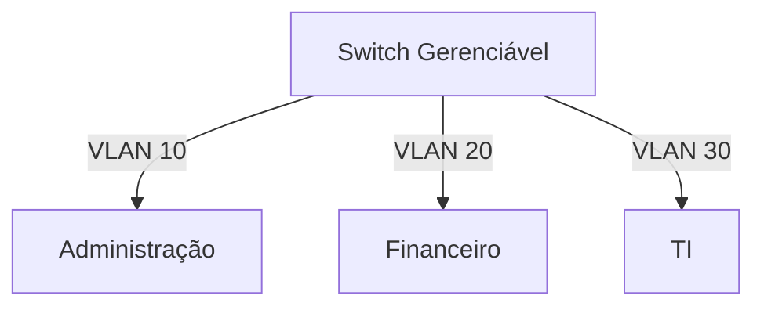

**Dica:** Combine VLANs com firewalls ou ACLs para controlar a comunicação entre elas.

---

### 5.2 Atualizações e Patching

Manter sistemas e dispositivos atualizados é **essencial para mitigar vulnerabilidades conhecidas** que podem ser exploradas por atacantes.

#### Boas práticas:

* Implementar **política de gerenciamento de patches**
* Monitorar os **boletins de segurança** dos fabricantes (ex: Cisco, Microsoft)
* Automatizar atualizações em estações e servidores (WSUS, Ansible, etc.)

#### Exemplo:

> A falha **CVE-2021-44228 (Log4Shell)** afetou milhares de sistemas Java e foi corrigida apenas com atualização.

---

### 5.3 Monitoramento e Logs

O **monitoramento contínuo** permite detectar atividades suspeitas, anomalias de tráfego e falhas em tempo real. Os **logs** são fundamentais para auditorias e análises forenses.

#### Ferramentas comuns:

* **SIEMs** (Security Information and Event Management): Splunk, Wazuh, QRadar
* **Syslog servers**: Graylog, ELK stack
* **SNMP e NetFlow**: Monitoramento de tráfego

#### Boas práticas:

* Coletar logs de firewalls, servidores, switches e endpoints
* Retenção adequada (ex: 6 a 12 meses)
* Ativar alertas automáticos por e-mail ou SMS

**Exemplo de alerta automatizado:**

> "Detectado 10 tentativas de login falho no servidor Web em 1 minuto"

---

### 5.4 Testes de Vulnerabilidade e Pentest

Realizar avaliações periódicas ajuda a **identificar falhas antes que sejam exploradas**.

#### Tipos:

| Tipo                              | Objetivo                   |
| --------------------------------- | -------------------------- |
| **Scan de Vulnerabilidades**      | Detectar falhas conhecidas |
| **Teste de Penetração (Pentest)** | Simular ataques reais      |

#### Ferramentas populares:

* **Vulnerabilidade:** Nessus, OpenVAS, Qualys
* **Pentest:** Metasploit, Burp Suite, Nmap, Kali Linux

#### Exemplo de processo de Pentest:

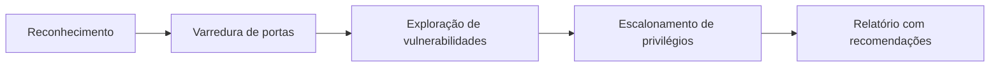

---

### 5.5 Conformidade e Normas (ISO/IEC 27001, LGPD/GDPR)

Estar em conformidade com **padrões internacionais e legislações** protege a organização contra multas, falhas legais e perda de confiança.

#### ISO/IEC 27001

* Norma internacional de **gestão de segurança da informação**
* Define políticas, controles e procedimentos
* Recomendado para organizações que buscam certificação de segurança

#### LGPD / GDPR

* **LGPD (Lei Geral de Proteção de Dados)** – Brasil
* **GDPR (General Data Protection Regulation)** – União Europeia
* Define como dados pessoais devem ser **coletados, processados e armazenados**

#### Exemplos de exigências:

* Consentimento claro do usuário
* Notificação de incidentes de segurança
* Registro de operações com dados pessoais

---


Adotar boas práticas de segurança em redes é uma exigência técnica, estratégica e legal. A combinação de **segmentação, atualizações, monitoramento, testes e conformidade** oferece uma base sólida para proteger a infraestrutura digital de uma organização.

---

## 6. Estudo de Caso

Este capítulo apresenta cenários reais e simulados de segurança em redes, com foco na **aplicação prática de firewalls, VPNs e controle de acesso** em ambientes corporativos.

---

### 6.1 Análise de um Ataque Real e Mitigação com Firewall

#### Cenário:

Uma empresa de e-commerce percebe uma **lentidão extrema no site** e instabilidade nos serviços internos. Logs mostram um volume incomum de tráfego na porta 80 vindo de múltiplos IPs.

#### Diagnóstico:

Trata-se de um ataque **DDoS (Distributed Denial of Service)** com requisições HTTP massivas.

#### Solução:

Configuração de regras no firewall para **bloquear IPs suspeitos**, limitar conexões simultâneas e aplicar regras geográficas.

#### Etapas:

1. **Identificação de IPs maliciosos**:

   ```bash
   sudo netstat -antp | grep :80
   ```

2. **Adição de regras no `iptables`** (Linux):

   ```bash
   sudo iptables -A INPUT -s 192.168.100.200 -j DROP
   sudo iptables -A INPUT -p tcp --dport 80 -m connlimit --connlimit-above 50 -j DROP
   ```

3. **Geoblocking com `iptables` + `xt_geoip`**:

   ```bash
   iptables -A INPUT -m geoip ! --src-cc BR -j DROP
   ```

4. **Firewall em camada de aplicação (WAF)**:
   Implementação do **Cloudflare** para proteção adicional.

#### Diagrama do ataque e defesa:

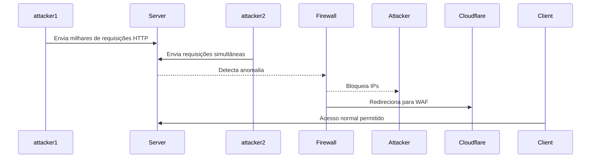

---

### 6.2 Implementação de VPN em uma Pequena Empresa

#### Cenário:

Uma empresa com matriz e duas filiais precisa permitir o **acesso remoto seguro aos sistemas internos** para equipes em home office e filiais.

#### Solução:

Implementação de uma **VPN site-to-site** com **OpenVPN** e uma **VPN client-to-site** para home office.

#### Arquitetura:

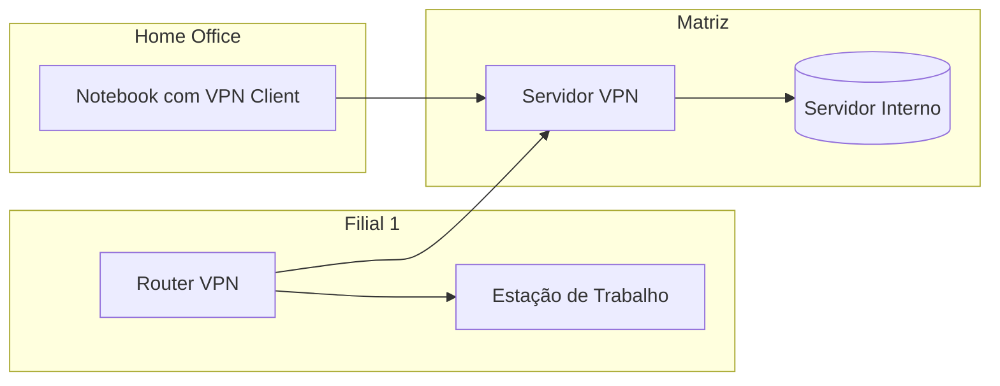

#### Etapas:

1. **Instalação do OpenVPN** (Debian):

   ```bash
   sudo apt install openvpn easy-rsa
   ```

2. **Geração de certificados e chaves**

   ```bash
   ./easyrsa init-pki
   ./easyrsa build-ca
   ./easyrsa gen-req server nopass
   ./easyrsa sign-req server server
   ```

3. **Configuração do arquivo `server.conf`**

   ```conf
   port 1194
   proto udp
   dev tun
   server 10.8.0.0 255.255.255.0
   push "route 192.168.10.0 255.255.255.0"
   ```

4. **Cliente acessando de casa**:

   * Instala o OpenVPN Client
   * Usa `.ovpn` com certificado e IP público da matriz

---

### 6.3 Aplicação de RBAC em um Sistema de Controle de Acesso Interno

#### Cenário:

Uma universidade precisa controlar o acesso a sistemas internos (notas, financeiro, biblioteca) com base nas **funções dos usuários**: alunos, professores e equipe administrativa.

#### Solução:

Implementação de **RBAC (Role-Based Access Control)** em um sistema web com autenticação via Active Directory e integração com LDAP.

#### Regras:

| Papel          | Permissões                                           |
| -------------- | ---------------------------------------------------- |
| Aluno          | Visualizar notas, acessar biblioteca                 |
| Professor      | Lançar notas, visualizar alunos                      |
| Administrativo | Gerenciar matrículas, acessar relatórios financeiros |

#### Diagrama de RBAC:

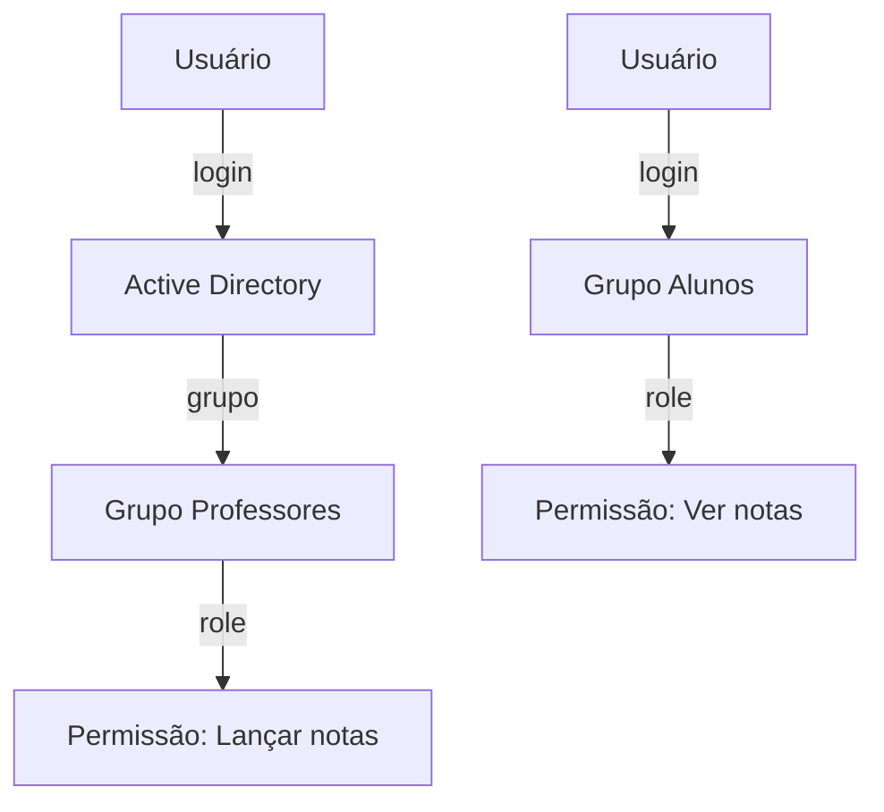

#### Implementação com Flask + LDAP:

```python
from flask_login import login_user
from ldap3 import Server, Connection

def autenticar(usuario, senha):
    servidor = Server("ldap://ldap.empresa.local")
    conn = Connection(servidor, user=usuario, password=senha)
    if conn.bind():
        grupos = conn.extend.standard.who_am_i()
        if "professores" in grupos:
            login_user(usuario, role="professor")
```

---

Esses estudos de caso demonstram como aplicar, na prática, os conceitos de segurança em redes:

* **Firewall** para bloquear ataques e limitar conexões
* **VPN** para acesso remoto seguro
* **RBAC** para proteger sistemas conforme funções dos usuários

Com essas estratégias, é possível criar uma infraestrutura resiliente, segura e preparada para desafios reais.

---

## 7. Conclusão

A segurança em redes é uma área crítica e em constante evolução, que exige conhecimento técnico, atualização constante e boas práticas consolidadas. Este material buscou apresentar, de forma clara e prática, os fundamentos essenciais para a proteção de redes corporativas e pessoais.

---

### 7.1 Resumo dos Conceitos

Durante o estudo, foram abordados os seguintes pontos:

| Tópico                            | Descrição                                                                       |
| --------------------------------- | ------------------------------------------------------------------------------- |
| **Firewalls**                     | Sistemas que filtram tráfego de rede com base em regras pré-definidas.          |
| **VPNs**                          | Conexões seguras e criptografadas para acessar redes privadas remotamente.      |
| **Controle de Acesso (AAA)**      | Conjunto de práticas que incluem autenticação, autorização e auditoria.         |
| **Modelos de Controle de Acesso** | DAC, MAC, RBAC, ABAC — cada um com finalidades e aplicações específicas.        |
| **Boas Práticas de Segurança**    | Segmentação, monitoramento, atualizações, testes de vulnerabilidade.            |
| **Estudos de Caso**               | Situações reais de aplicação de firewall, VPN e RBAC em ambientes corporativos. |

Esses conceitos formam a base para proteger redes contra acessos não autorizados, ataques cibernéticos e falhas operacionais.

---

### 7.2 Recomendações Finais

A seguir, algumas boas práticas essenciais para a gestão de segurança em redes:

* **Implemente defesa em camadas (defesa em profundidade)**: Combine firewalls, antivírus, IDS/IPS, e controle de acesso.
* **Utilize VPNs seguras com protocolos modernos**: Prefira OpenVPN, WireGuard ou IPSec com autenticação forte.
* **Gerencie acessos com RBAC ou ABAC**: Reduza privilégios ao mínimo necessário para cada função.
* **Atualize regularmente** sistemas operacionais, dispositivos de rede e softwares.
* **Monitore ativamente os logs** da rede e implemente alertas automáticos.
* **Documente políticas de segurança** e treine os usuários regularmente.
* **Realize testes periódicos de vulnerabilidade e pentest.**
* **Adote padrões de conformidade**, como ISO/IEC 27001, LGPD ou GDPR, conforme o contexto.

---

### 7.3 Leituras Complementares

Para aprofundar o conhecimento, recomenda-se:

#### Livros:

* **"Firewalls and Internet Security" – William R. Cheswick, Steven M. Bellovin**
* **"Network Security Essentials" – William Stallings**
* **"Security+ Guide to Network Security Fundamentals" – Mark Ciampa**

#### Documentações oficiais:

* [OpenVPN Documentation](https://openvpn.net/community-resources/how-to/)
* [pfSense Documentation](https://docs.netgate.com/)
* [iptables Documentation](https://netfilter.org/projects/iptables/index.html)

#### Normas e padrões:

* [ISO/IEC 27001: Segurança da Informação](https://www.iso.org/isoiec-27001-information-security.html)
* [Guia da LGPD – Governo Federal](https://www.gov.br/anpd/pt-br)
* [NIST SP 800-53 – Security and Privacy Controls](https://csrc.nist.gov/publications/detail/sp/800-53/rev-5/final)


