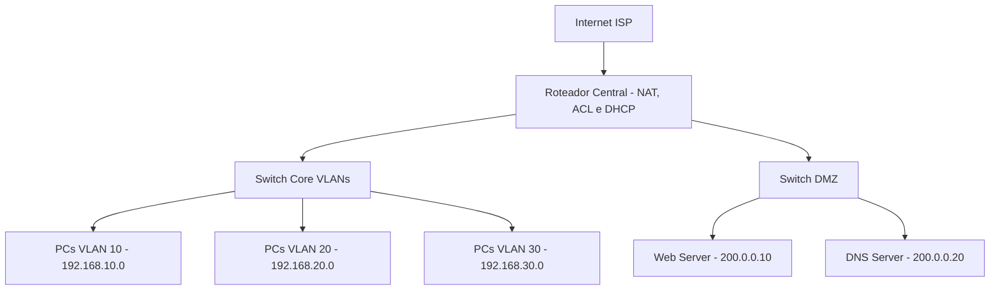

# Projeto Prático: Rede Corporativa Segura com DMZ, VLANs e NAT

## Objetivo

Implementar uma rede corporativa com segmentação via VLANs, uma zona desmilitarizada (DMZ) para serviços públicos, controle de acesso com ACLs, e serviços como DHCP, DNS, Web e NAT para acesso à internet.

## Diagrama Lógico da Rede

## Bloco 8 – Testes Funcionais

**Enunciado:** Verifique se os seguintes acessos estão funcionando conforme esperado:

| Origem         | Destino        | Serviço | Acesso Esperado | Justificativa                                   |
| -------------- | -------------- | ------- | --------------- | ----------------------------------------------- |
| VLAN 10        | Internet       | HTTP    | ✅               | Permitido pela ACL + NAT configurado            |
| VLAN 20        | Internet       | HTTP    | ✅               | Idem                                            |
| VLAN 30        | Internet       | HTTP    | ❌               | Bloqueado pela ACL 110                          |
| Todas as VLANs | DNS Server DMZ | DNS     | ✅               | Permitido na ACL 120                            |
| Todas as VLANs | Web Server DMZ | HTTP    | ✅               | Permitido na ACL 120                            |
| Internet       | Web Server DMZ | HTTP    | ✅               | O Web Server tem IP público e porta 80 liberada |

