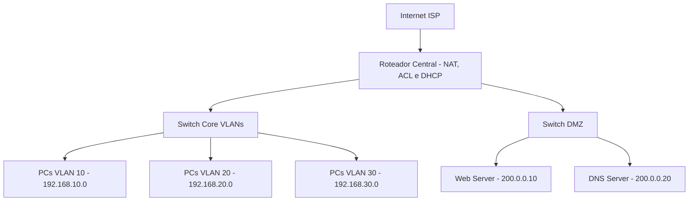

# Projeto Prático: Rede Corporativa Segura com DMZ, VLANs e NAT

## Objetivo

Implementar uma rede corporativa com segmentação via VLANs, uma zona desmilitarizada (DMZ) para serviços públicos, controle de acesso com ACLs, e serviços como DHCP, DNS, Web e NAT para acesso à internet.


## Diagrama Lógico da Rede



## Bloco 1 – Criação de VLANs no Switch Core

**Enunciado:** Crie as VLANs 10 (RH), 20 (TI), 30 (Financeiro), e 99 (Gerenciamento) no switch principal.

**Comando:**

```bash
enable                         ! Entra no modo privilegiado
configure terminal             ! Entra no modo de configuração global

vlan 10                        ! Cria a VLAN 10
 name RH                      ! Nomeia a VLAN como RH

vlan 20                        ! Cria a VLAN 20
 name TI                      ! Nomeia a VLAN como TI

vlan 30                        ! Cria a VLAN 30
 name Financeiro              ! Nomeia a VLAN como Financeiro

vlan 99                        ! Cria a VLAN 99
 name Gerenciamento           ! VLAN para administração da rede

exit                           ! Sai para o modo global
```

## Bloco 2 – Subinterfaces no Roteador para Inter-VLAN

**Enunciado:** Configure subinterfaces no roteador para que cada VLAN possa se comunicar com outras e ter gateway.

**Comando:**

```bash
interface g0/1.10              ! Cria subinterface para VLAN 10
 encapsulation dot1Q 10       ! Define o ID da VLAN na subinterface
 ip address 192.168.10.1 255.255.255.0  ! Endereço de gateway para VLAN 10

interface g0/1.20
 encapsulation dot1Q 20
 ip address 192.168.20.1 255.255.255.0

interface g0/1.30
 encapsulation dot1Q 30
 ip address 192.168.30.1 255.255.255.0

interface g0/1.99
 encapsulation dot1Q 99
 ip address 192.168.99.1 255.255.255.0

```

## Bloco 3 – Configuração da DMZ

**Enunciado:** Configure uma interface dedicada no roteador (ex: `g0/2`) conectando ao switch da DMZ. Atribua a rede pública 200.0.0.0/24 aos servidores.

**Comando:**

```bash
interface g0/2                 ! Interface dedicada para a DMZ
 description DMZ              ! Comentário para identificação
 ip address 200.0.0.1 255.255.255.0  ! IP da interface na rede pública
 no shutdown                  ! Ativa a interface

```


## Bloco 4 – Configuração do NAT no Roteador

**Enunciado:** Configure o roteador para realizar NAT das redes internas para acessar a Internet via interface externa.

**Comando:**

```bash
access-list 1 permit 192.168.0.0 0.0.255.255
! Cria uma ACL padrão permitindo toda a faixa 192.168.0.0/16 (redes internas)

interface g0/0
 ip address dhcp
 ip nat outside
! Define interface externa (acesso à internet), recebe IP via DHCP

interface g0/1
 ip nat inside
! Define como interface interna (VLANs)

interface g0/2
 ip nat inside
! A DMZ também precisa sair para a internet (ex: atualizações)

ip nat inside source list 1 interface g0/0 overload
! Realiza NAT com sobrecarga (PAT), traduzindo IPs internos para o IP público

```


## Bloco 5 – ACLs de Segurança

**Enunciado:** Implemente as ACLs para:

* Bloquear acesso da VLAN 30 (Financeiro) à internet.
* Permitir somente HTTP e DNS para os servidores da DMZ.

**Comando:**

```bash
! Bloqueio da Financeiro para a Internet
access-list 110 deny ip 192.168.30.0 0.0.0.255 any
! Bloqueia qualquer tráfego da VLAN 30 com destino à internet

access-list 110 permit ip any any
! Permite todo o resto do tráfego

interface g0/1
 ip access-group 110 in
! Aplica a ACL na entrada da interface interna (VLANs)


! Restrições de acesso à DMZ
access-list 120 permit tcp any host 200.0.0.10 eq 80
! Permite tráfego HTTP para o servidor Web da DMZ

access-list 120 permit udp any host 200.0.0.20 eq 53
! Permite DNS (UDP) para o servidor DNS da DMZ

access-list 120 deny ip any any
! Bloqueia qualquer outro acesso

interface g0/2
 ip access-group 120 in
! Aplica essa ACL na interface da DMZ (tráfego vindo da rede interna)

```

## Bloco 6 – Configuração do Servidor DHCP

**Enunciado:** Configure o servidor DHCP com escopos para cada VLAN interna, apontando o DNS para o servidor na DMZ.

**Configuração no Servidor DHCP:**

```bash
ip dhcp excluded-address 192.168.10.1
ip dhcp excluded-address 192.168.20.1
ip dhcp excluded-address 192.168.30.1
! Reserva endereços iniciais para gateway e equipamentos fixos

ip dhcp pool RH
 network 192.168.10.0 255.255.255.0
 default-router 192.168.10.1
 dns-server 200.0.0.20
! Define escopo para VLAN 10 com gateway e servidor DNS

ip dhcp pool TI
 network 192.168.20.0 255.255.255.0
 default-router 192.168.20.1
 dns-server 200.0.0.20

ip dhcp pool Financeiro
 network 192.168.30.0 255.255.255.0
 default-router 192.168.30.1
 dns-server 200.0.0.20

```


## Bloco 7 – Configuração dos Servidores Web e DNS

**Enunciado:** Configure o servidor Web para responder na porta 80 e o servidor DNS para resolver nomes da rede.

**Configuração no Web Server:**

* IP: `200.0.0.10`
* Ativar serviço HTTP

**Configuração no DNS Server:**

* IP: `200.0.0.20`
* Adicionar zona: `empresa.com`
* Entrada: `www` → `200.0.0.10`


## Bloco 8 – Testes Funcionais

**Enunciado:** Verifique se os seguintes acessos estão funcionando conforme esperado:

| Origem         | Destino        | Serviço | Acesso Esperado | Justificativa                                   |
| -------------- | -------------- | ------- | --------------- | ----------------------------------------------- |
| VLAN 10        | Internet       | HTTP    | ✅               | Permitido pela ACL + NAT configurado            |
| VLAN 20        | Internet       | HTTP    | ✅               | Idem                                            |
| VLAN 30        | Internet       | HTTP    | ❌               | Bloqueado pela ACL 110                          |
| Todas as VLANs | DNS Server DMZ | DNS     | ✅               | Permitido na ACL 120                            |
| Todas as VLANs | Web Server DMZ | HTTP    | ✅               | Permitido na ACL 120                            |
| Internet       | Web Server DMZ | HTTP    | ✅               | O Web Server tem IP público e porta 80 liberada |

