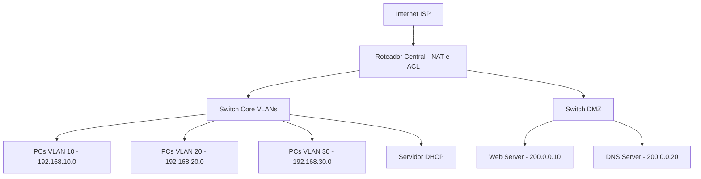

# Projeto Prático: Rede Corporativa Segura com DMZ, VLANs e NAT

## 🎯 Objetivo

Implementar uma rede corporativa com segmentação via VLANs, uma zona desmilitarizada (DMZ) para serviços públicos, controle de acesso com ACLs, e serviços como DHCP, DNS, Web e NAT para acesso à internet.


## Diagrama Lógico da Rede



## Bloco 1 – Criação de VLANs no Switch Core

**Enunciado:** Crie as VLANs 10 (RH), 20 (TI), 30 (Financeiro), e 99 (Gerenciamento) no switch principal.

**Comando:**

```bash
enable
configure terminal
vlan 10
 name RH
vlan 20
 name TI
vlan 30
 name Financeiro
vlan 99
 name Gerenciamento
exit
```

## Bloco 2 – Subinterfaces no Roteador para Inter-VLAN

**Enunciado:** Configure subinterfaces no roteador para que cada VLAN possa se comunicar com outras e ter gateway.

**Comando:**

```bash
interface g0/1.10
 encapsulation dot1Q 10
 ip address 192.168.10.1 255.255.255.0

interface g0/1.20
 encapsulation dot1Q 20
 ip address 192.168.20.1 255.255.255.0

interface g0/1.30
 encapsulation dot1Q 30
 ip address 192.168.30.1 255.255.255.0

interface g0/1.99
 encapsulation dot1Q 99
 ip address 192.168.99.1 255.255.255.0
```

## Bloco 3 – Configuração da DMZ

**Enunciado:** Configure uma interface dedicada no roteador (ex: `g0/2`) conectando ao switch da DMZ. Atribua a rede pública 200.0.0.0/24 aos servidores.

**Comando:**

```bash
interface g0/2
 description DMZ
 ip address 200.0.0.1 255.255.255.0
 no shutdown
```


## Bloco 4 – Configuração do NAT no Roteador

**Enunciado:** Configure o roteador para realizar NAT das redes internas para acessar a Internet via interface externa.

**Comando:**

```bash
access-list 1 permit 192.168.0.0 0.0.255.255

interface g0/0
 ip address dhcp
 ip nat outside

interface g0/1
 ip nat inside

interface g0/2
 ip nat inside

ip nat inside source list 1 interface g0/0 overload
```


## Bloco 5 – ACLs de Segurança

**Enunciado:** Implemente as ACLs para:

* Bloquear acesso da VLAN 30 (Financeiro) à internet.
* Permitir somente HTTP e DNS para os servidores da DMZ.

**Comando:**

```bash
! Bloqueio da Financeiro para a Internet
access-list 110 deny ip 192.168.30.0 0.0.0.255 any
access-list 110 permit ip any any
interface g0/1
 ip access-group 110 in

! Restrições de acesso à DMZ
access-list 120 permit tcp any host 200.0.0.10 eq 80
access-list 120 permit udp any host 200.0.0.20 eq 53
access-list 120 deny ip any any
interface g0/2
 ip access-group 120 in
```

## Bloco 6 – Configuração do Servidor DHCP

**Enunciado:** Configure o servidor DHCP com escopos para cada VLAN interna, apontando o DNS para o servidor na DMZ.

**Configuração no Servidor DHCP:**

```bash
ip dhcp pool RH
 network 192.168.10.0 255.255.255.0
 default-router 192.168.10.1
 dns-server 200.0.0.20

ip dhcp pool TI
 network 192.168.20.0 255.255.255.0
 default-router 192.168.20.1
 dns-server 200.0.0.20

ip dhcp pool Financeiro
 network 192.168.30.0 255.255.255.0
 default-router 192.168.30.1
 dns-server 200.0.0.20
```


## Bloco 7 – Configuração dos Servidores Web e DNS

**Enunciado:** Configure o servidor Web para responder na porta 80 e o servidor DNS para resolver nomes da rede.

**Configuração no Web Server:**

* IP: `200.0.0.10`
* Ativar serviço HTTP

**Configuração no DNS Server:**

* IP: `200.0.0.20`
* Adicionar zona: `empresa.com`
* Entrada: `www` → `200.0.0.10`


## Bloco 8 – Testes Funcionais

**Enunciado:** Verifique se os seguintes acessos estão funcionando conforme esperado:

| Origem        | Destino        | Serviço | Acesso Esperado |
| ------------- | -------------- | ------- | --------------- |
| VLAN 10       | Internet       | HTTP    | ✅               |
| VLAN 20       | Internet       | HTTP    | ✅               |
| VLAN 30       | Internet       | HTTP    | ❌               |
| Qualquer VLAN | DNS Server DMZ | DNS     | ✅               |
| Qualquer VLAN | Web Server DMZ | HTTP    | ✅               |
| Internet      | Web Server DMZ | HTTP    | ✅               |
