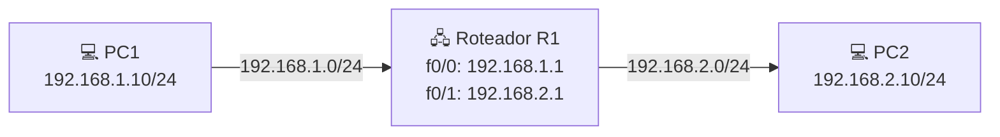
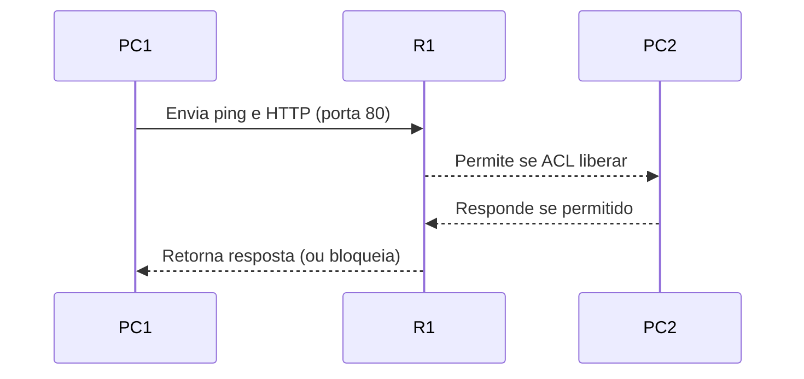
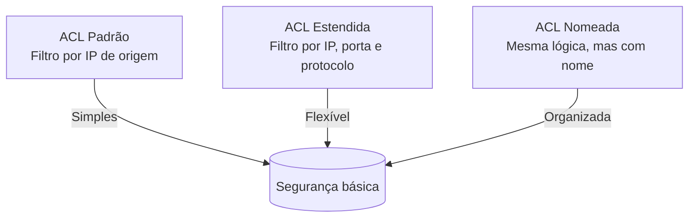

# LISTAS DE CONTROLE DE ACESSO (ACLs) CISCO

##  1. CONCEITO GERAL

As **Listas de Controle de Acesso (ACLs)** são conjuntos de regras aplicadas em roteadores ou switches de camada 3 para **controlar o tráfego de rede**.  
Essas regras permitem ou negam pacotes com base em **endereços IP**, **protocolos** e **portas**.

###  Funções principais:
- Restringir acesso a redes internas;
- Filtrar tráfego entre VLANs ou sub-redes;
- Controlar acesso remoto (Telnet, SSH);
- Melhorar segurança e desempenho.


##  2. TIPOS DE ACL

| Tipo | Faixa Numérica | Nível de Filtro | Exemplo | Observação |
|------|----------------|----------------|----------|-------------|
| **Padrão (Standard)** | 1–99 / 1300–1999 | Apenas IP de **origem** | `access-list 10 deny 192.168.1.10` | Simples, ideal para bloqueios por host ou rede |
| **Estendida (Extended)** | 100–199 / 2000–2699 | IP **origem/destino**, **protocolo** e **porta** | `access-list 110 permit tcp 192.168.1.0 0.0.0.255 any eq 80` | Mais precisa e flexível |
| **Nomeada (Named)** | Definida pelo admin | Igual à padrão ou estendida | `ip access-list extended BLOQUEIO_HTTP` | Melhora legibilidade e manutenção |


##  3. TOPOLOGIA DE REFERÊNCIA

Cenário usado nos exemplos práticos abaixo:




## 4. ACL PADRÃO — Exemplo Prático

### Objetivo:

Bloquear o PC1 (192.168.1.10) de acessar qualquer destino na rede 192.168.2.0/24.

###  Configuração no Roteador:

```bash
enable
configure terminal

! Criação da ACL padrão
access-list 10 deny 192.168.1.10
access-list 10 permit any

! Aplicar a ACL na interface de saída (para rede 192.168.2.0)
interface fastEthernet 0/1
 ip access-group 10 out
exit

end
write memory
```


* A ACL **nega** o tráfego do IP 192.168.1.10.
* `permit any` garante que os outros hosts continuem com acesso.
* Aplicada na **saída** (outbound) da interface que leva ao destino.


##  5. ACL ESTENDIDA — Exemplo Prático

###  Objetivo:

Permitir **apenas tráfego HTTP (porta 80)** da rede 192.168.1.0/24 para 192.168.2.0/24, bloqueando o restante.

###  Configuração no Roteador:

```bash
enable
configure terminal

! Criação da ACL estendida
access-list 110 permit tcp 192.168.1.0 0.0.0.255 192.168.2.0 0.0.0.255 eq 80
access-list 110 deny ip any any

! Aplicar a ACL na interface de entrada (rede de origem)
interface fastEthernet 0/0
 ip access-group 110 in
exit

end
write memory
```

###  Explicação:

* O tráfego **TCP na porta 80** (HTTP) é permitido.
* Qualquer outro protocolo é bloqueado (`deny ip any any`).
* Aplicação **na entrada (inbound)** é recomendada quando filtramos pacotes ao chegar na rede.


## 6. ACL NOMEADA — Exemplo Prático

###  Objetivo:

Bloquear conexões **Telnet (porta 23)** da rede 192.168.1.0/24 para a rede 192.168.2.0/24.

###  Configuração no Roteador:

```bash
enable
configure terminal

! Criação da ACL nomeada
ip access-list extended BLOQUEIO_TELNET
 deny tcp 192.168.1.0 0.0.0.255 192.168.2.0 0.0.0.255 eq 23
 permit ip any any
exit

! Aplicar a ACL na interface de entrada
interface fastEthernet 0/0
 ip access-group BLOQUEIO_TELNET in
exit

end
write memory
```


* Modo “config” da ACL permite **editar regras linha a linha**.
* A regra bloqueia **Telnet (porta 23)**, mas **permite** o restante.
* Nomear facilita identificar sua função e manutenção futura.


##  7. TESTE PRÁTICO NO PACKET TRACER

Siga este roteiro para validar as ACLs:



### Etapas de teste:

1. Configure IPs e gateways nos PCs.
2. Teste `ping` antes de aplicar ACLs (deve funcionar).
3. Aplique as ACLs e repita o teste:

   * Padrão: ping de PC1 deve falhar.
   * Estendida: apenas HTTP deve funcionar.
   * Nomeada: Telnet deve ser bloqueado.
4. Use o **Simulation Mode** para visualizar pacotes negados.


## 8. COMANDOS DE VERIFICAÇÃO

| Comando                              | Função                                      |                                     |
| ------------------------------------ | ------------------------------------------- | ----------------------------------- |
| `show access-lists`                  | Exibe todas as ACLs e contadores de pacotes |                                     |
| `show ip interface fastEthernet 0/0` | Mostra ACLs aplicadas na interface          |                                     |
| `show running-config                 | include access-group`                       | Lista interfaces com ACLs aplicadas |
| `no access-list [número]`            | Remove ACL numérica                         |                                     |
| `no ip access-list extended [nome]`  | Remove ACL nomeada                          |                                     |


##  9. DICAS IMPORTANTES

* Toda ACL tem **implicitamente** a regra:

  ```bash
  deny ip any any
  ```
* Sempre inclua regras `permit` ao final para evitar bloqueio total.
* ACLs padrão → mais próximas **do destino**.
* ACLs estendidas → mais próximas **da origem**.
* ACLs nomeadas são ideais em ambientes de produção pela clareza e facilidade de edição.


##  10. RESUMO GERAL



As ACLs são ferramentas essenciais para segurança e controle de tráfego em redes Cisco.
Compreender **onde aplicar**, **como ordenar as regras** e **qual tipo escolher** é fundamental para um bom design de rede.
